# AI Coding Agents

---

## Chapter Overview

From chatbots to autonomous coding partners

1. What distinguishes agents from chatbots
1. Core agent architectures and multi-agent workflows
1. Popular agent-based development tools
1. Agent capabilities, error handling, and the developer loop
1. Permissions, safety, and configuration
1. Context management, memory, and prompt engineering
1. Benchmarking, observability, and best practices

---

## Chatbot vs Agent


- An agent **observes**, **reasons**, **acts**, and **loops** until the task is done
- A chatbot only responds to what you explicitly ask

---

## The Agent Loop


- The loop continues until the agent determines the task is complete
- Each iteration adds context from tool outputs to the next reasoning step

---

## Architecture: Plan-Execute

**How it works**: the LLM generates a full plan, then executes steps sequentially

```misc
User: "Add input validation to the signup form"

Plan:
  1. Read current form component
  2. Identify fields needing validation
  3. Add validation schema (e.g., zod)
  4. Wire validators to form submit handler
  5. Add error display components
  6. Run tests

Execute: step 1 → step 2 → ... → step 6
```

- Strength: predictable, auditable steps
- Weakness: fragile when early assumptions break

---

## Architecture: ReAct (Reason + Act)

**How it works**: interleave reasoning and action on every iteration

```misc
Thought: I need to find where the form is defined
Action:  grep -r "SignupForm" src/
Observe: src/components/SignupForm.tsx

Thought: Let me read the file to understand the structure
Action:  read src/components/SignupForm.tsx
Observe: [file content]

Thought: There is no validation; I should add a zod schema
Action:  edit src/components/SignupForm.tsx
```

- Strength: adapts dynamically to what it discovers
- Weakness: can wander without clear stopping criteria

---

## Architecture: Tool-Use Loops

Modern agents combine planning with a **tool-use loop**:

1. LLM decides which tool to call and with what arguments
1. Runtime executes the tool, returns structured output
1. LLM incorporates the result into its next decision
1. Repeat until a terminal condition is met

**Key tools in coding agents**:
- `read_file`, `edit_file`, `write_file`
- `bash` / `shell` execution
- `grep` / `glob` for codebase search
- `git` operations
- `run_tests` or test harness invocation

---

## Multi-Agent and Orchestrated Workflows

Advanced setups use multiple agents collaborating:



1. **Planning agent**: breaks the task into subtasks using a stronger model
1. **Execution agents**: each subtask runs in parallel with a faster model
1. **Review agent**: validates outputs and merges results

**Use cases**:
- Large-scale refactors across many files simultaneously
- Generating tests for multiple modules in parallel
- Code review with separate security, style, and correctness agents

---

## Popular Agent Tools Landscape



---

## Cursor / Windsurf / Cline: IDE Agent Walkthrough

IDE-integrated agents share a common interaction model:

1. **Agent panel**: dedicated chat sidebar with tool-use visibility
1. **Inline diffs**: proposed changes appear as colored diffs in the editor
1. **Context pinning**: pin files, symbols, or docs as persistent context
1. **Accept/reject**: approve or discard individual edits before they apply

**Key differences**:
| Feature | Cursor | Windsurf | Cline |
|---|---|---|---|
| Model choice | Multiple | Multiple | Multiple |
| Auto-apply edits | Yes (toggleable) | Yes | Ask first |
| Terminal access | Yes | Yes | Yes |
| Context pinning | `@file`, `@symbol` | `@file` | `@file`, `@url` |

- IDE agents excel at interactive, visual editing workflows

---

## Aider: Git-Native Agent Workflow

Aider is a terminal agent built around git:

1. **Repo map**: Aider scans the codebase and builds a compact map of files, classes, and functions
1. **Automatic git commits**: every change is committed with a descriptive message
1. **Diff formats**: supports `unified`, `whole-file`, and `udiff` output formats
1. **Architect mode**: uses a strong model to plan and a fast model to edit

```bash
# Start aider with specific files in context
aider src/auth/login.ts src/auth/login.test.ts

# Use architect mode for complex changes
aider --architect
```

- The git-native approach means every change is instantly revertible
- Repo map keeps token usage low by summarizing the full codebase

---

## Claude Code: CLI Agent Deep Dive

A terminal-based agent that operates directly in your repository:

```bash
# Start an interactive session
claude

# Run a one-shot task
claude -p "refactor the auth module to use JWT"

# Pipe context in
git diff HEAD~3 | claude -p "review these changes"
```

**Key differentiators**:
- Full shell access within your project
- Reads and edits files with diff-based patching
- Runs tests, interprets failures, and retries
- Git-aware: commits, branches, PR descriptions

---

## Agent Capabilities Matrix

| Capability | Claude Code | Cursor Agent | Aider | Cline |
|---|---|---|---|---|
| File read/edit | Yes | Yes | Yes | Yes |
| Shell commands | Yes | Yes | No | Yes |
| Codebase search | Yes | Yes | Repo map | Yes |
| Run tests | Yes | Limited | No | Yes |
| Git operations | Yes | No | Yes | No |
| Multi-step tasks | Yes | Yes | Yes | Yes |
| Image input | Yes | Yes | No | Yes |

- Choose your tool based on which capabilities matter most for your workflow
- CLI agents excel at automation; IDE agents excel at interactive editing

---

## Copilot Workspace Deep Dive

GitHub's plan-based development agent:

1. **Start from an issue**: Copilot Workspace reads the issue description
1. **Generate a spec**: proposes what needs to change and why
1. **Create a plan**: lists files to modify with intended changes
1. **Implement**: generates code edits across all planned files
1. **Validate**: runs the repository's test suite
1. **Open a PR**: creates a pull request with the full changeset

**Key differentiator**: the user can edit the spec and plan before implementation starts

- Best suited for well-described issues with clear acceptance criteria
- The spec-to-PR workflow mirrors how senior developers break down work

---

## Multi-Step Task Execution

A real-world example of what an agent does autonomously:

```misc
Task: "Fix the failing CI test in payments module"

Agent steps:
 1. Read CI logs to identify the failing test
 2. Search codebase for the test file
 3. Read the test and the code under test
 4. Identify the root cause (API response shape changed)
 5. Update the code to handle new response format
 6. Update the test assertions
 7. Run the test suite locally to verify
 8. Commit the fix with a descriptive message
```

- The developer only provided the task; the agent handled 8 steps
- Each step's output informed the next decision

---

## How Agents Handle Errors and Self-Correct


The **observe-diagnose-retry** loop:
1. Agent runs a tool (e.g., `npm test`) and it fails
1. Agent reads the error output and reasons about the cause
1. Agent edits the code and retries the tool
1. Loop continues until the test passes or a retry limit is hit

- Good agents cap retries to avoid infinite loops

---

## Hands-On: Agent-Driven Bug Fix

**Exercise**: let the agent fix a failing test end-to-end

```bash
# Setup: clone the exercise repo and run the failing test
git clone https://github.com/example/agent-exercise.git
cd agent-exercise
npm test  # one test fails
```

**Steps**:
1. Feed the failing test output to your agent
1. Observe: does the agent find the right file?
1. Observe: does the agent understand the root cause?
1. Observe: does the agent run the tests again after fixing?
1. Review the diff the agent produced

**Discussion**:
- How many iterations did the agent need?
- Did the fix match what you would have written?

---

## Permissions and Safety Models

Agents need boundaries. Common permission tiers:

**Read-only** (safe):
- File reading, codebase search, `git log`, `git diff`

**Write with approval** (default in most tools):
- File edits shown as diffs for user to accept/reject
- Shell commands displayed before execution

**Autonomous** (opt-in, use carefully):
- Agent runs without confirmation prompts
- Useful for trusted, well-scoped tasks

```bash
# Claude Code: allow specific tools without prompting
claude --allowedTools "Edit,Read,Bash(git *)"
```

---

## Agent Safety: What Can Go Wrong

Agents with tool access can cause real damage:

1. **Runaway `rm -rf`**: agent deletes files outside the project scope
1. **Infinite loops**: agent retries a failing approach indefinitely, burning tokens
1. **Committing secrets**: agent stages `.env` or credentials in a git commit
1. **Overwriting files**: agent replaces working code with broken output
1. **Network abuse**: agent `curl`s external APIs or downloads unknown packages

**Mitigations**:
- Always work on a git branch with uncommitted changes stashed
- Use permission tiers to require approval for destructive operations
- Set token and cost limits per session
- Review every diff before accepting

---

## Permission Allowlists in Practice

Configuring what agents can and cannot do:

```bash
# Claude Code: allow only safe tools
claude --allowedTools "Read,Glob,Grep"

# Claude Code: block specific dangerous commands
claude --disallowedTools "Bash(rm *),Bash(curl *)"
```

| Tool | Cursor | Cline | Claude Code |
|---|---|---|---|
| File read | Always allowed | Always allowed | Always allowed |
| File write | Ask / Auto | Ask / Auto | Ask / Auto |
| Shell commands | Ask / Auto | Ask / Auto | Allowlist |
| Git operations | N/A | N/A | Allowlist |

- Start restrictive and loosen permissions as you build trust
- Per-project settings let you tune safety per repository

---

## Configuring Agents: Project Context Files

Most agents support project-level configuration:

```misc
your-repo/
  .claude/
    CLAUDE.md          # Project conventions and context
    settings.json      # Tool permissions, model preferences
  .cursorrules         # Cursor-specific instructions
  .windsurfrules       # Windsurf-specific instructions
  .clinerules          # Cline-specific instructions
  AGENTS.md            # Shared agent instructions (emerging convention)
```

- These files are injected into the agent's system prompt
- They persist across sessions, unlike chat history

---

## Writing Effective CLAUDE.md

A `CLAUDE.md` file teaches the agent your project's conventions:

```markdown
## Build & Test
- Run tests: `npm test`
- Run single test: `npm test -- --grep "test name"`
- Lint: `npm run lint`

## Code Style
- Use TypeScript strict mode
- Prefer named exports over default exports
- Error handling: use Result<T, E> pattern, never throw

## Architecture
- Services go in src/services/
- All DB access goes through repository classes
- API routes use controller -> service -> repository pattern
```

- Keep it concise: agents work best with focused instructions
- Update it as you discover gaps in agent behavior

---

## Prompt Engineering for Agents

Writing effective instructions that guide agent behavior:

**Be specific about the outcome**:
- Bad: "improve this code"
- Good: "add input validation to `createUser` that rejects emails without an `@` sign"

**Constrain the scope**:
- "only modify files in `src/auth/`"
- "do not add new dependencies"

**Provide acceptance criteria**:
- "all existing tests must still pass"
- "add a test for the new validation logic"

**Reference existing patterns**:
- "follow the same error handling pattern used in `OrderService.ts`"

- Treat agent prompts like user stories: clear, scoped, testable

---

## Giving Agents Rich Context

Beyond config files, effective context strategies include:

1. **Provide examples**: "follow the pattern in `UserService.ts`"
1. **Reference docs**: "see the API spec in `docs/api.yaml`"
1. **Constrain scope**: "only modify files under `src/payments/`"
1. **State constraints**: "do not add new dependencies"
1. **Share history**: pipe `git log`, CI output, or error traces

```bash
# Feed test failures directly as context
npm test 2>&1 | claude -p "fix the failing tests"

# Scope the agent to specific files
claude -p "refactor to async/await" src/legacy/*.js
```

---

## Context Window Management and Token Budgets

Agents must work within finite context windows:


**Strategies agents use to stay within budget**:
1. **Repo maps**: compact outline of files and symbols (Aider approach)
1. **Selective reading**: only load files relevant to the current step
1. **Summarization**: compress earlier conversation turns
1. **Truncation**: drop oldest context when the window fills

---

## Agent Memory Across Sessions

Persistent context lets agents learn from past interactions:

1. **Project memory files**: `CLAUDE.md`, `.cursorrules` updated by the agent itself
1. **Conversation summaries**: condensed logs of previous sessions
1. **Learned preferences**: coding style, preferred libraries, naming conventions
1. **Error history**: patterns the agent previously struggled with

```bash
# Claude Code: agent can update its own project memory
claude -p "add a note to CLAUDE.md about our test conventions"
```

- Memory prevents repeating the same mistakes across sessions
- Treat memory files as shared team knowledge, commit them to version control

---

## Comparing Agent Effectiveness

Agents vary in effectiveness depending on the task type:

**Agents excel at**:
- Bug fixes with clear error messages
- Mechanical refactors (rename, restructure, migrate patterns)
- Test generation from existing code
- Boilerplate and CRUD operations
- Code review and documentation

**Agents struggle with**:
- Novel architecture decisions
- Performance optimization without profiling data
- Tasks requiring deep domain knowledge not in the codebase
- Security-critical code (always review carefully)

---

## Agent Benchmarking: SWE-bench and Beyond

Measuring real-world agent performance with standardized tests:

1. **SWE-bench**: 2,294 real GitHub issues from popular Python repos
    - Agent must read the issue, find the code, and produce a working patch
    - Top agents solve 40-50% of tasks autonomously
1. **HumanEval / MBPP**: function-level code generation (simpler)
1. **Aider polyglot benchmark**: multi-language edit accuracy
1. **Terminal-bench**: CLI-based task completion

**What benchmarks miss**:
- Multi-file architectural changes
- Performance and security considerations
- Integration with existing team workflows
- Long-running tasks requiring sustained context

---

## Measuring Agent ROI

Practical metrics for evaluating agent-assisted development:

1. **Task completion rate**: how often does the agent finish without manual intervention?
1. **Iteration count**: how many back-and-forth cycles to get acceptable output?
1. **Review overhead**: time spent verifying agent output vs writing it yourself
1. **Defect rate**: do agent-generated changes introduce more bugs?

**Rule of thumb**: if you spend more time reviewing and fixing agent output than writing the code yourself, adjust your approach:
- Break the task into smaller pieces
- Provide more context upfront
- Switch to a different tool for that task type

---

## Agent Logging and Observability

Tracing agent decisions helps debug unexpected behavior:

1. **Decision logs**: record which tool the agent chose and why
1. **Token usage tracking**: monitor input/output tokens per step
1. **Cost attribution**: calculate per-task spend across model calls
1. **Diff auditing**: log every file change with before/after snapshots

```bash
# Claude Code: verbose output shows tool calls and reasoning
claude -p "fix the login bug" --verbose

# Aider: token usage reported per interaction
aider --show-token-usage
```

- Review logs when an agent produces unexpected results
- Token budgets help prevent runaway costs on large repositories

---

## Best Practices for Working with Agents

1. **Start small**: give the agent one well-defined task, not a vague epic
1. **Review every diff**: agents are confident but not always correct
1. **Use version control**: always work on a branch so you can revert
1. **Iterate on prompts**: refine your instructions based on what the agent gets wrong
1. **Combine tools**: use CLI agents for bulk changes, IDE agents for interactive editing
1. **Keep config files updated**: treat `CLAUDE.md` and rules files as living documents
1. **Trust but verify**: run tests after every agent-generated change

---

## Common Agent Anti-Patterns

Mistakes that reduce agent effectiveness:

1. **Over-reliance**: accepting agent output without reading it
1. **Vague prompts**: "make the code better" with no success criteria
1. **Kitchen-sink context**: dumping entire codebases instead of relevant files
1. **Ignoring diffs**: approving changes you do not understand
1. **No version control**: running agents on uncommitted work with no safety net
1. **Skipping tests**: assuming agent-generated code is correct

**Fix the pattern, not the symptom**:
- Write clear, scoped prompts with explicit acceptance criteria
- Always review diffs line by line
- Run the test suite after every agent change

---

## Key Takeaways

- Agents go beyond chatbots by **autonomously** executing multi-step tasks
- Core architectures (plan-execute, ReAct, tool-use loops) trade off between predictability and adaptability
- Modern agents can read, edit, search, test, and commit code
- **Permissions and safety models** let you control how much autonomy to grant
- **Project configuration files** (`CLAUDE.md`, `.cursorrules`) dramatically improve agent output
- Match the agent to the task: not everything benefits from autonomous execution
- Always review agent output with the same rigor as a human PR
