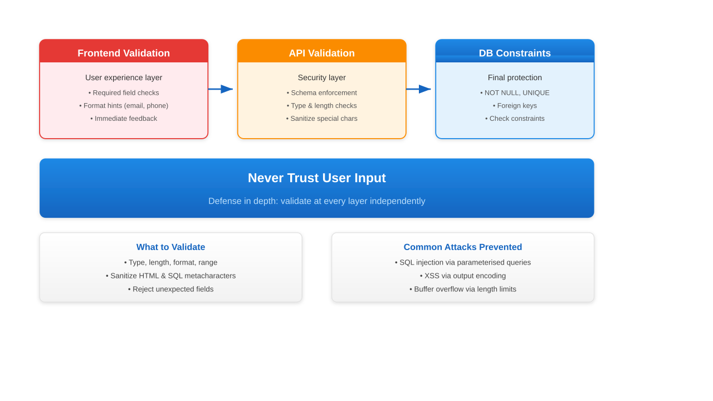
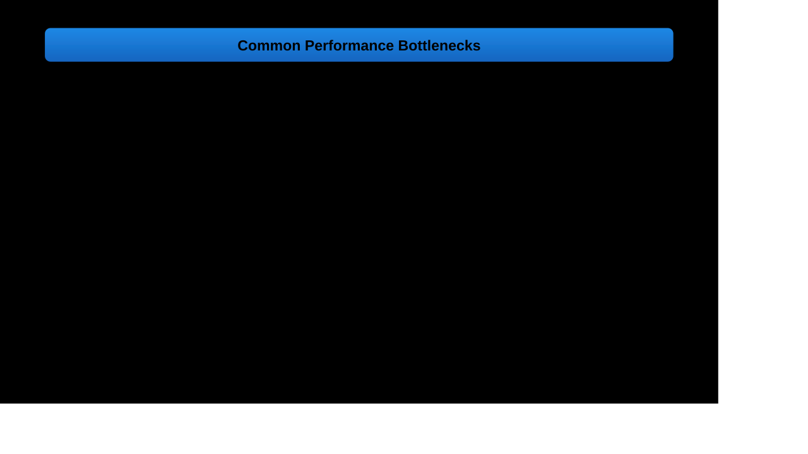

# Quality and Best Practices

---

## Maintaining Excellence in AI-Assisted Development

Ensure quality while leveraging AI's speed and capabilities

This chapter covers:
1. Code quality with AI
1. Security considerations
1. Performance optimization
1. Maintainability
1. Team standards

---

## The Quality Paradox



---

## Code Quality: Style Consistency

Enforcing consistent coding standards:

```javascript
// Configure ESLint for AI-generated code
{
  "extends": ["airbnb", "plugin:react/recommended"],
  "rules": {
    "indent": ["error", 2],
    "quotes": ["error", "single"],
    "semi": ["error", "always"],
    "no-unused-vars": "error",
    "consistent-return": "error"
  }
}

// Prettier config for formatting
{
  "singleQuote": true,
  "trailingComma": "es5",
  "tabWidth": 2,
  "printWidth": 80
}
```

Always run linters on AI output!

---

## Code Organization

Structuring projects consistently:

```tree
src/
├── components/      # UI components
│   ├── common/     # Reusable components
│   └── features/   # Feature-specific
├── services/       # Business logic
├── utils/          # Utility functions
├── hooks/          # Custom React hooks
├── api/            # API integration
├── types/          # TypeScript types
├── constants/      # App constants
└── tests/          # Test files
```

AI should follow your project structure!

---

## Complexity Management

Keep code simple and readable:

```python
# Bad: Complex nested logic
def process(data):
    if data:
        if data.valid:
            if data.type == 'A':
                return handle_a(data)
            else:
                if data.type == 'B':
                    return handle_b(data)
    return None

# Good: Early returns, clear flow
def process(data):
    if not data or not data.valid:
        return None

    handlers = {
        'A': handle_a,
        'B': handle_b
    }
    return handlers.get(data.type, lambda x: None)(data)
```

---

## Security Considerations: Vulnerability Detection

AI must check for security issues:

```javascript
// Common vulnerabilities to catch:

// 1. SQL Injection
// BAD: Never trust user input
const query = `SELECT * FROM users WHERE id = ${userId}`;

// GOOD: Use parameterized queries
const query = 'SELECT * FROM users WHERE id = ?';
db.query(query, [userId]);

// 2. XSS Prevention
// BAD: Direct HTML insertion
element.innerHTML = userInput;

// GOOD: Sanitize input
element.textContent = userInput;
```

---

## Secure Coding Patterns

Essential security patterns:

```python
# Password handling
import bcrypt

# Never store plain text
password_hash = bcrypt.hashpw(
    password.encode('utf-8'),
    bcrypt.gensalt()
)

# Environment variables for secrets
import os
API_KEY = os.environ.get('API_KEY')
# Never hardcode: API_KEY = 'abc123'

# Input validation
from marshmallow import Schema, fields

class UserSchema(Schema):
    email = fields.Email(required=True)
    age = fields.Int(min=0, max=150)
```

---

## Input Validation



---

## Authentication Patterns

Secure auth implementation:

```typescript
// JWT best practices
const generateToken = (user: User) => {
  return jwt.sign(
    {
      id: user.id,
      role: user.role
    },
    process.env.JWT_SECRET,
    {
      expiresIn: '15m',  // Short lived
      issuer: 'api.example.com'
    }
  );
};

// Refresh token pattern
const refreshToken = generateRefreshToken(user);
res.cookie('refreshToken', refreshToken, {
  httpOnly: true,
  secure: true,
  sameSite: 'strict'
});
```

---

## Performance Optimization: Bottleneck Identification



---

## Algorithm Optimization

Choose efficient algorithms:

```javascript
// Inefficient: O(n²)
function hasDuplicates(arr) {
  for (let i = 0; i < arr.length; i++) {
    for (let j = i + 1; j < arr.length; j++) {
      if (arr[i] === arr[j]) return true;
    }
  }
  return false;
}

// Efficient: O(n)
function hasDuplicates(arr) {
  return new Set(arr).size !== arr.length;
}

// AI should always suggest optimal algorithms
```

---

## Memory Management

Prevent memory leaks:

```javascript
// React: Clean up effects
useEffect(() => {
  const timer = setInterval(updateData, 1000);
  const subscription = dataService.subscribe(handleUpdate);

  // Cleanup function
  return () => {
    clearInterval(timer);
    subscription.unsubscribe();
  };
}, []);

// Node.js: Handle streams properly
const stream = fs.createReadStream(file);
stream.on('data', processChunk);
stream.on('end', () => stream.destroy());
stream.on('error', (err) => {
  logger.error(err);
  stream.destroy();
});
```

---

## Query Optimization

Database performance tips:

```sql
-- Use indexes effectively
CREATE INDEX idx_user_email ON users(email);
CREATE INDEX idx_orders_user_date
  ON orders(user_id, created_at DESC);

-- Avoid SELECT *
-- BAD: SELECT * FROM users;
-- GOOD: SELECT id, name, email FROM users;

-- Use EXPLAIN to analyze
EXPLAIN ANALYZE
SELECT u.name, COUNT(o.id)
FROM users u
LEFT JOIN orders o ON u.id = o.user_id
GROUP BY u.id;

-- Batch operations
INSERT INTO logs (message, level, created_at)
VALUES
  ('Message 1', 'INFO', NOW()),
  ('Message 2', 'ERROR', NOW());
```

---

## Maintainability: Code Readability

Write self-documenting code:

```python
# Bad: Unclear intent
def calc(x, y, z):
    return x * 0.1 + y * z * 0.05

# Good: Clear and documented
def calculate_total_price(
    base_price: float,
    quantity: int,
    tax_rate: float = 0.1
) -> float:
    """Calculate total with tax."""
    subtotal = base_price * quantity
    tax = subtotal * tax_rate
    return subtotal + tax

# AI should generate readable code by default
```

---

## Modular Design

Building maintainable systems:

```javascript
// Single Responsibility Principle
// Each module does one thing well

// user-service.js
export class UserService {
  async getUser(id) { /* ... */ }
  async updateUser(id, data) { /* ... */ }
}

// email-service.js
export class EmailService {
  async sendWelcome(user) { /* ... */ }
  async sendPasswordReset(email) { /* ... */ }
}

// controller.js - Orchestrates services
import { UserService } from './user-service';
import { EmailService } from './email-service';

// Clean separation of concerns
```

---

## Dependency Management

Keep dependencies under control:

```json
// package.json best practices
{
  "dependencies": {
    // Pin major versions
    "express": "^4.18.0",
    "react": "^18.2.0"
  },
  "devDependencies": {
    // Dev tools separate
    "eslint": "^8.0.0",
    "jest": "^29.0.0"
  },
  "scripts": {
    "audit": "npm audit fix",
    "outdated": "npm outdated",
    "update": "npm update"
  }
}
```

Regular updates prevent security issues

---

## Team Standards: Coding Conventions

Establishing team guidelines:

```typescript
// Team TypeScript conventions
interface TeamStandards {
  // Always use interfaces for objects
  naming: {
    components: 'PascalCase';
    functions: 'camelCase';
    constants: 'UPPER_SNAKE_CASE';
  };

  // Explicit return types
  functions: 'always-typed';

  // Error handling pattern
  errors: 'Result<T, Error>';

  // Testing requirements
  coverage: {
    minimum: 80;
    critical: 95;
  };
}

// AI should follow team conventions
```

---

## Review Processes

Code review workflow:


---

## SOLID Principles Enforcement

AI should follow SOLID:

```typescript
// S - Single Responsibility
class UserValidator {
  validate(user: User): ValidationResult {
    // Only validation logic
  }
}

// O - Open/Closed
interface PaymentProcessor {
  process(amount: number): Promise<Result>;
}
class StripeProcessor implements PaymentProcessor {}
class PayPalProcessor implements PaymentProcessor {}

// D - Dependency Inversion
class OrderService {
  constructor(private payment: PaymentProcessor) {}
  // Works with any PaymentProcessor
}
```

---

## Anti-Pattern Detection

Common anti-patterns to avoid:

```javascript
// ❌ God Object - Too many responsibilities
class UserManager {
  authenticate() {}
  saveToDatabase() {}
  sendEmail() {}
  generateReport() {}
  validateInput() {}
  handlePayment() {}
}

// ✅ Separated Concerns
class AuthService { authenticate() {} }
class UserRepository { save() {} }
class EmailService { send() {} }

// ❌ Callback Hell
getData(function(a) {
  getMoreData(a, function(b) {
    getMoreData(b, function(c) {
      // Deeply nested
    });
  });
});

// ✅ Async/Await
const a = await getData();
const b = await getMoreData(a);
const c = await getMoreData(b);
```

---

## Continuous Improvement: Metrics Tracking

Monitor quality over time:

```python
# Quality metrics dashboard
class QualityMetrics:
    def calculate_metrics(self, codebase):
        return {
            'coverage': self.test_coverage(),
            'complexity': {
                'cyclomatic': self.cyclomatic_complexity(),
                'cognitive': self.cognitive_complexity()
            },
            'duplication': self.duplication_percentage(),
            'debt': {
                'hours': self.technical_debt_hours(),
                'issues': self.debt_issues_count()
            }
        }

    def generate_report(self):
        """Weekly quality report"""
        return {
            'score': self.quality_score(),
            'delta': self.week_over_week_change(),
            'recommendations': self.get_improvements()
        }
```

---

## Quality Automation: Static Analysis

Automated code analysis tools:

```javascript
// ESLint configuration for automation
module.exports = {
  plugins: ['security', 'sonarjs'],
  extends: [
    'eslint:recommended',
    'plugin:security/recommended',
    'plugin:sonarjs/recommended'
  ],
  rules: {
    'complexity': ['error', 10],
    'max-lines-per-function': ['error', 50],
    'max-depth': ['error', 4],
    'no-duplicate-imports': 'error',
    'sonarjs/cognitive-complexity': ['error', 15],
    'security/detect-object-injection': 'error'
  }
};

// Auto-fix on save
// "editor.codeActionsOnSave": {
//   "source.fixAll.eslint": true
// }
```

---

## Pre-commit Hooks

Enforce quality before commit:

```json
// package.json with husky setup
{
  "husky": {
    "hooks": {
      "pre-commit": "lint-staged",
      "pre-push": "npm test",
      "commit-msg": "commitlint -E HUSKY_GIT_PARAMS"
    }
  },
  "lint-staged": {
    "*.{js,jsx,ts,tsx}": [
      "eslint --fix",
      "prettier --write",
      "jest --findRelatedTests"
    ],
    "*.{css,md}": "prettier --write"
  }
}
```

Prevent bad code from entering repository

---

## CI/CD Quality Gates

Automated quality enforcement:

```yaml
# Quality gates in CI/CD
quality_gates:
  - stage: Analysis
    steps:
      - lint:
          fail_on: error
      - typecheck:
          strict: true
      - security_scan:
          severity: high

  - stage: Testing
    requirements:
      - coverage: ">= 80%"
      - passing: "100%"
      - performance: "p95 < 200ms"

  - stage: Deploy Gate
    conditions:
      - quality_score: ">= B"
      - no_critical_issues: true
      - approved_by: 2
```

---

## Failure Recovery

Graceful error handling:

```typescript
// Resilient error handling pattern
class ResilientService {
  async fetchData(id: string): Promise<Result<Data, Error>> {
    try {
      // Primary attempt
      const data = await this.primary.fetch(id);
      return { success: true, data };
    } catch (primaryError) {
      logger.warn('Primary failed', primaryError);

      try {
        // Fallback to cache
        const cached = await this.cache.get(id);
        if (cached) {
          return { success: true, data: cached };
        }
      } catch (cacheError) {
        logger.warn('Cache failed', cacheError);
      }

      // Return degraded response
      return {
        success: false,
        error: new ServiceError('Service degraded'),
        fallback: this.getDefaultData()
      };
    }
  }
}
```

---

## Security Testing

Security-focused testing:

```python
# Security test cases
import pytest
from security_tests import SQLInjectionTester

class TestSecurity:
    def test_sql_injection_prevention(self):
        """Test against SQL injection"""
        payloads = [
            "'; DROP TABLE users; --",
            "1' OR '1'='1",
            "admin'--"
        ]

        for payload in payloads:
            result = api.search(payload)
            assert "error" not in result
            assert "SQL" not in str(result)

    def test_xss_prevention(self):
        """Test XSS protection"""
        xss_payload = "<script>alert('XSS')</script>"
        result = api.submit_comment(xss_payload)
        assert "<script>" not in result.rendered_html

    def test_rate_limiting(self):
        """Test rate limiting"""
        for i in range(101):
            response = api.request()
            if i > 99:
                assert response.status == 429
```

---

## Documentation Quality

Maintaining documentation standards:

```markdown
# Documentation Checklist

## Code Documentation ✓
- [ ] All public APIs documented
- [ ] Complex logic explained
- [ ] Examples provided
- [ ] Edge cases noted

## Project Documentation ✓
- [ ] README complete
- [ ] Setup instructions tested
- [ ] Architecture documented
- [ ] API reference current

## Process Documentation ✓
- [ ] Deployment process
- [ ] Troubleshooting guide
- [ ] Contributing guidelines
- [ ] Security procedures

## Keep docs in sync with code!
```

---

## Review Automation

AI-assisted code reviews:

```javascript
// AI review configuration
const aiReviewConfig = {
  checks: {
    security: {
      enabled: true,
      severity: 'high',
      rules: ['no-eval', 'no-injection', 'secure-random']
    },
    performance: {
      enabled: true,
      thresholds: {
        complexity: 10,
        fileSize: 500, // KB
        functionLength: 50
      }
    },
    style: {
      enabled: true,
      preset: 'team-standard'
    }
  },

  autoSuggest: {
    improvements: true,
    alternatives: true,
    bestPractices: true
  },

  blockMerge: {
    onCritical: true,
    onHighSeverity: false
  }
};
```

---

## Quality Culture

Building quality-first mindset:

```yaml
quality_culture:
  principles:
    - ownership: "Every developer owns quality"
    - prevention: "Fix root causes, not symptoms"
    - continuous: "Always improving"
    - measurement: "Data-driven decisions"

  practices:
    - peer_reviews: "All code reviewed"
    - testing: "TDD/BDD approach"
    - documentation: "Code explains itself"
    - learning: "Share knowledge freely"

  recognition:
    - quality_champion: "Monthly recognition"
    - improvement_bonus: "Reward improvements"
    - learning_time: "20% for learning"
```

---

## Technical Debt Management


---

## Chapter Summary

**Key Takeaways**:

AI speed + quality standards = sustainable development

Essential practices:
- Enforce consistent code style
- Implement security-first approach
- Optimize performance systematically
- Maintain modular, readable code
- Establish team standards
- Automate quality checks
- Continuous improvement culture

Quality is not optional with AI-assisted development
