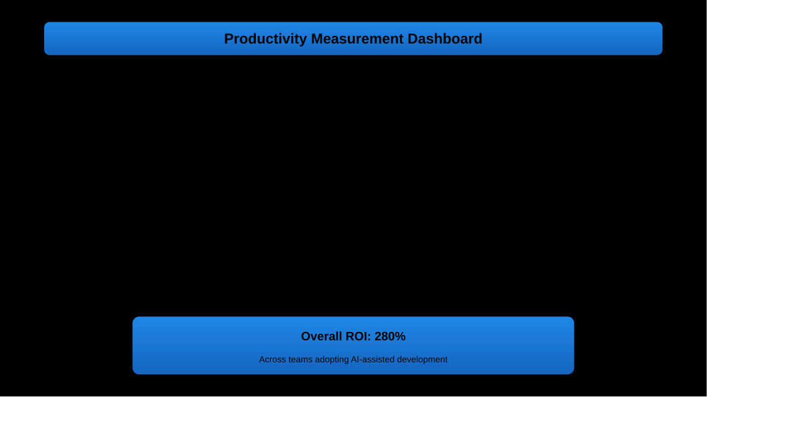
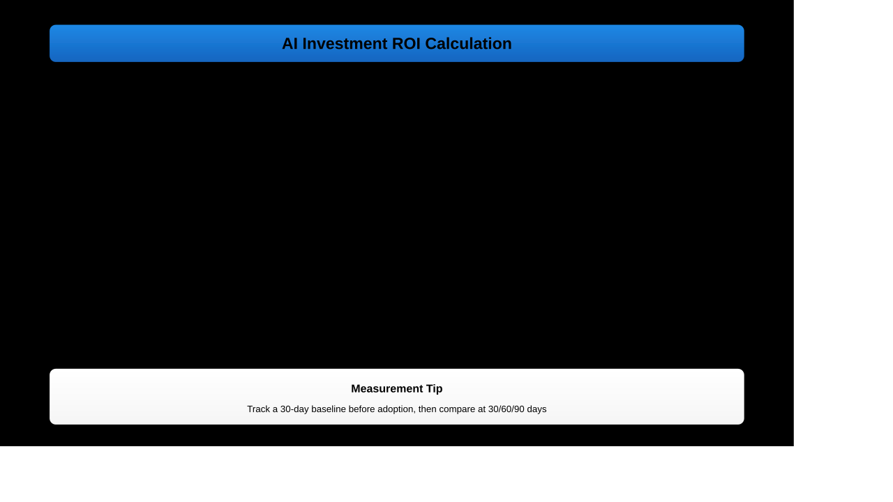
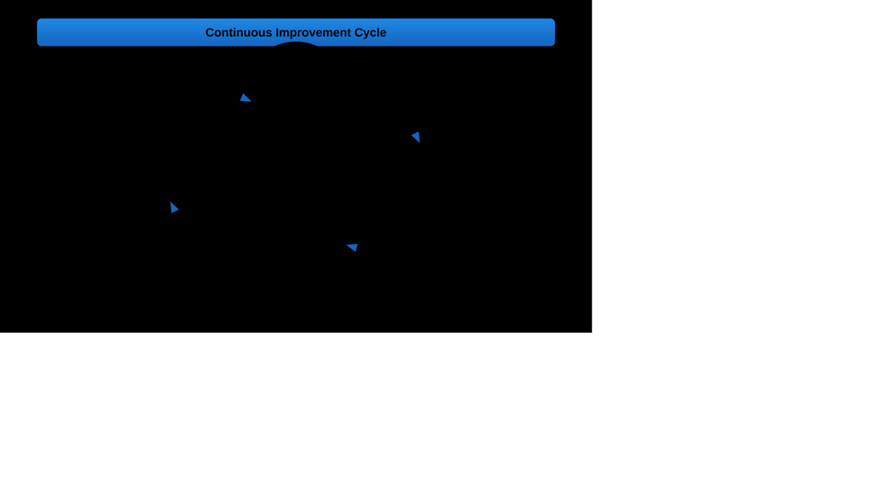

# Measuring Impact and ROI

---

## Learning Objectives

1. Establish comprehensive metrics for AI tool effectiveness
1. Calculate ROI of AI investments in development workflows
1. Measure productivity improvements and quality enhancements
1. Track learning acceleration and team impact

---

## Why Measuring AI Impact Matters

Quantifying AI impact enables:
- **Justification of AI tool investments** to management and stakeholders
- **Data-driven optimization** of AI usage patterns and workflows
- **Identification of high-value use cases** and areas for expansion
- **Evidence-based team training** and skill development prioritization
- **Strategic planning** for future AI adoption and scaling

---

## The Measurement Challenge



---

## Measurement Framework Overview

Comprehensive approach to measuring AI impact:

```yaml
# AI Impact Measurement Framework
measurement_categories:
  productivity:
    - development_velocity
    - task_completion_time
    - code_generation_speed
    - debugging_efficiency

  quality:
    - bug_reduction_rate
    - code_quality_metrics
    - security_improvement
    - technical_debt_reduction

  learning:
    - skill_acquisition_speed
    - knowledge_transfer_rate
    - onboarding_time_reduction
    - problem_solving_capability

  collaboration:
    - team_communication_quality
    - knowledge_sharing_frequency
    - code_review_efficiency
    - cross_team_coordination
```

---

## Baseline Establishment

Create accurate baselines before measuring AI impact:

```python
class BaselineEstablisher:
    def __init__(self):
        self.metrics_collector = MetricsCollector()
        self.historical_analyzer = HistoricalAnalyzer()

    def establish_baseline(self, measurement_period_weeks=12):
        """Establish baseline metrics before AI adoption"""
        return {
            'development_velocity': self.measure_historical_velocity(),
            'bug_rates': self.analyze_historical_bugs(),
            'code_quality': self.assess_historical_quality(),
            'team_productivity': self.calculate_team_output(),
            'learning_metrics': self.measure_skill_development(),
            'collaboration_metrics': self.assess_team_dynamics()
        }

    def validate_baseline_quality(self, baseline):
        """Ensure baseline measurements are reliable"""
        return self.statistical_validator.validate(baseline)
```

---

## Productivity Metrics



---

## Development Velocity Measurement

Track how AI impacts development speed:

```javascript
class VelocityTracker {
    measureDevelopmentVelocity(timeframe) {
        const baselineMetrics = this.getBaselineMetrics(timeframe);
        const currentMetrics = this.getCurrentMetrics(timeframe);

        return {
            story_points_per_sprint: {
                baseline: baselineMetrics.storyPoints,
                current: currentMetrics.storyPoints,
                improvement: this.calculateImprovement(
                    baselineMetrics.storyPoints,
                    currentMetrics.storyPoints
                )
            },
            features_delivered_per_month: {
                baseline: baselineMetrics.features,
                current: currentMetrics.features,
                improvement: this.calculateImprovement(
                    baselineMetrics.features,
                    currentMetrics.features
                )
            },
            lines_of_code_per_day: {
                baseline: baselineMetrics.loc,
                current: currentMetrics.loc,
                ai_generated_percentage: currentMetrics.aiGeneratedLoc
            }
        };
    }
}
```

---

## Task Completion Time Analysis

Measure efficiency improvements in specific development tasks:

```python
# Task completion time tracking
task_categories = {
    'feature_development': {
        'baseline_hours': 16.5,
        'with_ai_hours': 12.2,
        'improvement': '26% faster',
        'ai_contribution': {
            'code_generation': '40% of code AI-generated',
            'testing': '60% of tests AI-created',
            'documentation': '80% AI-assisted'
        }
    },
    'bug_fixing': {
        'baseline_hours': 4.8,
        'with_ai_hours': 2.9,
        'improvement': '40% faster',
        'ai_contribution': {
            'root_cause_analysis': '50% AI-assisted',
            'solution_generation': '70% AI-suggested',
            'testing_fixes': '80% AI-generated tests'
        }
    },
    'code_review': {
        'baseline_hours': 2.3,
        'with_ai_hours': 1.4,
        'improvement': '39% faster'
    }
}
```

---

## Quality Improvements Analysis

Track how AI affects the quality of development output:

```yaml
# Quality metrics tracking
quality_improvements:
  bug_reduction:
    baseline_bugs_per_kloc: 15.2
    with_ai_bugs_per_kloc: 8.7
    improvement_percentage: 43%
    attribution:
      - ai_code_review: 35%
      - ai_testing: 25%
      - ai_static_analysis: 40%

  code_quality_scores:
    complexity_reduction:
      baseline_cyclomatic: 12.4
      with_ai_cyclomatic: 8.9
      improvement: 28%

    maintainability_index:
      baseline_mi: 68
      with_ai_mi: 78
      improvement: 15%

    test_coverage:
      baseline_coverage: 67%
      with_ai_coverage: 84%
      improvement: 17_percentage_points
```

---

## Bug Reduction Metrics

Track how AI helps prevent and fix bugs:

```python
class BugReductionAnalyzer:
    def analyze_bug_trends(self, analysis_period):
        bugs_data = self.bug_tracker.get_bugs(analysis_period)
        ai_usage_data = self.ai_usage_correlator.get_usage(analysis_period)

        return {
            'prevention_metrics': {
                'bugs_prevented_by_ai_review': self.count_prevented_bugs(),
                'early_detection_rate': self.calculate_early_detection(),
                'ai_suggested_fixes_accuracy': self.measure_fix_accuracy()
            },
            'resolution_metrics': {
                'average_fix_time_reduction': '42%',
                'first_time_fix_rate_improvement': '28%',
                'regression_bug_reduction': '35%'
            },
            'correlation_analysis': {
                'ai_usage_vs_bug_rate': self.calculate_correlation(),
                'most_effective_ai_tools': self.rank_tools_by_bug_impact(),
                'bug_categories_most_improved': self.analyze_category_improvements()
            }
        }
```

---

## Learning Acceleration Measurement



---

## Technology Adoption Metrics

Track how AI helps teams adopt new technologies:

```yaml
# Technology adoption acceleration
adoption_metrics:
  new_framework_learning:
    traditional_ramp_up_time: "6-8 weeks"
    ai_assisted_ramp_up_time: "3-4 weeks"
    improvement: "50% faster"
    success_factors:
      - ai_generated_examples: 85%_helpful
      - interactive_explanations: 92%_clarity
      - personalized_learning_paths: 78%_effectiveness

  language_switching:
    baseline_productivity_recovery: "4 weeks"
    ai_assisted_recovery: "1.5 weeks"
    improvement: "63% faster"
    ai_contributions:
      - syntax_translation: "automated"
      - idiom_suggestions: "contextual"
      - best_practice_guidance: "real_time"
```

---

## Team Impact Assessment



---

## Collaboration Improvement Metrics

Measure how AI enhances team collaboration:

```yaml
# Team collaboration metrics
collaboration_improvements:
  knowledge_sharing:
    baseline_sharing_frequency: "2.3 items per developer per week"
    ai_enhanced_sharing: "4.7 items per developer per week"
    improvement: "104% increase"
    quality_metrics:
      - documentation_completeness: "+67%"
      - explanation_clarity: "+45%"
      - example_usefulness: "+58%"

  communication_efficiency:
    meeting_preparation_time: "-35%"
    technical_discussion_quality: "+52% clarity rating"
    cross_team_understanding: "+38% comprehension scores"
    ai_contributions:
      - automated_meeting_summaries: "95% accuracy"
      - technical_translation: "89% helpfulness"
      - context_preservation: "92% continuity"
```

---

## ROI Calculation Framework



---

## Comprehensive ROI Model

Calculate return on investment across multiple dimensions:

```python
class AIROICalculator:
    def calculate_comprehensive_roi(self, time_period):
        costs = self.calculate_total_costs(time_period)
        benefits = self.calculate_total_benefits(time_period)
        risks = self.assess_risks_and_adjustments()

        return {
            'financial_roi': {
                'total_investment': costs.total,
                'total_returns': benefits.total,
                'net_benefit': benefits.total - costs.total,
                'roi_percentage': ((benefits.total - costs.total) / costs.total) * 100,
                'payback_period_months': self.calculate_payback_period(costs, benefits)
            },
            'strategic_benefits': {
                'competitive_advantage': benefits.strategic.competitive_edge,
                'innovation_capability': benefits.strategic.innovation_boost,
                'talent_attraction': benefits.strategic.hiring_advantage,
                'market_responsiveness': benefits.strategic.agility_improvement
            }
        }
```

---

## Cost Component Analysis

Break down all AI-related investments:

```yaml
# Comprehensive cost analysis
ai_investment_costs:
  direct_costs:
    software_licenses:
      copilot_seats: "$19/month × 10 developers = $1,900/year"
      claude_pro: "$20/month × 5 senior devs = $1,200/year"
      cursor_licenses: "$20/month × 8 developers = $1,920/year"
      total_software: "$5,020/year"

    training_and_onboarding:
      initial_training: "$15,000 one-time"
      ongoing_education: "$5,000/year"
      certification_programs: "$3,000/year"
      total_training: "$23,000 first year, $8,000/year ongoing"

  indirect_costs:
    setup_and_integration:
      tool_configuration: "$8,000 one-time"
      workflow_redesign: "$12,000 one-time"
      policy_development: "$5,000 one-time"
      total_setup: "$25,000 one-time"
```

---

## Benefit Quantification

Calculate tangible and intangible benefits:

```python
class BenefitCalculator:
    def calculate_annual_benefits(self, team_metrics):
        return {
            'productivity_benefits': {
                'time_savings': {
                    'hours_saved_per_week': 15.2,
                    'average_hourly_rate': 80,
                    'weekly_value': 15.2 * 80 * 10,  # 10 developers
                    'annual_value': 15.2 * 80 * 10 * 52
                },
                'faster_delivery': {
                    'features_delivered_faster': 23,
                    'average_feature_value': 25000,
                    'accelerated_revenue': 23 * 25000 * 0.3  # 30% acceleration
                }
            },
            'quality_benefits': {
                'bug_reduction': {
                    'bugs_prevented_annually': 145,
                    'average_bug_fix_cost': 420,
                    'annual_savings': 145 * 420
                },
                'technical_debt_reduction': {
                    'maintenance_cost_reduction': 75000,
                    'future_development_acceleration': 45000
                }
            }
        }
```

---

## Continuous Improvement Framework



---

## Measurement Automation

Implement automated tracking of AI impact metrics:

```python
class AutomatedMeasurementSystem:
    def setup_automated_tracking(self):
        """Configure automated data collection and reporting"""
        collection_schedule = {
            'daily': ['productivity_metrics', 'quality_indicators'],
            'weekly': ['team_collaboration', 'learning_progress'],
            'monthly': ['roi_calculations', 'trend_analysis'],
            'quarterly': ['strategic_impact', 'long_term_projections']
        }

        for frequency, metrics in collection_schedule.items():
            self.schedule_collection(frequency, metrics)

        self.setup_alerting_thresholds()
        self.configure_dashboard_updates()

    def generate_impact_reports(self):
        """Automatically generate comprehensive impact reports"""
        return {
            'executive_summary': self.create_executive_dashboard(),
            'detailed_analytics': self.create_detailed_reports(),
            'trend_analysis': self.create_trend_reports(),
            'recommendations': self.generate_optimization_suggestions()
        }
```

---

## Performance Benchmarking

Compare AI impact against industry standards:

```yaml
# Industry benchmarking data
benchmark_comparisons:
  productivity_improvements:
    industry_average: "25% productivity gain"
    our_achievement: "42% productivity gain"
    percentile_ranking: "85th percentile"

  quality_improvements:
    industry_average: "18% bug reduction"
    our_achievement: "35% bug reduction"
    percentile_ranking: "78th percentile"

  learning_acceleration:
    industry_average: "30% faster skill acquisition"
    our_achievement: "58% faster skill acquisition"
    percentile_ranking: "91st percentile"

  roi_metrics:
    industry_average: "185% ROI in first year"
    our_achievement: "284% ROI in first year"
    percentile_ranking: "82nd percentile"
```

---

## Success Story Documentation

Capture and communicate AI success stories:

```markdown
# AI Success Story Template

## Project: Payment Processing Optimization

### Challenge
- Legacy payment system with 500ms average response time
- High maintenance overhead requiring 40 hours/week
- Security vulnerabilities identified in quarterly audit

### AI-Assisted Solution
- **Architecture Design**: Claude provided microservice decomposition strategy
- **Implementation**: Copilot accelerated coding with 65% AI-generated code
- **Testing**: AI-generated comprehensive test suites with edge cases
- **Security**: Automated vulnerability scanning and fix suggestions

### Results
- **Performance**: 85% improvement (500ms → 75ms response time)
- **Maintenance**: 70% reduction (40 → 12 hours/week)
- **Security**: 100% of identified vulnerabilities resolved
- **Development Speed**: 60% faster delivery (8 weeks → 3.2 weeks)

### ROI Analysis
- **Investment**: $15,000 (tools + training)
- **Annual Benefits**: $180,000 (time savings + reduced maintenance)
- **ROI**: 1,100% first year return
- **Payback Period**: 6 weeks
```

---

## Chapter Summary

**Key Takeaways**:

Measuring AI impact enables data-driven optimization and demonstrates value:

**Comprehensive Metrics**: Track productivity, quality, learning, and collaboration improvements
**ROI Calculation**: Quantify financial returns and strategic benefits
**Continuous Improvement**: Use measurement data to optimize AI usage patterns
**Stakeholder Communication**: Present impact data effectively to different audiences
**Future-Proofing**: Design measurement systems that evolve with AI capabilities

Effective measurement transforms AI adoption from experimentation to strategic advantage.
