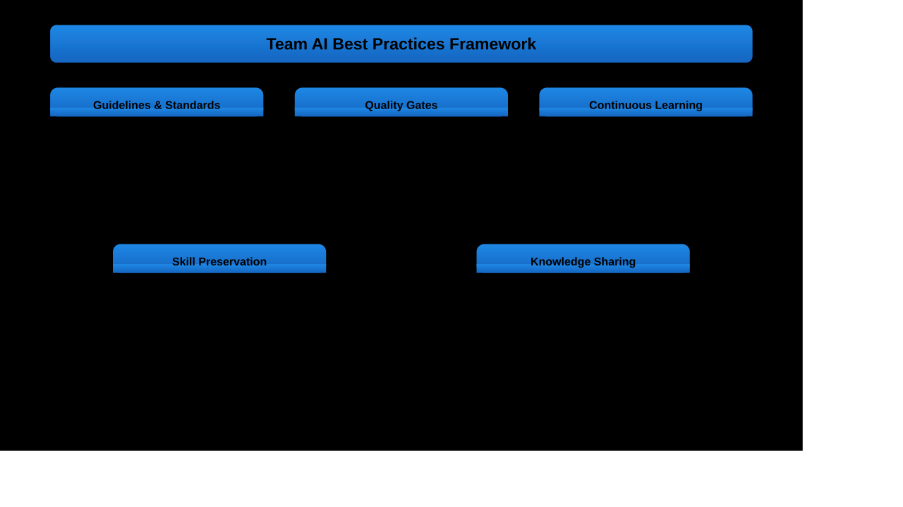

# Common Pitfalls and Solutions

---

## Learning Objectives

1. Identify common pitfalls in AI-assisted development
1. Implement strategies to avoid over-reliance on AI tools
1. Establish quality control measures for AI-generated code
1. Navigate context limitations and tool constraints effectively

---

## Why Pitfall Awareness Matters

Understanding common mistakes prevents:
- **Over-dependence** on AI tools leading to skill atrophy
- **Quality degradation** through insufficient verification
- **Security vulnerabilities** from unchecked AI suggestions
- **Technical debt accumulation** from rushed AI implementations
- **Team dysfunction** due to misaligned AI adoption

---

## The AI Adoption Danger Zones


---

## Over-Reliance on AI Tools

The most common and dangerous pitfall in AI-assisted development:

### Warning Signs
- Inability to code without AI assistance
- Panic when AI tools are unavailable
- Accepting all AI suggestions without review
- Loss of fundamental programming knowledge
- Reduced problem-solving confidence

---

## The Over-Reliance Progression

Understanding how over-dependence develops:

```python
# The dangerous progression of over-reliance
class OverRelianceProgression:
    def __init__(self):
        self.stages = {
            'stage_1_adoption': {
                'behavior': 'Using AI for simple tasks',
                'risk_level': 'low',
                'skills_impact': 'minimal'
            },
            'stage_2_convenience': {
                'behavior': 'AI becomes preferred method',
                'risk_level': 'low-medium',
                'skills_impact': 'slight_atrophy'
            },
            'stage_3_dependence': {
                'behavior': 'Struggling without AI assistance',
                'risk_level': 'high',
                'skills_impact': 'significant_degradation'
            },
            'stage_4_helplessness': {
                'behavior': 'Cannot function without AI',
                'risk_level': 'critical',
                'skills_impact': 'severe_skill_loss'
            }
        }
```

---

## Maintaining Core Programming Skills

Strategies to preserve fundamental development capabilities:

```yaml
# Monthly skill maintenance checklist
skill_preservation_routine:
  coding_fundamentals:
    - implement_algorithms_without_ai: "weekly"
    - solve_coding_problems_manually: "3x per week"
    - write_code_from_scratch: "daily minimum 30min"
    - debug_without_ai_assistance: "2x per week"

  problem_solving:
    - analyze_problems_independently: "before using AI"
    - generate_multiple_solutions: "compare with AI suggestions"
    - explain_reasoning_out_loud: "validate understanding"
    - teach_concepts_to_others: "monthly knowledge sharing"

  technical_understanding:
    - review_ai_generated_code_line_by_line: "always"
    - explain_ai_solutions_in_own_words: "validate comprehension"
    - modify_ai_code_without_ai_help: "test understanding"
    - implement_alternative_approaches: "expand thinking"
```

---

## Critical Thinking Preservation

Maintain analytical and decision-making skills:

```python
class CriticalThinkingFramework:
    def evaluate_ai_suggestion(self, suggestion, context):
        evaluation = {
            'technical_correctness': self.verify_correctness(suggestion),
            'performance_implications': self.analyze_performance(suggestion),
            'security_considerations': self.check_security(suggestion),
            'maintainability_assessment': self.assess_maintainability(suggestion),
            'alignment_with_requirements': self.verify_requirements(suggestion, context),
            'alternative_approaches': self.consider_alternatives(suggestion)
        }

        decision = self.make_informed_choice(evaluation)
        return decision
```

---

## Quality Control Failures



---

## The Verification Imperative

Never deploy AI-generated code without thorough verification:

```python
class AICodeVerificationFramework:
    def verify_ai_generated_code(self, code, context):
        verification_results = {}

        # Layer 1: Automated Analysis
        verification_results['syntax_check'] = self.verify_syntax(code)
        verification_results['security_scan'] = self.scan_security_issues(code)
        verification_results['performance_analysis'] = self.analyze_performance(code)

        # Layer 2: Functional Testing
        verification_results['unit_tests'] = self.run_unit_tests(code)
        verification_results['integration_tests'] = self.run_integration_tests(code)
        verification_results['edge_case_tests'] = self.test_edge_cases(code)

        # Layer 3: Human Review
        verification_results['code_review'] = self.human_code_review(code, context)
        verification_results['architecture_review'] = self.architecture_assessment(code)

        return self.compile_verification_report(verification_results)
```

---

## Testing AI-Generated Code

Comprehensive testing strategies for AI outputs:

```yaml
# AI code testing strategy
testing_framework:
  immediate_verification:
    - syntax_validation: "automated"
    - basic_functionality: "unit_tests"
    - expected_behavior: "integration_tests"
    - error_handling: "exception_tests"

  comprehensive_testing:
    - edge_case_scenarios: "boundary_value_analysis"
    - performance_under_load: "stress_testing"
    - security_vulnerability_scan: "automated_security_testing"
    - compatibility_testing: "cross_platform_validation"

  long_term_validation:
    - production_monitoring: "real_world_performance"
    - user_feedback_analysis: "actual_usage_patterns"
    - maintenance_complexity: "code_evolution_tracking"
    - scalability_assessment: "growth_impact_analysis"
```

---

## Security Validation Requirements

Special focus on security when using AI-generated code:

```python
class AISecurityValidator:
    def validate_security(self, ai_generated_code):
        security_report = {
            'vulnerabilities_found': [],
            'security_score': 0,
            'recommendations': [],
            'compliance_status': {}
        }

        # Common AI code security issues
        common_issues = [
            'hardcoded_credentials',
            'sql_injection_vulnerabilities',
            'xss_susceptibility',
            'insecure_random_generation',
            'improper_error_handling',
            'insufficient_input_validation'
        ]

        for issue in common_issues:
            if self.detect_issue(ai_generated_code, issue):
                security_report['vulnerabilities_found'].append(issue)
                security_report['recommendations'].extend(
                    self.get_remediation_steps(issue)
                )

        return security_report
```

---

## Context Limitation Challenges



---

## Managing Large Codebase Complexity

Strategies for AI limitations in complex systems:

```python
class ContextManager:
    def prepare_context_for_large_codebase(self, task, codebase):
        """Intelligently select most relevant context"""

        # Step 1: Identify relevant files and modules
        relevant_files = self.identify_relevant_files(task, codebase)

        # Step 2: Prioritize context by relevance
        prioritized_context = self.prioritize_context(relevant_files, task)

        # Step 3: Fit within context limits
        optimized_context = self.fit_context_window(prioritized_context)

        return {
            'primary_context': optimized_context['essential'],
            'supplementary_context': optimized_context['additional'],
            'excluded_context': optimized_context['deferred'],
            'context_summary': self.create_context_summary(codebase, task)
        }
```

---

## Complex Dependency Management

Handle AI limitations with interconnected systems:

```yaml
# Dependency complexity management
dependency_strategies:
  dependency_mapping:
    - create_visual_dependency_graphs
    - document_critical_dependency_paths
    - identify_circular_dependencies
    - map_external_system_integrations

  context_summarization:
    - create_component_interface_summaries
    - document_data_flow_patterns
    - maintain_integration_point_catalogs
    - generate_system_interaction_diagrams

  incremental_approach:
    - break_large_changes_into_small_increments
    - focus_ai_on_specific_subsystems
    - validate_each_increment_thoroughly
    - maintain_comprehensive_test_coverage
```

---

## Tool Limitation Recognition

Understanding when AI tools reach their limits:

```python
class ToolLimitationDetector:
    def __init__(self):
        self.limitation_patterns = {
            'hallucination_indicators': [
                'confident_but_incorrect_assertions',
                'non_existent_library_references',
                'impossible_performance_claims',
                'contradictory_statements'
            ],
            'context_overflow_signs': [
                'ignoring_recent_conversation_context',
                'repeating_outdated_information',
                'missing_critical_constraints',
                'generic_instead_of_specific_responses'
            ],
            'complexity_threshold_exceeded': [
                'oversimplified_solutions_for_complex_problems',
                'missing_edge_cases_in_complex_scenarios',
                'inadequate_error_handling_suggestions',
                'performance_implications_overlooked'
            ]
        }
```

---

## Fallback Strategy Development

Prepare for AI tool failures and limitations:

```yaml
# Comprehensive fallback strategies
fallback_framework:
  tool_failure_responses:
    primary_tool_unavailable:
      - switch_to_backup_ai_tool
      - continue_with_reduced_ai_assistance
      - fall_back_to_manual_development
      - escalate_to_senior_team_members

    quality_issues_detected:
      - stop_using_ai_for_current_task
      - review_and_fix_ai_generated_code_manually
      - implement_additional_validation_layers
      - document_problematic_patterns_for_future_avoidance

    context_limitations_exceeded:
      - break_problem_into_smaller_chunks
      - use_human_expertise_for_complex_parts
      - create_simplified_context_summaries
      - implement_staged_development_approach
```

---

## Team Best Practices



---

## Establishing Team Guidelines

Create comprehensive AI usage guidelines for teams:

```markdown
# Team AI Development Guidelines

## AI Tool Usage Standards
### Approved Tools and Configurations
- **Primary Tools**: GitHub Copilot, Claude 3.5, Cursor
- **Usage Contexts**: Code generation, debugging, documentation
- **Prohibited Uses**: Security-sensitive code, production deployments without review

### Code Generation Guidelines
- **Always Review**: Every AI-generated line must be human-reviewed
- **Test Requirements**: AI code requires same testing standards as human code
- **Documentation**: AI-generated code must include human-written explanations
- **Version Control**: Clear commits indicating AI assistance used

### Quality Assurance Requirements
- **Peer Review Mandatory**: All AI-assisted code requires peer review
- **Security Scanning**: Additional security validation for AI-generated code
- **Performance Testing**: AI code must meet same performance standards
- **Integration Testing**: Extra validation for AI-generated integrations
```

---

## Quality Gate Implementation

Systematic quality controls for AI-assisted development:

```python
class AIQualityGateSystem:
    def enforce_quality_gates(self, code_change, ai_metadata):
        """Enforce quality gates for AI-assisted code changes"""
        gate_results = {}

        # Pre-commit gate
        gate_results['pre_commit'] = self.quality_gates['pre_commit'].validate(
            code_change, ai_metadata
        )

        if not gate_results['pre_commit'].passed:
            return self.fail_early(gate_results['pre_commit'])

        # Code review gate
        gate_results['code_review'] = self.quality_gates['code_review'].validate(
            code_change, ai_metadata
        )

        # Integration gate
        if gate_results['code_review'].passed:
            gate_results['integration'] = self.quality_gates['integration'].validate(
                code_change, ai_metadata
            )

        return self.compile_gate_results(gate_results)
```

---

## Early Warning Systems

Implement systems to detect pitfalls before they become problems:

```python
class AIUsageMonitoringSystem:
    def __init__(self):
        self.warning_thresholds = {
            'over_reliance_indicators': {
                'ai_code_percentage': 0.8,  # Warning if >80% AI-generated
                'manual_coding_frequency': 0.2,  # Warning if <20% manual
                'ai_dependency_score': 0.7  # Warning if dependency too high
            },
            'quality_degradation_signals': {
                'bug_rate_increase': 0.3,  # Warning if bugs increase >30%
                'review_rejection_rate': 0.4,  # Warning if >40% rejections
                'technical_debt_accumulation': 0.5  # Warning threshold
            },
            'skill_atrophy_markers': {
                'problem_solving_time_increase': 0.4,  # 40% slower
                'manual_task_difficulty_increase': 0.3,  # 30% harder
                'knowledge_retention_decrease': 0.25  # 25% decrease
            }
        }
```

---

## Systematic Prevention Strategies

Proactive measures to prevent common pitfalls:

```yaml
# Systematic pitfall prevention
prevention_strategies:
  skill_preservation_systems:
    mandatory_manual_coding:
      frequency: "daily_minimum_30_minutes"
      activities: ["algorithm_implementation", "debugging_without_ai", "architecture_design"]
      tracking: "individual_and_team_dashboards"

    regular_assessments:
      technical_interviews: "monthly_peer_assessments"
      coding_challenges: "weekly_problem_solving_without_ai"
      knowledge_checks: "quarterly_comprehensive_evaluations"

  quality_assurance_systems:
    automated_quality_gates:
      pre_commit_hooks: "ai_code_identification_and_validation"
      continuous_integration: "enhanced_testing_for_ai_generated_code"
      deployment_checks: "additional_validation_before_production"

    human_oversight_requirements:
      mandatory_reviews: "ai_code_requires_senior_developer_review"
      security_validation: "security_expert_review_for_sensitive_ai_code"
      architecture_approval: "architect_approval_for_ai_architecture_suggestions"
```

---

## Incident Response Planning

Prepare for AI-related incidents and failures:

```markdown
# AI Incident Response Plan

## Category 1: AI Tool Failures
**Symptoms**: Tool unavailable, severe performance degradation, obvious bugs
**Immediate Response**:
- Switch to backup AI tools
- Fall back to manual development processes
- Notify team of tool status
- Document incident details

## Category 2: Quality Issues from AI Code
**Symptoms**: Production bugs traced to AI-generated code, security vulnerabilities
**Immediate Response**:
- Assess scope of impacted code
- Implement immediate fixes
- Review all recent AI-generated code
- Strengthen validation processes

## Category 3: Over-Reliance Detection
**Symptoms**: Team struggles without AI, reduced problem-solving capability
**Immediate Response**:
- Implement skill reinforcement exercises
- Increase manual coding requirements
- Provide additional mentoring
- Adjust AI usage guidelines
```

---

## Chapter Summary

**Key Takeaways**:

Avoiding AI pitfalls requires systematic awareness and proactive measures:

**Over-Reliance Prevention**: Maintain core programming skills through regular practice
**Quality Control**: Implement comprehensive validation for all AI-generated code
**Context Awareness**: Understand AI tool limitations and develop workarounds
**Team Best Practices**: Establish guidelines, quality gates, and continuous learning
**Proactive Monitoring**: Early warning systems and risk assessment prevent problems

Success with AI requires balancing assistance with human expertise.
