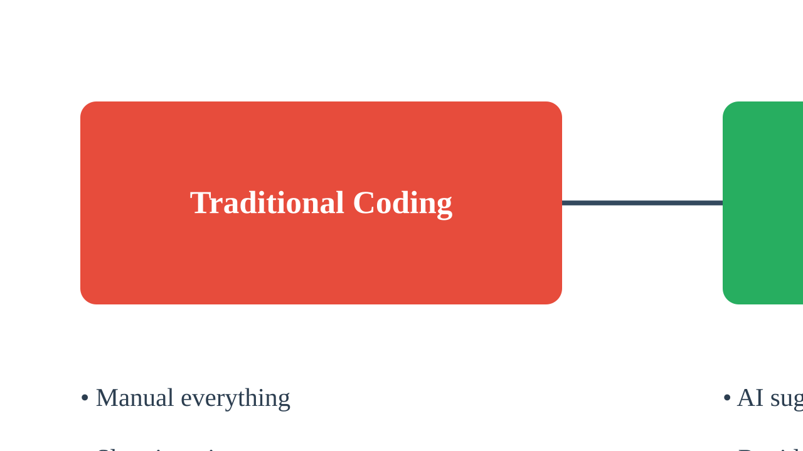
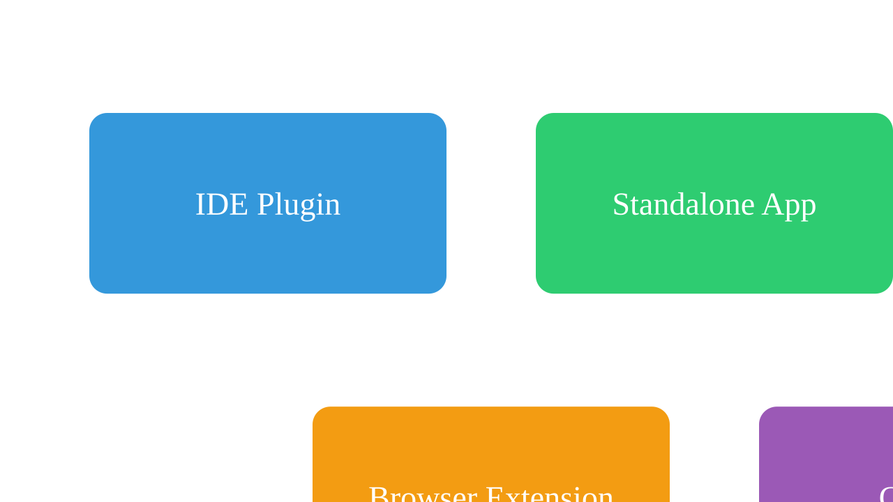
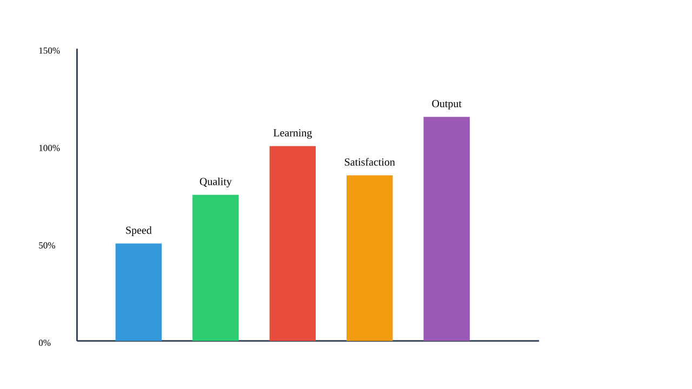

# Introduction to AI-Assisted Development

---

## Welcome to the AI Revolution in Software Development

AI is transforming how we write, test, and maintain code

This chapter explores:
1. Current state of AI for developers
1. Types of AI assistance available
1. Tool ecosystem overview
1. Productivity impact assessment
1. Limitations and best practices

---

## The Current State of AI for Developers

AI has evolved from simple autocomplete to intelligent coding partners

Key milestones:
- **2021**: GitHub Copilot launch - first mainstream AI pair programmer
- **2022**: ChatGPT revolution - conversational AI for development
- **2023**: Specialized coding AIs emerge - Cursor, Codeium, Claude
- **2024**: Multi-modal AI - understanding diagrams, screenshots, documentation
- **2025**: Context-aware, project-level AI assistance

---

## Why AI-Assisted Development Matters

Traditional development challenges:
- Repetitive boilerplate code
- Documentation burden
- Learning curve for new technologies
- Debugging time consumption
- Code review bottlenecks

AI addresses each of these pain points directly

---

## The Paradigm Shift



---

## Types of AI Assistance: Code Generation

### Automatic code completion and generation

Examples:
- Function implementation from comments
- Boilerplate code generation
- Pattern-based code suggestions
- Multi-file context understanding

```python
# AI understands intent and generates:
def calculate_fibonacci(n):
    # Generated implementation
```

---

## Types of AI Assistance: Intelligent Debugging

### AI-powered error detection and resolution

Capabilities:
- Error message interpretation
- Stack trace analysis
- Root cause identification
- Fix suggestions with explanations
- Performance bottleneck detection

Reduces debugging time by up to 50%

---

## Types of AI Assistance: Documentation Automation

### Automatic documentation generation

AI can create:
- Inline code comments
- Function/class documentation
- README files
- API documentation
- Architecture diagrams
- User guides

Maintains consistency and completeness

---

## Types of AI Assistance: Code Review

### Automated code quality analysis

AI assists with:
- Bug detection before human review
- Style consistency checking
- Security vulnerability scanning
- Performance optimization suggestions
- Best practice recommendations
- Anti-pattern identification

---

## Types of AI Assistance: Learning & Problem-Solving

### On-demand knowledge and guidance

AI provides:
- Technology explanations
- Code examples
- Best practice guidance
- Algorithm suggestions
- Library recommendations
- Architecture advice

Your personal tutor available 24/7

---

## AI Tools Ecosystem Overview


---

## Commercial vs Open Source Tools

### Commercial Tools
- GitHub Copilot - Microsoft/OpenAI backed
- Cursor - AI-first IDE
- Amazon CodeWhisperer - AWS integrated
- Tabnine - Enterprise focused

### Open Source Tools
- Codeium - Free tier available
- CodeGeeX - Hugging Face models
- LocalAI - Self-hosted solutions
- Ollama - Run models locally

---

## Cloud-Based vs Local Tools

**Cloud-Based**
    - Pros: Latest models, no setup, powerful
    - Cons: Internet required, privacy concerns, cost

**Local Tools**
    - Pros: Privacy, offline work, customizable
    - Cons: Hardware requirements, setup complexity, older models

Choose based on your security and performance needs

---

## General vs Specialized AI Assistants

### General Purpose
- ChatGPT, Claude, Gemini
- Broad knowledge base
- Flexible use cases
- Natural conversation

### Specialized Tools
- SQL-specific assistants
- Frontend component generators
- DevOps automation tools
- Security scanning AIs

---

## Integration Levels



---

## Productivity Impact: Time Savings Analysis

Studies show significant time reductions:

1. **Boilerplate code**: 90% faster
1. **Unit test writing**: 70% faster
1. **Documentation**: 80% faster
1. **Bug fixing**: 40% faster
1. **Code refactoring**: 60% faster

Average developer saves 2-3 hours per day

---

## Productivity Impact: Quality Improvements

Measurable quality gains:

- **Bug reduction**: 25-40% fewer bugs in production
- **Code consistency**: 85% improvement in style adherence
- **Test coverage**: 30% increase on average
- **Documentation completeness**: 3x more documented code
- **Security issues**: 50% caught before review

---

## Productivity Impact: Learning Acceleration

AI accelerates skill acquisition:

- New language proficiency: 2x faster
- Framework adoption: 60% quicker
- Best practice implementation: Immediate
- Problem-solving patterns: Learn from examples
- Technology exploration: Instant guidance

Junior developers reach productivity faster

---

## Productivity Impact: Cognitive Load Reduction

AI handles the mundane, you handle the creative:

**AI Manages**:
- Syntax details
- Library APIs
- Boilerplate patterns
- Error messages
- Documentation format

**You Focus On**:
- Business logic
- System design
- User experience
- Performance optimization
- Innovation

---

## Real-World Impact Metrics



---

## Understanding AI Limitations

**What AI Cannot Do**:
1. Replace human creativity and judgment
1. Understand complex business context
1. Make architectural decisions independently
1. Guarantee bug-free code
1. Handle highly specialized domains perfectly

AI is a tool, not a replacement

---

## Verification Requirements

**Always verify AI-generated code for**:

- **Correctness**: Does it actually work?
- **Security**: Are there vulnerabilities?
- **Performance**: Is it efficient?
- **Maintainability**: Is it readable and clean?
- **Licensing**: Are there copyright issues?

Trust but verify principle applies

---

## Security Considerations

Critical security practices:

1. **Never share**: Passwords, API keys, secrets
1. **Review carefully**: Authentication code
1. **Validate**: Input sanitization
1. **Check**: Dependency vulnerabilities
1. **Audit**: Data handling logic

AI doesn't understand your security context

---

## Maintaining Coding Skills

Balance AI assistance with skill development:

**Do**:
- Understand generated code
- Learn from AI suggestions
- Practice core concepts
- Review AI output critically

**Don't**:
- Blindly copy-paste
- Skip learning fundamentals
- Lose problem-solving skills
- Become dependent

---

## Ethical Considerations

Important ethical guidelines:

1. **Attribution**: Credit AI assistance when required
1. **Originality**: Ensure work meets originality standards
1. **Privacy**: Don't expose sensitive data
1. **Bias**: Be aware of AI biases
1. **Responsibility**: You own the final code

Professional integrity remains paramount

---

## Best Practices Overview



---

## Setting Expectations

**What to Expect**:
- Significant productivity boost
- Faster learning curve
- Reduced mundane tasks
- Better code consistency
- More time for creativity

**What NOT to Expect**:
- Perfect code every time
- Complete automation
- No need for expertise
- Instant mastery

---

## The Developer's New Role

From coder to AI orchestrator:

1. **Architect**: Design systems AI implements
1. **Curator**: Select best AI suggestions
1. **Validator**: Ensure quality and correctness
1. **Innovator**: Focus on creative solutions
1. **Mentor**: Guide AI with domain knowledge

Higher-level thinking becomes primary focus

---

## Success Factors

Key elements for successful AI adoption:

- **Open mindset**: Embrace new workflows
- **Continuous learning**: Stay updated with tools
- **Critical thinking**: Evaluate AI output
- **Experimentation**: Try different approaches
- **Collaboration**: Share knowledge with team

---

## Common Misconceptions

**Myth**: AI will replace developers
**Reality**: AI augments developer capabilities

**Myth**: AI-generated code is always correct
**Reality**: Requires validation and testing

**Myth**: AI understands business logic
**Reality**: Needs clear context and guidance

**Myth**: One AI tool fits all needs
**Reality**: Different tools for different tasks

---

## Getting Started Checklist

Essential first steps:

1. Choose one AI coding assistant
1. Start with simple tasks
1. Learn effective prompting
1. Establish verification workflow
1. Document what works
1. Share experiences with team
1. Gradually increase complexity

---

## Investment Considerations

**Time Investment**:
- Initial setup: 2-4 hours
- Learning curve: 1-2 weeks
- Proficiency: 1-2 months

**Financial Investment**:
- Free tiers available
- Paid plans: $10-30/month
- Enterprise: Custom pricing

ROI typically achieved within first month

---

## Measuring Your Progress

Track these metrics:

1. **Time saved** per feature/bug
1. **Code quality** improvements
1. **Learning velocity** for new tech
1. **Stress reduction** in daily work
1. **Output increase** per sprint

Regular assessment ensures continuous improvement

---

## Chapter Summary

**Key Takeaways**:

AI-assisted development is transforming software engineering

Main benefits:
    - Increased productivity and code quality
    - Accelerated learning and skill development
    - Reduced cognitive load and mundane tasks
    - Enhanced collaboration and documentation

Success requires balanced approach: embrace AI while maintaining core skills

---

## Looking Ahead

Next chapters will cover:

1. **Chapter 2**: AI-Powered Coding Assistants - hands-on with tools
1. **Chapter 3**: Chat-Based Development Workflows - conversational coding
1. **Chapter 4**: Prompt Engineering - getting the best results
1. **Chapter 5**: AI-Enhanced Coding Practices - real-world applications

Ready to transform your development workflow!
