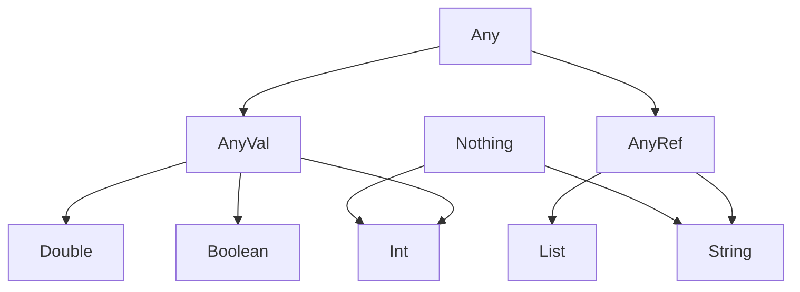
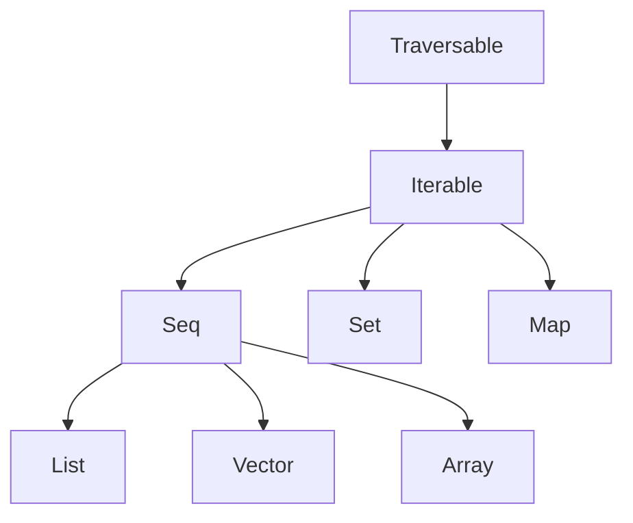
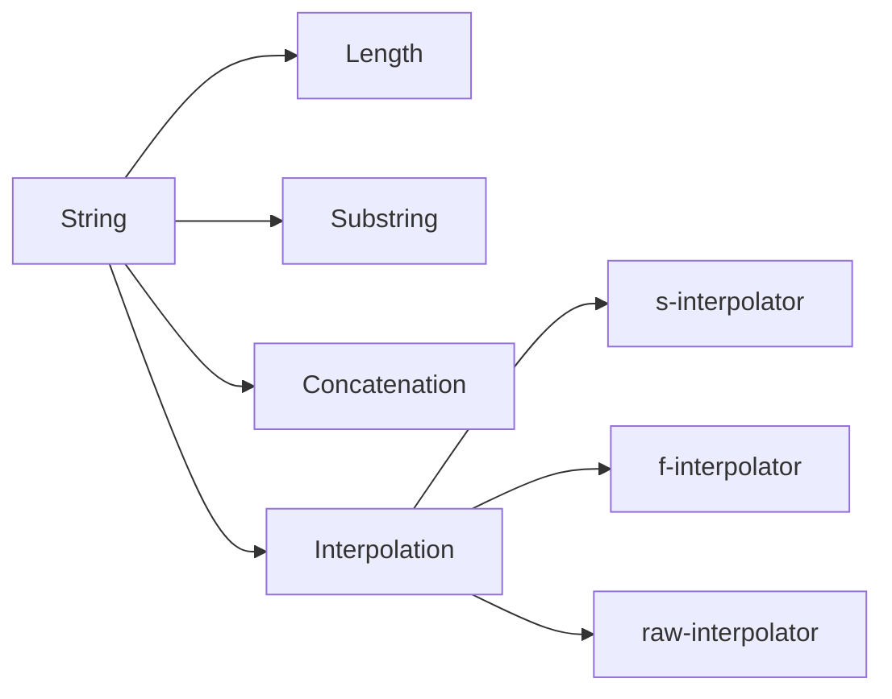
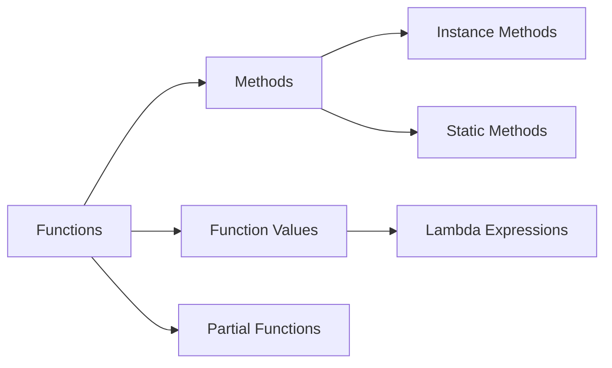
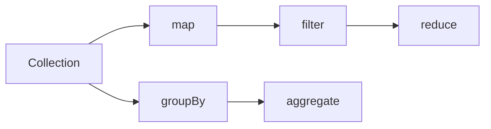
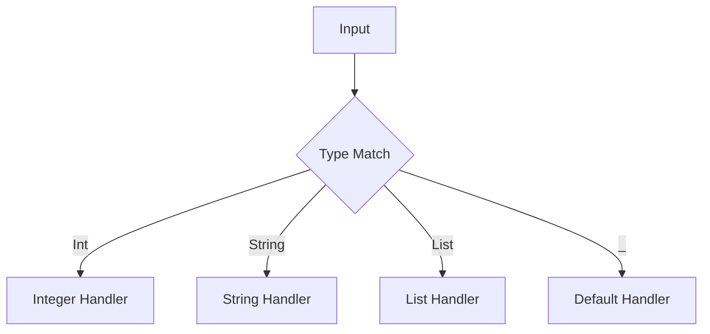
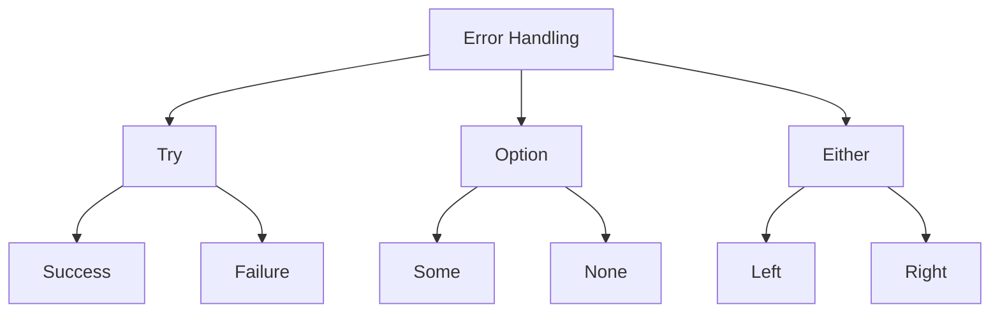
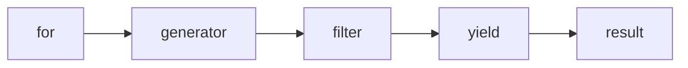
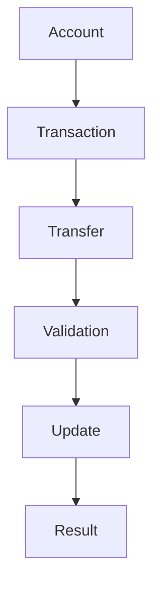

# Scala Refresher for Apache Spark

## Course Overview

1. Basic Scala Syntax
1. Object-Oriented Features
1. Functional Programming
1. Collections and Data Structures
1. Error Handling
1. Pattern Matching

---

## Scala Type Hierarchy



---

## Basic Syntax - Variables

1. Mutability with var
1. Immutability with val
1. Type Inference
1. Basic Types
1. Type Annotations

---

## Variable Declaration Examples

```scala
// Type inference
val message = "Hello"
var counter = 0

// Explicit typing
val greeting: String = "Hello"
var age: Int = 25

// Multiple declarations
val (x, y) = (10, 20)
```

---

## Collection Hierarchy



---

## Numeric Types in Detail

```scala
// Integer types
val b: Byte = 127
val s: Short = 32767
val i: Int = 2147483647
val l: Long = 9223372036854775807L

// Floating point
val f: Float = 3.14f
val d: Double = 3.14159265359
```

---

## String Operations Flow



---

## String Operations - Basics

```scala
val str1 = "Hello"
val str2 = "World"

// Concatenation
val combined = str1 + " " + str2

// String length and access
val length = str1.length
val firstChar = str1(0)
```

[Previous string sections continue...]

---

## Function Types



---

[Previous function sections continue...]

---

## Collection Operations Flow



---

[Previous collections sections continue...]

---

## Pattern Matching Flow



---

[Previous pattern matching sections continue...]

---

## Error Handling Hierarchy



---

[Previous error handling sections continue...]

---

## For Comprehension Flow



---

[Previous sections continue with other content remaining the same but with "---" between slides...]

---

## Final Exercise Architecture



[Final sections and solution continue...]
