# Introduction to Apache Spark

## What is Big Data?

1. Data that exceeds traditional processing capabilities
2. Requires distributed computing
3. Needs parallel processing
4. Demands scalable storage
5. Complex analysis requirements

---

## The 5 V's of Big Data

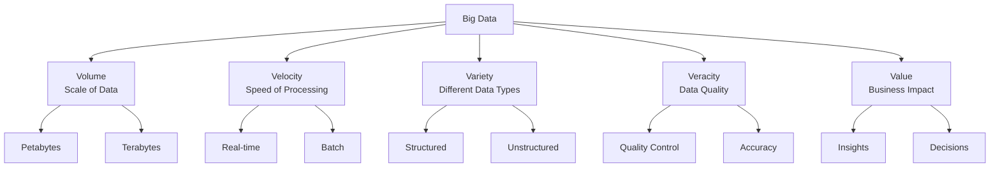

---

## Traditional vs Big Data Processing

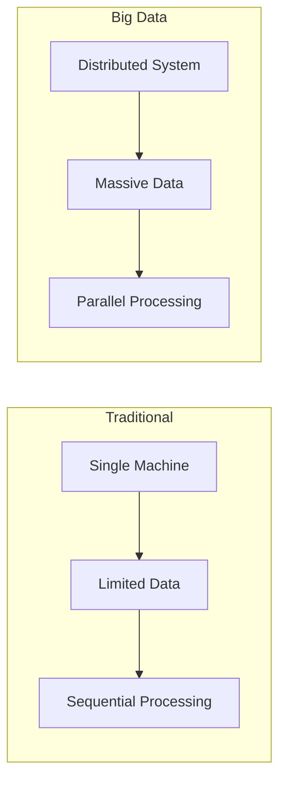

---

## Volume Challenges

1. Petabyte scale data
2. Historical data accumulation
3. Multiple data sources
4. Storage infrastructure
5. Processing capacity

---

## Data Growth Pattern

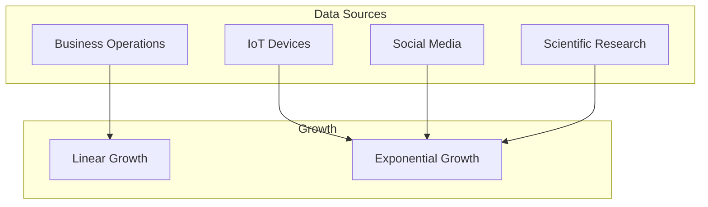

---

## Processing Requirements

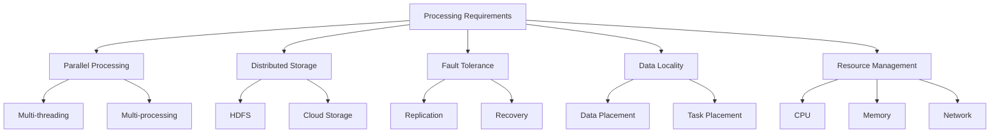

---

## Big Data Evolution

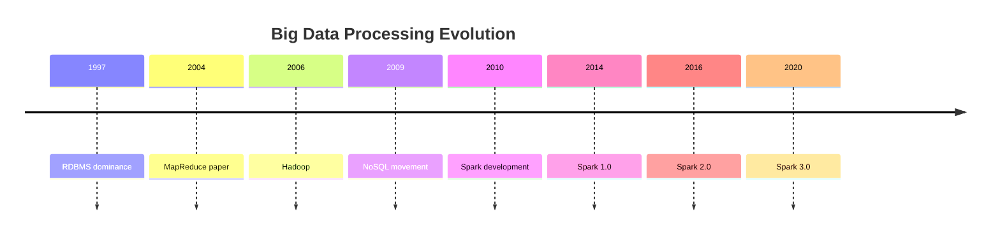

---

## Spark Architecture Overview

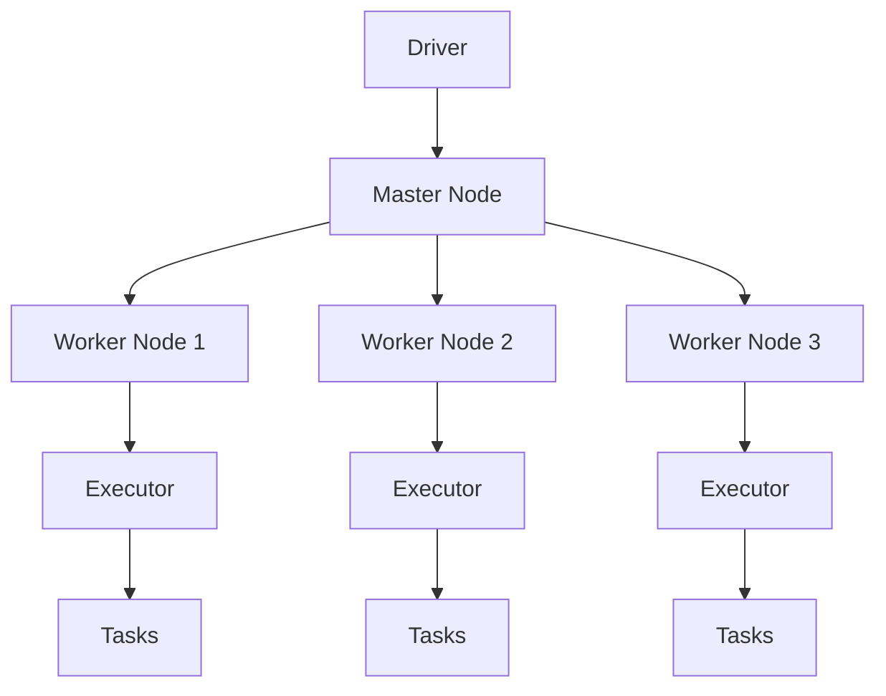

---

## Spark Components

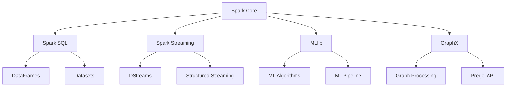

---

## Memory Architecture

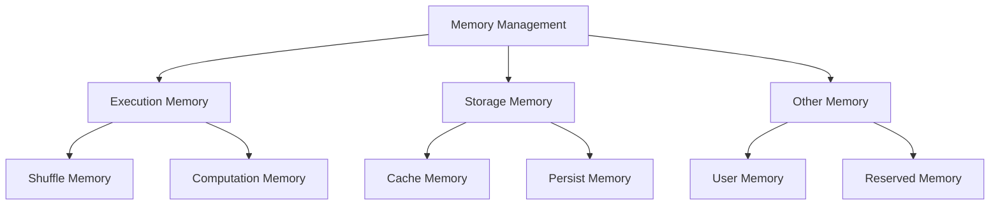

---

## Distributed Processing

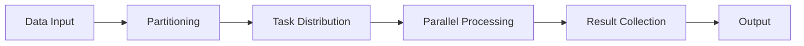

---

## Data Flow in Spark

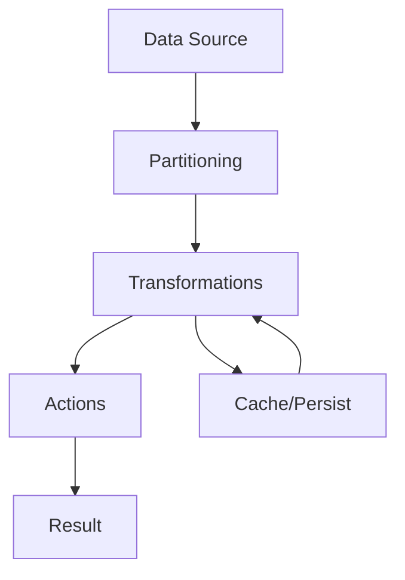

---

## Cluster Manager Types

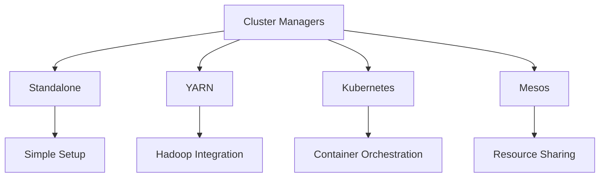

---

## Resource Management

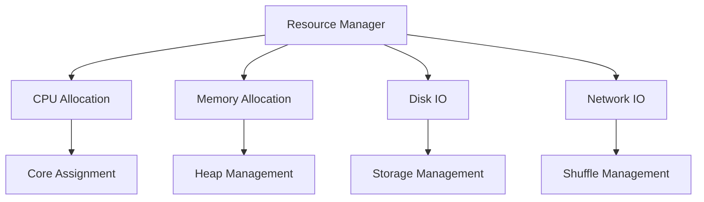

---

## DAG Execution

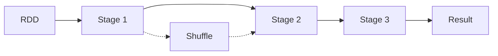

---

## Task Scheduling

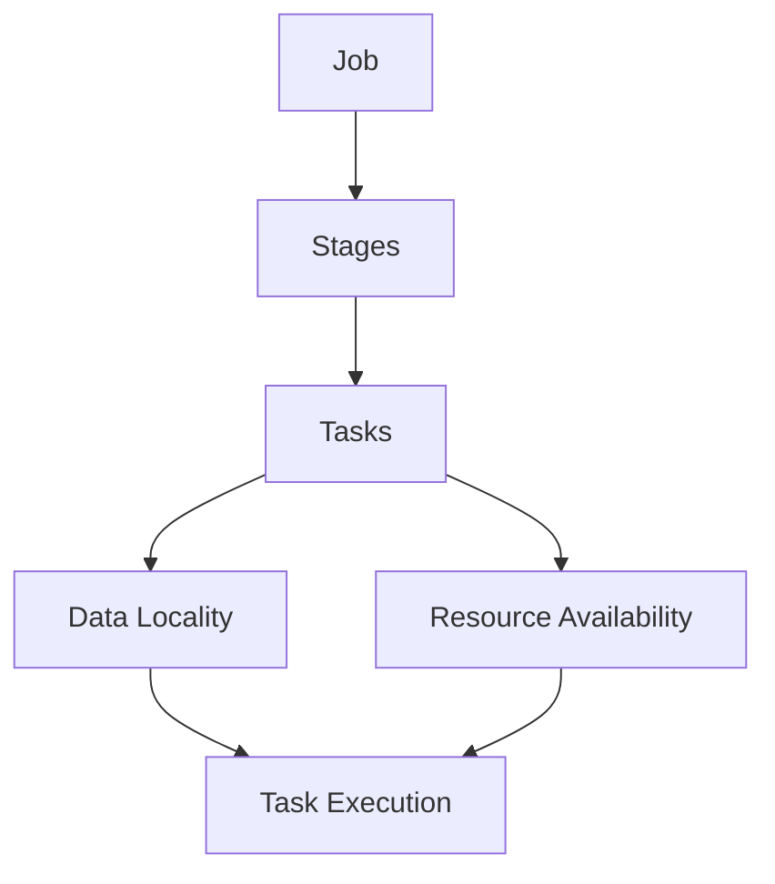

---

## Execution Modes

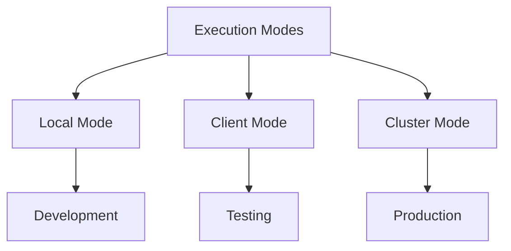

---

## Local Mode Setup

```scala
val spark = SparkSession.builder()
  .master("local[*]")
  .appName("LocalMode")
  .getOrCreate()
```

---

## Client Mode Setup

```scala
val spark = SparkSession.builder()
  .master("yarn")
  .deployMode("client")
  .appName("ClientMode")
  .getOrCreate()
```

---

## Cluster Mode Setup

```scala
val spark = SparkSession.builder()
  .master("yarn")
  .deployMode("cluster")
  .appName("ClusterMode")
  .getOrCreate()
```

---

## Fault Tolerance Model

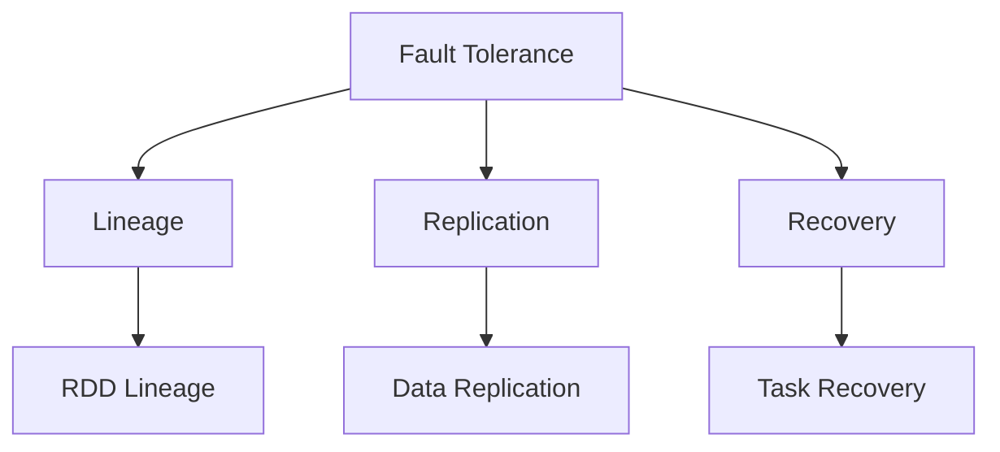

---

## Data Locality

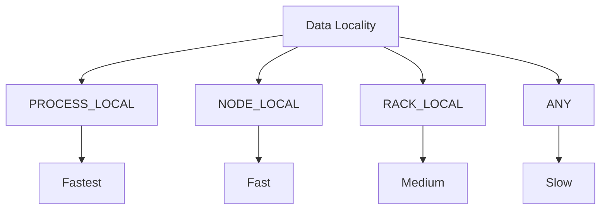

---

## Performance Considerations

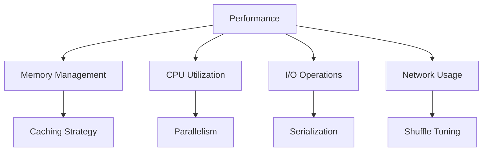

---

## Memory Management

1. Storage Memory
2. Execution Memory
3. User Memory
4. Reserved Memory

---

## CPU Resource Planning

1. Core Allocation
2. Task Parallelism
3. Executor Settings
4. Resource Sharing

---

## Network Optimization

1. Data Serialization
2. Shuffle Configuration
3. Broadcast Variables
4. Data Locality

---

## Storage Options

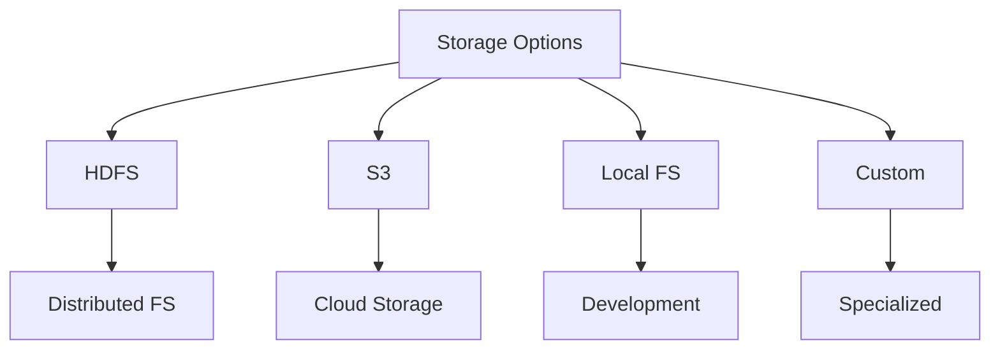

---

## Monitoring & Debugging

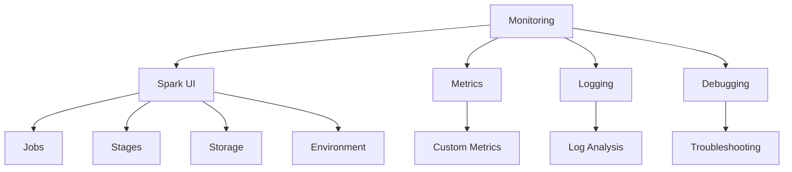

---

## Production Deployment

```mermaid
graph TD
    Prod[Production] --> Config[Configuration]
    Prod --> Security[Security]
    Prod --> Monitor[Monitoring]
    Prod --> Scale[Scaling]
    
    Config --> Tune[Tuning]
    Security --> Auth[Authentication]
    Monitor --> Alert[Alerting]
    Scale --> Auto[Auto-scaling]
```

---

## Best Practices

1. Resource Planning
2. Data Organization
3. Job Configuration
4. Monitoring Setup
5. Error Handling

---

## Cluster Sizing

```mermaid
graph TD
    Size[Cluster Sizing] --> Nodes[Number of Nodes]
    Size --> Cores[Cores per Node]
    Size --> Mem[Memory per Node]
    Size --> Disk[Storage per Node]
    
    Nodes --> Load[Workload]
    Cores --> Parallel[Parallelism]
    Mem --> Cache[Caching]
    Disk --> Data[Data Size]
```

---

## Security Configuration

1. Authentication
2. Authorization
3. Encryption
4. Audit Logging
5. Access Control

---

## Future Trends

```mermaid
graph TD
    Future[Future Trends] --> Cloud[Cloud Native]
    Future --> GPU[GPU Acceleration]
    Future --> ML[Advanced ML]
    Future --> Stream[Real-time Processing]
    
    Cloud --> K8s[Kubernetes]
    GPU --> Deep[Deep Learning]
    ML --> Auto[AutoML]
    Stream --> Edge[Edge Computing]
```
