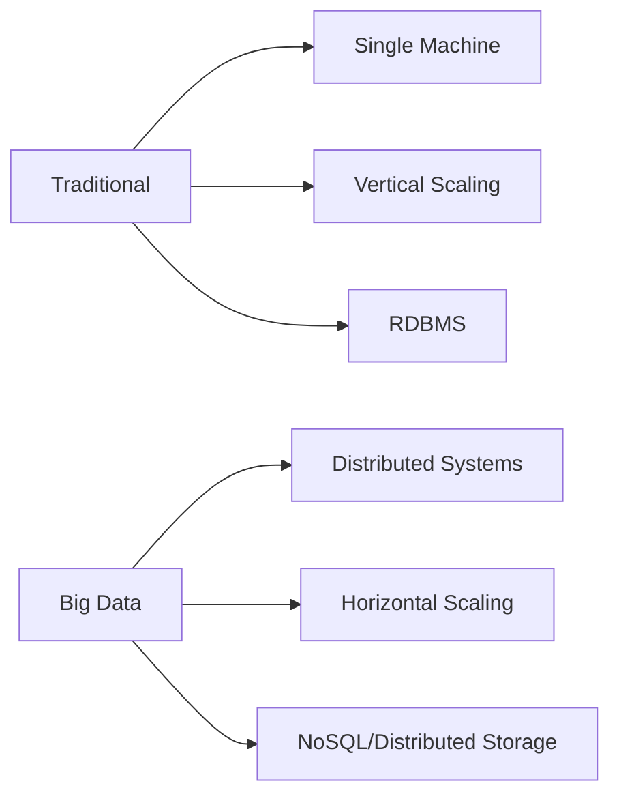
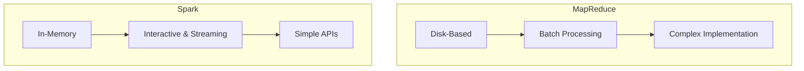
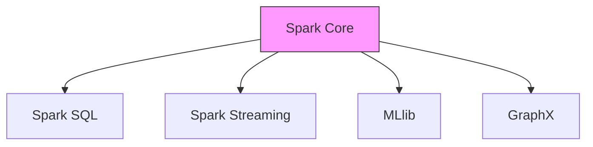
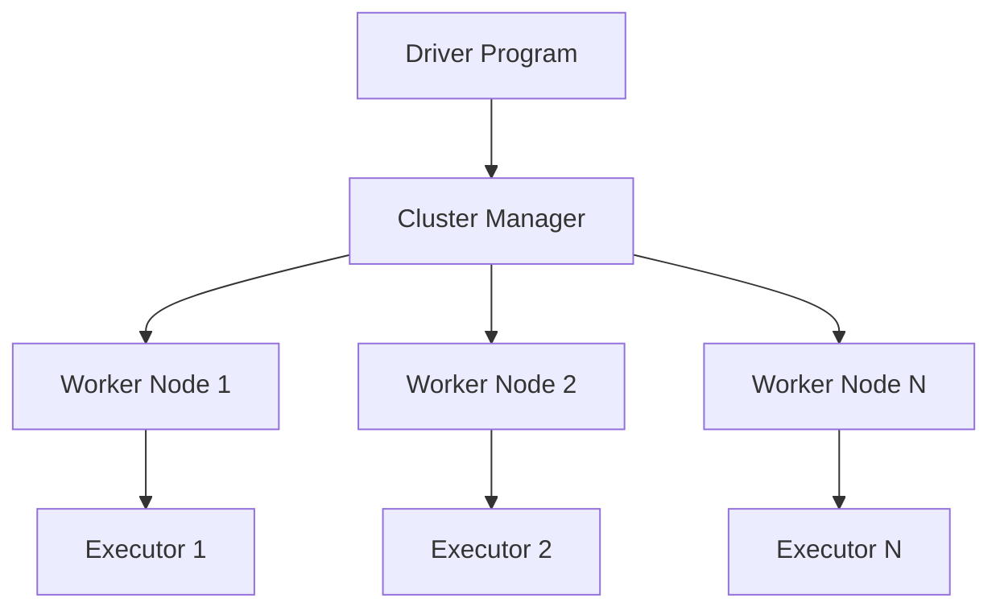
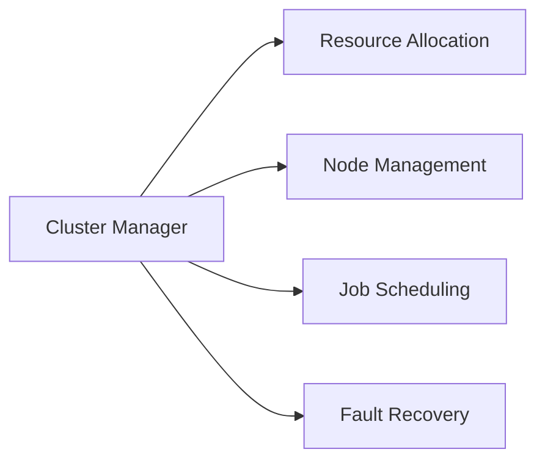
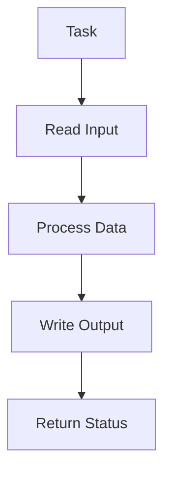
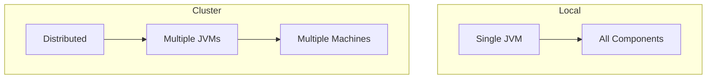
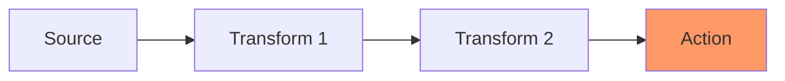

# Introduction to Apache Spark

## Overview of Big Data

1. Volume - Scale of data
1. Velocity - Speed of data generation
1. Variety - Different types of data
1. Veracity - Uncertainty of data
1. Value - Business impact

## Big Data Challenges

1. Data Storage
1. Data Processing
1. Data Analysis
1. Real-time Processing
1. Resource Management

## Evolution of Big Data Technologies

1. Traditional Databases
1. MapReduce & Hadoop
1. Apache Spark
1. Modern Data Lake Architecture

## Traditional vs Big Data Processing



## Apache Spark Overview

1. Open-source unified analytics engine
1. In-memory computation
1. Fault tolerance
1. Lazy evaluation
1. Multiple language support

## Spark vs Hadoop MapReduce



## Spark Components



## Spark Architecture



## Driver Program

1. Contains application's main function
1. Creates SparkContext
1. Declares transformations and actions
1. Coordinates work distribution

## Spark Context

```scala
// Creating Spark Context
import org.apache.spark.{SparkConf, SparkContext}

val conf = new SparkConf()
  .setAppName("MySparkApp")
  .setMaster("local[*]")

val sc = new SparkContext(conf)
```

## Executors

1. Run on worker nodes
1. Execute tasks
1. Store data in memory or disk
1. Return results to driver

## Cluster Manager Types

1. Standalone
1. YARN
1. Mesos
1. Kubernetes

## Cluster Manager Responsibilities



## DAG - Directed Acyclic Graph


## Stages in Spark

1. DAG scheduler breaks job into stages
1. Each stage contains multiple tasks
1. Stages are separated by shuffle operations

## Task Execution



## Memory Management

1. Execution Memory
1. Storage Memory
1. User Memory
1. Reserved Memory

## Performance Considerations

1. Data serialization
1. Memory allocation
1. Shuffle operations
1. Data locality

## Best Practices

1. Proper partition sizing
1. Cache reused data
1. Minimize shuffling
1. Use appropriate data formats

## Local vs Cluster Mode



## Spark Web UI

1. Application monitoring
1. Job progress tracking
1. Memory usage
1. Executor information
1. Stage details

## Data Lineage



## Fault Tolerance

1. RDD lineage tracking
1. Executor failure handling
1. Task retry mechanism
1. Checkpoint support
