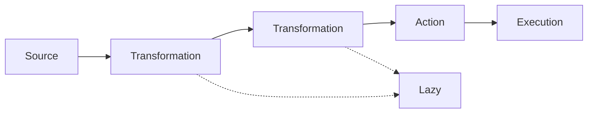
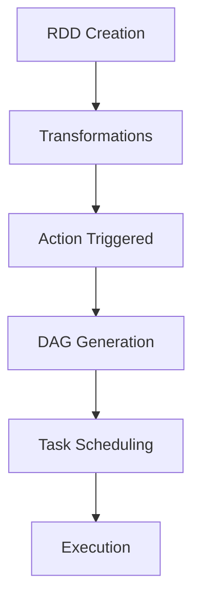
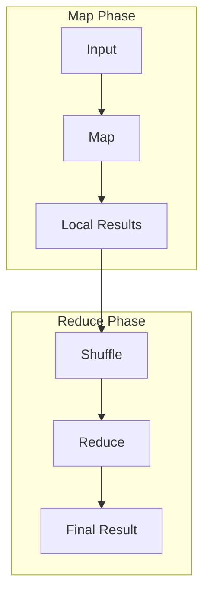
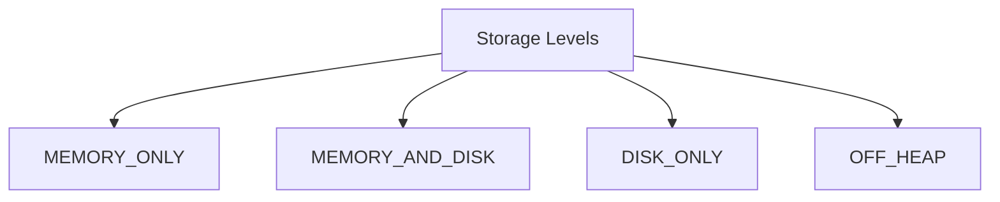
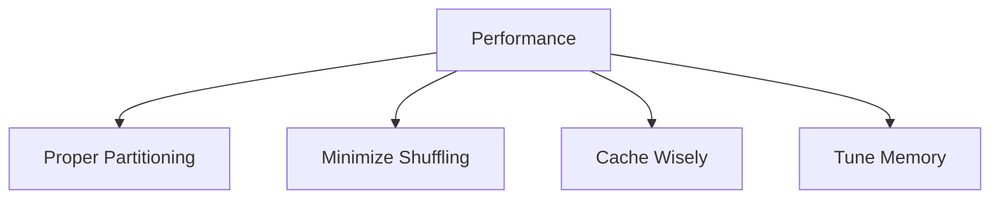

# Spark Core

## What is Spark Core?

1. Foundation of Spark ecosystem
1. Provides basic functionality
1. Implements RDDs
1. Handles task scheduling
1. Manages memory

## RDD Basics

1. Resilient Distributed Datasets
1. Immutable
1. Partitioned
1. Lazy evaluation
1. Fault-tolerant

## Creating RDDs

```scala
// From a collection
val data = Array(1, 2, 3, 4, 5)
val rdd = sc.parallelize(data)

// From a file
val textFile = sc.textFile("data.txt")

// From another RDD
val mappedRDD = rdd.map(_ * 2)
```

## RDD Operations Flow



## Transformations

1. map
1. filter
1. flatMap
1. groupBy
1. union

## Transformation Examples

```scala
// Map transformation
val numbers = sc.parallelize(1 to 10)
val doubled = numbers.map(_ * 2)

// Filter transformation
val evens = numbers.filter(_ % 2 == 0)

// FlatMap transformation
val lines = sc.parallelize(List("hello world", "hi there"))
val words = lines.flatMap(_.split(" "))
```

## Actions

1. collect
1. count
1. first
1. take
1. reduce

## Action Examples

```scala
// Collect action
val result = doubled.collect()

// Count action
val total = evens.count()

// Reduce action
val sum = numbers.reduce(_ + _)
```

## Execution Model



## Chaining Transformations

```scala
val result = sc.textFile("data.txt")
  .map(_.split(" "))
  .flatMap(identity)
  .map(_.toLowerCase)
  .filter(_.length > 3)
  .map((_, 1))
  .reduceByKey(_ + _)
  .collect()
```

## Lambda Functions

```scala
// Anonymous function syntax
val square = (x: Int) => x * x

// With RDD
val squared = numbers.map(x => x * x)

// Shorter syntax
val squared = numbers.map(pow(_, 2))
```

## MapReduce Pattern



## Shuffling Operations

1. groupByKey
1. reduceByKey
1. join
1. cogroup
1. repartition

## Caching

```scala
// Cache in memory
rdd.cache()

// Or with storage level
import org.apache.spark.storage.StorageLevel
rdd.persist(StorageLevel.MEMORY_AND_DISK)
```

## Storage Levels



## Web UI Monitoring

1. Application status
1. Job progress
1. Storage usage
1. Environment info
1. Executor details

## Common Use Cases

1. Data cleaning
1. ETL operations
1. Text processing
1. Basic analytics
1. Data preparation

## Serialization

```scala
// Case class for custom objects
case class Person(name: String, age: Int)

// Kryo serialization configuration
conf.set("spark.serializer",
  "org.apache.spark.serializer.KryoSerializer")
conf.registerKryoClasses(Array(classOf[Person]))
```

## Troubleshooting

1. Out of memory errors
1. Data skew
1. Slow shuffle operations
1. Task failures
1. Driver issues

## Performance Tips



## Resource Usage

1. Memory allocation
1. CPU utilization
1. Network bandwidth
1. Disk I/O

## Best Practices

1. Use appropriate data structures
1. Optimize shuffle operations
1. Monitor memory usage
1. Handle data skew
1. Implement proper error handling
