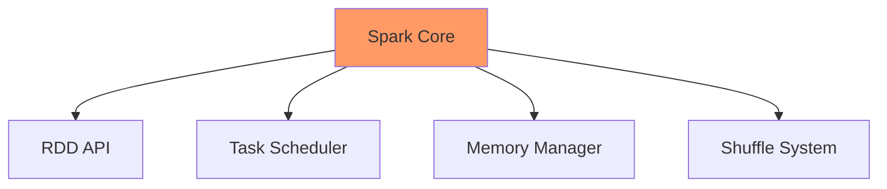
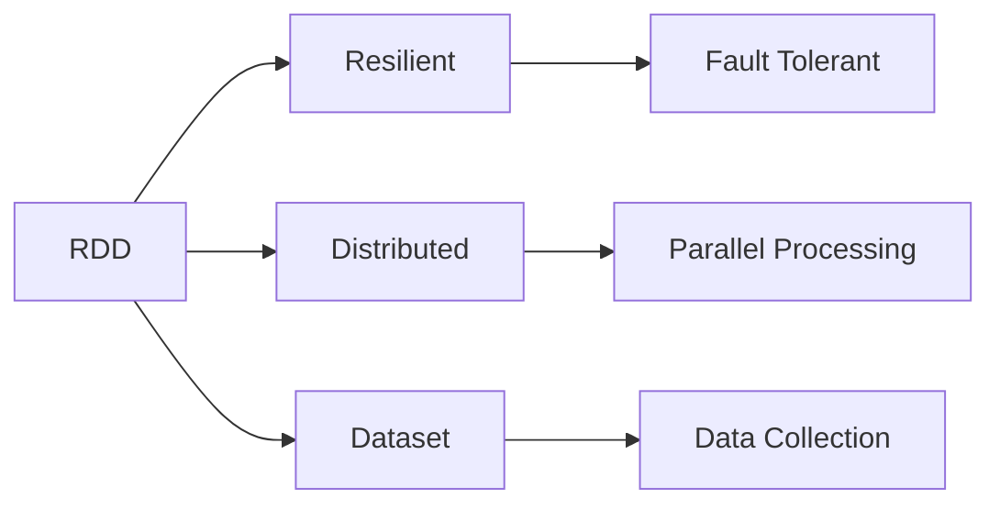
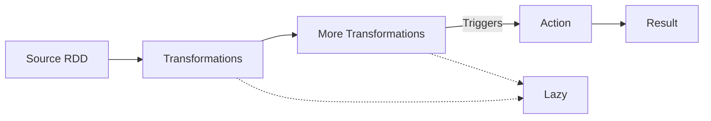
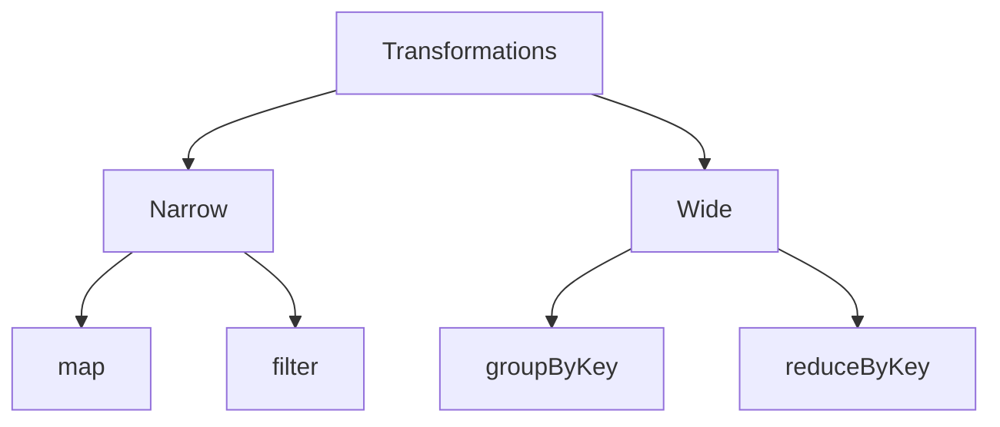
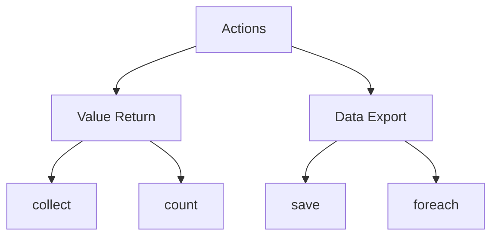
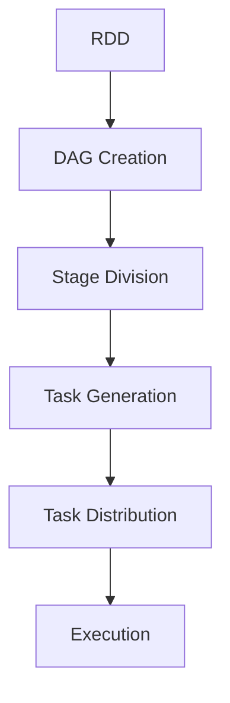
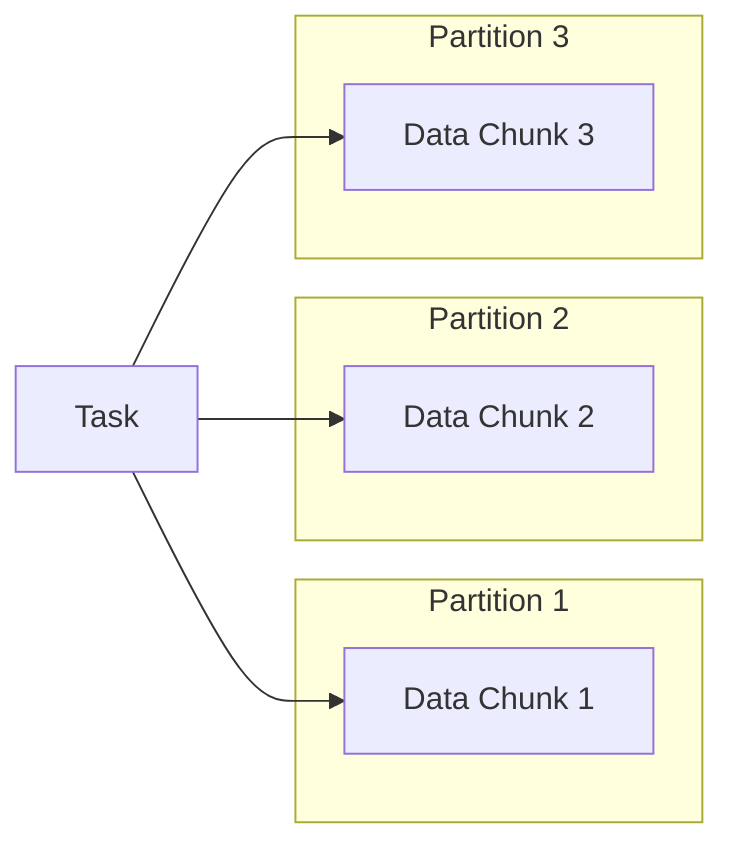

# Spark Core

## What is Spark Core?

1. Foundation of Spark ecosystem
1. Provides basic functionality
1. Implements RDDs
1. Handles task scheduling
1. Manages memory

---

## Core Components



---

## RDD Basics



---

## RDD Characteristics

1. Immutable
1. Partitioned
1. Lazy evaluation
1. Fault-tolerant
1. Type-safe

---

## Creating RDDs

```scala
// From a collection
val data = Array(1, 2, 3, 4, 5)
val rdd = sc.parallelize(data)

// From a file
val textFile = sc.textFile("data.txt")

// From another RDD
val mappedRDD = rdd.map(_ * 2)
```

---

## RDD Operations Flow



---

## Transformations Hierarchy



---

## Transformation Examples

```scala
// Map transformation
val numbers = sc.parallelize(1 to 10)
val doubled = numbers.map(_ * 2)

// Filter transformation
val evens = numbers.filter(_ % 2 == 0)

// FlatMap transformation
val lines = sc.parallelize(List("hello world", "hi there"))
val words = lines.flatMap(_.split(" "))
```

---

## Action Types



---

## Action Examples

```scala
// Collect action
val result = doubled.collect()

// Count action
val total = evens.count()

// Reduce action
val sum = numbers.reduce(_ + _)
```

---

[Continue with remaining slides, adding mermaid diagrams for concepts like:]

## Execution Model



---

## Data Partitioning



[Continue with remaining content and diagrams...]
