# Spark SQL

## Introduction to Spark SQL

1. High-level API for structured data
1. DataFrame abstraction
1. SQL query support
1. Schema inference
1. Optimized execution

---

## Spark SQL Architecture

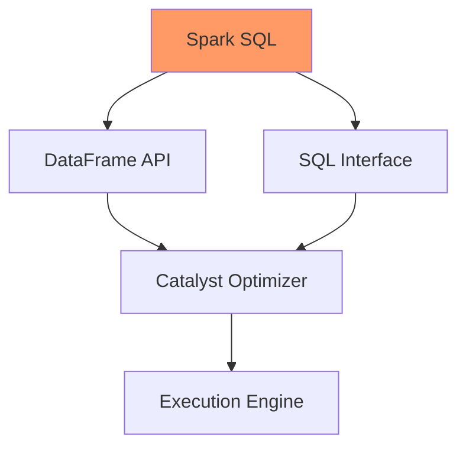

---

## Data Sources

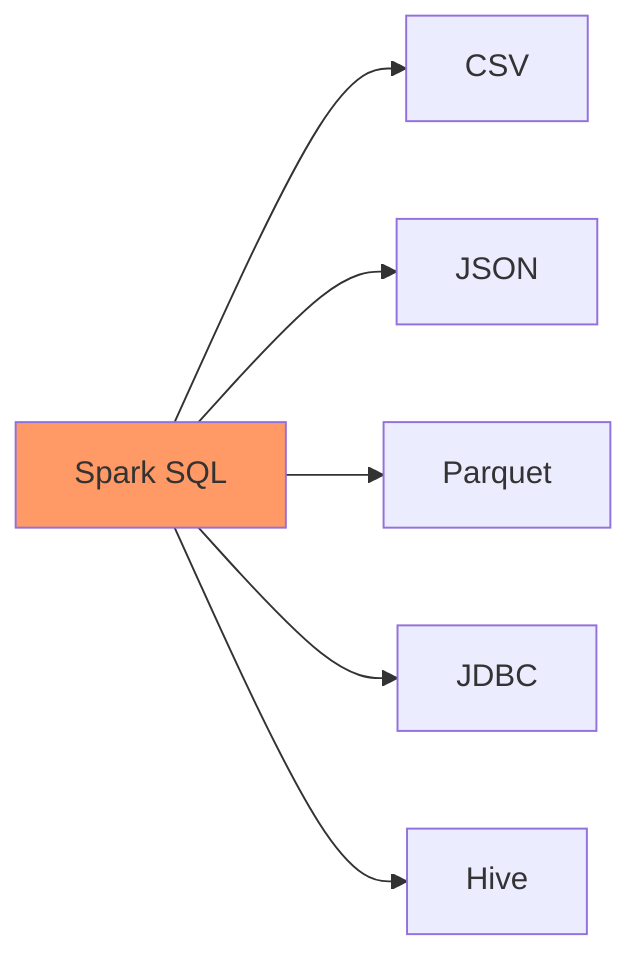

---

## DataFrame Creation

```scala
// From RDD
case class Person(name: String, age: Int)
val people = sc.parallelize(List(
  Person("Alice", 25),
  Person("Bob", 30)
)).toDF()

// From CSV
val df = spark.read
  .option("header", "true")
  .csv("people.csv")

// From JSON
val jsonDF = spark.read.json("data.json")
```

---

## DataFrame Operations Flow

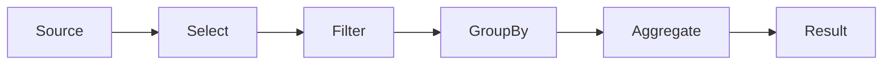

---

## DataFrame Operations

```scala
// Select columns
df.select("name", "age")

// Filter rows
df.filter($"age" > 25)

// Group and aggregate
df.groupBy("department")
  .agg(avg("salary"), max("age"))
```

---

## Query Optimization

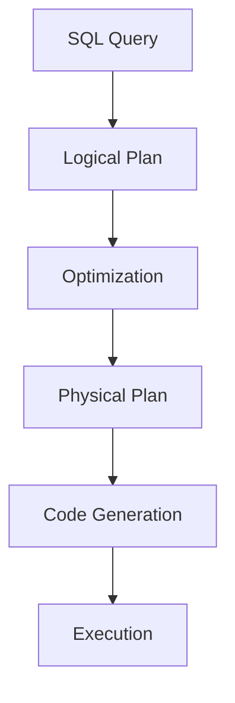

---

## SQL Queries

```scala
// Register temp view
df.createOrReplaceTempView("people")

// Run SQL query
val results = spark.sql("""
  SELECT department,
         AVG(salary) as avg_salary
  FROM people
  GROUP BY department
  HAVING AVG(salary) > 50000
""")
```

---

## Catalyst Optimizer

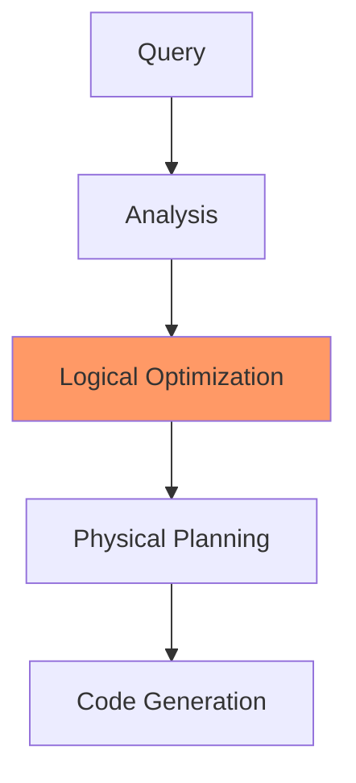

---

## Working with Parquet

```scala
// Write Parquet
df.write.parquet("data.parquet")

// Read Parquet
val parquetDF = spark.read.parquet("data.parquet")

// Partition by column
df.write
  .partitionBy("year", "month")
  .parquet("partitioned_data")
```

---

## Data Types

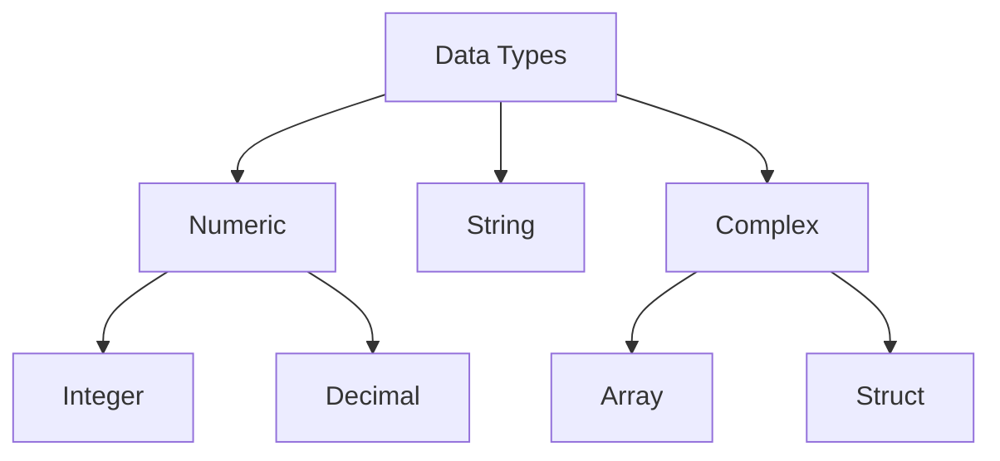

---

## Schema Management

```scala
// Define schema
import org.apache.spark.sql.types._

val schema = StructType(Array(
  StructField("name", StringType, false),
  StructField("age", IntegerType, true),
  StructField("salary", DoubleType, true)
))

// Apply schema
val df = spark.read
  .schema(schema)
  .csv("data.csv")
```

---

## Hive Integration

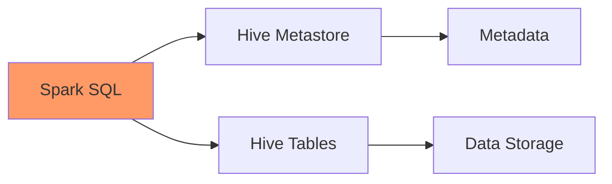

---

## Hive Operations

```scala
// Enable Hive support
val spark = SparkSession.builder()
  .enableHiveSupport()
  .getOrCreate()

// Create Hive table
spark.sql("CREATE TABLE IF NOT EXISTS users ...")

// Query Hive table
val results = spark.sql("SELECT * FROM users")
```

---

## Window Functions

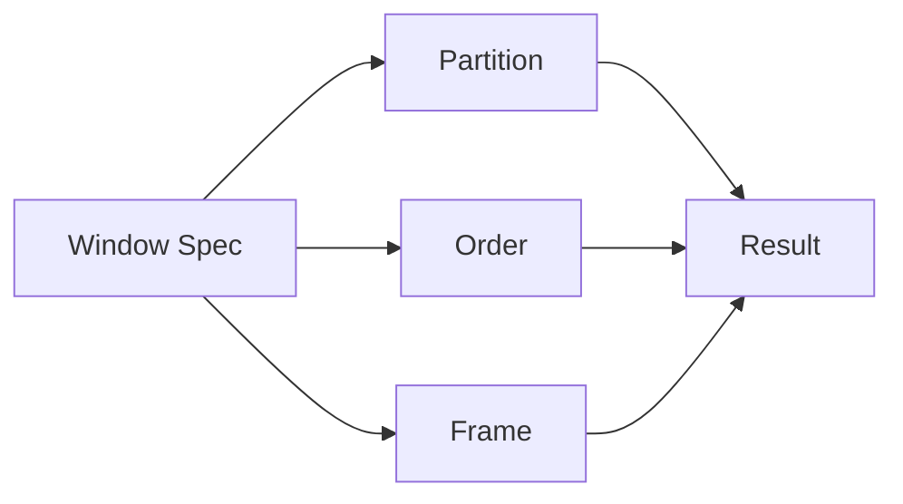

---

## Window Implementation

```scala
import org.apache.spark.sql.expressions.Window

val windowSpec = Window
  .partitionBy("department")
  .orderBy("salary")
  .rowsBetween(Window.unboundedPreceding,
               Window.currentRow)

df.withColumn("running_total",
  sum("salary").over(windowSpec))
```

---

## UDF Registration

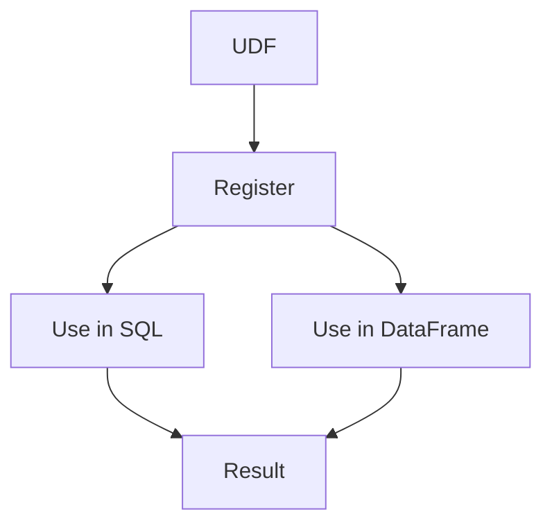

---

## User-Defined Functions

```scala
// Register UDF
spark.udf.register("myUpper",
  (input: String) => input.toUpperCase)

// Use in SQL
spark.sql("SELECT myUpper(name) FROM users")

// Use in DataFrame API
import org.apache.spark.sql.functions.udf
val upperUDF = udf((input: String) => input.toUpperCase)
df.select(upperUDF($"name"))
```

---

## Join Operations

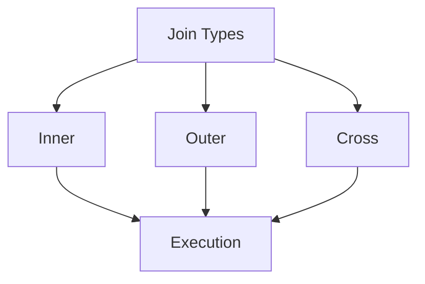

---

## Join Examples

```scala
// Inner join
df1.join(df2, "key")

// Left outer join
df1.join(df2, Seq("key"), "left_outer")

// Cross join
df1.crossJoin(df2)
```

---

[Continue with remaining content, adding diagrams for:]

## Performance Optimization

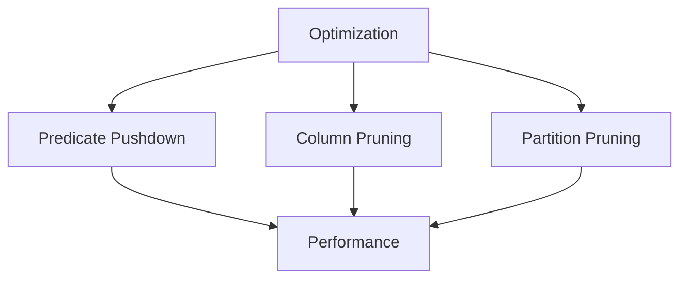

[Continue until approximately 40 slides...]
