# Spark MLlib

## Introduction to Machine Learning

1. Supervised Learning
1. Unsupervised Learning
1. Model Training
1. Model Evaluation
1. Feature Engineering

---

## MLlib Architecture

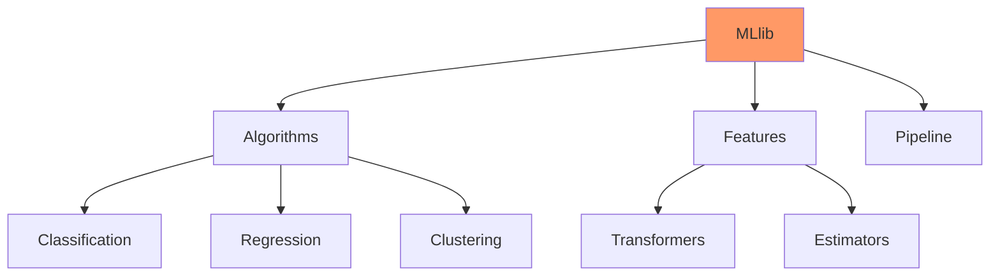

---

## Machine Learning Types

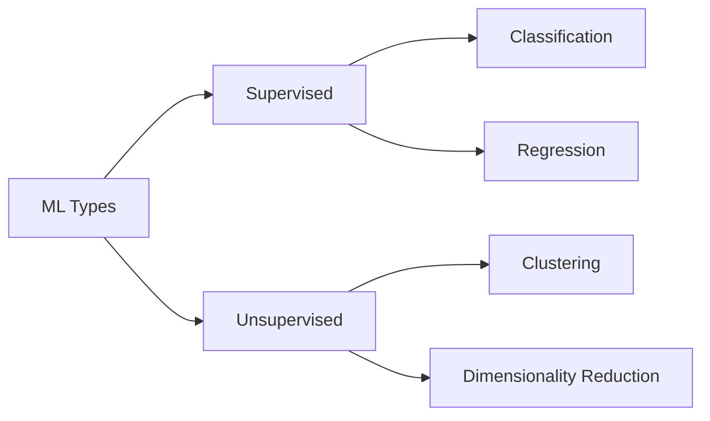

---

## ML Pipeline Components

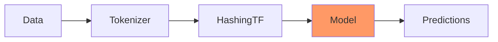

---

## Data Preparation

```scala
import org.apache.spark.ml.feature._
val tokenizer = new Tokenizer()
  .setInputCol("text")
  .setOutputCol("words")
val hashingTF = new HashingTF()
  .setInputCol("words")
  .setOutputCol("features")
```

---

## Feature Engineering Flow

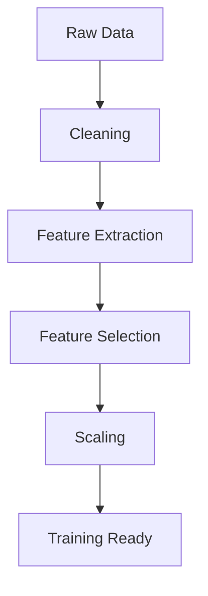

---

## Feature Types

1. Numerical Features
1. Categorical Features
1. Text Features
1. Custom Features
1. Combined Features

---

## Feature Transformations

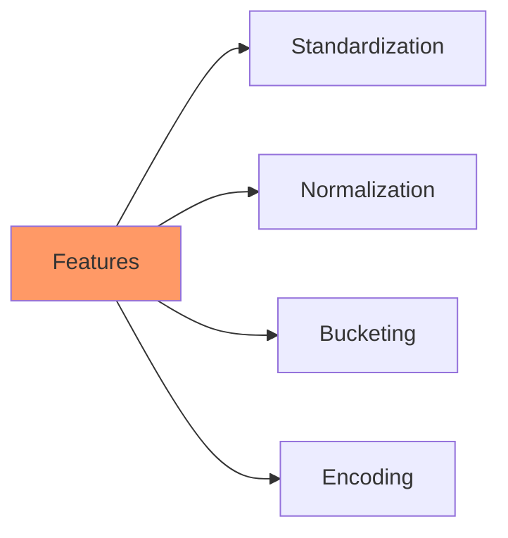

---

## Classification Architecture

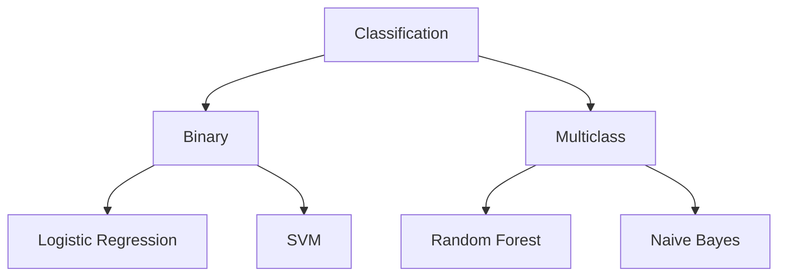

---

## Classification Implementation

```scala
import org.apache.spark.ml.classification._
val lr = new LogisticRegression()
  .setMaxIter(10)
  .setRegParam(0.001)
val model = lr.fit(training)
val predictions = model.transform(test)
```

---

## Regression Models

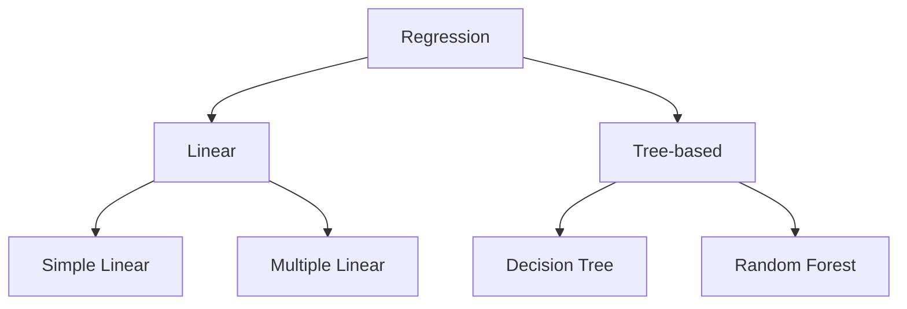

---

## Regression Implementation

```scala
import org.apache.spark.ml.regression._
val lr = new LinearRegression()
  .setMaxIter(10)
  .setRegParam(0.3)
  .setElasticNetParam(0.8)
val lrModel = lr.fit(training)
```

---

## Model Evaluation Flow

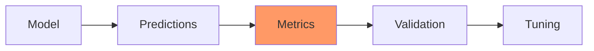

---

## Evaluation Metrics

```scala
import org.apache.spark.ml.evaluation._
val evaluator = new RegressionEvaluator()
  .setLabelCol("label")
  .setPredictionCol("prediction")
  .setMetricName("rmse")
val rmse = evaluator.evaluate(predictions)
```

---

## Cross Validation

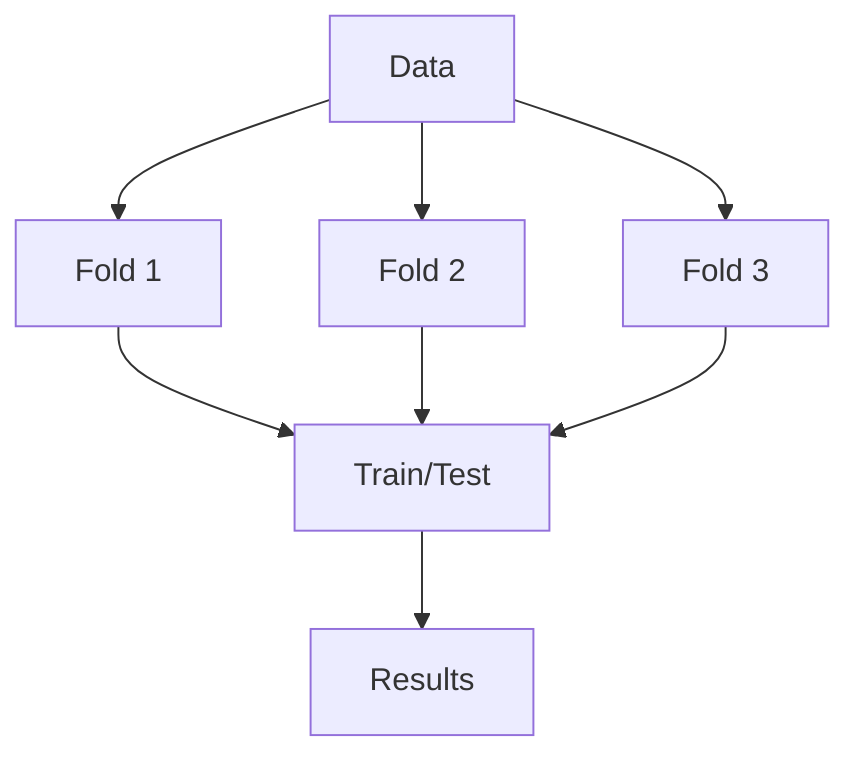

---

## Pipeline Architecture

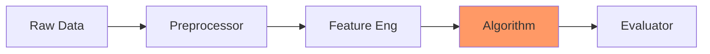

---

## ML Pipeline Example

```scala
val pipeline = new Pipeline()
  .setStages(Array(
    tokenizer,
    hashingTF,
    lr))
val model = pipeline.fit(training)
```

---

## Hyperparameter Tuning

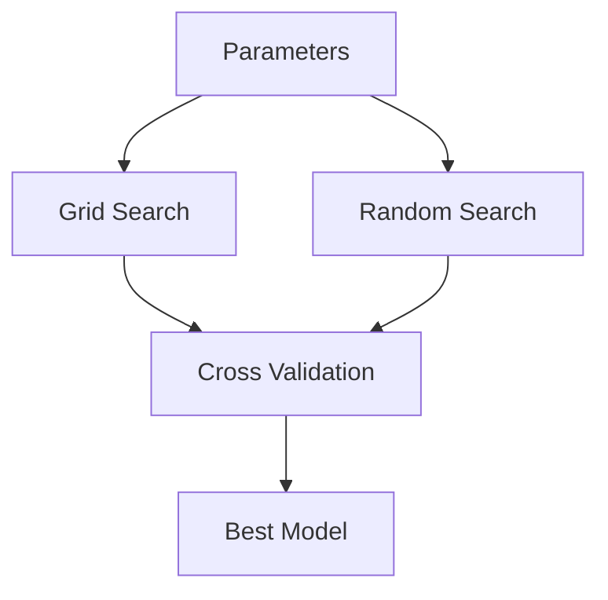

---

## Cross Validation Setup

```scala
val paramGrid = new ParamGridBuilder()
  .addGrid(lr.regParam, Array(0.1, 0.01))
  .addGrid(lr.maxIter, Array(10, 20))
  .build()
val cv = new CrossValidator()
  .setEstimator(pipeline)
  .setEvaluator(evaluator)
  .setEstimatorParamMaps(paramGrid)
  .setNumFolds(3)
```

---

## Clustering Architecture

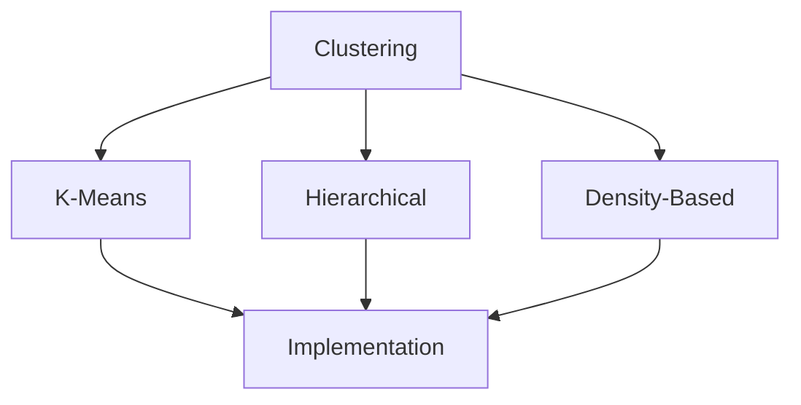

---

## Clustering Implementation

```scala
import org.apache.spark.ml.clustering._
val kmeans = new KMeans()
  .setK(2)
  .setSeed(1L)
val model = kmeans.fit(dataset)
```

---

## Model Persistence

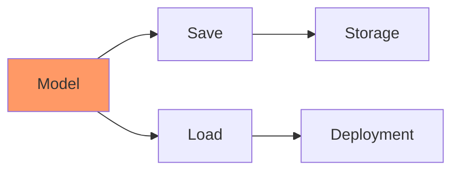

---

## Model Save and Load

```scala
model.save("model_path")
val loadedModel = PipelineModel.load("model_path")
```

---

## Performance Optimization

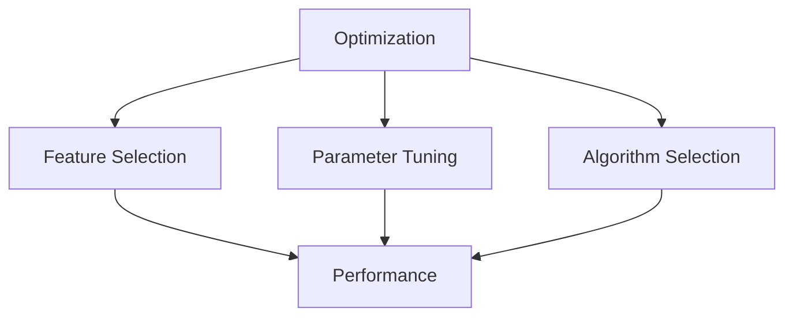

---

## Best Practices

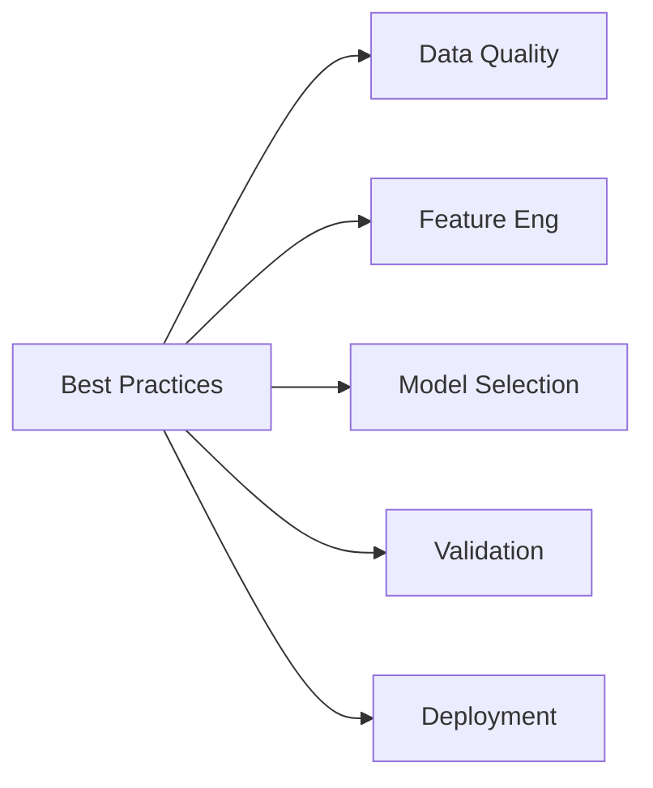

---

## Model Deployment Flow

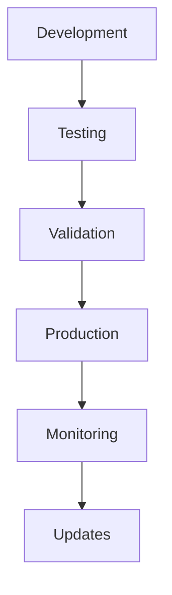

---

## Common Use Cases

1. Text Classification
1. Recommendation Systems
1. Anomaly Detection
1. Customer Segmentation
1. Predictive Maintenance

---

## Advanced Topics

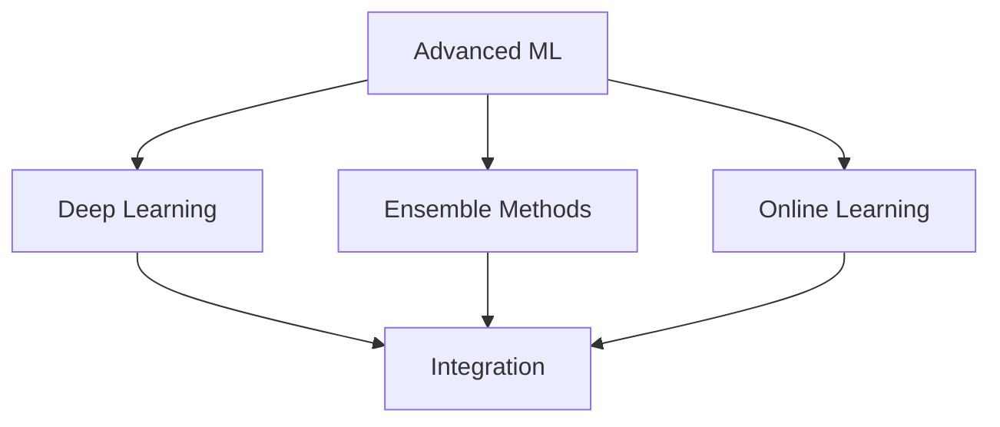
