# Spark Streaming

## Introduction to Streaming

1. Real-time processing
1. Stream sources
1. Window operations
1. State management
1. Fault tolerance

---

## Streaming Architecture

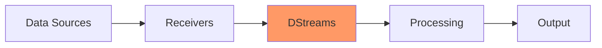

---

## Processing Models

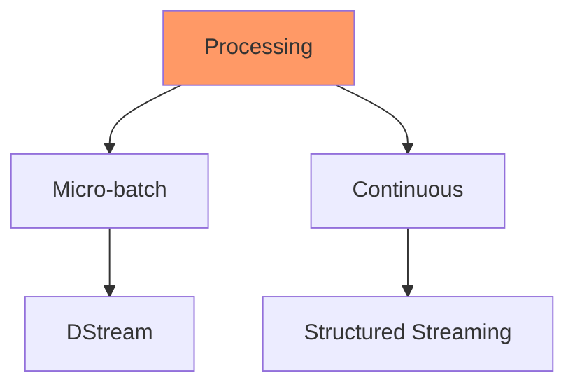

---

## DStream Basics

```scala
import org.apache.spark.streaming._
val conf = new SparkConf().setAppName("StreamingApp")
val ssc = new StreamingContext(conf, Seconds(1))
```

---

## Stream Sources

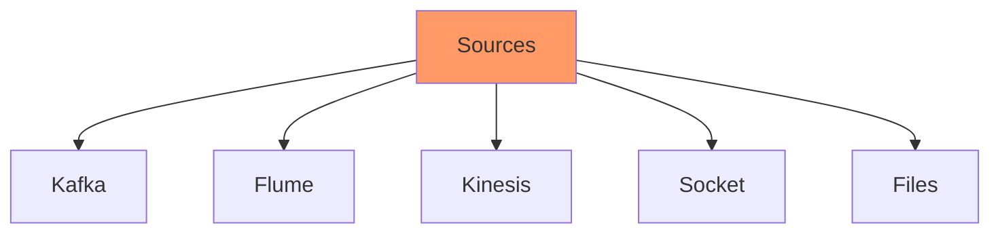

---

## Kafka Integration Flow

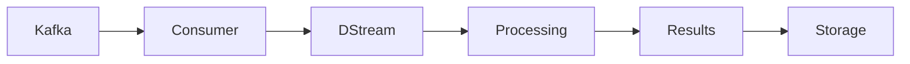

---

## Kafka Setup

```scala
import org.apache.spark.streaming.kafka010._
val kafkaParams = Map(
  "bootstrap.servers" -> "localhost:9092",
  "key.deserializer" -> classOf[StringDeserializer],
  "value.deserializer" -> classOf[StringDeserializer],
  "group.id" -> "spark_streaming_group"
)
```

---

## Window Operations

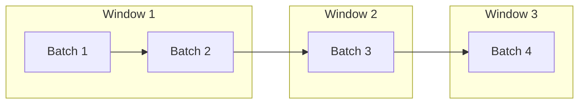

---

## Windowing Types

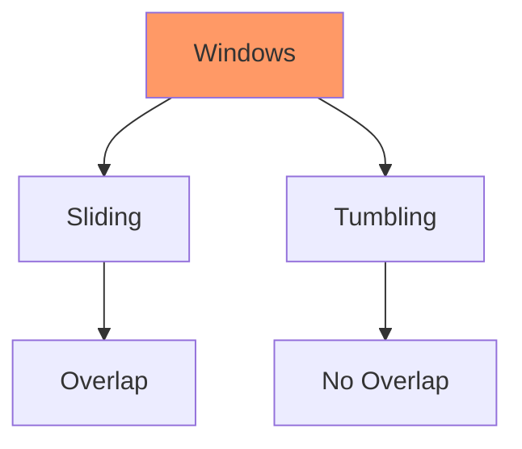

---

## Window Configuration

```scala
// Window duration
val windowLength = Seconds(30)
// Sliding interval
val slidingInterval = Seconds(10)
// Apply window
val windowedStream = stream.window(
  windowLength,
  slidingInterval
)
```

---

## Stateful Operations

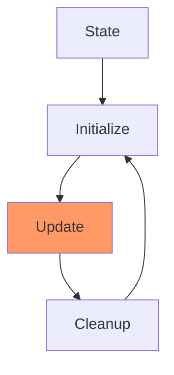

---

## State Implementation

```scala
val words = lines.flatMap(_.split(" "))
val pairs = words.map(word => (word, 1))
val wordCounts = pairs.updateStateByKey(updateFunction)
```

---

## Checkpointing

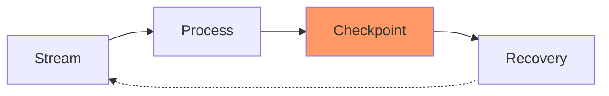

---

## Checkpoint Setup

```scala
ssc.checkpoint("checkpoint_directory")
def functionToCreateContext(): StreamingContext = {
  val ssc = new StreamingContext(...)
  ssc.checkpoint("checkpoint_directory")
  ssc
}
```

---

## Output Operations

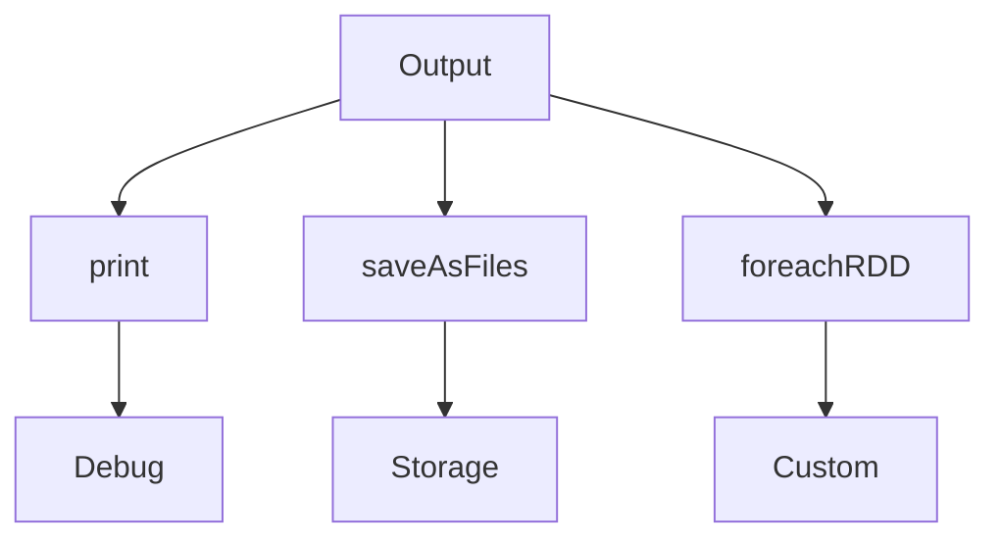

---

## Output Implementation

```scala
// Print output
stream.print()
// Save as text files
stream.saveAsTextFiles("prefix", "suffix")
// Custom output
stream.foreachRDD { rdd =>
  rdd.foreach { record =>
    // Process each record
  }
}
```

---

## Transformation Types

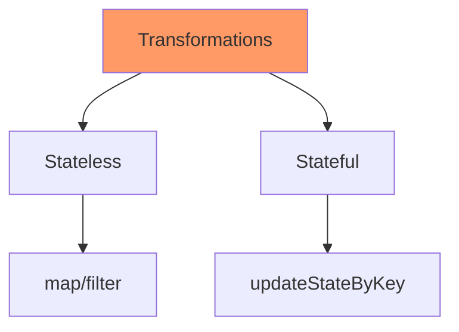

---

## Error Handling

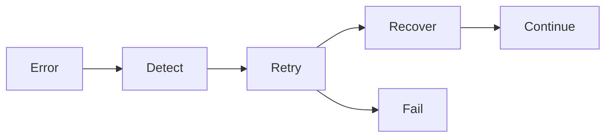

---

## Error Implementation

```scala
stream.foreachRDD { rdd =>
  rdd.foreachPartition { partition =>
    try {
      // Process partition
    } catch {
      case e: Exception =>
        // Handle error
    }
  }
}
```

---

## Performance Tuning

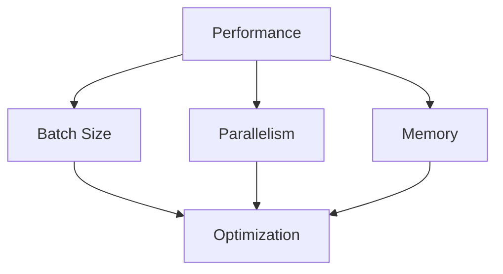

---

## Monitoring Architecture

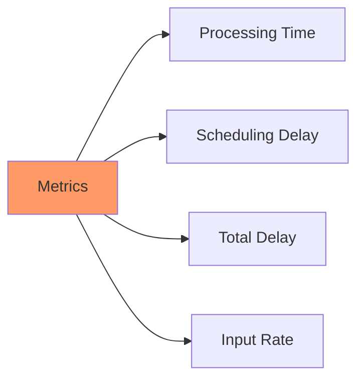

---

## Monitoring Implementation

1. Streaming tab in UI
1. Processing time
1. Scheduling delay
1. Total delay
1. Input rate

---

## Backpressure

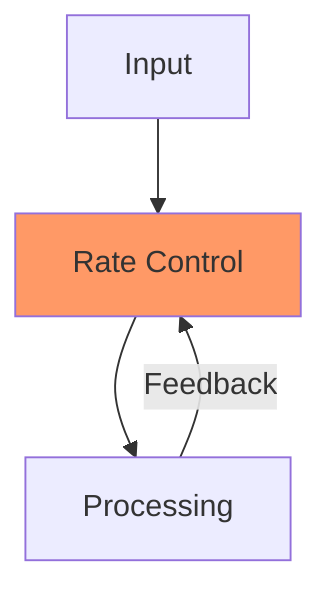

---

## Best Practices

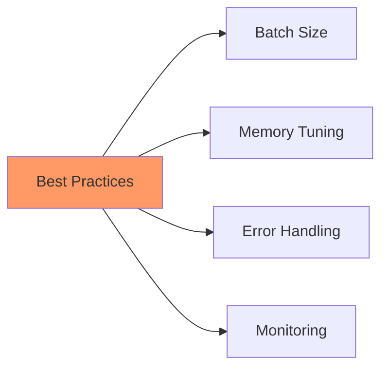

---

## Production Deployment

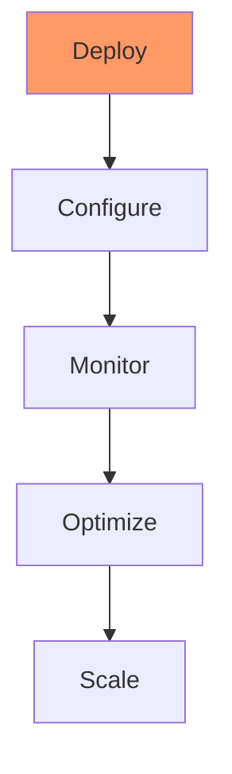

---

## Use Cases

1. Log Processing
1. IoT Data Analysis
1. Social Media Analysis
1. Financial Data Processing
1. Real-time Analytics

---

## Advanced Features

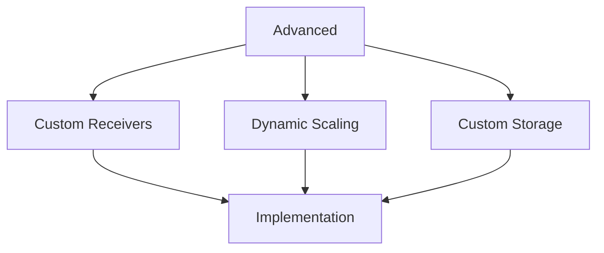
