# Graph Processing with GraphX

## Introduction to Graph Computation

1. Vertices and Edges
1. Graph Properties
1. Graph Algorithms
1. Graph Analytics
1. Graph Visualization

---

## Graph Basics

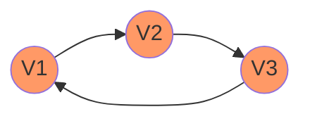

---

## Graph Components

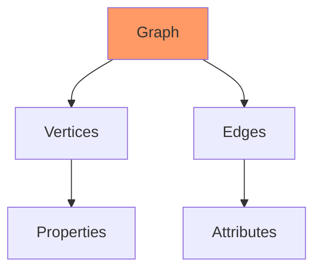

---

## Graph Creation

```scala
import org.apache.spark.graphx._
val vertices = sc.parallelize(Array(
  (1L, ("Alice", 28)),
  (2L, ("Bob", 27)),
  (3L, ("Charlie", 65))
))
val edges = sc.parallelize(Array(
  Edge(1L, 2L, "coworker"),
  Edge(2L, 3L, "parent"),
  Edge(3L, 1L, "friend")
))
val graph = Graph(vertices, edges)
```

---

## Vertex Operations

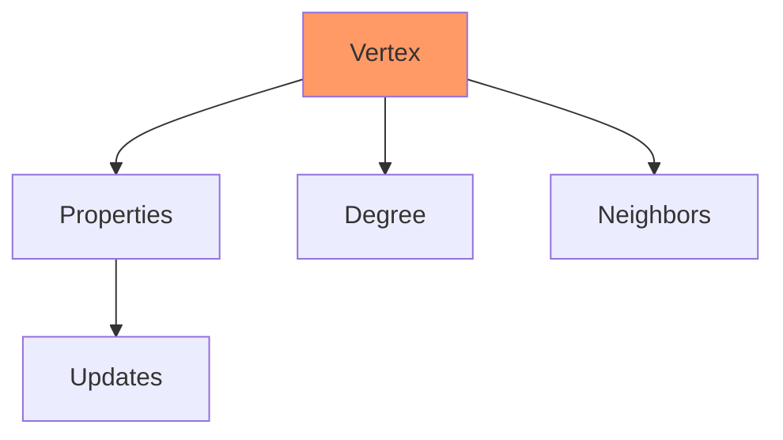

---

## Edge Operations

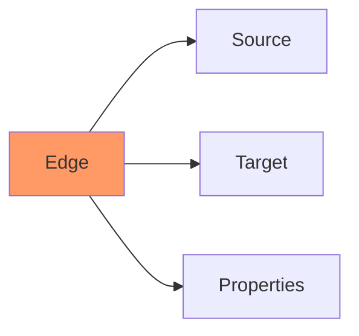

---

## Basic Operations

```scala
// Count vertices and edges
println(s"Vertices: ${graph.vertices.count()}")
println(s"Edges: ${graph.edges.count()}")
// Get vertex degrees
val degrees = graph.degrees
```

---

## Property Graphs

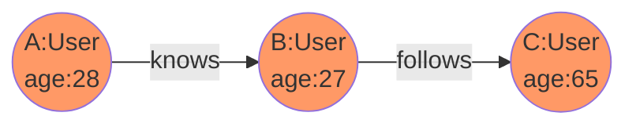

---

## Graph Transformations

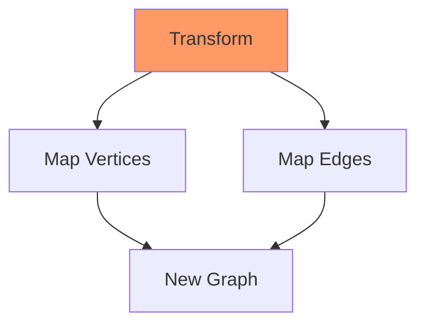

---

## Transformation Code

```scala
// Map vertices
val newGraph = graph.mapVertices((id, attr) =>
  attr._2 * 2)
// Map edges
val weightedGraph = graph.mapEdges(e =>
  e.attr.length.toDouble)
```

---

## Aggregation Operations

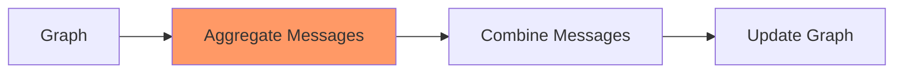

---

## Message Passing

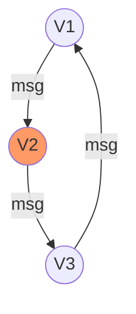

---

## Pregel API

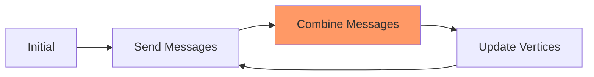

---

## Pregel Implementation

```scala
val initialGraph = graph.mapVertices((id, _) =>
  if (id == sourceId) 0.0 else Double.PositiveInfinity)
val sssp = initialGraph.pregel(Double.PositiveInfinity)(
  (id, dist, newDist) => math.min(dist, newDist),
  triplet => {
    if (triplet.srcAttr + triplet.attr < triplet.dstAttr) {
      Iterator((triplet.dstId, triplet.srcAttr + triplet.attr))
    } else {
      Iterator.empty
    }
  },
  (a, b) => math.min(a, b)
)
```

---

## Graph Algorithms

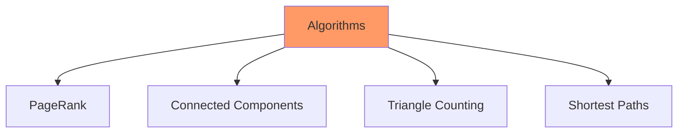

---

## PageRank Flow

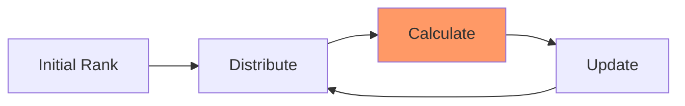

---

## PageRank Implementation

```scala
val ranks = graph.pageRank(0.0001).vertices
val users = vertices.map { case (id, (name, age)) =>
  (id, name) }
val ranksByUsername = users.join(ranks).map {
  case (id, (name, rank)) => (name, rank)
}
```

---

## Connected Components

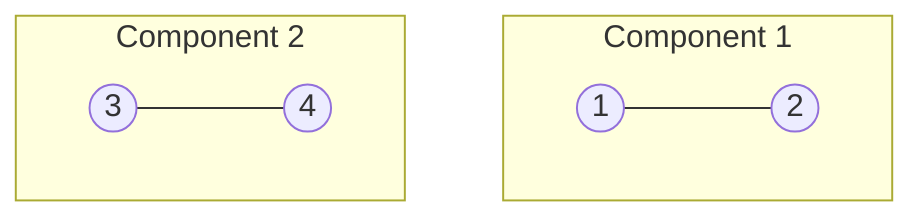

---

## Component Analysis

```scala
val cc = graph.connectedComponents()
val componentCounts = cc.vertices
  .map(_._2)
  .countByValue()
```

---

## Triangle Counting

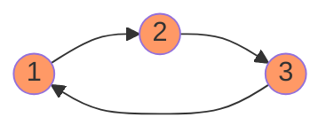

---

## Triangle Implementation

```scala
val triCounts = graph.triangleCount()
val maxTris = triCounts.vertices
  .map(_._2)
  .max()
```

---

## Graph Partitioning

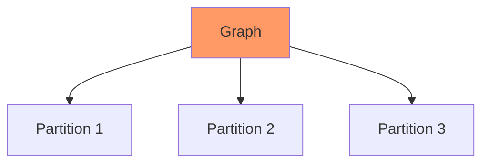

---

## Performance Optimization

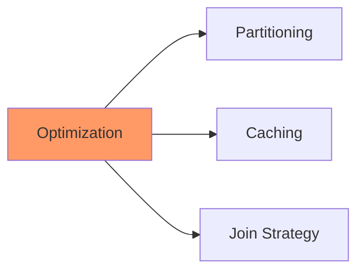

---

## Best Practices

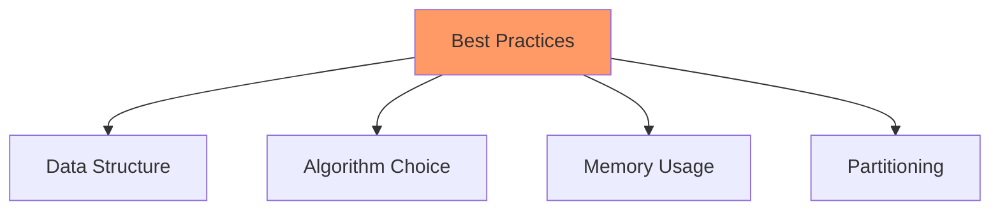

---

## Graph Building

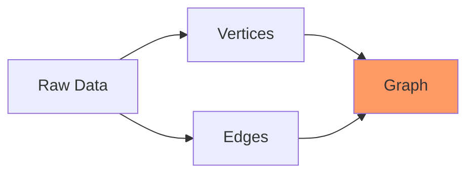

---

## Graph Analytics

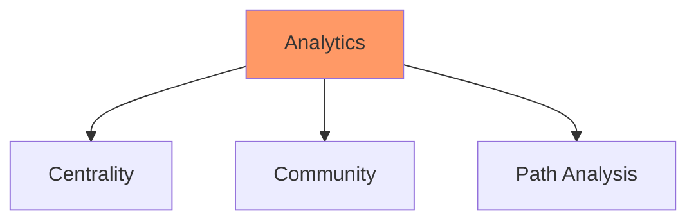

---

## Use Cases

1. Social Network Analysis
1. Recommendation Systems
1. Fraud Detection
1. Network Optimization
1. Knowledge Graphs

---

## Advanced Features

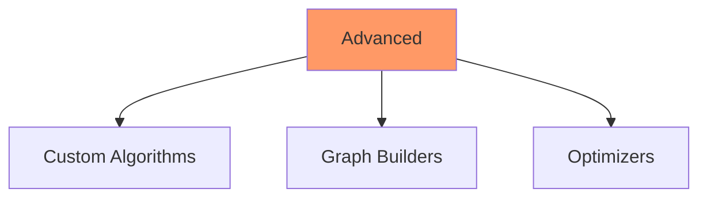
