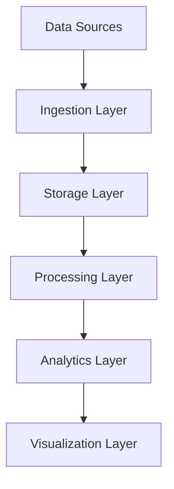
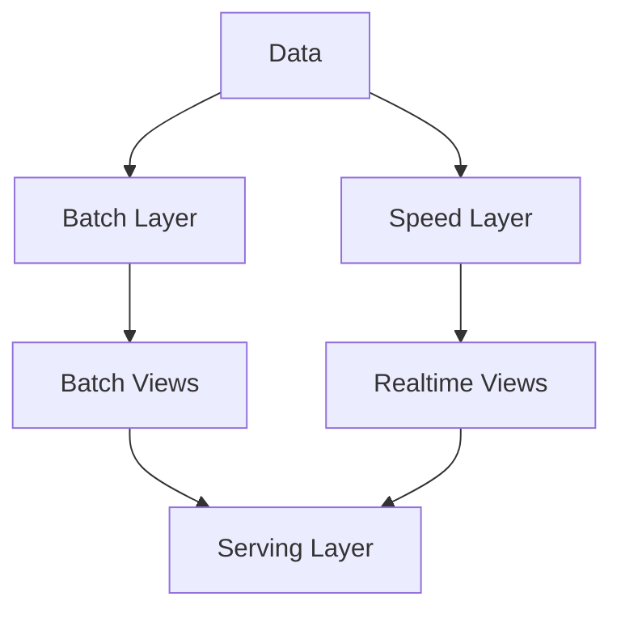
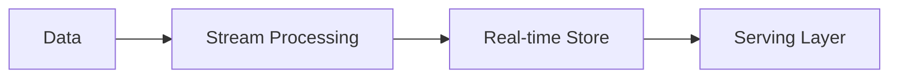
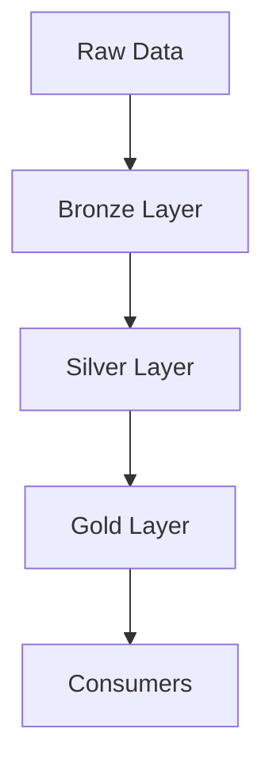
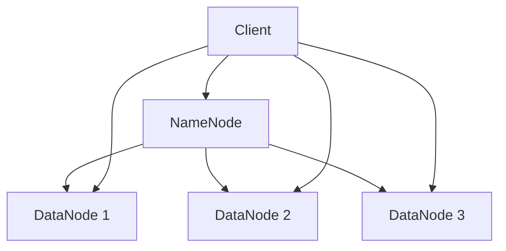
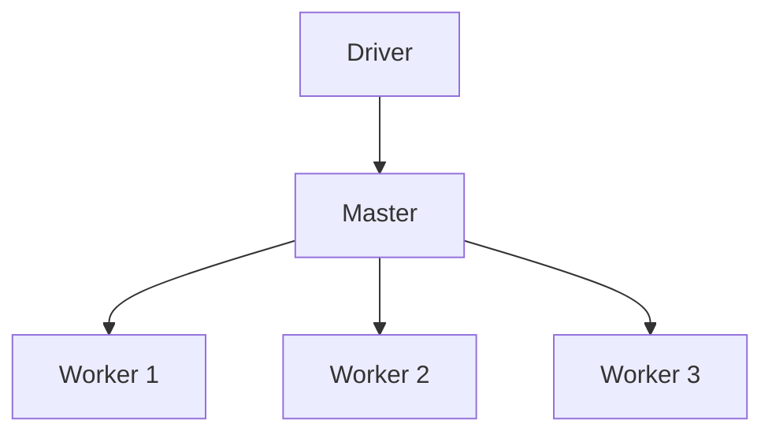
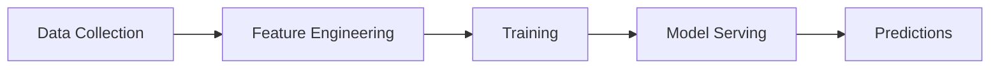
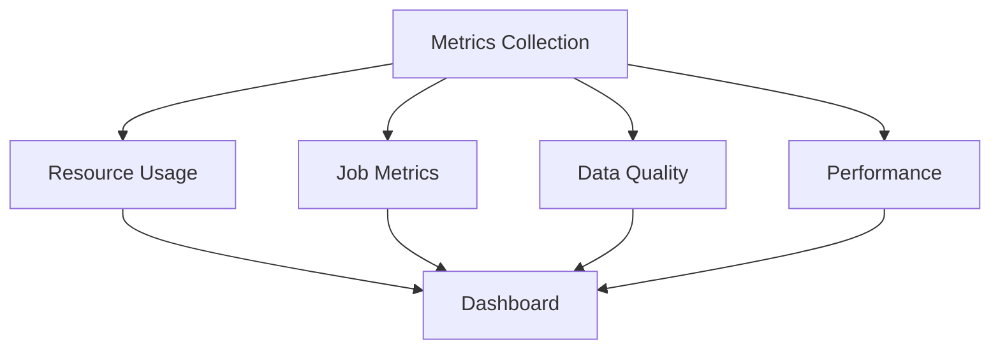
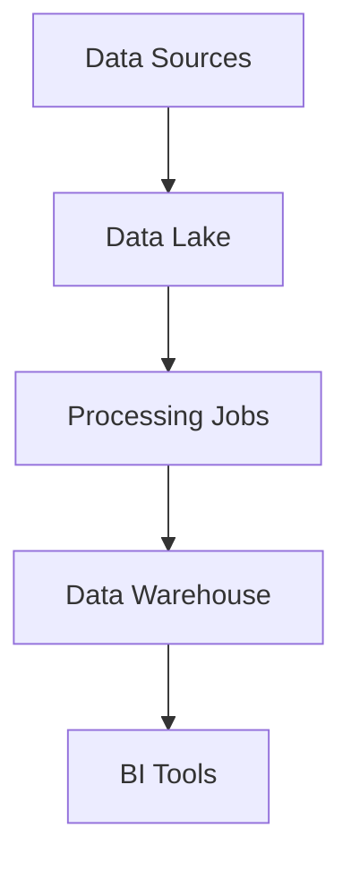
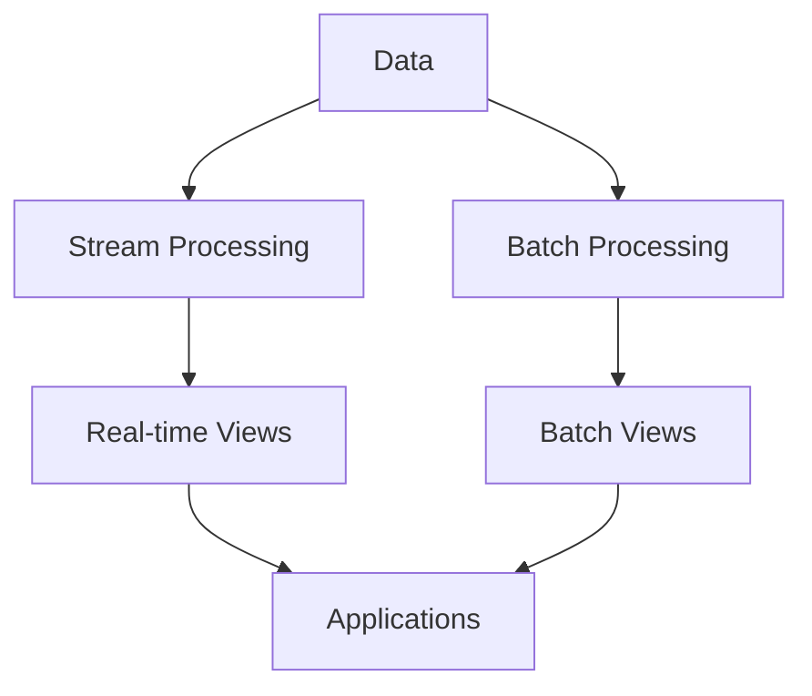

# Architecting Systems for Big Data
## Modern Architecture Course

---

# Agenda

1. Introduction to Big Data
2. Big Data Architecture
3. Data Processing Frameworks
4. Storage Solutions
5. Processing Patterns
6. Analytics & ML Integration
7. Security & Governance

---

# The 3 V's of Big Data

- Volume: Scale of data
- Velocity: Speed of data generation
- Variety: Different forms of data

Additional V's:
- Veracity: Data quality
- Value: Business impact

---

# Big Data Architecture Overview



---

# Data Sources

1. Structured Data
   - Databases
   - CSV files
2. Semi-structured
   - JSON
   - XML
3. Unstructured
   - Text
   - Images
   - Videos

---

# Lambda Architecture



---

# Kappa Architecture



---

# Data Lake Architecture



---

# Storage Systems

1. HDFS
2. Object Storage
3. NoSQL Databases
4. Data Warehouses
5. Data Lakes

---

# HDFS Architecture



---

# Object Storage Example (S3)

```python
import boto3

def store_data(data, bucket, key):
    s3 = boto3.client('s3')
    
    # Store with lifecycle policy
    s3.put_object(
        Bucket=bucket,
        Key=key,
        Body=data,
        StorageClass='INTELLIGENT_TIERING',
        Metadata={
            'source': 'sensors',
            'timestamp': datetime.now().isoformat()
        }
    )
```

---

# Processing Frameworks

1. Apache Hadoop
2. Apache Spark
3. Apache Flink
4. Apache Beam
5. Dask

---

# Spark Architecture



---

# Spark Processing Example

```python
from pyspark.sql import SparkSession
from pyspark.sql.functions import *

spark = SparkSession.builder \
    .appName("BigDataProcessing") \
    .config("spark.executor.memory", "8g") \
    .getOrCreate()

# Read data
df = spark.read.parquet("s3://data/events/")

# Process
result = df.groupBy("event_type") \
    .agg(
        count("*").alias("count"),
        avg("duration").alias("avg_duration")
    ) \
    .where(col("count") > 1000)

# Write results
result.write \
    .partitionBy("event_type") \
    .mode("overwrite") \
    .parquet("s3://data/aggregated/")
```

---

# Stream Processing

1. Real-time Analytics
2. Event Processing
3. Continuous Computation
4. Window Operations
5. State Management

---

# Streaming Example (Flink)

```java
StreamExecutionEnvironment env = 
    StreamExecutionEnvironment.getExecutionEnvironment();

DataStream<Event> events = env
    .addSource(new KafkaSource<>())
    .keyBy(Event::getType)
    .window(TumblingEventTimeWindows.of(Time.minutes(5)))
    .aggregate(new CustomAggregator());

events.addSink(new ElasticsearchSink<>());

env.execute("Streaming Pipeline");
```

---

# Data Warehousing

1. Schema Design
2. Partitioning
3. Data Modeling
4. Query Optimization
5. Performance Tuning

---

# SQL Query Engines

1. Apache Hive
2. Presto/Trino
3. Amazon Athena
4. Apache Drill
5. Snowflake

---

# Presto Query Example

```sql
WITH daily_stats AS (
  SELECT 
    date_trunc('day', timestamp) as day,
    user_id,
    count(*) as events,
    sum(amount) as total_amount
  FROM events
  WHERE date >= date_add('day', -30, current_date)
  GROUP BY 1, 2
)
SELECT 
  day,
  count(distinct user_id) as users,
  sum(events) as total_events,
  avg(total_amount) as avg_amount
FROM daily_stats
GROUP BY 1
ORDER BY 1 DESC
```

---

# Machine Learning Pipeline



---

# ML Pipeline Example

```python
from pyspark.ml import Pipeline
from pyspark.ml.feature import VectorAssembler
from pyspark.ml.classification import RandomForestClassifier
from pyspark.ml.evaluation import BinaryClassificationEvaluator

# Create pipeline
pipeline = Pipeline(stages=[
    VectorAssembler(
        inputCols=feature_cols,
        outputCol="features"
    ),
    RandomForestClassifier(
        labelCol="label",
        featuresCol="features"
    )
])

# Train
model = pipeline.fit(training_data)

# Save
model.write().overwrite().save("s3://models/latest")
```

---

# Data Quality

1. Schema Validation
2. Data Profiling
3. Quality Checks
4. Anomaly Detection
5. Data Lineage

---

# Data Quality Example

```python
from great_expectations.dataset import SparkDFDataset

def validate_dataset(df):
    data = SparkDFDataset(df)
    
    # Add expectations
    data.expect_column_values_to_not_be_null("user_id")
    data.expect_column_values_to_be_between("amount", 0, 1000000)
    data.expect_column_values_to_match_regex("email", r"[^@]+@[^@]+\.[^@]+")
    
    # Validate
    results = data.validate()
    
    if not results["success"]:
        raise DataQualityException(results)
```

---

# Monitoring Systems

1. Cluster Metrics
2. Job Statistics
3. Data Quality
4. Resource Usage
5. Performance Metrics

---

# Monitoring Dashboard



---

# Resource Management

```yaml
resources:
  driver:
    cores: 4
    memory: "16g"
  executor:
    cores: 8
    memory: "32g"
    instances: 10
  
dynamic:
  minExecutors: 2
  maxExecutors: 20
  targetCPUUtilization: 0.7
```

---

# Security Implementation

```python
def secure_data_access():
    # Enable encryption
    spark.conf.set("spark.hadoop.fs.s3a.encryption.enabled", "true")
    
    # Set up authentication
    spark.conf.set("spark.hadoop.fs.s3a.aws.credentials.provider", 
                  "com.amazonaws.auth.WebIdentityTokenCredentialsProvider")
    
    # Enable audit logging
    spark.conf.set("spark.hadoop.fs.s3a.audit.enabled", "true")
```

---

# Data Governance

1. Access Control
2. Data Catalog
3. Metadata Management
4. Compliance
5. Audit Trails

---

# Data Catalog Example

```python
from datacatalog import DataCatalog

catalog = DataCatalog()

# Register dataset
catalog.register_dataset(
    name="user_events",
    location="s3://data/events/",
    schema=schema,
    owner="data_team",
    tags=["pii", "raw"],
    retention_days=90,
    sensitivity="high"
)
```

---

# Cost Optimization

1. Storage Tiering
2. Compute Scaling
3. Caching Strategy
4. Query Optimization
5. Resource Planning

---

# Cost Optimization Example

```python
def optimize_storage():
    # Move cold data to cheaper storage
    s3.copy_object(
        Bucket="archive-bucket",
        Key=f"archive/{date}/data.parquet",
        CopySource={
            "Bucket": "hot-bucket",
            "Key": f"data/{date}/data.parquet"
        },
        StorageClass="GLACIER"
    )
    
    # Delete from hot storage
    s3.delete_object(
        Bucket="hot-bucket",
        Key=f"data/{date}/data.parquet"
    )
```

---

# Disaster Recovery

1. Backup Strategy
2. Recovery Plans
3. Data Replication
4. Failover Process
5. Testing Procedures

---

# Performance Optimization

1. Partitioning Strategy
2. Indexing
3. Caching
4. Query Optimization
5. Resource Allocation

---

# Partitioning Example

```python
def optimize_partitioning(df):
    # Repartition for optimal file size
    df = df.repartition(
        num_partitions=calculate_optimal_partitions(df),
        partitionBy=["year", "month", "day"]
    )
    
    # Write with optimization
    df.write \
        .option("maxRecordsPerFile", 1000000) \
        .partitionBy("year", "month", "day") \
        .format("parquet") \
        .save(output_path)
```

---

# Real-time Processing


---

# Batch Processing



---

# Hybrid Processing



---

# Future Trends

1. Serverless Analytics
2. AI-Driven Optimization
3. Multi-cloud Architecture
4. Real-time Everything
5. Automated Governance

---

# Best Practices

1. Data Quality First
2. Proper Partitioning
3. Resource Planning
4. Security by Design
5. Cost Optimization
6. Regular Monitoring
7. Documentation

---

# Questions?

Thank you for attending!

Contact: instructor@example.com

---
