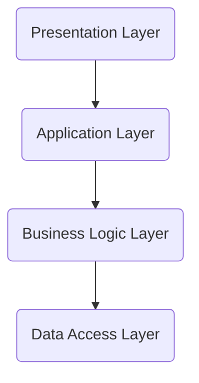
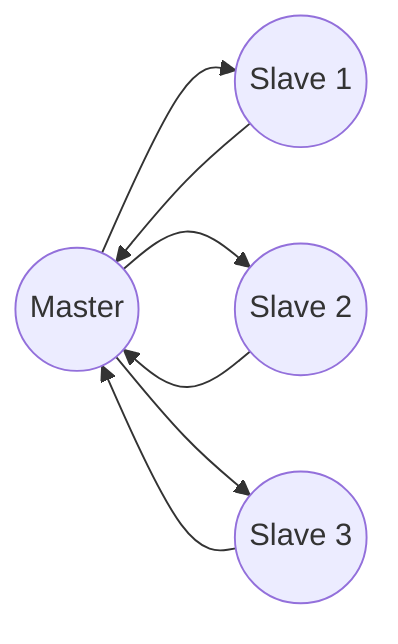
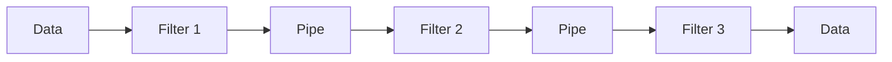
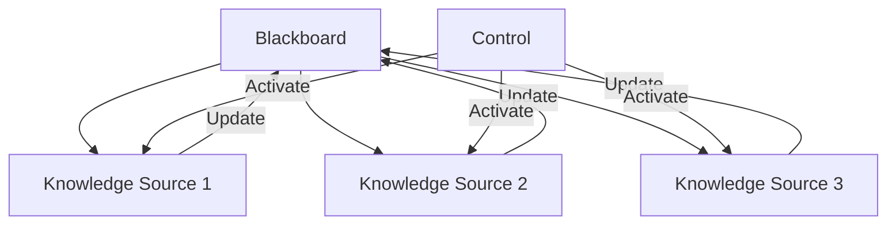
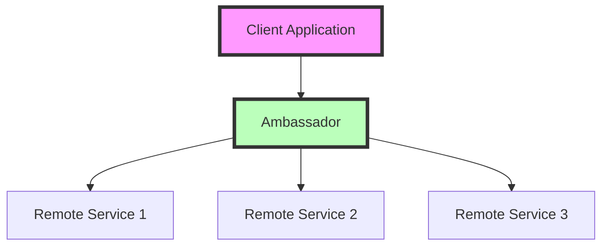
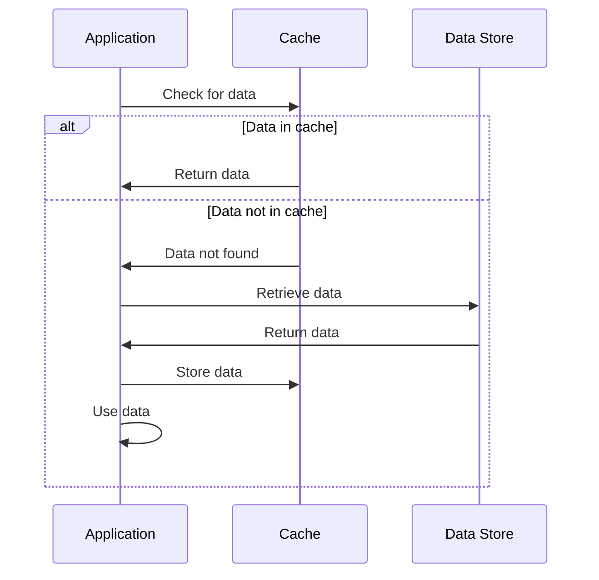
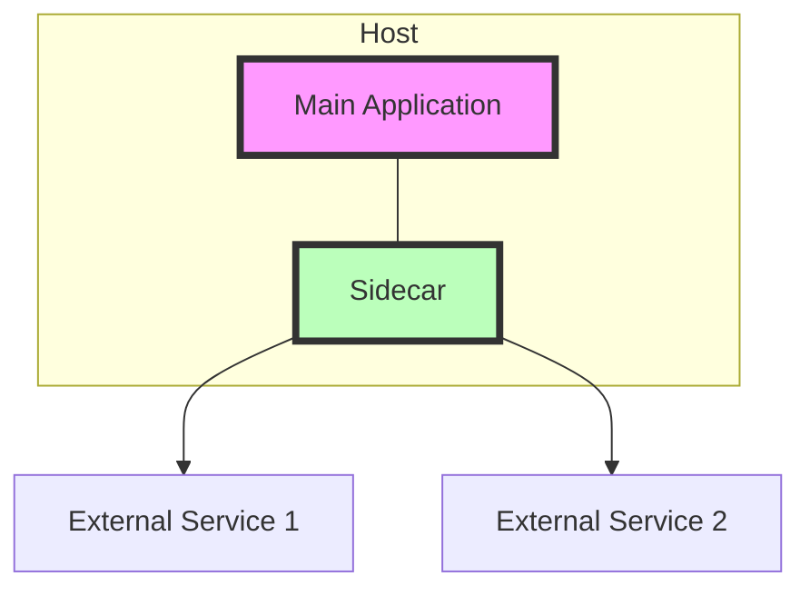
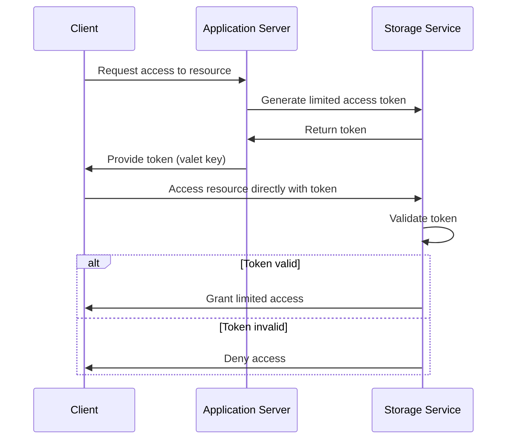

# Layered (n-tier) Pattern

---

## Overview

- Partitions the system into layers, each with a specific role and responsibility 
- Common layers: Presentation, Application, Business Logic, Data Access
- Adjacent layers communicate via well-defined interfaces

---

## Layer Responsibilities

- Presentation Layer
  - User interface and user interaction
  - Displays information to the user and interprets user commands
- Application Layer  
  - Coordinates application activity
  - Doesn't contain business logic 
  - Delegates to business logic layer
- Business Logic Layer
  - Core functionality and business rules
  - Independent of other layers
- Data Access Layer
  - Provides persistence for the business layer
  - Abstracts the actual database or external services

---

## Layer Diagram

---

## Pros and Cons

Pros:
- Separation of concerns and modularity
- Changes in one layer don't affect others
- Easy to understand and implement
- Supports incremental development

Cons: 
- Potential for tight coupling between layers
- Performance overhead from layer-to-layer communication
- Limited flexibility and scalability
- Can lead to monolithic applications over time

---

## When to Use

- Business logic can be cleanly separated from presentation and data 
- Multiple user interfaces need to reuse business logic
- Incremental development is desired
- Different teams will work on different layers

---

# Master-Slave Pattern

---

## Overview

- One component (the master) controls one or more other components (the slaves)
- Master assigns tasks to slaves and monitors their progress
- Slaves complete assigned tasks and report back to master
- Often used for parallel processing or redundancy

---

## Component Roles

- Master
  - Decomposes task into smaller subtasks
  - Distributes subtasks to slaves 
  - Monitors slave progress and health
  - Aggregates results from slaves
- Slave
  - Accepts tasks from master
  - Processes subtasks independently
  - Reports status and results to master
  - May be identical to each other

---

## Interaction Diagram

---

## Pros and Cons

Pros:
- Enables parallel processing for better performance
- Supports scalability by adding more slaves
- Provides fault tolerance if slaves fail
- Simplifies slave implementation and testing

Cons:
- Master can be a single point of failure
- Added latency from master-slave communication 
- Limited applicability outside parallel processing
- Slaves are not autonomous and rely on master

---

## When to Use

- Task can be decomposed into independent subtasks
- Processing can be done more efficiently in parallel
- Resource usage needs to be coordinated
- Fault tolerance and redundancy are required
- Slaves do not need to communicate with each other

---

# Pipe-Filter Pattern

---

## Overview

- Decomposes a task into a series of sequential steps (filters)
- Data flows through the steps via connectors (pipes)
- Each filter works independently, unaware of other filters
- Filters can be added, removed, or reordered as needed

---

## Component Roles

- Filter
  - Performs a specific processing step
  - Receives input data, processes it, and produces output
  - Does not know or interact with other filters
- Pipe
  - Connects the output of one filter to the input of the next
  - Passes data between filters
  - Can perform buffering, synchronization, or transformation
- Data
  - Flows through the pipes and is processed by the filters
  - Can be a stream of bytes, objects, or messages

---

## Pipeline Diagram

---

## Pros and Cons

Pros:
- Supports reuse and late binding of filters
- Easy to understand and maintain individual filters
- Flexible and adaptable to changing requirements
- Naturally fits batch processing scenarios

Cons: 
- Not suitable for interactive or request-response interactions
- Error handling and recovery can be complex
- Potential performance overhead from data flow between filters
- Overall pipeline can be harder to understand and debug

---

## When to Use

- Processing can be divided into a sequence of independent steps
- Reuse and late composition of steps is desired
- Multiple sources need to be processed in the same way
- Output of one step is input for the next step
- Little or no user interaction is required during processing

---

# Blackboard Pattern

---

## Overview

- Coordinates a group of loosely coupled, independent Knowledge Sources (KSs)
- KSs work collaboratively to solve a problem using a shared data structure (Blackboard)
- Each KS contributes a piece of the solution based on its specialized knowledge
- Control component manages the activation and scheduling of KSs

---

## Component Roles

- Blackboard
  - Shared data structure that holds the problem state and partial solutions
  - Accessible by all Knowledge Sources for reading and writing
  - Organized into hierarchical levels of abstraction
- Knowledge Source (KS)
  - Independent module that encapsulates a specific piece of knowledge or expertise
  - Reads data from the Blackboard, processes it, and writes results back
  - Triggered by changes in the Blackboard or by the Control component
- Control
  - Manages the activation and scheduling of Knowledge Sources
  - Monitors the Blackboard for changes and selects appropriate KSs to activate
  - Can implement different strategies for KS activation and conflict resolution

---

## Interaction Diagram

---

## Pros and Cons

Pros:
- Enables collaboration among independent, heterogeneous Knowledge Sources
- Supports incremental and opportunistic problem solving
- Provides flexibility in adding or modifying Knowledge Sources
- Allows for multiple control strategies and conflict resolution mechanisms

Cons:
- Can lead to complex interactions and dependencies between Knowledge Sources
- Performance may depend on the efficiency of the Blackboard and Control components
- Debugging and tracing the problem-solving process can be challenging
- May require careful design and partitioning of the problem space and knowledge

---

## When to Use

- Problem can be decomposed into loosely coupled subproblems
- Multiple, independent sources of knowledge need to collaborate
- Incremental and opportunistic problem solving is desired
- Flexibility in adding or modifying knowledge sources is required
- Complex control strategies and conflict resolution mechanisms are needed

---

# Ambassador Pattern

- Provides a proxy service for connecting to external services or resources
- Offloads common client connectivity tasks from the main application
- Acts as a single point of contact for managing service dependencies
- Can handle network request retries, monitoring, logging, and security
- Simplifies the main application by abstracting connection complexities

---

# Ambassador Pattern Diagram

---

# Pros and Cons

Pros:
- Simplifies client application by offloading connectivity concerns
- Provides a consistent interface to diverse external services
- Improves application resilience through built-in retry and circuit breaking
- Enables easier updates to service communication without changing the main application
- Facilitates implementation of cross-cutting concerns like logging and monitoring

Cons:
- Adds an extra network hop, potentially increasing latency
- Increases overall system complexity
- Can become a single point of failure if not properly managed
- May require additional resources and maintenance
- Can complicate local development and testing scenarios

---

# When to Use

- In microservices architectures to manage inter-service communication
- When connecting to external services with complex protocols or authentication
- To implement retry logic and circuit breaking for improved resilience
- In polyglot environments where services are written in different languages
- To standardize and simplify access to a variety of backend services
- When you need to add features like logging or monitoring without modifying the main application
- In scenarios where you want to shield the main application from the complexities of service discovery
---

# Cache-Aside Pattern

- Also known as Lazy Loading
- Loads data on demand into a cache from a data store
- Application checks the cache first before accessing the data store
- If data is not in cache, it's retrieved from the store and added to the cache
- Improves performance for frequently accessed data
- Reduces load on the backend data store

---

# Cache-Aside Pattern Diagram

---

# Pros and Cons

Pros:
- Improves application performance for read-heavy workloads
- Reduces load on the backend data store
- Only caches data that is actually requested
- Works well with data that changes infrequently
- Can easily be added to existing systems

Cons:
- Possible initial delay when populating the cache
- Can lead to stale data if not managed properly
- Adds complexity to the application logic
- May increase memory usage significantly
- Requires careful consideration of cache eviction policies

---

# When to Use

- In read-heavy applications where data doesn't change frequently
- When you want to reduce load on the database
- In systems where data access patterns are uneven or unpredictable
- To improve response times for frequently accessed data
- When implementing a distributed cache in a microservices architecture
- In scenarios where you can tolerate slightly stale data
- When you need fine-grained control over what gets cached and when
---

# Sidecar Pattern

- Deploys components of an application as a separate process or container
- Attaches and co-locates the sidecar with a parent application
- Extends and enhances the functionality of the main application
- Provides a way to access features or services in a language-agnostic way
- Common uses include logging, monitoring, security, and network services

---

# Sidecar Pattern Diagram

---

# Pros and Cons

Pros:
- Separation of concerns between core functionality and peripheral tasks
- Language-agnostic way to extend application capabilities
- Easier to develop, test, and maintain components independently
- Allows for standardization of cross-cutting concerns across different services
- Enables updating or replacing the sidecar without modifying the main application

Cons:
- Increases overall system complexity
- Can introduce additional resource overhead
- Potential latency in communication between application and sidecar
- May complicate deployment and orchestration processes
- Can lead to version compatibility issues between application and sidecar

---

# When to Use

- In microservices architectures to handle cross-cutting concerns
- When you need to add features to an application without modifying its code
- For implementing service mesh functionalities (e.g., service discovery, load balancing)
- To standardize monitoring, logging, or security across diverse applications
- When you want to offload peripheral tasks from the main application
- In polyglot environments where services are written in different languages
- To extend the functionality of legacy applications without modifying them
---

# Valet Key Pattern

- Provides clients with restricted direct access to a specific resource
- Uses a token or key with limited privileges and validity period
- Offloads data transfer from the application to a separate data store
- Improves scalability by reducing load on the main application server
- Enhances security by limiting the scope and duration of access
- Often used for operations like uploads/downloads in cloud storage

---

# Valet Key Pattern Diagram

---

# Pros and Cons

Pros:
- Reduces load on application servers
- Improves performance for large data transfers
- Enhances security through limited-scope access
- Simplifies client-side implementation for resource access
- Allows fine-grained control over resource permissions

Cons:
- Increases complexity in managing and securing access tokens
- Requires careful implementation to prevent token misuse
- May need additional infrastructure for token generation/validation
- Can be challenging to revoke access before token expiration
- Might not be suitable for frequently changing or sensitive data

---

# When to Use

- In cloud-based applications for managing access to storage services
- When handling large file uploads or downloads
- To offload data transfer operations from application servers
- In scenarios requiring temporary, limited access to resources
- For improving scalability in systems with heavy resource access
- When implementing fine-grained access control to shared resources
- In multi-tenant systems to securely manage resource access across tenants
