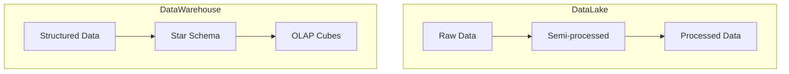
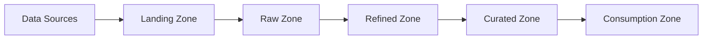
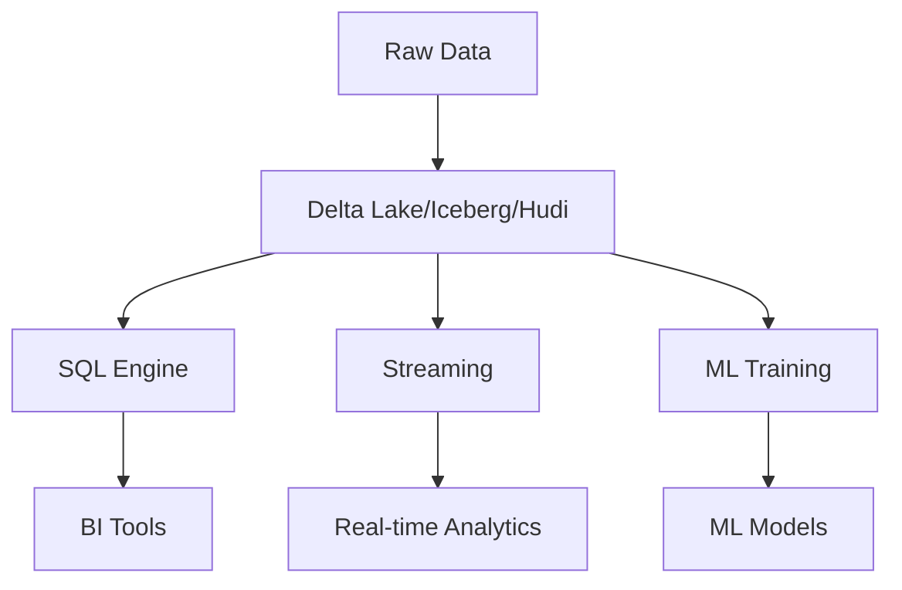
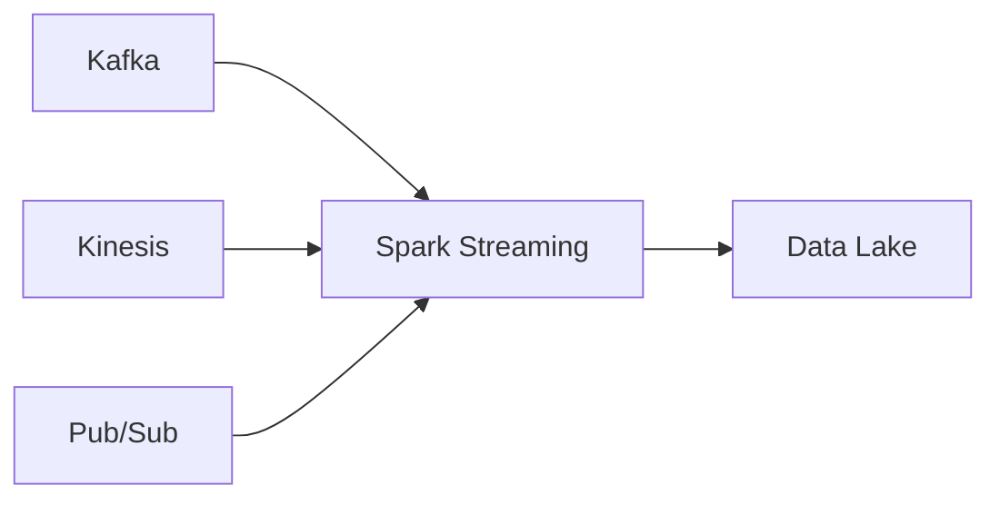
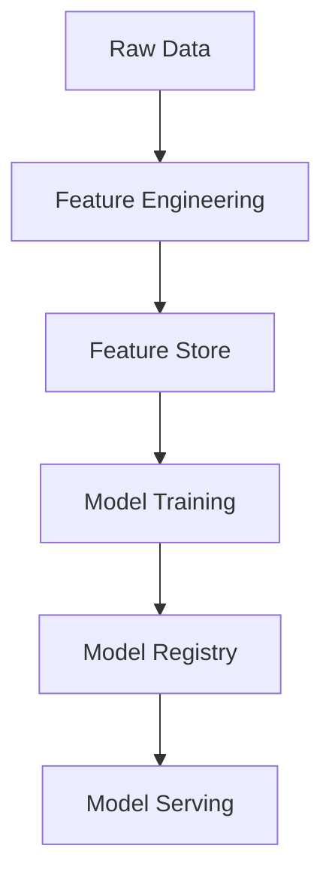
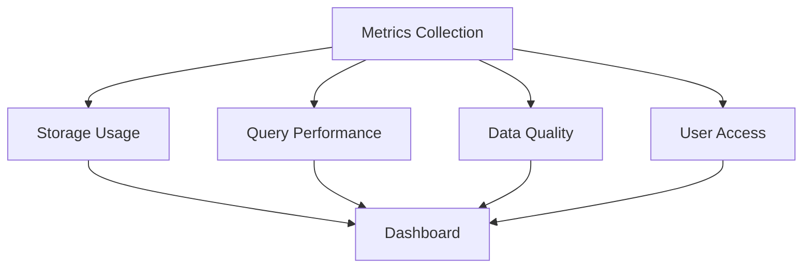
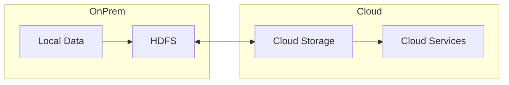

# Data Lakes and Lakehouses
## Modern Architecture Course

---

## Agenda

1. Introduction to Data Lakes
2. Data Lakehouse Architecture
3. Components and Implementation
4. Data Ingestion Patterns
5. Analytics and ML Integration
6. Best Practices

---

## What is a Data Lake?

- Repository for raw data in native format
- Supports structured and unstructured data
- Schema-on-read approach
- Unlimited scalability
- Cost-effective storage
- Supports all data types

---

## Data Lake vs Data Warehouse



---

## Data Lake Architecture



---

## Data Formats in Data Lakes

1. Structured
   - Parquet
   - ORC
   - Avro
2. Semi-structured
   - JSON
   - XML
3. Unstructured
   - Text
   - Images
   - Video

---

## Apache Parquet Example

```python
import pandas as pd
import pyarrow as pa
import pyarrow.parquet as pq

# Read CSV data
df = pd.read_csv('data.csv')

# Convert to PyArrow Table
table = pa.Table.from_pandas(df)

# Write to Parquet with partitioning
pq.write_table(
    table,
    'data.parquet',
    partition_cols=['year', 'month']
)
```

---

## Evolution to Data Lakehouse

Traditional Problems:
- Data reliability issues
- Lack of ACID transactions
- Performance challenges
- Schema enforcement
- Data quality

Solution: Data Lakehouse Architecture

---

## Data Lakehouse Architecture



---

## Key Lakehouse Features

1. ACID Transactions
2. Schema Enforcement
3. Time Travel
4. Upserts/Deletes
5. Streaming Support
6. BI Support
7. ML Integration

---

## Delta Lake Example

```python
from delta.tables import DeltaTable
from pyspark.sql import SparkSession

# Create Delta Table
DeltaTable.createIfNotExists(spark) \
    .tableName("events") \
    .addColumn("id", "LONG") \
    .addColumn("timestamp", "TIMESTAMP") \
    .addColumn("data", "STRING") \
    .partitionedBy("timestamp") \
    .execute()

# Upsert data
deltaTable = DeltaTable.forName(spark, "events")
deltaTable.merge(
    source = updates_df,
    condition = "events.id = updates.id"
) \
.whenMatched().updateAll() \
.whenNotMatched().insertAll() \
.execute()
```

---

## Apache Iceberg Features

- Schema evolution
- Hidden partitioning
- Time travel
- Snapshot isolation
- Optimistic concurrency

---

## Iceberg Table Example

```sql
-- Create Iceberg table
CREATE TABLE events (
    id bigint,
    timestamp timestamp,
    data string
) USING iceberg
PARTITIONED BY (days(timestamp));

-- Time travel query
SELECT * FROM events 
TIMESTAMP AS OF '2024-01-01 00:00:00';

-- Snapshot query
SELECT * FROM events 
VERSION AS OF 12345;
```

---

## Data Ingestion Strategies

1. Batch Processing
2. Stream Processing
3. Change Data Capture
4. API Integration
5. File-based Ingestion

---

## Batch Ingestion Example

```python
from pyspark.sql import SparkSession

def batch_ingest():
    spark = SparkSession.builder \
        .appName("BatchIngestion") \
        .getOrCreate()
    
    # Read from source
    df = spark.read \
        .format("jdbc") \
        .option("url", "jdbc:postgresql://db/source") \
        .load()
    
    # Write to data lake
    df.write \
        .format("delta") \
        .mode("append") \
        .partitionBy("date") \
        .save("/lake/raw/events")
```

---

## Streaming Ingestion



---

## Streaming Example with Kafka

```python
from pyspark.sql.streaming import *

# Create streaming query
streamingDF = spark \
    .readStream \
    .format("kafka") \
    .option("kafka.bootstrap.servers", "broker:9092") \
    .option("subscribe", "events") \
    .load()

# Write to Delta Lake
query = streamingDF \
    .writeStream \
    .format("delta") \
    .outputMode("append") \
    .option("checkpointLocation", "/checkpoints") \
    .start("/lake/streaming/events")
```

---

## Data Management & Governance

1. Data Catalog
2. Access Control
3. Data Quality
4. Metadata Management
5. Lineage Tracking

---

## Data Catalog Example

```python
from datacatalog import DataCatalog

# Register dataset
catalog = DataCatalog()
catalog.register_dataset(
    name="customer_events",
    path="/lake/events",
    schema=schema,
    owner="data_team",
    tags=["pii", "raw"],
    retention_days=90
)
```

---

## Processing Engines

1. Apache Spark
2. Presto/Trino
3. Apache Flink
4. Databricks
5. Amazon EMR

---

## Spark Processing Example

```python
from pyspark.sql.functions import *

# Read from lake
events = spark.read.format("delta") \
    .load("/lake/raw/events")

# Process data
processed = events \
    .withColumn("date", to_date("timestamp")) \
    .withColumn("hour", hour("timestamp")) \
    .groupBy("date", "hour") \
    .agg(count("*").alias("event_count"))

# Write back to lake
processed.write.format("delta") \
    .mode("overwrite") \
    .partitionBy("date") \
    .save("/lake/processed/hourly_events")
```

---

## ML Pipeline Integration



---

## Feature Engineering Example

```python
from pyspark.ml.feature import VectorAssembler
from pyspark.ml.preprocessing import StandardScaler

# Create feature pipeline
assembler = VectorAssembler(
    inputCols=["feature1", "feature2", "feature3"],
    outputCol="features"
)

scaler = StandardScaler(
    inputCol="features",
    outputCol="scaled_features"
)

# Transform data
transformed = assembler.transform(raw_data)
scaled = scaler.fit(transformed).transform(transformed)
```

---

## Data Lake Security

1. Authentication
2. Authorization
3. Encryption
4. Auditing
5. Data Masking

---

## Security Implementation

```python
# Example using AWS
import boto3

def setup_security():
    # Enable encryption
    s3 = boto3.client('s3')
    s3.put_bucket_encryption(
        Bucket='data-lake',
        ServerSideEncryptionConfiguration={
            'Rules': [{
                'ApplyServerSideEncryptionByDefault': {
                    'SSEAlgorithm': 'AES256'
                }
            }]
        }
    )
    
    # Setup IAM policies
    iam = boto3.client('iam')
    iam.put_role_policy(
        RoleName='DataLakeAccess',
        PolicyName='ReadWrite',
        PolicyDocument={
            'Version': '2012-10-17',
            'Statement': [{
                'Effect': 'Allow',
                'Action': ['s3:GetObject', 's3:PutObject'],
                'Resource': 'arn:aws:s3:::data-lake/*'
            }]
        }
    )
```

---

## Monitoring and Analytics

1. Storage Metrics
2. Processing Metrics
3. Query Performance
4. Data Quality Metrics
5. Usage Analytics

---

## Monitoring Dashboard



---

## Implementation Strategies

1. Cloud-based
   - AWS S3 + EMR
   - Azure Data Lake
   - GCP Cloud Storage

2. On-premises
   - Hadoop HDFS
   - MinIO
   - Ceph

---

## Hybrid Architecture



---

## Best Practices

1. Zone-based architecture
2. Data quality checks
3. Proper partitioning
4. Performance optimization
5. Cost management
6. Regular maintenance

---

## Future Trends

1. Automated data quality
2. Real-time processing
3. AI-driven optimization
4. Unified governance
5. Zero-copy cloning
