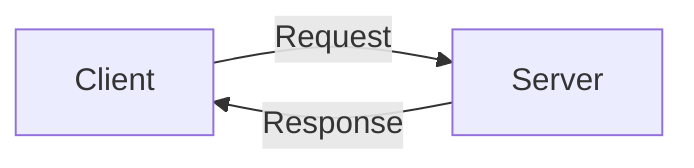
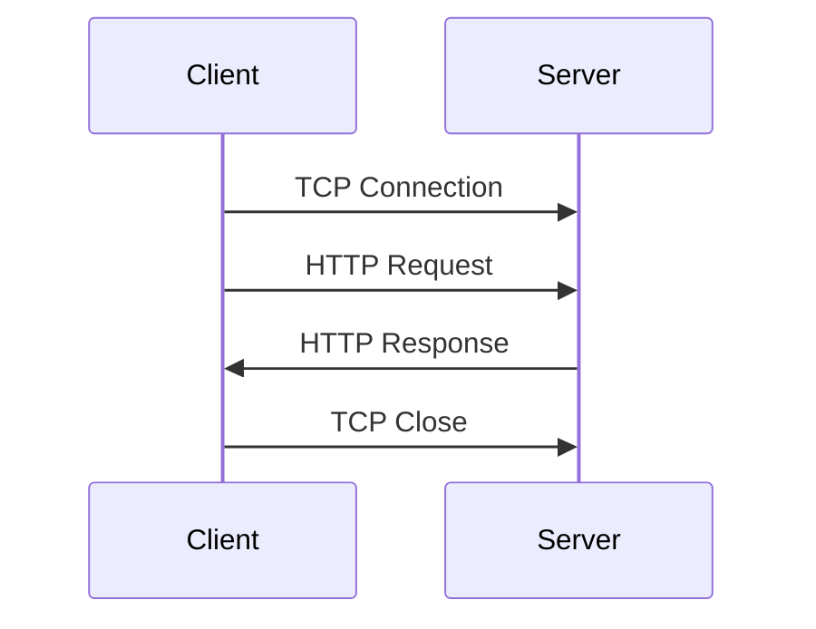
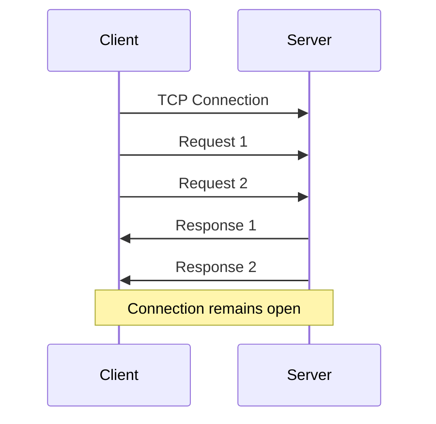
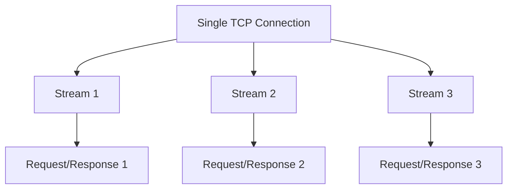
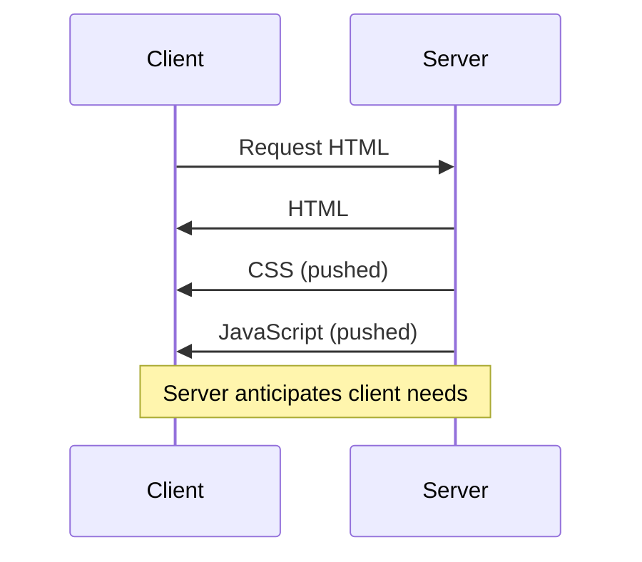
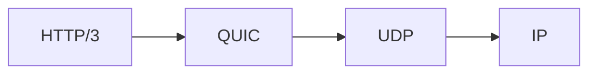
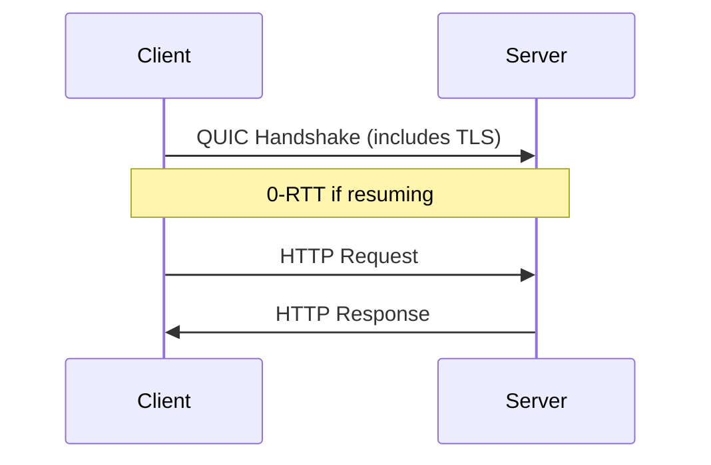

# HTTP Protocol: Evolution and Versions
## From 1.0 to 3.0

---

# What is HTTP?

- HTTP: Hypertext Transfer Protocol
- Foundation of data exchange on the Web
- Client-server protocol
- Stateless, but not sessionless

---

# HTTP/1.0 (1996)

- First standardized version
- One request-response pair per TCP connection
- Headers introduced
- Methods: GET, HEAD, POST

---

# HTTP/1.1 (1997)

- Persistent connections
- Pipelining (multiple requests before responses)
- Host header (virtual hosting)
- New methods: PUT, DELETE, TRACE, OPTIONS
- Chunked transfer encoding

---

# HTTP/1.1 Improvements

- Reduced latency for multiple requests
- Better bandwidth utilization
- Introduced caching mechanisms
- Added compression (Content-Encoding)

---

# HTTP/2 (2015)

- Binary protocol (not text-based)
- Multiplexing (multiple requests/responses over single connection)
- Header compression (HPACK)
- Server push
- Stream prioritization

---

# HTTP/2 Server Push

---

# HTTP/3 (2022)

- Based on QUIC protocol (Quick UDP Internet Connections)
- Replaces TCP with UDP
- Improved performance on poor networks
- Reduced connection establishment time
- Better multiplexing without head-of-line blocking

---

# HTTP/3 Connection Establishment

---

# Version Comparison

| Feature           | HTTP/1.0 | HTTP/1.1 | HTTP/2   | HTTP/3   |
|-------------------|----------|----------|----------|----------|
| Connections       | One-off  | Persistent | Multiplexed | Multiplexed |
| Compression       | No       | Yes      | HPACK    | QPACK    |
| Multiplexing      | No       | Limited  | Yes      | Yes      |
| Server Push       | No       | No       | Yes      | Yes      |
| HOL Blocking      | Yes      | Yes      | Reduced  | Eliminated |
| Transport Protocol| TCP      | TCP      | TCP      | UDP (QUIC) |

---

# Key Takeaways

1. HTTP has evolved to meet increasing web demands
2. Each version improved performance and capabilities
3. HTTP/2 and HTTP/3 focus on multiplexing and reducing latency
4. Modern websites benefit from using the latest HTTP version
5. Understanding HTTP versions helps in web optimization

---

# Questions?

Thank you for your attention!

Feel free to ask any questions about HTTP and its evolution.

