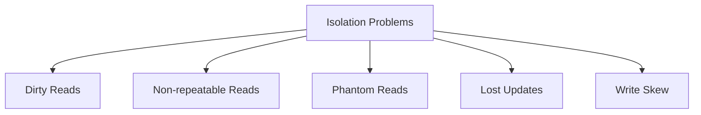
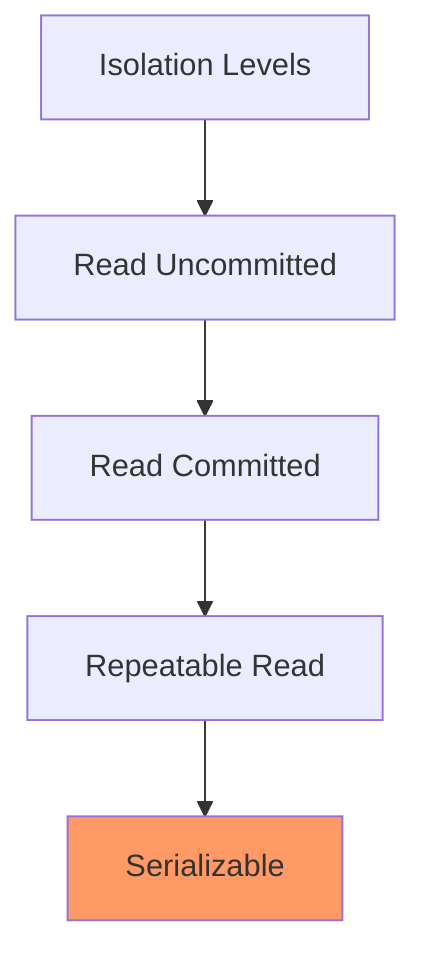
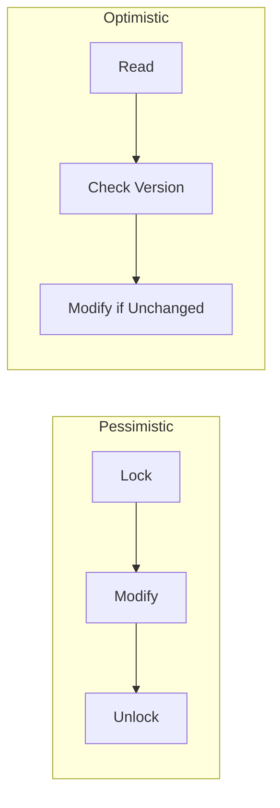
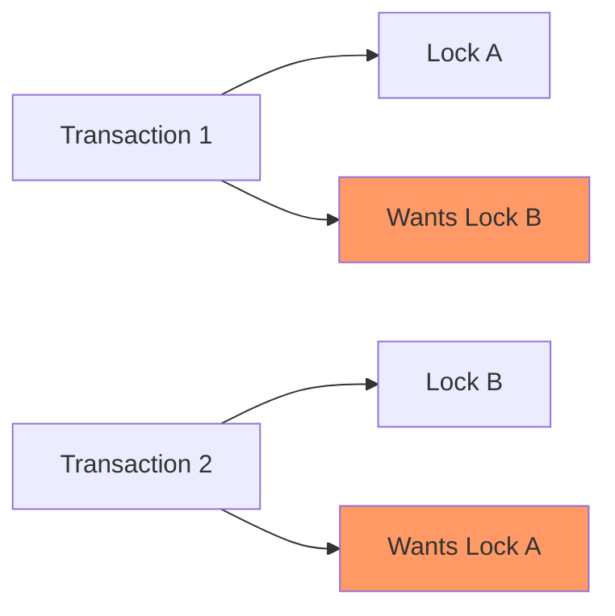
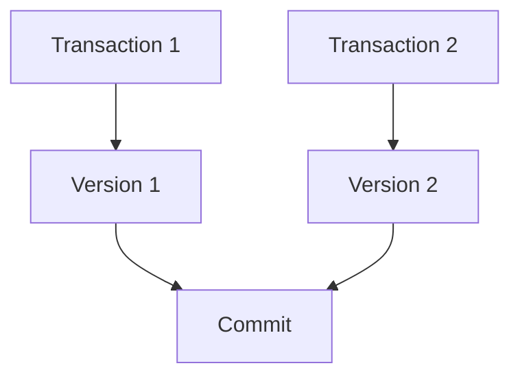

# Database Isolation Levels
## Understanding and Implementing Transaction Isolation

---

## Agenda

1. ACID Review
2. Isolation Problems
3. Isolation Levels
4. Implementation Patterns
5. Best Practices

---

## What is Isolation?

- Part of ACID properties
- Handles concurrent transactions
- Prevents interference
- Ensures data consistency
- Balances consistency vs performance

---

## Common Isolation Problems



---

## Dirty Read Example

```sql
-- Transaction 1
BEGIN;
UPDATE accounts SET balance = balance - 100 WHERE id = 1;
-- Not yet committed

-- Transaction 2 (Dirty Read)
SELECT balance FROM accounts WHERE id = 1;
-- Reads uncommitted data

-- Transaction 1
ROLLBACK;
-- Now Transaction 2 has invalid data
```

---

## Non-repeatable Read Example

```sql
-- Transaction 1
BEGIN;
SELECT balance FROM accounts WHERE id = 1;  -- Returns 1000

-- Transaction 2
UPDATE accounts SET balance = 800 WHERE id = 1;
COMMIT;

-- Transaction 1
SELECT balance FROM accounts WHERE id = 1;  -- Returns 800
-- Different result in same transaction!
```

---

## Phantom Read Example

```sql
-- Transaction 1
BEGIN;
SELECT COUNT(*) FROM accounts WHERE balance > 1000;  -- Returns 5

-- Transaction 2
INSERT INTO accounts (id, balance) VALUES (6, 1500);
COMMIT;

-- Transaction 1
SELECT COUNT(*) FROM accounts WHERE balance > 1000;  -- Returns 6
-- New row appeared!
```

---

## Standard Isolation Levels



---

## Isolation Level Characteristics

| Level | Dirty Read | Non-repeatable Read | Phantom Read |
|-------|------------|---------------------|--------------|
| Read Uncommitted | Yes | Yes | Yes |
| Read Committed | No | Yes | Yes |
| Repeatable Read | No | No | Yes* |
| Serializable | No | No | No |

---

## Setting Isolation Levels

```sql
-- Session level
SET TRANSACTION ISOLATION LEVEL SERIALIZABLE;

-- Transaction level
BEGIN TRANSACTION ISOLATION LEVEL SERIALIZABLE;

-- PostgreSQL example
BEGIN;
SET TRANSACTION ISOLATION LEVEL SERIALIZABLE;
-- your transaction
COMMIT;
```

---

## Optimistic vs Pessimistic Locking



---

## Optimistic Locking Example

```sql
-- Table structure
CREATE TABLE accounts (
    id INT PRIMARY KEY,
    balance DECIMAL,
    version INT
);

-- Update with version check
UPDATE accounts 
SET balance = balance - 100,
    version = version + 1
WHERE id = 1 
AND version = 5;

-- If no rows updated, transaction conflicts detected
```

---

## Row-Level Locking

```sql
-- Explicit row lock
SELECT * FROM accounts 
WHERE id = 1 
FOR UPDATE;

-- Skip locked rows
SELECT * FROM accounts 
WHERE status = 'pending'
FOR UPDATE SKIP LOCKED
LIMIT 1;
```

---

## Handling Lost Updates

```python
def transfer_money(from_id, to_id, amount):
    while True:
        try:
            with transaction.atomic():
                # Lock both accounts
                from_acc = Account.objects.select_for_update().get(id=from_id)
                to_acc = Account.objects.select_for_update().get(id=to_id)
                
                # Perform transfer
                from_acc.balance -= amount
                to_acc.balance += amount
                
                from_acc.save()
                to_acc.save()
                break
        except DatabaseError:
            time.sleep(0.1)  # Brief delay before retry
```

---

## Dealing with Deadlocks



---

## Deadlock Prevention

```python
def safe_update(account_ids, callback):
    # Sort IDs to ensure consistent lock order
    sorted_ids = sorted(account_ids)
    
    with transaction.atomic():
        # Lock in consistent order
        accounts = [
            Account.objects.select_for_update().get(id=id)
            for id in sorted_ids
        ]
        
        # Perform updates
        callback(accounts)
```

---

## Multi-Version Concurrency Control (MVCC)



---

## Handling Write Skew

```sql
-- Using Serializable Isolation
BEGIN TRANSACTION ISOLATION LEVEL SERIALIZABLE;

-- Check constraint
SELECT COUNT(*) FROM doctors 
WHERE on_call = true AND id != 123;

-- Update if safe
UPDATE doctors 
SET on_call = false 
WHERE id = 123;

COMMIT;
```

---

## Performance vs Consistency

1. Higher isolation = Lower concurrency
2. Lower isolation = Better performance
3. Choose based on requirements
4. Consider hybrid approaches
5. Monitor and adjust

---

## Best Practices

1. Use appropriate isolation level
2. Implement retry logic
3. Keep transactions short
4. Handle deadlocks gracefully
5. Monitor lock contention
6. Document isolation requirements
