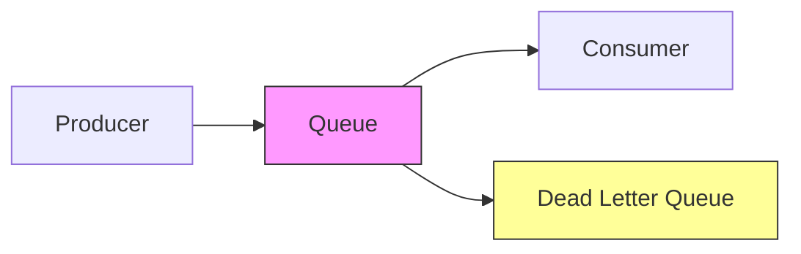
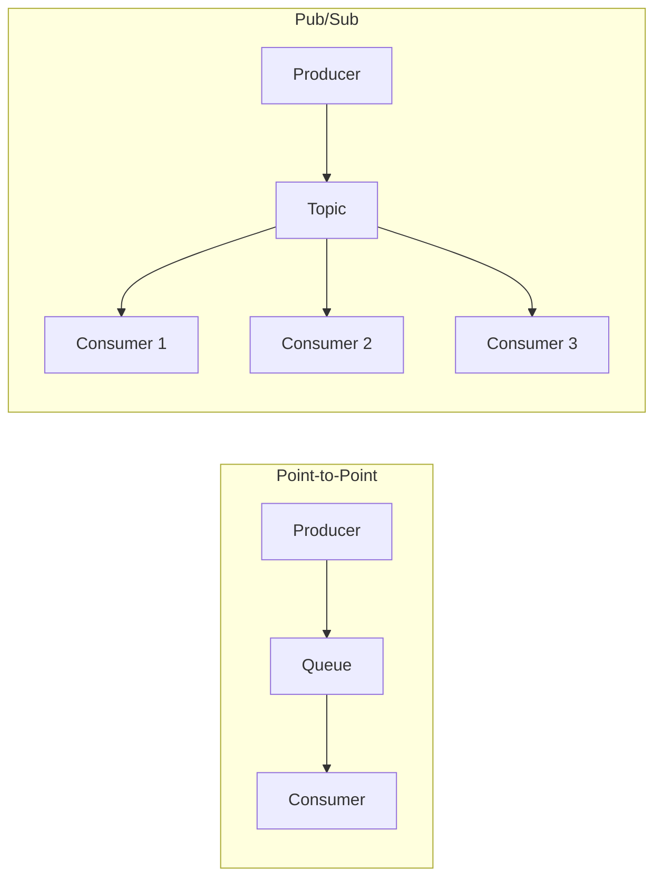
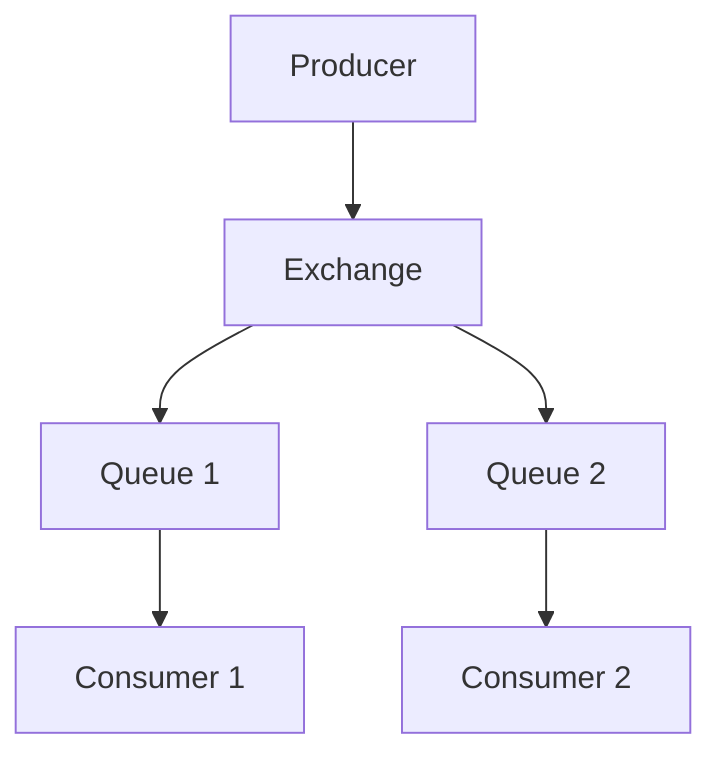
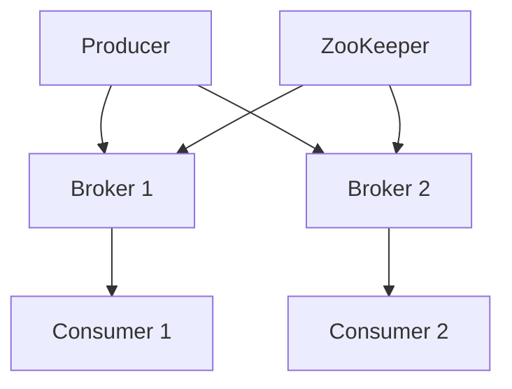
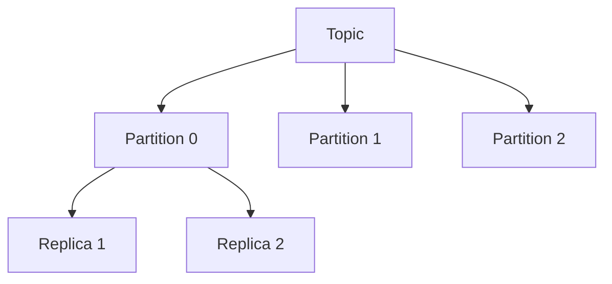
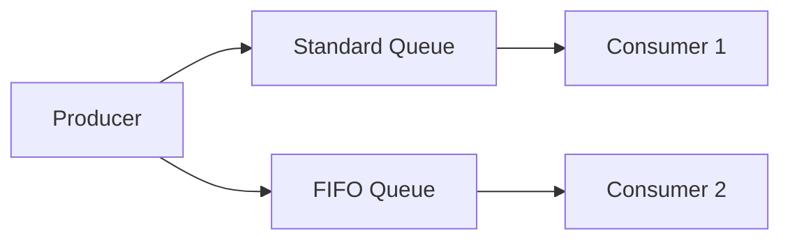
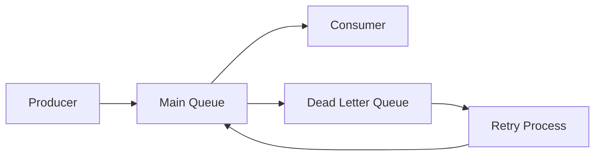
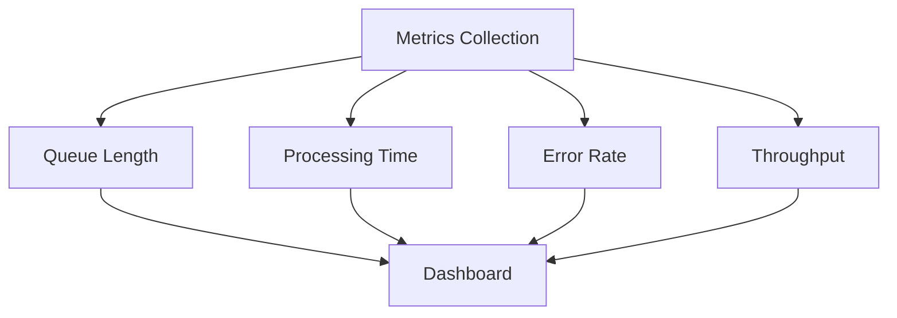
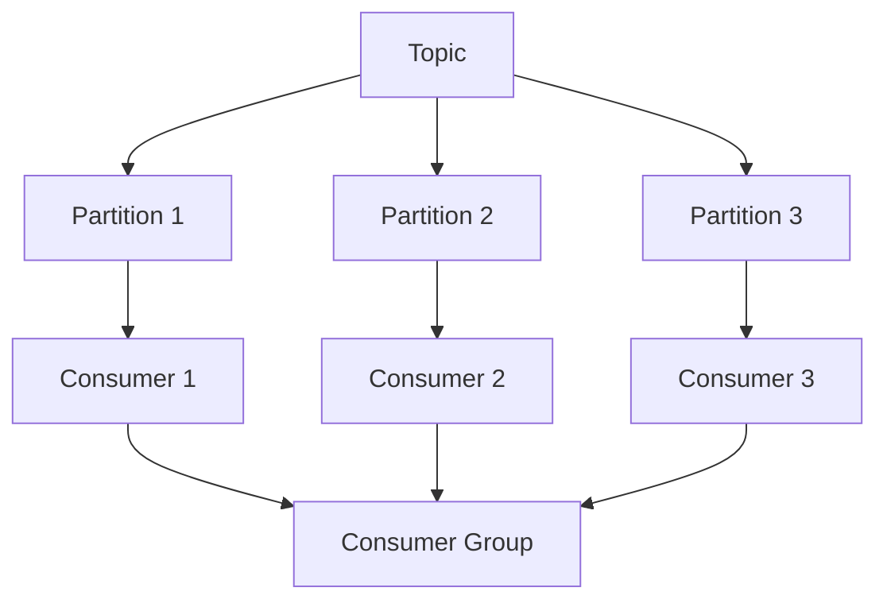

# Queues in Distributed Systems
## Modern Architecture Course

---

## Agenda

1. Understanding Queues
2. Queue Types and Patterns
3. Message Ordering and Delivery
4. Queue Systems Deep Dive
   - RabbitMQ
   - Apache Kafka
   - Amazon SQS
5. Advanced Concepts

---

## What are Queues?

- Asynchronous communication mechanism
- Decouples producers and consumers
- Handles backpressure
- Ensures reliable delivery
- Enables scalability

---

## Queue Components



---

## Types of Queues

1. Point-to-Point
2. Publish/Subscribe
3. Priority Queues
4. Dead Letter Queues
5. Delay Queues

---

## Point-to-Point vs Pub/Sub



---

## Basic Queue Operations

```python
from queue import Queue

# Create queue
queue = Queue()

# Producer
def produce():
    for i in range(10):
        queue.put(f"Message {i}")

# Consumer
def consume():
    while True:
        message = queue.get()
        process_message(message)
        queue.task_done()
```

---

## RabbitMQ Architecture



---

## RabbitMQ Example

```python
import pika

# Connection
connection = pika.BlockingConnection(
    pika.ConnectionParameters('localhost')
)
channel = connection.channel()

# Declare queue
channel.queue_declare(queue='task_queue', durable=True)

# Producer
channel.basic_publish(
    exchange='',
    routing_key='task_queue',
    body='Hello World!',
    properties=pika.BasicProperties(
        delivery_mode=2,  # make message persistent
    )
)

# Consumer
def callback(ch, method, properties, body):
    print(f" [x] Received {body}")
    ch.basic_ack(delivery_tag=method.delivery_tag)

channel.basic_consume(
    queue='task_queue',
    on_message_callback=callback
)
channel.start_consuming()
```

---

## Apache Kafka Architecture



---

## Kafka Topics and Partitions



---

## Kafka Producer Example

```python
from kafka import KafkaProducer
import json

producer = KafkaProducer(
    bootstrap_servers=['localhost:9092'],
    value_serializer=lambda v: json.dumps(v).encode('utf-8')
)

# Produce message
producer.send('my_topic', {
    'user_id': 123,
    'action': 'login',
    'timestamp': '2024-01-01T10:00:00Z'
})

# Flush and close
producer.flush()
producer.close()
```

---

## Kafka Consumer Example

```python
from kafka import KafkaConsumer
import json

consumer = KafkaConsumer(
    'my_topic',
    bootstrap_servers=['localhost:9092'],
    group_id='my_group',
    auto_offset_reset='earliest',
    value_deserializer=lambda x: json.loads(x.decode('utf-8'))
)

# Consume messages
for message in consumer:
    print(f"Partition: {message.partition}")
    print(f"Offset: {message.offset}")
    print(f"Value: {message.value}")
```

---

## Amazon SQS Architecture



---

## SQS Example

```python
import boto3

# Create SQS client
sqs = boto3.client('sqs')

# Send message
response = sqs.send_message(
    QueueUrl='https://sqs.region.amazonaws.com/123456789012/MyQueue',
    MessageBody='Hello from SQS!',
    MessageAttributes={
        'Author': {
            'StringValue': 'John Doe',
            'DataType': 'String'
        }
    }
)

# Receive messages
response = sqs.receive_message(
    QueueUrl='https://sqs.region.amazonaws.com/123456789012/MyQueue',
    MaxNumberOfMessages=10,
    WaitTimeSeconds=20
)
```

---

## Message Ordering

1. FIFO (First-In-First-Out)
2. Priority-based
3. Time-based
4. Custom ordering

---

## FIFO Implementation

```python
from collections import deque
import threading

class FIFOQueue:
    def __init__(self):
        self.queue = deque()
        self.lock = threading.Lock()
    
    def enqueue(self, item):
        with self.lock:
            self.queue.append(item)
    
    def dequeue(self):
        with self.lock:
            return self.queue.popleft() if self.queue else None
```

---

## Priority Queue Example

```python
import heapq

class PriorityQueue:
    def __init__(self):
        self._queue = []
        self._index = 0
    
    def push(self, item, priority):
        heapq.heappush(self._queue, (-priority, self._index, item))
        self._index += 1
    
    def pop(self):
        return heapq.heappop(self._queue)[-1]
```

---

## Message Batching

```python
class BatchProducer:
    def __init__(self, batch_size=100):
        self.batch = []
        self.batch_size = batch_size
    
    def add_message(self, message):
        self.batch.append(message)
        if len(self.batch) >= self.batch_size:
            self.flush()
    
    def flush(self):
        if self.batch:
            send_batch_to_queue(self.batch)
            self.batch = []
```

---

## Dead Letter Queues



---

## DLQ Implementation

```python
def process_message(message):
    try:
        # Process message
        process(message)
        # Acknowledge success
        message.ack()
    except Exception as e:
        # Move to DLQ
        move_to_dlq(message, str(e))

def move_to_dlq(message, error):
    dlq_message = {
        'original_message': message.body,
        'error': error,
        'timestamp': datetime.now().isoformat(),
        'retry_count': message.retry_count + 1
    }
    dlq.send_message(dlq_message)
```

---

## Queue Monitoring

Key Metrics:
- Queue Length
- Processing Time
- Error Rate
- Throughput
- Consumer Lag

---

## Monitoring Dashboard



---

## Error Handling Patterns

1. Retry with Backoff
2. Circuit Breaker
3. Fallback Handler
4. Poison Message Handler

---

## Retry Pattern

```python
def retry_with_backoff(func, max_retries=3):
    for attempt in range(max_retries):
        try:
            return func()
        except Exception as e:
            if attempt == max_retries - 1:
                raise e
            wait_time = (2 ** attempt) * 1000  # exponential backoff
            time.sleep(wait_time / 1000.0)
```

---

## Scaling Patterns

1. Horizontal Consumer Scaling
2. Partition Distribution
3. Consumer Groups
4. Load Balancing

---

## Consumer Group Pattern



---

## Performance Optimization

1. Message Compression
2. Batch Processing
3. Prefetch Count
4. Connection Pooling
5. Resource Management

---

## Best Practices

1. Use Dead Letter Queues
2. Implement Retry Logic
3. Monitor Queue Health
4. Handle Poison Messages
5. Plan for Scaling
6. Ensure Message Persistence
