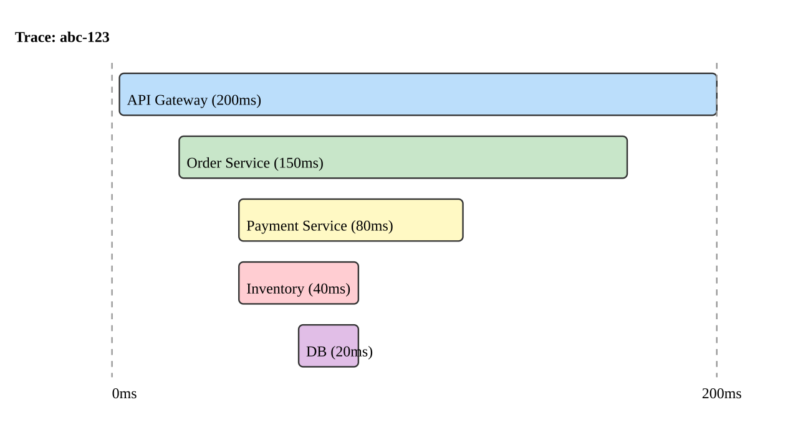

# Monitoring and Observability

<!-- Add Mermaid.js support -->
<script src="https://cdn.jsdelivr.net/npm/mermaid@10/dist/mermaid.min.js"></script>
<script>
  mermaid.initialize({ startOnLoad: true });
</script>

---
## Monitoring vs Observability

- Monitoring tells you when something is wrong
- Observability tells you why something is wrong
- Monitoring relies on predefined checks and thresholds
- Observability lets you ask arbitrary questions about system behavior

---
## Why Observability Matters

- Microservices create complex, distributed call chains
- Failures can originate in any service and propagate unpredictably
- Without observability, debugging production issues is guesswork
- Mean Time to Resolution (MTTR) depends on how quickly you understand the problem

---
## The Observability Challenge

<div class="mermaid">
graph TD
    C[Client] --> GW[API Gateway]
    GW --> S1[Service A]
    GW --> S2[Service B]
    S1 --> S3[Service C]
    S2 --> S3
    S3 --> DB[(Database)]
    S1 --> CACHE[(Cache)]
    S2 --> MQ[Message Queue]
</div>

- A single user request may touch 5+ services
- Where did the latency spike occur? Which service returned an error?

---
## The Three Pillars of Observability

<div class="mermaid">
graph TD
    O[Observability]
    O --> M[Metrics]
    O --> L[Logs]
    O --> T[Traces]
    M --> M1[Quantitative measurements over time]
    L --> L1[Discrete events with context]
    T --> T1[Request flow across services]
</div>

---
## Pillar 1: Metrics

- Numeric measurements collected at regular intervals
- Aggregated over time to show trends and patterns
- Lightweight and efficient to collect and store
- Used for alerting, dashboards, and capacity planning

---
## Types of Metrics

- Counter: monotonically increasing value (e.g., total requests)
- Gauge: value that can go up or down (e.g., current memory usage)
- Histogram: distribution of values in buckets (e.g., response time)
- Summary: similar to histogram but calculates percentiles client-side

---
## Key Metrics to Track

- `RED` method for services:
    - Rate: requests per second
    - Errors: error rate as percentage of total requests
    - Duration: response time distribution
- `USE` method for resources:
    - Utilization: percentage of resource capacity in use
    - Saturation: how much work is queued
    - Errors: count of error events

---
## Prometheus Metrics Example

```python
from prometheus_client import (
    Counter, Histogram, start_http_server
)

REQUEST_COUNT = Counter(
    'http_requests_total',
    'Total HTTP requests',
    ['method', 'endpoint', 'status'])

REQUEST_LATENCY = Histogram(
    'http_request_duration_seconds',
    'HTTP request latency',
    ['method', 'endpoint'])
```

---
## Metrics Architecture

<div class="mermaid">
graph LR
    S1[Service 1] -->|/metrics| P[Prometheus]
    S2[Service 2] -->|/metrics| P
    S3[Service 3] -->|/metrics| P
    P --> G[Grafana]
    P --> AM[Alert Manager]
    AM --> PD[PagerDuty / Slack]
</div>

---
## Grafana Dashboards

- Visualization tool for metrics data
- Create dashboards with graphs, tables, and alerts
- Supports multiple data sources: `Prometheus`, `InfluxDB`, `Elasticsearch`
- Pre-built dashboards available for common infrastructure

---
## Alerting Best Practices

- Alert on symptoms (high error rate) not causes (disk full)
- Use severity levels: critical, warning, informational
- Avoid alert fatigue by tuning thresholds carefully
- Include runbooks that describe what to do when an alert fires
- Use escalation policies for unacknowledged alerts

---
## Pillar 2: Logging

- Discrete records of events that occurred in the system
- Provide detailed context for debugging specific issues
- Each log entry includes timestamp, severity, message, and metadata
- Volume can be very high; require efficient storage and querying

---
## Structured Logging

```json
{
  "timestamp": "2026-02-17T14:30:00Z",
  "level": "ERROR",
  "service": "order-service",
  "traceId": "abc-123-def",
  "message": "Failed to process payment",
  "orderId": "ord-456",
  "error": "Connection timeout to payment-svc",
  "duration_ms": 5002
}
```

- Use `JSON` format for machine-parseable logs
- Include correlation IDs for tracing across services

---
## Log Levels

| Level | Purpose |
|-------|---------|
| `TRACE` | Very detailed diagnostic information |
| `DEBUG` | Diagnostic information for developers |
| `INFO` | General operational events |
| `WARN` | Potentially harmful situations |
| `ERROR` | Error events that still allow operation |
| `FATAL` | Severe errors causing shutdown |

---
## Centralized Logging Architecture

<div class="mermaid">
graph LR
    S1[Service 1] -->|stdout| A1[Log Agent]
    S2[Service 2] -->|stdout| A2[Log Agent]
    S3[Service 3] -->|stdout| A3[Log Agent]
    A1 --> AGG[Log Aggregator]
    A2 --> AGG
    A3 --> AGG
    AGG --> STORE[(Log Storage)]
    STORE --> UI[Query / Dashboard]
</div>

---
## Logging Stack Options

- `ELK Stack`: `Elasticsearch`, `Logstash`, `Kibana`
    - Powerful but resource-intensive
- `EFK Stack`: `Elasticsearch`, `Fluentd`, `Kibana`
    - Fluentd is more Kubernetes-native than Logstash
- `Loki` + `Grafana`: lightweight, label-based log aggregation
    - Cost-effective, integrates with existing Grafana dashboards
- Cloud-managed: `CloudWatch`, `Stackdriver`, `Azure Monitor`

---
## Logging Best Practices

- Write logs to `stdout` and `stderr`, not to files
- Use structured logging in `JSON` format
- Include request IDs and trace IDs in every log entry
- Set appropriate log levels per environment
- Avoid logging sensitive data (PII, passwords, tokens)
- Use sampling for high-volume debug logs in production

---
## Pillar 3: Distributed Tracing

- Tracks a single request as it flows through multiple services
- Shows the full call chain with timing for each step
- Identifies bottlenecks and failure points in distributed systems
- Essential for understanding latency in microservice architectures

---
## Trace Anatomy

<div class="mermaid">
graph LR
    subgraph Trace
        S1[Span: API Gateway 200ms]
        S1 --> S2[Span: Order Service 150ms]
        S2 --> S3[Span: Payment Service 80ms]
        S2 --> S4[Span: Inventory Service 40ms]
        S3 --> S5[Span: Database Query 20ms]
    end
</div>

- A trace represents the entire request journey
- Each span represents one operation within the trace

---
## Trace Terminology

- `Trace` - the end-to-end journey of a request through the system
- `Span` - a single unit of work within a trace
- `Trace ID` - unique identifier shared across all spans in a trace
- `Span ID` - unique identifier for each individual span
- `Parent Span ID` - links a child span to its parent

---
## Context Propagation

- Trace context must be passed between services
- Typically propagated via HTTP headers
- Standard headers: `traceparent`, `tracestate` (W3C Trace Context)
- Libraries handle injection and extraction automatically

---
## Context Propagation Flow

<div class="mermaid">
sequenceDiagram
    participant A as Service A
    participant B as Service B
    participant C as Service C
    A->>B: Request + traceparent header
    Note over B: Extract context, create child span
    B->>C: Request + traceparent header
    Note over C: Extract context, create child span
    C-->>B: Response
    B-->>A: Response
</div>

---
## OpenTelemetry

- A vendor-neutral standard for collecting telemetry data
- Merged from `OpenTracing` and `OpenCensus` projects
- Provides APIs, SDKs, and tools for metrics, logs, and traces
- Supported by all major observability vendors

---
## OpenTelemetry Architecture

<div class="mermaid">
graph TD
    APP[Application + OTel SDK] -->|OTLP| COLL[OTel Collector]
    COLL -->|Export| J[Jaeger]
    COLL -->|Export| P[Prometheus]
    COLL -->|Export| L[Loki]
    COLL -->|Export| V[Vendor Backend]
</div>

---
## OpenTelemetry Collector

- A vendor-agnostic proxy for receiving, processing, and exporting telemetry
- Receivers: accept data in various formats (`OTLP`, `Jaeger`, `Zipkin`)
- Processors: batch, filter, sample, or transform data
- Exporters: send data to one or more backends
- Decouples applications from specific observability backends

---
## Instrumenting with OpenTelemetry

```python
from opentelemetry import trace
from opentelemetry.sdk.trace import (
    TracerProvider)
from opentelemetry.sdk.trace.export import (
    BatchSpanProcessor)

provider = TracerProvider()
processor = BatchSpanProcessor(exporter)
provider.add_span_processor(processor)
trace.set_tracer_provider(provider)

tracer = trace.get_tracer("order-service")

with tracer.start_as_current_span("process"):
    # business logic here
    pass
```

---
## Auto-Instrumentation

- Automatically instruments common libraries without code changes
- Supports HTTP clients, database drivers, message queues, and frameworks
- Available for `Python`, `Java`, `Node.js`, `Go`, `.NET`, and more
- Reduces the effort to add observability to existing applications

---
## Tracing Tools

- `Jaeger` - open-source distributed tracing by Uber
- `Zipkin` - open-source distributed tracing by Twitter
- `Tempo` - Grafana's distributed tracing backend
- `AWS X-Ray` - managed tracing for AWS services
- `Datadog APM` - commercial tracing with rich analytics

---
## Trace Visualization



---
## Health Check Strategies

- Liveness checks: is the process alive and not deadlocked?
- Readiness checks: is the service ready to handle requests?
- Dependency checks: are all critical dependencies reachable?
- Shallow vs deep health checks serve different purposes

---
## Shallow vs Deep Health Checks

| Type | What It Checks | Use Case |
|------|---------------|----------|
| Shallow | Service is running | Liveness probe |
| Deep | Service + all dependencies | Readiness probe |

- Shallow checks are fast and cheap
- Deep checks verify end-to-end functionality
- Use shallow for liveness, deep for readiness

---
## Health Check Endpoint Example

```python
@app.get("/health/live")
def liveness():
    return {"status": "ok"}

@app.get("/health/ready")
def readiness():
    checks = {
        "database": check_db(),
        "cache": check_cache(),
        "queue": check_queue(),
    }
    status = "ok" if all(
        checks.values()) else "degraded"
    code = 200 if status == "ok" else 503
    return JSONResponse(
        {"status": status, "checks": checks},
        status_code=code)
```

---
## SLIs, SLOs, and SLAs

- `SLI` (Service Level Indicator): a measurable metric (e.g., latency p99)
- `SLO` (Service Level Objective): a target for the SLI (e.g., p99 < 200ms)
- `SLA` (Service Level Agreement): a contract with consequences if SLOs are missed
- SLIs inform SLOs which back SLAs

---
## SLI/SLO Relationship

<div class="mermaid">
graph LR
    SLI[SLI: p99 latency = 180ms] --> SLO[SLO: p99 latency < 200ms]
    SLO --> SLA[SLA: 99.9% of requests within SLO]
    SLI2[SLI: Error rate = 0.05%] --> SLO2[SLO: Error rate < 0.1%]
    SLO2 --> SLA
</div>

---
## Error Budgets

- The acceptable amount of unreliability within an SLO
- If SLO is 99.9% availability, the error budget is 0.1%
- Teams can "spend" the error budget on risky deployments or experiments
- When the budget is exhausted, focus shifts to reliability over features

---
## Correlation Across Pillars

- Use trace IDs to connect logs, metrics, and traces
- A metric alert triggers investigation
- Traces identify the slow or failing service
- Logs from that service reveal the root cause
- All three pillars work together for fast resolution

---
## Correlation Flow

<div class="mermaid">
graph TD
    A[Alert: High p99 latency] --> B[Dashboard: Which endpoint?]
    B --> C[Trace: Find slow spans]
    C --> D[Logs: Error details for trace ID]
    D --> E[Root Cause Identified]
</div>

---
## Observability in Kubernetes

- `Prometheus` with `kube-state-metrics` for cluster metrics
- `Fluentd` or `Fluent Bit` as `DaemonSet` for log collection
- `Jaeger` or `Tempo` deployed in-cluster for tracing
- `Grafana` as the unified dashboard for all three pillars

---
## Monitoring Anti-Patterns

- Alert on every metric instead of meaningful symptoms
- Dashboards with hundreds of panels nobody reads
- Logging everything at `DEBUG` level in production
- No correlation between metrics, logs, and traces
- Monitoring only in production, not in staging

---
## Summary

- Observability lets you understand system behavior through metrics, logs, and traces
- Metrics provide quantitative trends; use `RED` and `USE` methods
- Structured logs with correlation IDs enable efficient debugging
- Distributed tracing reveals the path and timing of requests across services
- `OpenTelemetry` provides a vendor-neutral standard for all telemetry
- Health checks and SLOs create a framework for reliability targets
- Correlating all three pillars is key to fast incident resolution
