# Spark Streaming and Structured Streaming
---
## Streaming Fundamentals
* Real-time data processing
* Stream processing models
* Micro-batch processing
* Continuous processing
---
## Stream Processing Models


---
## Basic Concepts
1. Data sources
1. Processing time
1. Event time
1. Watermarks
---
## Streaming Sources
```python
# Kafka source example
stream = spark.readStream \
    .format("kafka") \
    .option("kafka.bootstrap.servers", "host:port") \
    .option("subscribe", "topic") \
    .load()
```
---
## Input Data Sources

---
## Stream Processing Modes
1. Micro-batch processing
1. Continuous processing
1. Trigger options
1. Processing guarantees
---
## Event Time Processing
```python
from pyspark.sql.functions import window

windowed = stream.groupBy(
    window("eventTime", "1 hour"),
    "id"
).count()
```
---
## Watermark Configuration
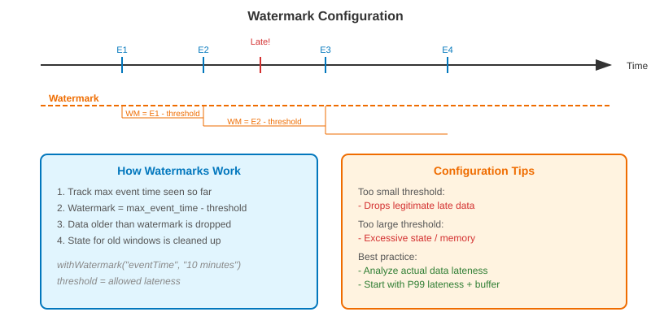

---
## Late Data Handling
```python
# Configure watermark
stream_df = stream_df \
    .withWatermark("eventTime", "10 minutes") \
    .groupBy("id") \
    .count()
```
---
## Stateful Processing
1. Window operations
1. Aggregations
1. State management
1. Checkpointing
---
## Window Operations
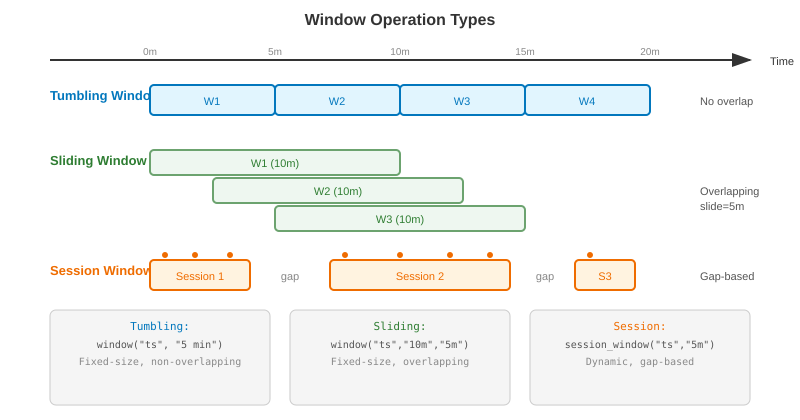

---
## Window Types
```python
# Sliding window
windowed = stream.groupBy(
    window("timestamp", "30 minutes", "5 minutes")
).count()
```
---
## State Management
```python
# Maintain running count
def update_state(key, value, state):
    if state.exists():
        state.update(state.get() + value)
    else:
        state.update(value)
```
---
## Checkpointing
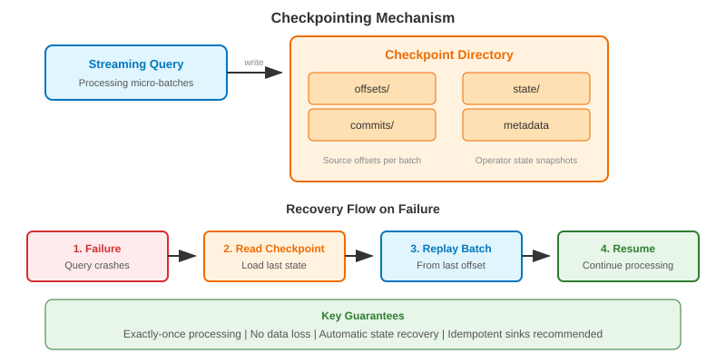

---
## Fault Tolerance
1. Exactly-once processing
1. Checkpoint configuration
1. Recovery mechanisms
1. State recovery
---
## Output Modes
```python
# Complete output mode
query = stream.writeStream \
    .outputMode("complete") \
    .format("console") \
    .start()
```
---
## Output Sinks
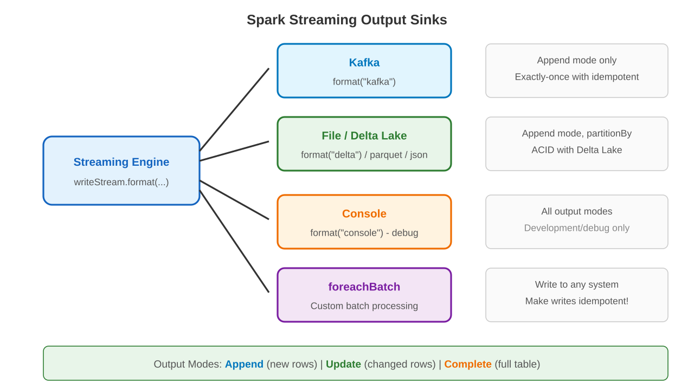

---
## Streaming Joins
1. Stream-stream joins
1. Stream-static joins
1. Watermark considerations
1. State cleanup
---
## Stream-Stream Join
```python
# Join two streams
joined = stream1.join(
    stream2,
    "joinKey",
    "leftOuter"
)
```
---
## Performance Optimization


---
## Memory Management
1. State cleanup
1. Watermark tuning
1. Checkpoint cleanup
1. Resource allocation
---
## Trigger Options
```python
# Process every 5 minutes
query = stream.writeStream \
    .trigger(processingTime='5 minutes') \
    .start()
```
---
## Monitoring Streams
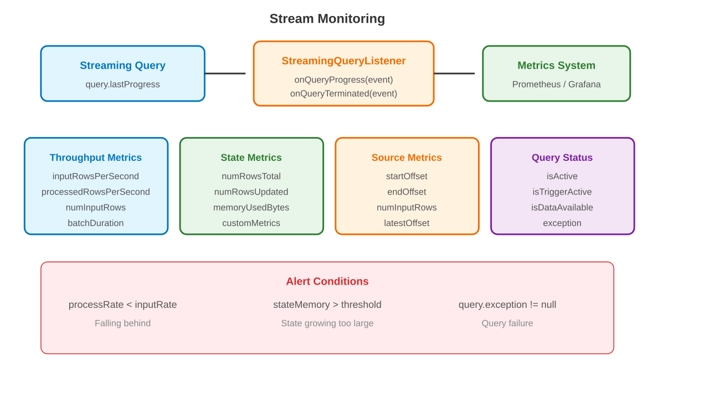

---
## Performance Metrics
1. Input rate
1. Processing rate
1. Batch duration
1. Operation metrics
---
## Error Handling
```python
def handle_errors(df, epoch_id):
    try:
        process_batch(df)
    except Exception as e:
        log_error(e)
```
---
## Data Quality

---
## Schema Evolution
```python
# Schema enforcement
stream = spark.readStream \
    .schema(schema) \
    .json("path")
```
---
## Custom Sources
```python
from pyspark.sql.streaming import Source

class CustomSource(Source):
    def getBatch(self, start, end):
        return get_data(start, end)
```
---
## Custom Sinks


---
## Rate Limiting
1. Input rate control
1. Processing rate control
1. Backpressure handling
1. Resource management
---
## Kafka Integration
```python
# Write to Kafka
query = stream.writeStream \
    .format("kafka") \
    .option("topic", "output") \
    .start()
```
---
## Security Setup

---
## Production Deployment
1. Monitoring setup
1. Alert configuration
1. Resource planning
1. Scaling strategy
---
## Recovery Mechanisms
```python
# Checkpoint configuration
stream.writeStream \
    .option("checkpointLocation", "path") \
    .start()
```
---
## Testing Strategies
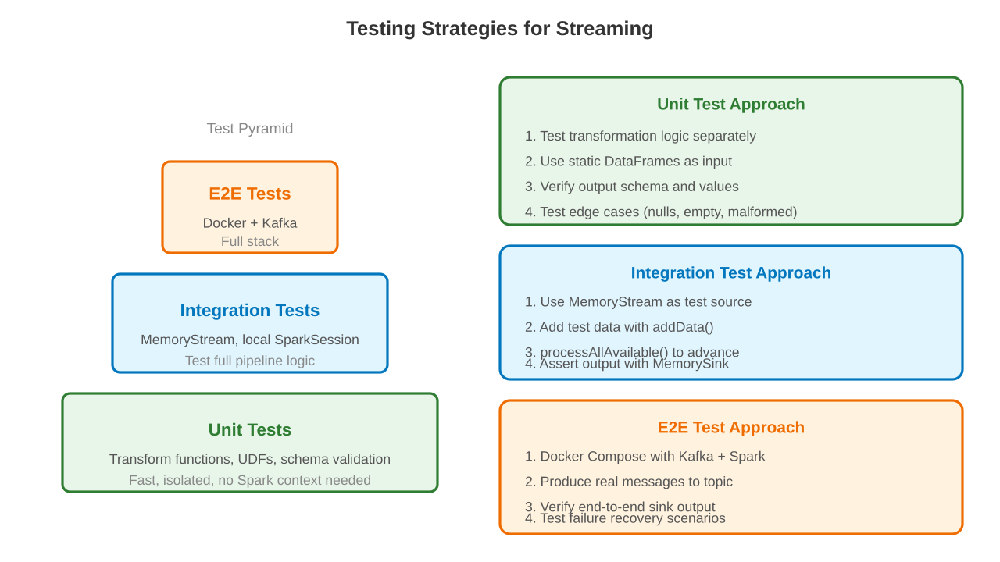

---
## Debugging Tools
1. Progress monitoring
1. Query explanation
1. Metrics tracking
1. Log analysis
---
## Advanced Patterns
```python
# Streaming aggregation pattern
def process_stream(batch_df, batch_id):
    batch_df.cache()
    process_aggregations(batch_df)
```
---
## Stream Processing Patterns
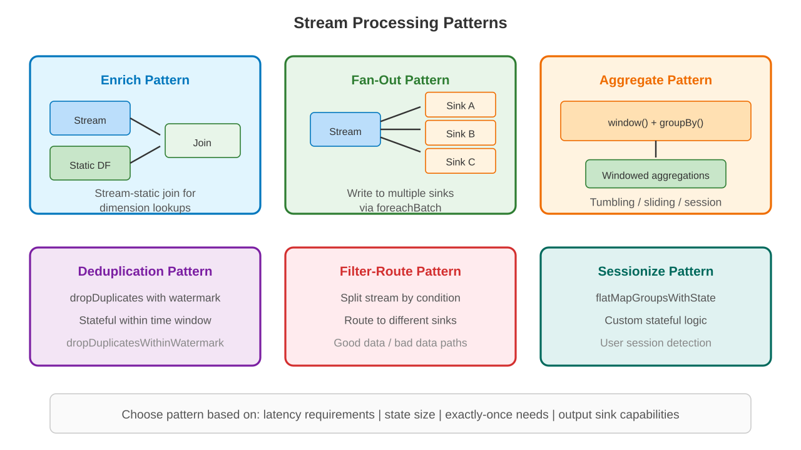

---
## State Store
1. RocksDB backend
1. State versioning
1. Cleanup policies
1. Size management
---
## Metrics Collection
```python
# Custom metrics
def process_metrics(batch_df, epoch_id):
    metrics = compute_metrics(batch_df)
    log_metrics(metrics)
```
---
## Monitoring Dashboard


---
## Scaling Considerations
1. Partition management
1. Resource allocation
1. Cluster sizing
1. Load balancing
---
## Best Practices
```python
# Configure proper watermark
df = df.withWatermark("timestamp", "1 hour")
    .groupBy("key")
    .agg(...)
```
---
## Common Pitfalls


---
## Optimization Tips
1. Proper partitioning
1. Efficient watermarks
1. Memory management
1. Batch size tuning
---
## Advanced Features
```python
# Arbitrary stateful processing
def update_state(key, values, state):
    updated = process_values(values, state)
    return updated
```
---
## Future Development

---
## Integration Patterns
1. Lambda architecture
1. Kappa architecture
1. Hybrid solutions
1. Custom patterns
---
## Production Checklist
```python
# Essential configurations
spark.conf.set("spark.streaming.stopGracefullyOnShutdown", "true")
spark.conf.set("spark.sql.streaming.checkpointLocation", "path")
```
---
## Documentation


---
## Additional Resources
* Official documentation
* Community guides
* Best practices
* Performance tips

---

## Full Program: Kafka to Delta Lake Streaming Pipeline

```python
from pyspark.sql import SparkSession
from pyspark.sql import functions as F
from pyspark.sql.types import *

spark = SparkSession.builder \
    .appName("KafkaToDeltaPipeline") \
    .config("spark.sql.extensions",
            "io.delta.sql.DeltaSparkSessionExtension") \
    .config("spark.sql.catalog.spark_catalog",
            "org.apache.spark.sql.delta.catalog.DeltaCatalog") \
    .config("spark.sql.streaming.schemaInference", "true") \
    .getOrCreate()

# Define message schema
message_schema = StructType([
    StructField("event_id", StringType(), False),
    StructField("user_id", LongType(), False),
    StructField("event_type", StringType(), True),
    StructField("timestamp", StringType(), True),
    StructField("properties", MapType(StringType(), StringType()), True),
])

# Read from Kafka
kafka_stream = (
    spark.readStream
    .format("kafka")
    .option("kafka.bootstrap.servers", "kafka-broker1:9092,kafka-broker2:9092")
    .option("subscribe", "user_events")
    .option("startingOffsets", "latest")
    .option("maxOffsetsPerTrigger", 100000)
    .option("kafka.security.protocol", "SASL_SSL")
    .option("kafka.sasl.mechanism", "PLAIN")
    .load()
)

# Parse and transform
parsed_stream = (
    kafka_stream
    .select(
        F.col("key").cast("string").alias("kafka_key"),
        F.from_json(
            F.col("value").cast("string"),
            message_schema
        ).alias("data"),
        F.col("topic"),
        F.col("partition").alias("kafka_partition"),
        F.col("offset").alias("kafka_offset"),
        F.col("timestamp").alias("kafka_timestamp"),
    )
    .select(
        "kafka_key",
        "data.*",
        "topic",
        "kafka_partition",
        "kafka_offset",
        "kafka_timestamp",
    )
    .withColumn("event_timestamp",
        F.to_timestamp("timestamp", "yyyy-MM-dd'T'HH:mm:ss.SSS'Z'"))
    .withColumn("event_date", F.to_date("event_timestamp"))
    .withColumn("processing_time", F.current_timestamp())
)

# Write to Delta Lake with partitioning
query = (
    parsed_stream
    .withWatermark("event_timestamp", "1 hour")
    .writeStream
    .format("delta")
    .outputMode("append")
    .option("checkpointLocation", "/checkpoints/user_events/")
    .partitionBy("event_date", "event_type")
    .trigger(processingTime="30 seconds")
    .start("/data/delta/user_events/")
)

query.awaitTermination()
```

---

## Streaming Data Flow Architecture

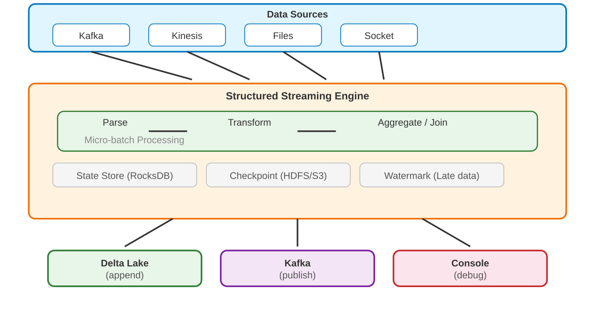

---

## Trigger Modes Comparison

| Trigger | Latency | Throughput | Use Case |
|---|---|---|---|
| processingTime="0" | Lowest micro-batch | Lower | Near real-time |
| processingTime="30s" | ~30 seconds | Higher | Standard ETL |
| processingTime="5m" | ~5 minutes | Highest | Batch-like |
| once=True | One batch only | N/A | Scheduled batch |
| availableNow=True | Process all available | N/A | Catch-up batch |
| continuous="1s" | ~1 second | Medium | True real-time (experimental) |

---

## Full Program: Windowed Aggregations with Watermark

```python
from pyspark.sql import SparkSession
from pyspark.sql import functions as F
from pyspark.sql.types import *

spark = SparkSession.builder \
    .appName("WindowedAggregations") \
    .getOrCreate()

# Simulated IoT sensor stream
sensor_schema = StructType([
    StructField("sensor_id", StringType()),
    StructField("temperature", DoubleType()),
    StructField("humidity", DoubleType()),
    StructField("event_time", TimestampType()),
])

sensor_stream = (
    spark.readStream
    .format("kafka")
    .option("kafka.bootstrap.servers", "kafka:9092")
    .option("subscribe", "sensor_readings")
    .load()
    .select(
        F.from_json(F.col("value").cast("string"), sensor_schema)
        .alias("data")
    )
    .select("data.*")
)

# Tumbling window: non-overlapping 5-minute windows
tumbling_agg = (
    sensor_stream
    .withWatermark("event_time", "10 minutes")
    .groupBy(
        F.window("event_time", "5 minutes"),
        "sensor_id"
    )
    .agg(
        F.avg("temperature").alias("avg_temp"),
        F.max("temperature").alias("max_temp"),
        F.min("temperature").alias("min_temp"),
        F.stddev("temperature").alias("stddev_temp"),
        F.count("*").alias("reading_count"),
    )
)

# Sliding window: 10-minute window, sliding every 2 minutes
sliding_agg = (
    sensor_stream
    .withWatermark("event_time", "10 minutes")
    .groupBy(
        F.window("event_time", "10 minutes", "2 minutes"),
        "sensor_id"
    )
    .agg(
        F.avg("temperature").alias("avg_temp"),
        F.avg("humidity").alias("avg_humidity"),
    )
)

# Session window: gap-based window (Spark 3.2+)
session_agg = (
    sensor_stream
    .withWatermark("event_time", "10 minutes")
    .groupBy(
        F.session_window("event_time", "5 minutes"),
        "sensor_id"
    )
    .agg(
        F.count("*").alias("readings_in_session"),
        F.first("temperature").alias("first_temp"),
        F.last("temperature").alias("last_temp"),
    )
)

# Write tumbling window results
query = (
    tumbling_agg
    .writeStream
    .outputMode("update")
    .format("console")
    .option("truncate", "false")
    .trigger(processingTime="30 seconds")
    .start()
)
```

---

## Window Types Visualization

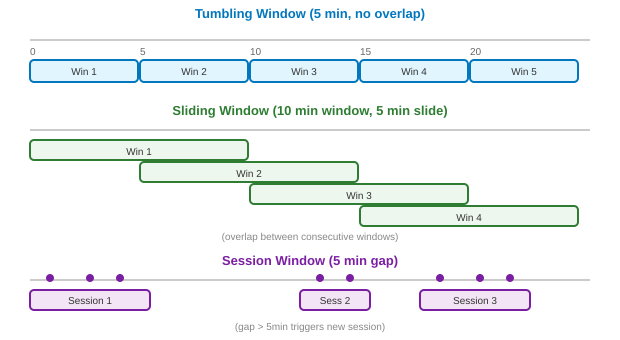

---

## Full Program: Stream-Stream Join with Watermarks

```python
from pyspark.sql import SparkSession
from pyspark.sql import functions as F
from pyspark.sql.types import *

spark = SparkSession.builder \
    .appName("StreamStreamJoin") \
    .getOrCreate()

# Stream 1: Ad impressions
impressions_schema = StructType([
    StructField("impression_id", StringType()),
    StructField("ad_id", StringType()),
    StructField("user_id", StringType()),
    StructField("impression_time", TimestampType()),
])

impressions = (
    spark.readStream
    .format("kafka")
    .option("kafka.bootstrap.servers", "kafka:9092")
    .option("subscribe", "ad_impressions")
    .load()
    .select(F.from_json(F.col("value").cast("string"),
            impressions_schema).alias("d"))
    .select("d.*")
    .withWatermark("impression_time", "2 hours")
)

# Stream 2: Ad clicks
clicks_schema = StructType([
    StructField("click_id", StringType()),
    StructField("impression_id", StringType()),
    StructField("click_time", TimestampType()),
])

clicks = (
    spark.readStream
    .format("kafka")
    .option("kafka.bootstrap.servers", "kafka:9092")
    .option("subscribe", "ad_clicks")
    .load()
    .select(F.from_json(F.col("value").cast("string"),
            clicks_schema).alias("d"))
    .select("d.*")
    .withWatermark("click_time", "3 hours")
)

# Stream-stream join with time constraint
# Click must happen within 1 hour of impression
joined = impressions.join(
    clicks,
    F.expr("""
        impressions.impression_id = clicks.impression_id AND
        click_time >= impression_time AND
        click_time <= impression_time + interval 1 hour
    """),
    "leftOuter"
)

# Compute click-through rate per ad
ctr_stats = (
    joined
    .groupBy(
        F.window("impression_time", "15 minutes"),
        "ad_id"
    )
    .agg(
        F.count("impression_id").alias("impressions"),
        F.count("click_id").alias("clicks"),
        (F.count("click_id") / F.count("impression_id") * 100)
            .alias("ctr_pct"),
    )
)

query = (
    ctr_stats
    .writeStream
    .outputMode("update")
    .format("delta")
    .option("checkpointLocation", "/checkpoints/ad_ctr/")
    .trigger(processingTime="1 minute")
    .start("/data/delta/ad_ctr_stats/")
)
```

---

## Stream-Stream Join: State Management


---

## Full Program: Stateful Processing with mapGroupsWithState

```python
from pyspark.sql import SparkSession
from pyspark.sql import functions as F
from pyspark.sql.types import *
from pyspark.sql.streaming import GroupState

spark = SparkSession.builder \
    .appName("StatefulProcessing") \
    .getOrCreate()

# Define state schema for user session tracking
session_schema = StructType([
    StructField("user_id", StringType()),
    StructField("session_start", TimestampType()),
    StructField("session_end", TimestampType()),
    StructField("event_count", IntegerType()),
    StructField("page_views", IntegerType()),
    StructField("total_duration_sec", LongType()),
])

# Using flatMapGroupsWithState for custom session detection
def update_session_state(key, events, state):
    """Custom session tracking with 30-minute timeout."""
    import datetime

    user_id = key[0]
    session_timeout = datetime.timedelta(minutes=30)

    # Get current state or initialize
    if state.exists:
        current = state.get
        session_start = current["session_start"]
        last_event_time = current["session_end"]
        event_count = current["event_count"]
        page_views = current["page_views"]
    else:
        session_start = None
        last_event_time = None
        event_count = 0
        page_views = 0

    sessions_to_output = []

    for event in events:
        event_time = event["event_time"]

        if session_start is None:
            # Start new session
            session_start = event_time
            last_event_time = event_time
            event_count = 1
            page_views = 1 if event["event_type"] == "page_view" else 0
        elif event_time - last_event_time > session_timeout:
            # Session expired, output completed session
            duration = int(
                (last_event_time - session_start).total_seconds()
            )
            sessions_to_output.append({
                "user_id": user_id,
                "session_start": session_start,
                "session_end": last_event_time,
                "event_count": event_count,
                "page_views": page_views,
                "total_duration_sec": duration,
            })
            # Start new session
            session_start = event_time
            last_event_time = event_time
            event_count = 1
            page_views = 1 if event["event_type"] == "page_view" else 0
        else:
            # Continue session
            last_event_time = event_time
            event_count += 1
            if event["event_type"] == "page_view":
                page_views += 1

    # Update state
    state.update({
        "session_start": session_start,
        "session_end": last_event_time,
        "event_count": event_count,
        "page_views": page_views,
    })

    # Set timeout for state expiry
    state.setTimeoutDuration("30 minutes")

    return iter(sessions_to_output)
```

---

## Output Modes Comparison

| Output Mode | Description | Supported Ops | Use Case |
|---|---|---|---|
| Append | New rows only | No aggregations, or watermarked agg | Log shipping |
| Update | Changed rows only | All aggregations | Dashboard metrics |
| Complete | Full result table | Aggregations only | Small result tables |

---

## Streaming Monitoring and Alerting

```python
from pyspark.sql import SparkSession
from pyspark.sql.streaming import StreamingQueryListener
import json

spark = SparkSession.builder \
    .appName("StreamingMonitor") \
    .getOrCreate()

# Custom listener for streaming metrics
class MetricsListener(StreamingQueryListener):
    def onQueryStarted(self, event):
        print(f"Query started: {event.id}")

    def onQueryProgress(self, event):
        progress = event.progress
        metrics = {
            "query_id": str(progress.id),
            "batch_id": progress.batchId,
            "input_rows_per_sec": progress.inputRowsPerSecond,
            "processed_rows_per_sec": progress.processedRowsPerSecond,
            "batch_duration_ms": progress.batchDuration,
            "num_input_rows": progress.numInputRows,
            "state_operators": [
                {
                    "num_rows_total": op.numRowsTotal,
                    "num_rows_updated": op.numRowsUpdated,
                    "memory_used_bytes": op.memoryUsedBytes,
                }
                for op in progress.stateOperators
            ],
        }
        # Send to monitoring system
        print(json.dumps(metrics, indent=2))

        # Alert on slow processing
        if progress.inputRowsPerSecond > 0:
            ratio = (progress.processedRowsPerSecond /
                     progress.inputRowsPerSecond)
            if ratio < 0.8:
                print(f"WARNING: Processing falling behind! "
                      f"Ratio: {ratio:.2f}")

    def onQueryTerminated(self, event):
        print(f"Query terminated: {event.id}")
        if event.exception:
            print(f"  Exception: {event.exception}")

# Register listener
spark.streams.addListener(MetricsListener())

# Programmatic monitoring
for q in spark.streams.active:
    status = q.status
    progress = q.lastProgress
    print(f"Query: {q.name}")
    print(f"  Active: {q.isActive}")
    print(f"  Status: {status}")
    if progress:
        print(f"  Input rate: {progress['inputRowsPerSecond']}")
        print(f"  Process rate: {progress['processedRowsPerSecond']}")
```

---

## Streaming Configuration Tuning

```python
# Core streaming settings
spark.conf.set("spark.sql.streaming.schemaInference", "true")
spark.conf.set("spark.sql.streaming.checkpointLocation", "/checkpoints/")

# Kafka-specific tuning
spark.conf.set("spark.sql.streaming.kafka.maxOffsetsPerTrigger", "100000")
spark.conf.set("spark.sql.streaming.kafka.minOffsetsPerTrigger", "1000")

# State store configuration
spark.conf.set("spark.sql.streaming.stateStore.providerClass",
    "org.apache.spark.sql.execution.streaming.state.RocksDBStateStoreProvider")
spark.conf.set("spark.sql.streaming.stateStore.rocksdb.compactOnCommit",
    "true")

# Memory and performance
spark.conf.set("spark.sql.streaming.metricsEnabled", "true")
spark.conf.set("spark.sql.streaming.numRecentProgressUpdates", "100")

# Graceful shutdown
spark.conf.set("spark.streaming.stopGracefullyOnShutdown", "true")

# Backpressure (DStreams legacy)
spark.conf.set("spark.streaming.backpressure.enabled", "true")
```

---

## Exactly-Once Semantics Flow


---

## Common Streaming Anti-Patterns

| Anti-Pattern | Problem | Solution |
|---|---|---|
| No watermark on join | Unbounded state growth | Set watermark on both streams |
| Complete mode + large state | OOM on driver | Use update or append mode |
| foreachBatch with side effects | Duplicates on retry | Make writes idempotent |
| No checkpoint | Lost progress on restart | Always set checkpointLocation |
| Tiny trigger intervals | High overhead | Use processingTime >= 10s |
| collect() in foreachBatch | Driver OOM | Write directly from DataFrame |
