# Introduction to Microsoft Azure

## What is Azure?
- Microsoft's cloud platform
- Global infrastructure
- Integrated services
- Enterprise scale
- Continuous innovation

---

## Azure History

---

## Global Infrastructure

---

## Azure Regions
- Geographic areas
- Multiple data centers
- Data residency
- Service availability
- Performance optimization

---

## Availability Zones
- Physical separation
- Independent power
- Networking
- Cooling
- High availability

---

## Core Azure Services
1. Compute
1. Storage
1. Networking
1. Databases
1. AI/ML

---

## Service Categories

---

## Management Structure
- Management groups
- Subscriptions
- Resource groups
- Resources
- Organization

---

## Azure Subscriptions
- Billing boundary
- Access control
- Resource limits
- Environment isolation
- Cost management

---

## Resource Groups
- Logical containers
- Resource organization
- Access control
- Policy application
- Lifecycle management

---

## Azure Resource Manager
- Deployment control
- Access management
- Resource organization
- Template-based deployment
- Consistent management

---

## Identity Services
- Azure Active Directory
- Single sign-on
- Multi-factor auth
- Conditional access
- Identity protection

---

## Security Features
- Network security
- Data protection
- Identity management
- Threat protection
- Compliance tools

---

## Monitoring Tools
- Azure Monitor
- Application Insights
- Log Analytics
- Alerts
- Dashboards

---

## Cost Management
- Pricing calculator
- Cost analysis
- Budgets
- Recommendations
- Optimization

---

## Support Options
- Basic
- Developer
- Standard
- Professional
- Premier

---

## Azure Service Levels
- Free services
- Basic services
- Standard services
- Premium services
- Custom solutions

---

## Compliance Standards
- Industry compliance
- Regional standards
- Security certifications
- Audit reports
- Documentation

---

## Azure Marketplace
- Pre-built solutions
- Third-party services
- Templates
- Consulting services
- Integration tools

---

## Development Tools
- Visual Studio
- VS Code
- SDKs
- Azure DevOps
- GitHub integration

---

## Azure CLI and PowerShell
- Command-line tools
- Automation
- Scripting
- Resource management
- Configuration

---

## Integration Services
- Logic Apps
- Service Bus
- Event Grid
- API Management
- Functions

---

## Azure Solutions
- Web applications
- Mobile backends
- IoT solutions
- AI/ML services
- Analytics platforms

---

## Industry Solutions
- Healthcare
- Financial services
- Manufacturing
- Retail
- Government

---

## Partner Ecosystem
- Solution providers
- Managed services
- System integrators
- Training partners
- Consultants

---

## Getting Started
- Free account
- Learning resources
- Documentation
- Training paths
- Certifications

---

## Best Practices
- Architecture design
- Security implementation
- Cost optimization
- Performance tuning
- Operational excellence

---

## Future Roadmap
- Service evolution
- New features
- Industry focus
- Innovation areas
- Strategic direction

---

## Success Stories
- Enterprise adoption
- Digital transformation
- Innovation examples
- Business outcomes
- Learning lessons

---

## Next Steps
- Account creation
- Service exploration
- Skills development
- Implementation planning
- Resource allocation
