# Next Steps and Azure Certifications

## Azure Learning Path

---

## Certification Paths

---

## Azure Fundamentals
- AZ-900 certification
- Cloud concepts
- Core services
- Security and privacy
- Pricing and support

---

## Administrator Path
- AZ-104 certification
- Managing subscriptions
- Implementing resources
- Configuring services
- Monitoring solutions

---

## Developer Path
- AZ-204 certification
- Azure solutions
- Azure storage
- Security implementation
- Monitoring and logging

---

## Solutions Architect
- AZ-305 certification
- Design solutions
- Implementation planning
- Architecture patterns
- Best practices

---

## Exam Preparation
1. Official documentation
1. Practice tests
1. Hands-on labs
1. Study groups
1. Online courses

---

## Learning Resources
- Microsoft Learn
- Documentation
- Azure Friday
- Community content
- Training partners

---

## Microsoft Learn
- Free learning platform
- Structured paths
- Interactive modules
- Knowledge checks
- Hands-on exercises

---

## Documentation Resources
- Reference materials
- Best practices
- Architecture guides
- Sample solutions
- Code examples

---

## Community Resources
- Azure blog
- Tech community
- GitHub repositories
- Forums
- User groups

---

## Hands-on Practice
- Free account
- Sandbox environments
- Labs
- Personal projects
- Proof of concepts

---

## Azure Architecture Center

---

## Azure Updates
- Service announcements
- New features
- Preview offerings
- Regional availability
- Roadmap

---

## Azure Partner Network
- Training programs
- Certifications
- Resources
- Support
- Benefits

---

## Professional Development
- Skill assessment
- Learning plans
- Career paths
- Specializations
- Continuous learning

---

## Building Experience
- Practice exercises
- Real-world scenarios
- Project work
- Troubleshooting
- Documentation

---

## Specialty Areas
- IoT
- AI/ML
- Security
- DevOps
- Data solutions

---

## Advanced Topics
- Microservices
- Containerization
- Serverless
- Edge computing
- Hybrid solutions

---

## Career Progression
- Role advancement
- Specialization
- Leadership
- Architecture
- Consulting

---

## Continuing Education
- New services
- Updates
- Best practices
- Industry trends
- Technologies

---

## Cloud Skills Gap
- Market demand
- Required skills
- Opportunities
- Career paths
- Training needs

---

## Industry Recognition
- Certifications
- Achievements
- Portfolio
- Experience
- Expertise

---

## Building Solutions
- Architecture
- Implementation
- Management
- Operations
- Optimization

---

## Project Experience
- Planning
- Execution
- Monitoring
- Maintenance
- Documentation

---

## Best Practices Review
- Architecture
- Security
- Performance
- Cost optimization
- Operations

---

## Community Engagement
- Meetups
- Conferences
- Online forums
- Social media
- Networking

---

## Knowledge Sharing
- Documentation
- Presentations
- Mentoring
- Blogging
- Speaking

---

## Future Trends
- Emerging technologies
- Industry direction
- Skills evolution
- Career opportunities
- Learning paths

---

## Success Strategies
- Continuous learning
- Practical experience
- Certification goals
- Community involvement
- Career planning

---

## Next Actions
- Set goals
- Create timeline
- Choose path
- Start learning
- Get certified
