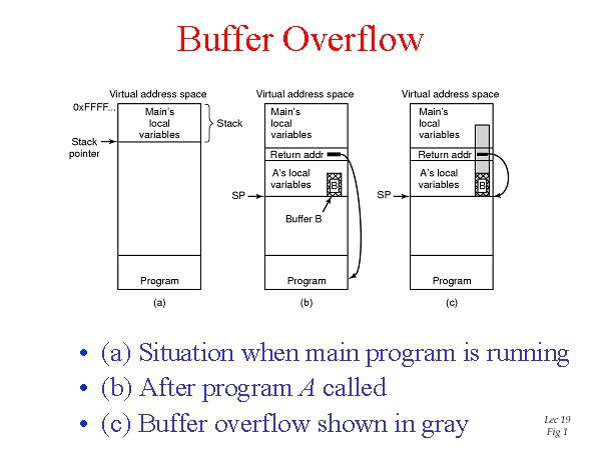

# Buffer Overflows in C
---
## What is a Buffer Overflow?
- Occurs when a program tries to write data beyond the bounds of a buffer
- Can overwrite adjacent memory locations
- Allows an attacker to gain control of the program flow
---
## How Buffer Overflows Happen
- Common coding mistakes:
    - Using insecure functions (e.g. `strcpy`, `strcat`, `sprintf`)
    - Off-by-one errors
    - Inadequate bounds checking
---
## Diagram

---
## Consequences
- Execution of malicious code
- Privilege escalation
- Denial of service
- Information leaks
---
## Defending Against Buffer Overflows
- Use safe functions (`strncpy`, `strncat`) with bounds checking
- Enable compiler warnings and address sanitizers
- Perform input validation and sanitization
- Avoid using unsafe C functions
- Implement DEP, ASLR, stack canaries
---
## Mitigation Techniques
- Data Execution Prevention (DEP)
    - Marks memory regions as non-executable
- Address Space Layout Randomization (ASLR)
    - Randomizes memory layout of processes
- Stack Canaries
    - Detects stack buffer overflows
    - Value is placed before return address on stack
---
## Other Best Practices

- Keep software up-to-date
- Apply principle of least privilege
- Conduct security code reviews
- Use safe alternatives (e.g. rust, memory-safe languages)
