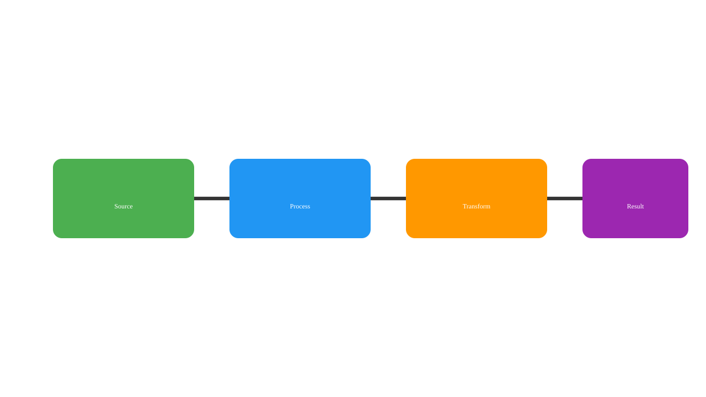

# Elasticsearch Query Language (ES|QL)

## Structured Query Language for Elasticsearch

---

## What is ES|QL?

A new piped query language that:
1. Processes data with sequential commands
1. Combines search and analytics
1. Simplifies complex operations
1. Provides SQL-like familiarity

---

## ES|QL vs Query DSL



---

## When to Use ES|QL

Best for:
1. Data exploration and analysis
1. Complex transformations
1. Time series analysis
1. Cross-index queries
1. Ad-hoc investigations

---

## ES|QL Architecture



---

## Basic ES|QL Query

```esql
POST /_query
{
  "query": """
    FROM products
    | WHERE price > 100
    | LIMIT 10
  """
}
```

---

## Piped Syntax

Each command processes previous output:

```esql
FROM source
| command1
| command2
| command3
```

---

## Case Sensitivity

1. Commands: Case-insensitive (`FROM` = `from`)
1. Field names: Case-sensitive
1. Functions: Case-insensitive
1. String values: Case-sensitive

---

## Comments

```esql
FROM products
// This is a single-line comment
| WHERE price > 100
/* This is a
   multi-line comment */
| LIMIT 10
```

---

## Output Formats

```esql
POST /_query?format=txt
{
  "query": "FROM products | LIMIT 5"
}
```

Formats: `json`, `txt`, `csv`, `tsv`, `yaml`

---

## FROM Command

```esql
FROM products
```

Or multiple indices:

```esql
FROM products, orders, customers
```

---

## Index Patterns

```esql
FROM logs-*

FROM logs-2024.*

FROM .kibana*,products
```

Wildcards supported

---

## Metadata Fields

```esql
FROM products METADATA _id, _index, _version
| KEEP _id, name, price
```

Access document metadata

---

## ROW Command

Create inline data:

```esql
ROW name = "Laptop", price = 999.99
| EVAL tax = price * 0.1
```

---

## SHOW Command

```esql
SHOW INFO

SHOW FUNCTIONS
```

Display system information

---

## WHERE Filtering

```esql
FROM products
| WHERE price > 100 AND category == "electronics"
```

Boolean operators: `AND`, `OR`, `NOT`

---

## Comparison Operators

```esql
FROM products
| WHERE price >= 100
  AND quantity != 0
  AND name LIKE "Laptop*"
```

Operators: `==`, `!=`, `>`, `>=`, `<`, `<=`, `LIKE`

---

## EVAL Expressions

```esql
FROM products
| EVAL discounted_price = price * 0.9
| EVAL profit_margin = (price - cost) / price * 100
```

Create calculated fields

---

## String Functions

```esql
FROM products
| EVAL upper_name = UPPER(name)
| EVAL name_length = LENGTH(name)
| EVAL category_substr = SUBSTRING(category, 0, 3)
```

---

## Mathematical Functions

```esql
FROM products
| EVAL sqrt_price = SQRT(price)
| EVAL rounded = ROUND(price, 2)
| EVAL absolute = ABS(profit)
```

---

## Date Functions

```esql
FROM orders
| EVAL year = DATE_EXTRACT("year", order_date)
| EVAL formatted = DATE_FORMAT(order_date, "yyyy-MM-dd")
| EVAL days_ago = DATE_DIFF("day", order_date, NOW())
```

---

## DISSECT Pattern Extraction

```esql
FROM logs
| DISSECT message "%{ip} - - [%{timestamp}] \"%{method} %{path}\""
| KEEP ip, method, path
```

Fixed delimiter parsing

---

## GROK Pattern Matching

```esql
FROM logs
| GROK message "%{IP:client_ip} %{WORD:method} %{URIPATH:path}"
| WHERE method == "POST"
```

Regex-based extraction

---

## ENRICH Data

```esql
FROM orders
| ENRICH customer_lookup ON customer_id
| KEEP order_id, customer_name, total
```

Join with lookup data

---

## RENAME Fields

```esql
FROM products
| RENAME product_name AS name,
         product_price AS price
```

---

## DROP Fields

```esql
FROM products
| DROP internal_id, debug_info, temp_field
```

Remove unwanted fields

---

## KEEP Fields

```esql
FROM products
| KEEP name, price, category
```

Select specific fields only

---

## SORT Operations

```esql
FROM products
| SORT price DESC, name ASC
```

Multi-field sorting

---

## LIMIT Results

```esql
FROM products
| WHERE category == "electronics"
| SORT price DESC
| LIMIT 10
```

---

## STATS Aggregations

```esql
FROM orders
| STATS total_revenue = SUM(amount),
        order_count = COUNT(*)
```

---

## STATS BY Grouping

```esql
FROM orders
| STATS revenue = SUM(amount),
        orders = COUNT(*)
  BY category
```

---

## Aggregation Functions

```esql
FROM products
| STATS avg_price = AVG(price),
        max_price = MAX(price),
        min_price = MIN(price),
        total = COUNT(*),
        unique_brands = COUNT_DISTINCT(brand)
```

---

## Percentile Calculations

```esql
FROM response_times
| STATS p50 = PERCENTILE(duration, 50),
        p95 = PERCENTILE(duration, 95),
        p99 = PERCENTILE(duration, 99)
```

---

## Conditional Logic

```esql
FROM products
| EVAL price_category = CASE(
    price < 50, "budget",
    price < 200, "mid-range",
    "premium"
  )
```

---

## Multi-value Fields

```esql
FROM products
| WHERE "electronics" IN categories
| EVAL category_count = MV_COUNT(categories)
```

---

## Complex Example

```esql
FROM orders
| WHERE order_date >= "2024-01-01"
| EVAL month = DATE_FORMAT(order_date, "yyyy-MM")
| STATS revenue = SUM(amount),
        orders = COUNT(*),
        avg_order = AVG(amount)
  BY month, category
| SORT month ASC, revenue DESC
| LIMIT 100
```

---

## Performance Tips

1. Filter early with WHERE
1. Drop unnecessary fields
1. Use appropriate data types
1. Limit result sets
1. Monitor query execution time

---

## ES|QL Best Practices

1. Start simple, add complexity
1. Use comments for clarity
1. Test with small datasets
1. Profile query performance
1. Consider memory usage

---

## Migration from SQL

SQL:
```sql
SELECT category, SUM(price)
FROM products
WHERE active = true
GROUP BY category
```

`ES|QL`:
```esql
FROM products
| WHERE active == true
| STATS total = SUM(price) BY category
```
