# Aggregations

## Analytics and Data Summarization

---

## What are Aggregations?

Powerful analytics framework that:
1. Summarizes data as metrics
1. Groups data into buckets
1. Performs complex calculations
1. Builds analytics dashboards

---

## Aggregation Types


---

## Basic Aggregation Structure

```json
GET /sales/_search
{
  "size": 0,
  "aggs": {
    "total_sales": {
      "sum": {
        "field": "amount"
      }
    }
  }
}
```

---

## Metrics Aggregations

Simple calculations on field values:
1. `sum`, `avg`, `min`, `max`
1. `stats`, `extended_stats`
1. `cardinality`
1. `percentiles`
1. `value_count`

---

## Sum Aggregation

```json
{
  "aggs": {
    "total_revenue": {
      "sum": {
        "field": "price"
      }
    }
  }
}
```

Total of all values

---

## Average Aggregation

```json
{
  "aggs": {
    "average_price": {
      "avg": {
        "field": "price"
      }
    }
  }
}
```

Mean value calculation

---

## Min and Max

```json
{
  "aggs": {
    "cheapest": {
      "min": {
        "field": "price"
      }
    },
    "most_expensive": {
      "max": {
        "field": "price"
      }
    }
  }
}
```

---

## Stats Aggregation

```json
{
  "aggs": {
    "price_stats": {
      "stats": {
        "field": "price"
      }
    }
  }
}
```

Returns: `count`, `min`, `max`, `avg`, `sum`

---

## Extended Stats

```json
{
  "aggs": {
    "price_analysis": {
      "extended_stats": {
        "field": "price"
      }
    }
  }
}
```

Adds: `variance`, `std_deviation`, `sum_of_squares`

---

## Cardinality

```json
{
  "aggs": {
    "unique_customers": {
      "cardinality": {
        "field": "customer_id"
      }
    }
  }
}
```

Approximate distinct count

---

## Value Count

```json
{
  "aggs": {
    "product_count": {
      "value_count": {
        "field": "product_id"
      }
    }
  }
}
```

Count non-null values

---

## Percentiles

```json
{
  "aggs": {
    "price_percentiles": {
      "percentiles": {
        "field": "response_time",
        "percents": [50, 95, 99]
      }
    }
  }
}
```

---

## Percentile Ranks

```json
{
  "aggs": {
    "price_ranks": {
      "percentile_ranks": {
        "field": "price",
        "values": [100, 200]
      }
    }
  }
}
```

What percentile are these values?

---

## Top Hits

```json
{
  "aggs": {
    "top_products": {
      "top_hits": {
        "size": 3,
        "sort": [{"price": "desc"}]
      }
    }
  }
}
```

Sample documents from bucket

---

## Bucket Aggregations

Group documents into buckets:
1. `terms`
1. `range`, `date_range`
1. `histogram`, `date_histogram`
1. `filters`
1. `nested`

---

## Terms Aggregation

```json
{
  "aggs": {
    "categories": {
      "terms": {
        "field": "category.keyword",
        "size": 10
      }
    }
  }
}
```

Group by field values

---

## Terms with Sub-aggregations

```json
{
  "aggs": {
    "categories": {
      "terms": {
        "field": "category.keyword"
      },
      "aggs": {
        "avg_price": {
          "avg": {
            "field": "price"
          }
        }
      }
    }
  }
}
```

---

## Range Aggregation

```json
{
  "aggs": {
    "price_ranges": {
      "range": {
        "field": "price",
        "ranges": [
          {"to": 50},
          {"from": 50, "to": 200},
          {"from": 200}
        ]
      }
    }
  }
}
```

---

## Date Range

```json
{
  "aggs": {
    "date_ranges": {
      "date_range": {
        "field": "created_at",
        "ranges": [
          {"to": "now-1M"},
          {"from": "now-1M", "to": "now"},
          {"from": "now"}
        ]
      }
    }
  }
}
```

---

## Histogram

```json
{
  "aggs": {
    "price_distribution": {
      "histogram": {
        "field": "price",
        "interval": 50
      }
    }
  }
}
```

Fixed-size buckets

---

## Date Histogram

```json
{
  "aggs": {
    "sales_over_time": {
      "date_histogram": {
        "field": "date",
        "calendar_interval": "month"
      }
    }
  }
}
```

Time-based buckets

---

## Auto Date Histogram

```json
{
  "aggs": {
    "auto_sales": {
      "auto_date_histogram": {
        "field": "date",
        "buckets": 10
      }
    }
  }
}
```

Automatic interval selection

---

## Filters Aggregation

```json
{
  "aggs": {
    "product_types": {
      "filters": {
        "filters": {
          "electronics": {"term": {"category": "electronics"}},
          "books": {"term": {"category": "books"}}
        }
      }
    }
  }
}
```

---

## Nested Aggregation

```json
{
  "aggs": {
    "reviews": {
      "nested": {
        "path": "reviews"
      },
      "aggs": {
        "avg_rating": {
          "avg": {
            "field": "reviews.rating"
          }
        }
      }
    }
  }
}
```

---

## Global Aggregation

```json
{
  "query": {
    "term": {"category": "electronics"}
  },
  "aggs": {
    "all_products": {
      "global": {},
      "aggs": {
        "total": {"value_count": {"field": "product_id"}}
      }
    }
  }
}
```

Ignore query context

---

## Significant Terms

```json
{
  "aggs": {
    "significant_brands": {
      "significant_terms": {
        "field": "brand.keyword"
      }
    }
  }
}
```

Find statistical anomalies

---

## Pipeline Aggregations

Process aggregation results:
1. `avg_bucket`
1. `sum_bucket`
1. `max_bucket`
1. `min_bucket`
1. `derivative`

---

## Avg Bucket

```json
{
  "aggs": {
    "sales_per_month": {
      "date_histogram": {
        "field": "date",
        "calendar_interval": "month"
      },
      "aggs": {
        "revenue": {"sum": {"field": "amount"}}
      }
    },
    "avg_monthly_sales": {
      "avg_bucket": {
        "buckets_path": "sales_per_month>revenue"
      }
    }
  }
}
```

---

## Derivative

```json
{
  "aggs": {
    "sales_per_day": {
      "date_histogram": {
        "field": "date",
        "calendar_interval": "day"
      },
      "aggs": {
        "revenue": {"sum": {"field": "amount"}},
        "revenue_derivative": {
          "derivative": {
            "buckets_path": "revenue"
          }
        }
      }
    }
  }
}
```

---

## Moving Average

```json
{
  "aggs": {
    "the_movavg": {
      "moving_avg": {
        "buckets_path": "sales_per_day>revenue",
        "window": 7,
        "model": "simple"
      }
    }
  }
}
```

---

## Cumulative Sum

```json
{
  "aggs": {
    "cumulative_sales": {
      "cumulative_sum": {
        "buckets_path": "sales_per_day>revenue"
      }
    }
  }
}
```

Running total

---

## Complex Aggregation Example

```json
{
  "aggs": {
    "categories": {
      "terms": {"field": "category"},
      "aggs": {
        "brands": {
          "terms": {"field": "brand"},
          "aggs": {
            "avg_price": {"avg": {"field": "price"}},
            "total_sold": {"sum": {"field": "quantity"}}
          }
        }
      }
    }
  }
}
```

---

## Aggregation Performance



---

## Optimization Tips

1. Use `size: 0` if only need aggregations
1. Limit terms aggregation size
1. Use `doc_values` for aggregation fields
1. Filter before aggregating
1. Consider sampling for large datasets

---

## Aggregation Accuracy

```json
{
  "aggs": {
    "products": {
      "terms": {
        "field": "product_id",
        "size": 10,
        "shard_size": 100
      }
    }
  }
}
```

Balance accuracy vs performance

---

## Missing Values

```json
{
  "aggs": {
    "missing_prices": {
      "missing": {
        "field": "price"
      }
    }
  }
}
```

Count documents without field

---

## Scripted Aggregations

```json
{
  "aggs": {
    "total_with_tax": {
      "sum": {
        "script": {
          "source": "doc['price'].value * 1.2"
        }
      }
    }
  }
}
```

---

## Common Patterns

1. **Time series**: Date histogram + metrics
1. **Faceted search**: Terms + filters
1. **Statistical analysis**: Extended stats + percentiles
1. **Trend analysis**: Derivative + moving average
