# Geospatial Search

## Location-Based Search and Analytics

---

## Geospatial Features

Elasticsearch supports:
1. Point locations (lat/lon)
1. Shapes (polygons, lines)
1. Distance calculations
1. Spatial relationships
1. Geo aggregations

---

## Geo Data Types


---

## Geo Point Mapping

```json
PUT /stores
{
  "mappings": {
    "properties": {
      "location": {
        "type": "geo_point"
      }
    }
  }
}
```

---

## Geo Point Formats

```json
// Object format
{"location": {"lat": 40.7128, "lon": -74.0060}}

// String format
{"location": "40.7128,-74.0060"}

// Geohash
{"location": "dr5r7p"}

// Array format [lon, lat] - GeoJSON
{"location": [-74.0060, 40.7128]}
```

---

## Geo Shape Mapping

```json
PUT /regions
{
  "mappings": {
    "properties": {
      "boundary": {
        "type": "geo_shape"
      }
    }
  }
}
```

---

## Geo Shape Types

1. **point**: Single location
1. **linestring**: Connected points
1. **polygon**: Closed area
1. **multipoint**: Multiple points
1. **multipolygon**: Multiple areas
1. **envelope**: Bounding box

---

## Index Geo Shape

```json
PUT /regions/_doc/1
{
  "name": "Central Park",
  "boundary": {
    "type": "polygon",
    "coordinates": [[
      [-73.981, 40.768],
      [-73.958, 40.768],
      [-73.958, 40.800],
      [-73.981, 40.800],
      [-73.981, 40.768]
    ]]
  }
}
```

---

## Shape Field Type

```json
{
  "mappings": {
    "properties": {
      "geometry": {
        "type": "shape"
      }
    }
  }
}
```

For Cartesian coordinates

---

## Geo Distance Query

```json
{
  "query": {
    "geo_distance": {
      "distance": "10km",
      "location": {
        "lat": 40.7128,
        "lon": -74.0060
      }
    }
  }
}
```

Find within radius

---

## Distance Units

Available units:
1. `mi` or `miles`
1. `km` or `kilometers`
1. `m` or `meters`
1. `cm` or `centimeters`
1. `mm` or `millimeters`

---

## Geo Bounding Box

```json
{
  "query": {
    "geo_bounding_box": {
      "location": {
        "top_left": {
          "lat": 40.8,
          "lon": -74.1
        },
        "bottom_right": {
          "lat": 40.7,
          "lon": -73.9
        }
      }
    }
  }
}
```

---

## Alternative Bounding Box

```json
{
  "query": {
    "geo_bounding_box": {
      "location": {
        "top": 40.8,
        "left": -74.1,
        "bottom": 40.7,
        "right": -73.9
      }
    }
  }
}
```

---

## Geo Polygon Query

```json
{
  "query": {
    "geo_polygon": {
      "location": {
        "points": [
          {"lat": 40.7, "lon": -74.0},
          {"lat": 40.7, "lon": -73.9},
          {"lat": 40.8, "lon": -73.9},
          {"lat": 40.8, "lon": -74.0}
        ]
      }
    }
  }
}
```

---

## Geo Shape Query

```json
{
  "query": {
    "geo_shape": {
      "boundary": {
        "shape": {
          "type": "circle",
          "coordinates": [-74.0060, 40.7128],
          "radius": "5km"
        },
        "relation": "intersects"
      }
    }
  }
}
```

---

## Spatial Relations

1. **intersects**: Default, overlaps
1. **disjoint**: No overlap
1. **within**: Completely inside
1. **contains**: Completely contains

---

## Pre-indexed Shape

```json
{
  "query": {
    "geo_shape": {
      "location": {
        "indexed_shape": {
          "index": "shapes",
          "id": "manhattan"
        }
      }
    }
  }
}
```

Reference stored shapes

---

## Geo Distance Sorting

```json
{
  "sort": [
    {
      "_geo_distance": {
        "location": {
          "lat": 40.7128,
          "lon": -74.0060
        },
        "order": "asc",
        "unit": "km"
      }
    }
  ]
}
```

---

## Multiple Reference Points

```json
{
  "sort": [
    {
      "_geo_distance": {
        "location": [
          {"lat": 40.7, "lon": -74.0},
          {"lat": 40.8, "lon": -73.9}
        ],
        "order": "asc"
      }
    }
  ]
}
```

Uses nearest point

---

## Geo Distance Aggregation

```json
{
  "aggs": {
    "distance_ranges": {
      "geo_distance": {
        "field": "location",
        "origin": {"lat": 40.7, "lon": -74.0},
        "unit": "km",
        "ranges": [
          {"to": 10},
          {"from": 10, "to": 50},
          {"from": 50}
        ]
      }
    }
  }
}
```

---

## Geohash Grid Aggregation

```json
{
  "aggs": {
    "locations": {
      "geohash_grid": {
        "field": "location",
        "precision": 5
      }
    }
  }
}
```

Cluster by geohash cells

---

## Geotile Grid Aggregation

```json
{
  "aggs": {
    "large_grid": {
      "geotile_grid": {
        "field": "location",
        "precision": 8
      }
    }
  }
}
```

Map tile clustering

---

## Geo Bounds Aggregation

```json
{
  "aggs": {
    "viewport": {
      "geo_bounds": {
        "field": "location",
        "wrap_longitude": true
      }
    }
  }
}
```

Find bounding box of results

---

## Geo Centroid Aggregation

```json
{
  "aggs": {
    "center_point": {
      "geo_centroid": {
        "field": "location"
      }
    }
  }
}
```

Calculate center point

---

## Geo Line Aggregation

```json
{
  "aggs": {
    "route": {
      "geo_line": {
        "point": {"field": "location"},
        "sort": {"field": "timestamp"}
      }
    }
  }
}
```

Connect points in order

---

## Store Locator Pattern

```json
{
  "query": {
    "bool": {
      "filter": [
        {"term": {"type": "store"}},
        {"term": {"status": "open"}}
      ],
      "must": {
        "geo_distance": {
          "distance": "25km",
          "location": {
            "lat": 40.7128,
            "lon": -74.0060
          }
        }
      }
    }
  },
  "sort": [{"_geo_distance": {"location": {...}}}]
}
```

---

## Radius Search with Count

```json
{
  "size": 0,
  "query": {
    "geo_distance": {
      "distance": "5km",
      "location": {"lat": 40.7, "lon": -74.0}
    }
  },
  "aggs": {
    "store_count": {
      "value_count": {"field": "store_id"}
    }
  }
}
```

---

## Region-based Search

```json
{
  "query": {
    "bool": {
      "filter": {
        "geo_shape": {
          "service_area": {
            "shape": {
              "type": "point",
              "coordinates": [-74.0, 40.7]
            },
            "relation": "contains"
          }
        }
      }
    }
  }
}
```

---

## Route Search

```json
{
  "query": {
    "geo_shape": {
      "coverage": {
        "shape": {
          "type": "linestring",
          "coordinates": [
            [-74.0, 40.7],
            [-73.9, 40.8],
            [-73.8, 40.9]
          ]
        },
        "relation": "intersects"
      }
    }
  }
}
```

---

## Perimeter Search

```json
{
  "query": {
    "geo_shape": {
      "location": {
        "shape": {
          "type": "envelope",
          "coordinates": [
            [-74.1, 40.8],
            [-73.9, 40.7]
          ]
        }
      }
    }
  }
}
```

---

## Distance Calculation Script

```json
{
  "script_fields": {
    "distance": {
      "script": {
        "source": "doc['location'].arcDistance(params.lat, params.lon)",
        "params": {
          "lat": 40.7128,
          "lon": -74.0060
        }
      }
    }
  }
}
```

---

## Geo Performance Tips

1. Use bounding box before distance
1. Index shapes for repeated use
1. Choose appropriate precision
1. Consider geohash for clustering
1. Use filters for yes/no queries

---

## Precision Trade-offs



---

## Common Geo Patterns

1. **Find nearest**: Distance query + sort
1. **Within area**: Bounding box or polygon
1. **Service coverage**: Shape contains point
1. **Route planning**: Line intersections
1. **Clustering**: Geohash aggregations

---

## Coordinate Systems

1. **WGS84**: Default, GPS coordinates
1. **Cartesian**: Flat plane coordinates
1. Always use `[lon, lat]` for arrays
1. Use `lat, lon` for objects

---

## Error Handling

```json
{
  "mappings": {
    "properties": {
      "location": {
        "type": "geo_point",
        "ignore_malformed": true,
        "ignore_z_value": true
      }
    }
  }
}
```

---

## Testing Geo Queries

1. Use Kibana Maps for visualization
1. Test edge cases (poles, date line)
1. Verify distance calculations
1. Check boundary conditions
1. Test with real-world data

---

## Next Steps

1. Performance Optimization
1. Query profiling
1. Indexing strategies
1. Caching patterns
