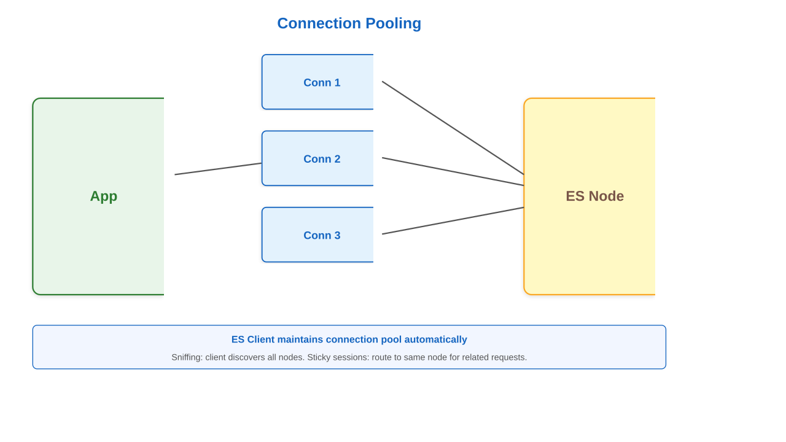

# Client Libraries and Integration

## Connecting Applications to Elasticsearch

---

## Official Client Libraries


---

## Java Client Setup

```xml
<dependency>
    <groupId>co.elastic.clients</groupId>
    <artifactId>elasticsearch-java</artifactId>
    <version>8.11.0</version>
</dependency>
```

Or with Gradle:
```groovy
implementation 'co.elastic.clients:elasticsearch-java:8.11.0'
```

---

## Java Client Connection

```java
RestClient restClient = RestClient.builder(
    new HttpHost("localhost", 9200, "https"))
    .setHttpClientConfigCallback(httpClientBuilder ->
        httpClientBuilder.setSSLContext(sslContext))
    .build();

ElasticsearchClient client = new ElasticsearchClient(
    new RestClientTransport(restClient,
        new JacksonJsonpMapper()));
```

---

## Java Index Document

```java
Product product = new Product("1", "Laptop", 999.99);

IndexResponse response = client.index(i -> i
    .index("products")
    .id(product.getId())
    .document(product)
);

System.out.println("Indexed: " + response.result());
```

---

## Java Search Query

```java
SearchResponse<Product> response = client.search(s -> s
    .index("products")
    .query(q -> q
        .match(m -> m
            .field("name")
            .query("laptop")
        )
    ),
    Product.class
);

List<Hit<Product>> hits = response.hits().hits();
```

---

## Python Client Setup

```bash
pip install elasticsearch

# With async support
pip install elasticsearch[async]
```

---

## Python Connection

```python
from elasticsearch import Elasticsearch

# Basic connection
es = Elasticsearch(
    "https://localhost:9200",
    ca_certs="/path/to/ca.crt",
    basic_auth=("elastic", "password")
)

# Cloud connection
es = Elasticsearch(
    cloud_id="deployment-name:dXMt...",
    api_key="encoded_api_key"
)
```

---

## Python Index Document

```python
doc = {
    "name": "Laptop",
    "price": 999.99,
    "timestamp": datetime.now()
}

response = es.index(
    index="products",
    id="1",
    document=doc
)

print(f"Indexed: {response['result']}")
```

---

## Python Search Query

```python
query = {
    "match": {
        "name": "laptop"
    }
}

response = es.search(
    index="products",
    query=query,
    size=10
)

for hit in response["hits"]["hits"]:
    print(hit["_source"])
```

---

## Python Bulk Operations

```python
from elasticsearch.helpers import bulk

actions = [
    {
        "_index": "products",
        "_id": str(i),
        "_source": {
            "name": f"Product {i}",
            "price": 10.0 * i
        }
    }
    for i in range(1000)
]

success, failed = bulk(es, actions)
```

---

## Node.js Client Setup

```bash
npm install @elastic/elasticsearch
```

---

## Node.js Connection

```javascript
const { Client } = require('@elastic/elasticsearch');

const client = new Client({
    node: 'https://localhost:9200',
    auth: {
        username: 'elastic',
        password: 'password'
    },
    tls: {
        ca: fs.readFileSync('./ca.crt'),
        rejectUnauthorized: true
    }
});
```

---

## Node.js Async Operations

```javascript
async function indexDocument() {
    const response = await client.index({
        index: 'products',
        id: '1',
        document: {
            name: 'Laptop',
            price: 999.99
        }
    });

    console.log(response);
}

indexDocument().catch(console.error);
```

---

## Node.js Search

```javascript
const response = await client.search({
    index: 'products',
    query: {
        match: {
            name: 'laptop'
        }
    }
});

response.hits.hits.forEach(hit => {
    console.log(hit._source);
});
```

---

## .NET Client Setup

```bash
dotnet add package Elastic.Clients.Elasticsearch
```

---

## .NET Connection

```csharp
var settings = new ElasticsearchClientSettings(
    new Uri("https://localhost:9200"))
    .Authentication(new BasicAuthentication(
        "elastic", "password"))
    .ServerCertificateValidationCallback(
        CertificateValidations.AllowAll);

var client = new ElasticsearchClient(settings);
```

---

## .NET Operations

```csharp
// Index
var product = new Product {
    Name = "Laptop",
    Price = 999.99
};

var response = await client.IndexAsync(
    product, idx => idx.Index("products"));

// Search
var searchResponse = await client.SearchAsync<Product>(s => s
    .Index("products")
    .Query(q => q
        .Match(m => m
            .Field(f => f.Name)
            .Query("laptop"))));
```

---

## Go Client Setup

```bash
go get github.com/elastic/go-elasticsearch/v8
```

---

## Go Connection

```go
import "github.com/elastic/go-elasticsearch/v8"

cfg := elasticsearch.Config{
    Addresses: []string{
        "https://localhost:9200",
    },
    Username: "elastic",
    Password: "password",
}

es, err := elasticsearch.NewClient(cfg)
if err != nil {
    log.Fatalf("Error: %s", err)
}
```

---

## Connection Pooling



---

## Connection Pool Config

```python
# Python
es = Elasticsearch(
    ["host1:9200", "host2:9200", "host3:9200"],
    sniff_on_start=True,
    sniff_on_connection_fail=True,
    sniffer_timeout=60,
    max_retries=3,
    retry_on_timeout=True
)
```

---

## Load Balancing

```javascript
// Node.js
const client = new Client({
    nodes: [
        'https://node1:9200',
        'https://node2:9200',
        'https://node3:9200'
    ],
    requestTimeout: 30000,
    sniffOnStart: true,
    sniffInterval: 60000
});
```

---

## Retry Strategies

```python
from elasticsearch import Elasticsearch
from elasticsearch.exceptions import ConnectionError
import time

def retry_with_backoff(func, max_retries=3):
    for attempt in range(max_retries):
        try:
            return func()
        except ConnectionError as e:
            if attempt == max_retries - 1:
                raise
            time.sleep(2 ** attempt)
```

---

## Circuit Breaker Pattern

```java
public class ESCircuitBreaker {
    private int failureCount = 0;
    private long lastFailureTime = 0;
    private final int threshold = 5;
    private final long timeout = 60000;

    public boolean allowRequest() {
        if (failureCount >= threshold) {
            if (System.currentTimeMillis() -
                lastFailureTime > timeout) {
                reset();
                return true;
            }
            return false;
        }
        return true;
    }
}
```

---

## Error Handling

```python
from elasticsearch import (
    Elasticsearch,
    NotFoundError,
    RequestError,
    ConflictError
)

try:
    response = es.get(index="products", id="1")
except NotFoundError:
    print("Document not found")
except RequestError as e:
    print(f"Bad request: {e.info}")
except ConflictError:
    print("Version conflict")
```

---

## Bulk Error Handling

```python
def process_bulk_errors(response):
    if response['errors']:
        for item in response['items']:
            operation = list(item.keys())[0]
            if 'error' in item[operation]:
                doc_id = item[operation]['_id']
                error = item[operation]['error']
                print(f"Failed {doc_id}: {error['type']}")
```

---

## Version Conflicts

```python
# Optimistic concurrency control
doc = es.get(index="products", id="1")

try:
    es.update(
        index="products",
        id="1",
        body={"doc": {"price": 899}},
        if_seq_no=doc['_seq_no'],
        if_primary_term=doc['_primary_term']
    )
except ConflictError:
    # Retry with fresh version
    pass
```

---

## Repository Pattern

```python
class ProductRepository:
    def __init__(self, es_client):
        self.es = es_client
        self.index = "products"

    def save(self, product):
        return self.es.index(
            index=self.index,
            id=product['id'],
            document=product
        )

    def find_by_id(self, product_id):
        try:
            response = self.es.get(
                index=self.index,
                id=product_id
            )
            return response['_source']
        except NotFoundError:
            return None
```

---

## Search Service Layer

```python
class SearchService:
    def __init__(self, es_client):
        self.es = es_client

    def search_products(self, query, filters=None):
        search_body = {
            "query": {
                "bool": {
                    "must": [{"match": {"name": query}}]
                }
            }
        }

        if filters:
            search_body["query"]["bool"]["filter"] = filters

        return self.es.search(
            index="products",
            body=search_body
        )
```

---

## Caching Strategies

```python
from functools import lru_cache
import hashlib
import json

class CachedSearch:
    def __init__(self, es_client):
        self.es = es_client

    @lru_cache(maxsize=128)
    def search_cached(self, query_hash):
        query = json.loads(query_hash)
        return self.es.search(body=query)

    def search(self, query):
        query_hash = hashlib.md5(
            json.dumps(query, sort_keys=True).encode()
        ).hexdigest()
        return self.search_cached(query_hash)
```

---

## Async Operations

```python
import asyncio
from elasticsearch import AsyncElasticsearch

async def async_bulk_index(docs):
    async with AsyncElasticsearch(
        "https://localhost:9200"
    ) as es:
        tasks = []
        for doc in docs:
            task = es.index(
                index="products",
                document=doc
            )
            tasks.append(task)

        return await asyncio.gather(*tasks)
```

---

## Streaming Results

```python
def stream_results(es, query, index="products"):
    response = es.search(
        index=index,
        body=query,
        scroll="1m",
        size=100
    )

    while response['hits']['hits']:
        for hit in response['hits']['hits']:
            yield hit['_source']

        response = es.scroll(
            scroll_id=response['_scroll_id'],
            scroll="1m"
        )
```

---

## Integration Testing

```python
import unittest
from elasticsearch import Elasticsearch

class TestElasticsearch(unittest.TestCase):
    @classmethod
    def setUpClass(cls):
        cls.es = Elasticsearch("http://localhost:9200")
        cls.test_index = "test_products"

    def setUp(self):
        self.es.indices.create(
            index=self.test_index,
            ignore=400
        )

    def tearDown(self):
        self.es.indices.delete(
            index=self.test_index,
            ignore=[400, 404]
        )
```

---

## Mocking Elasticsearch

```python
from unittest.mock import Mock, patch

def test_search_products():
    mock_es = Mock()
    mock_es.search.return_value = {
        "hits": {
            "hits": [
                {"_source": {"name": "Laptop"}}
            ]
        }
    }

    service = SearchService(mock_es)
    results = service.search_products("laptop")

    mock_es.search.assert_called_once()
```

---

## Health Checks

```python
def health_check(es):
    try:
        health = es.cluster.health()
        return {
            "status": health["status"],
            "nodes": health["number_of_nodes"],
            "shards": health["active_shards"]
        }
    except Exception as e:
        return {"status": "red", "error": str(e)}
```

---

## Monitoring Integration

```python
import time
import logging

def log_query_metrics(func):
    def wrapper(*args, **kwargs):
        start = time.time()
        try:
            result = func(*args, **kwargs)
            duration = time.time() - start
            logging.info(f"Query took {duration:.3f}s")
            return result
        except Exception as e:
            logging.error(f"Query failed: {e}")
            raise
    return wrapper
```

---

## Best Practices

1. Use connection pooling
1. Implement retry logic
1. Handle errors gracefully
1. Version your API
1. Monitor performance

---

## Common Integration Issues

1. Connection timeouts
1. Version mismatches
1. SSL certificate problems
1. Memory leaks in clients
1. Bulk operation failures

---

## Next Steps

1. Application Development Patterns
1. Search UI implementation
1. Multi-tenancy
1. Real-time search
