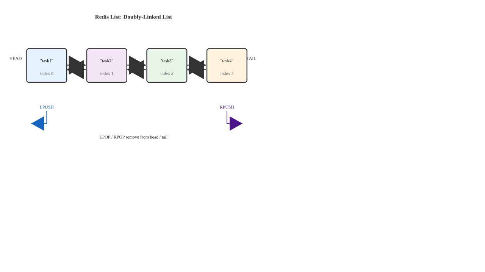
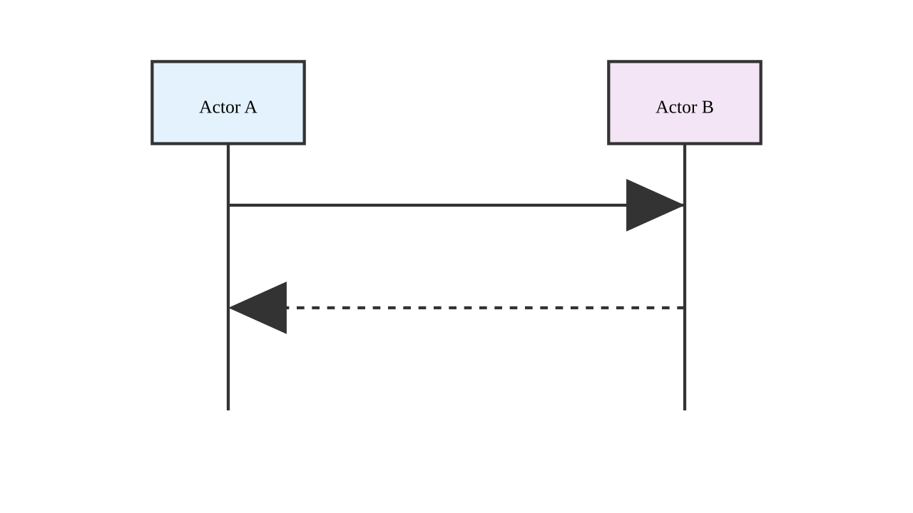

# Redis Data Structures

---

## Redis Data Structures Overview

- Data structures are the foundation of Redis
- Each structure optimized for specific use cases
- Atomic operations on all data types
- Commands named by structure prefix:
    - `STR...` for Strings
    - `L...` for Lists
    - `H...` for Hashes
    - `S...` for Sets
    - `Z...` for Sorted Sets

---

## String Operations Recap

Strings are the most basic Redis data type:



Basic operations:
```bash
SET key value [EX seconds] [PX milliseconds] [NX|XX]
GET key
MSET key value [key value ...]
MGET key [key ...]
```

---

## String Advanced Operations

```bash
# Incrementing/decrementing
INCR key              # Increment integer by 1
INCRBY key increment  # Increment by specific amount
INCRBYFLOAT key increment # Increment by float value
DECR key              # Decrement integer by 1
DECRBY key decrement  # Decrement by specific amount

# String manipulation
APPEND key value      # Append to string
GETRANGE key start end # Get substring
SETRANGE key offset value # Overwrite part of string
STRLEN key            # Get string length
```

---

## String Use Cases

1. **Caching**:
    - Cache API responses, HTML fragments, user data

1. **Counters**:
    - Page views, likes, votes
    - Atomic increments/decrements

1. **Rate limiting**:
    - Track API calls per user
    - Use `INCR` with `EXPIRE`

1. **Locks**:
    - Distributed locks with `SET key value NX PX milliseconds`

---

## Implementing a Counter with Redis Strings


---

## String Bit Operations

Strings can be used as bit arrays:

```bash
SETBIT key offset value   # Set bit at offset
GETBIT key offset         # Get bit at offset
BITCOUNT key [start] [end] # Count set bits
BITOP operation destkey key [key ...] # Bitwise operations
BITPOS key bit [start] [end] # Find first set/unset bit
```

Use cases:
- User presence tracking (online/offline)
- Feature flags
- Real-time analytics

---

## List Operations Recap

Lists are linked lists of string values:



Basic operations:
```bash
LPUSH key value [value ...]  # Push to head
RPUSH key value [value ...]  # Push to tail
LPOP key [count]             # Pop from head
RPOP key [count]             # Pop from tail
LRANGE key start stop        # Get range of elements
```

---

## List Advanced Operations

```bash
# Element manipulation
LINDEX key index           # Get element at index
LINSERT key BEFORE|AFTER pivot value # Insert element
LLEN key                   # Get list length
LSET key index value       # Set element at index
LTRIM key start stop       # Trim list to range

# Blocking operations
BLPOP key [key ...] timeout # Blocking pop from head
BRPOP key [key ...] timeout # Blocking pop from tail
BRPOPLPUSH source destination timeout # Pop from one list, push to another
```

---

## List Use Cases

1. **Activity feeds**:
    - Recent user actions
    - Latest posts or notifications

1. **Job/task queues**:
    - Workers consume tasks with `LPOP` or `BLPOP`
    - Tasks added with `RPUSH`

1. **Limited collections**:
    - Latest news articles
    - Recent searches
    - Use `LPUSH` + `LTRIM` pattern

---

## Implementing a Task Queue with Redis Lists



---

## Set Operations Recap

Sets are unordered collections of unique strings:



Basic operations:
```bash
SADD key member [member ...]    # Add members
SREM key member [member ...]    # Remove members
SMEMBERS key                    # Get all members
SISMEMBER key member            # Check if member exists
```

---

## Set Advanced Operations

```bash
# Set operations
SINTER key [key ...]           # Intersection of sets
SINTERSTORE destination key [key ...] # Store intersection
SUNION key [key ...]           # Union of sets
SUNIONSTORE destination key [key ...] # Store union
SDIFF key [key ...]            # Difference of sets
SDIFFSTORE destination key [key ...] # Store difference

# Other operations
SCARD key                      # Get set cardinality (size)
SPOP key [count]               # Remove and return random members
SRANDMEMBER key [count]        # Get random members
```

---

## Set Operations Visualization


---

## Set Use Cases

1. **Unique items**:
    - Unique visitors
    - User permissions

1. **Tagging systems**:
    - Articles, posts, products
    - Efficient lookups by tag

1. **Common relationships**:
    - Find mutual friends: `SINTER friends:user1 friends:user2`
    - Recommendation systems

1. **Random selection**:
    - Randomly select winners from contest entries
    - Poll sampling

---

## Implementing Tag Filtering with Redis Sets


---

## Sorted Set Operations Recap

Sorted sets are sets with scores (ordering values):


Basic operations:
```bash
ZADD key score member [score member ...] # Add members with scores
ZRANGE key start stop [WITHSCORES]      # Get range by index
ZRANGEBYSCORE key min max [WITHSCORES]  # Get range by score
ZREM key member [member ...]            # Remove members
```

---

## Sorted Set Advanced Operations

```bash
# Retrieving by rank/score
ZRANK key member                 # Get rank of member (ascending)
ZREVRANK key member              # Get rank of member (descending)
ZREVRANGE key start stop [WITHSCORES] # Get range by index, descending
ZREVRANGEBYSCORE key max min [WITHSCORES] # Get range by score, descending

# Score manipulation
ZINCRBY key increment member     # Increment score of member
ZSCORE key member                # Get score of member

# Other operations
ZCARD key                        # Get sorted set cardinality
ZCOUNT key min max               # Count members with scores in range
ZPOPMIN key [count]              # Remove and return members with lowest scores
ZPOPMAX key [count]              # Remove and return members with highest scores
```

---

## Sorted Set Use Cases

1. **Leaderboards**:
    - Game scores
    - Social media metrics

1. **Time-series data**:
    - Use timestamp as score
    - Range queries by time

1. **Weighted queues**:
    - Priority processing
    - Task scheduling

1. **Ranking systems**:
    - Product ratings
    - Search suggestions with weights

---

## Implementing a Leaderboard with Redis Sorted Sets


---

## Hash Operations Recap

Hashes are maps of field-value pairs:


Basic operations:
```bash
HSET key field value [field value ...] # Set hash fields
HGET key field                        # Get value of field
HMGET key field [field ...]           # Get values of multiple fields
HGETALL key                           # Get all fields and values
```

---

## Hash Advanced Operations

```bash
# Field manipulation
HDEL key field [field ...]           # Delete fields
HEXISTS key field                    # Check if field exists
HINCRBY key field increment          # Increment integer field
HINCRBYFLOAT key field increment     # Increment float field

# Other operations
HKEYS key                            # Get all fields
HVALS key                            # Get all values
HLEN key                             # Get number of fields
HSTRLEN key field                    # Get length of field value
HSCAN key cursor [MATCH pattern] [COUNT count] # Scan through fields
```

---

## Hash Use Cases

1. **Object representation**:
    - User profiles
    - Product details
    - Session data

1. **Counters per category**:
    - Page views by section
    - Votes by category

1. **Rate limiting**:
    - Track multiple limits for single entity
    - Different time windows

1. **Configuration storage**:
    - Application settings
    - Feature toggles

---

## Implementing User Profiles with Redis Hashes


---

## Streams Introduction

Streams (added in Redis 5.0):
- Append-only log data structures
- Similar to Kafka/messaging systems
- Support consumer groups

Basic operations:
```bash
XADD key ID field value [field value ...] # Add entry to stream
XREAD [COUNT count] [BLOCK milliseconds] STREAMS key [key ...] ID [ID ...] # Read from streams
XRANGE key start end [COUNT count]       # Read range of entries
XLEN key                                 # Get stream length
```

---

## HyperLogLog Introduction

HyperLogLog:
- Probabilistic data structure
- Estimates cardinality (unique elements)
- Very memory efficient (12kB max)

Basic operations:
```bash
PFADD key element [element ...]         # Add elements
PFCOUNT key [key ...]                   # Get estimated cardinality
PFMERGE destkey sourcekey [sourcekey ...] # Merge HyperLogLogs
```

Use cases:
- Unique visitors
- Metrics on large datasets
- When approximate count is acceptable

---

## Geospatial Data Introduction

Geospatial commands:
- Store and query points on Earth
- Implemented using sorted sets

Basic operations:
```bash
GEOADD key longitude latitude member [longitude latitude member ...] # Add locations
GEODIST key member1 member2 [unit]      # Get distance between points
GEOSEARCH key [FROMMEMBER member | FROMLONLAT longitude latitude] [BYRADIUS radius unit | BYBOX width height unit] [ASC | DESC] [WITHCOORD] [WITHDIST] [WITHHASH] [COUNT count] # Search within area
```

---

## Bitmaps Introduction

Bitmaps (implemented using strings):
- String operations treating strings as bit arrays
- Very memory efficient

Basic operations:
```bash
SETBIT key offset value                 # Set bit at offset
GETBIT key offset                       # Get bit at offset
BITCOUNT key [start end]                # Count set bits
BITOP operation destkey key [key ...]   # Bitwise operations
```

Use case: User online status tracking



---

## Choosing the Right Data Structure


---

## Memory Usage Comparison

Data structure efficiency (for 1 million items):

1. **Strings**: ~80-120MB (depends on value size)
1. **Lists**: ~100MB (linked list overhead)
1. **Sets**: ~80MB (hash table implementation)
1. **Sorted Sets**: ~120MB (skip list + hash table)
1. **Hashes**: ~70MB (with small fields, very efficient)
1. **HyperLogLog**: 12kB (regardless of cardinality)
1. **Bitmaps**: ~125kB (for 1M bits)

---

## Performance Considerations

---

## Data Structure Patterns: Composite Keys

Using multiple data structures together:



---

## Data Structure Patterns: Counters

Different counter implementations:

1. **Simple Counter**: `INCR counter:visits`
1. **Time-based Counter**: `HINCRBY counter:daily:20240323 visits 1`
1. **Per-entity Counter**: `HINCRBY counter:article:1234 views 1`
1. **Atomic Counter**: `INCR counter:global`

Counters can be:
- Global vs. scoped
- Persistent vs. temporary
- Simple vs. time-windowed

---

## Lab: Redis Data Structures

1. **Strings**: Implement a view counter for a page
1. **Lists**: Create a simple task queue
1. **Sets**: Build a tag system for articles
1. **Sorted Sets**: Create a leaderboard
1. **Hashes**: Store and retrieve user profiles
1. **Streams**: Log user actions
1. Advanced: Combine multiple data structures

---

## Summary

- Redis provides specialized data structures
- Each structure has optimal use cases
- Strings: simple values, counters
- Lists: ordered elements, queues
- Sets: unique elements, relationships
- Sorted Sets: scored elements, rankings
- Hashes: field-value pairs, objects
- Special types: Streams, HyperLogLog, Geospatial, Bitmaps

Next chapter: Caching with Redis
