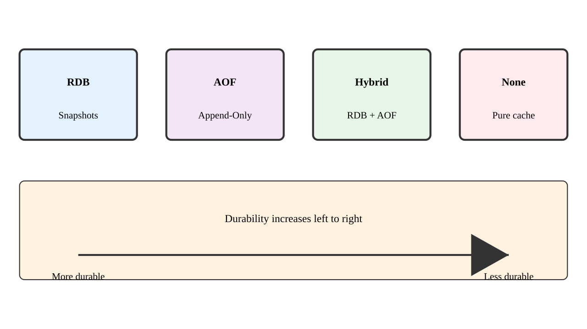
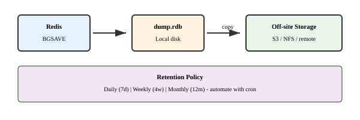
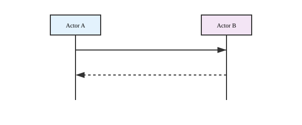

# Redis Persistence

---

## Why Persistence Matters

Redis is an in-memory database, but offers persistence options:

- **Data durability**: Survive server restarts
- **Disaster recovery**: Backup and restore
- **Data migration**: Move data between instances
- **Point-in-time recovery**: Recover from failures
- **Warm starts**: Faster initialization with pre-loaded data

Without persistence, all data is lost when Redis restarts!

---

## Redis Persistence Options



---

## RDB (Redis Database) Snapshots

Point-in-time snapshots of the dataset:

- Creates a single compact binary file
- Snapshot represents Redis data at one moment
- Usually scheduled at specific intervals
- Can be created manually with commands
- Good for backups and disaster recovery


---

## How RDB Snapshots Work


1. Redis forks a child process
1. Child process writes all data to a temporary file
1. Child replaces previous RDB file with new one
1. Parent process never blocks (except during fork)

---

## Configuring RDB Snapshots

In `redis.conf`:

```redis
# Save after 900 sec (15 min) if at least 1 key changed
save 900 1

# Save after 300 sec (5 min) if at least 10 keys changed
save 300 10

# Save after 60 sec if at least 10000 keys changed
save 60 10000

# Filename for the RDB file
dbfilename dump.rdb

# Directory for RDB file
dir /var/lib/redis

# Disable RDB snapshots
save ""
```

---

## RDB Manual Commands

Trigger snapshots manually:

```bash
# Synchronous save (blocks Redis until complete)
SAVE

# Asynchronous save (forks process)
BGSAVE

# Last successful save timestamp
LASTSAVE
```

Example:
```bash
127.0.0.1:6379> BGSAVE
Background saving started
```

---

## RDB Advantages and Disadvantages

**Advantages**:
- Compact single-file format
- Perfect for backups
- Faster restarts than AOF
- Better performance impact
- Can be used for replicas

**Disadvantages**:
- More data loss in case of crashes
- Less frequent snapshots
- Fork can be expensive with large datasets
- Potential stalls during fork on low memory

---

## AOF (Append-Only File)

Log of all write operations that modify data:

- Logs every write operation as it occurs
- Higher durability than RDB
- Can be compacted/rewritten to save space
- Easier to understand (plain text commands)
- Better for recovery with less data loss


---

## Configuring AOF

In `redis.conf`:

```redis
# Enable AOF
appendonly yes

# AOF filename
appendfilename "appendonly.aof"

# fsync policy (always, everysec, no)
appendfsync everysec

# Automatic AOF rewriting
auto-aof-rewrite-percentage 100
auto-aof-rewrite-min-size 64mb
```

---

## AOF Sync Options



---

## AOF Rewriting

AOF files grow continuously and need compaction:


---

## AOF Rewriting Commands

Trigger AOF rewriting manually:

```bash
# Asynchronous AOF rewrite
BGREWRITEAOF
```

Example:
```bash
127.0.0.1:6379> BGREWRITEAOF
Background append only file rewriting started
```

---

## AOF Advantages and Disadvantages

**Advantages**:
- Better durability (less data loss)
- Automatic rewrites to manage file size
- Easier to understand and parse
- Safe append-only operations
- Per-command granularity

**Disadvantages**:
- Larger files than RDB
- Slower restart times
- Sometimes slower than RDB depending on fsync policy
- Potential bugs historically (though rare now)

---

## Hybrid Persistence

Combine both RDB and AOF (Redis 4.0+):

```redis
# Enable AOF
appendonly yes

# Enable RDB + AOF hybrid mode
aof-use-rdb-preamble yes
```

How it works:
- AOF file starts with RDB snapshot (preamble)
- Commands since snapshot are appended after
- Faster restarts than pure AOF
- Better durability than pure RDB

---

## Hybrid Persistence File Structure



Benefits:
- Fast loading (RDB portion)
- Minimal data loss (AOF portion)
- Optimal space usage

---

## No Persistence

Redis can run without persistence:

```redis
# Disable RDB
save ""

# Disable AOF
appendonly no
```

Use cases:
- Pure cache
- Temporary data
- Volatile session storage
- When durability is handled elsewhere
- Development/testing environments

---

## Monitoring Persistence

Monitor persistence operations:

```bash
# Check RDB and AOF status
INFO persistence

# Sample output
# Persistence
loading:0
rdb_changes_since_last_save:0
rdb_bgsave_in_progress:0
rdb_last_save_time:1592211444
rdb_last_bgsave_status:ok
rdb_last_bgsave_time_sec:0
rdb_current_bgsave_time_sec:-1
rdb_last_cow_size:0
aof_enabled:1
aof_rewrite_in_progress:0
aof_rewrite_scheduled:0
aof_last_rewrite_time_sec:-1
aof_current_rewrite_time_sec:-1
aof_last_bgrewrite_status:ok
aof_last_write_status:ok
aof_last_cow_size:0
```

---

## Persistence and Memory Usage

Copy-On-Write (COW) mechanism:


- Child process shares memory with parent process
- When parent modifies data, memory is copied (Copy-On-Write)
- Maximum memory usage = original + modified pages
- Can be significant with large datasets and high write loads

---

## Managing Persistence Performance

Minimize impact on main Redis process:

1. **Schedule during low-traffic periods**:
    - Configure `save` directives carefully
    - Use `cron` to trigger manual BGSAVE

1. **Allocate sufficient memory**:
    - Account for COW memory usage
    - Set `maxmemory` below total available RAM

1. **CPU considerations**:
    - Ensure multiple cores for forked processes
    - Monitor CPU usage during persistence operations

1. **Disk I/O optimization**:
    - Use fast storage (SSD/NVMe)
    - Separate Redis data from OS/swap

---

## Backup Strategies



Best practices:
- Store backups off-server
- Implement retention policies (daily, weekly, monthly)
- Test backup restoration regularly
- Script and automate backup processes

---

## Recovery Procedures

Restoring from backups:

1. **RDB restore**:
    - Stop Redis
    - Copy RDB file to data directory
    - Start Redis

1. **AOF restore**:
    - Stop Redis
    - Copy AOF file to data directory
    - Start Redis

1. **Verification**:
    - Check Redis logs for successful loading
    - Verify data with sample queries
    - Monitor memory usage

---

## Corrupted AOF Recovery

If the AOF file becomes corrupted:

```bash
# Check and fix corrupted AOF file
redis-check-aof [--fix] <aof-file>
```

Example:
```bash
$ redis-check-aof --fix appendonly.aof
AOF analyzed: size=1052, ok_up_to=1024, diff=28
This will shrink the AOF from 1052 bytes to 1024 bytes
Continue? [y/N] y
Successfully truncated AOF
```

---

## Corrupted RDB Recovery

If the RDB file becomes corrupted:

```bash
# Check corrupted RDB file
redis-check-rdb <rdb-file>
```

Example:
```bash
$ redis-check-rdb dump.rdb
[offset 0] Checking RDB file dump.rdb
[offset 18] AUX FIELD redis-ver = '6.0.5'
[offset 32] AUX FIELD redis-bits = '64'
...
[offset 92] EOF is OK
```

Note: RDB files cannot be fixed - must restore from backup

---

## Point-in-Time Recovery

Combining RDB and AOF for point-in-time recovery:



---

## Redis Persistence in Replicated Setup


Strategies:
- Distribute persistence load across replicas
- Configure different persistence strategies per role
- Use dedicated backup replicas

---

## Persistence for Replication

RDB's role in replication:


- RDB file provides initial sync data
- Even with AOF enabled, replication uses RDB
- Partial resynchronization uses in-memory backlog

---

## Persistence in Redis Cluster

Redis Cluster persistence considerations:



- Each node manages persistence independently
- Need consistent configuration across nodes
- Backups should be coordinated cluster-wide
- Recovery might involve entire cluster rebuild

---

## Persistence Performance Benchmarking

Measure impact of persistence options:

```bash
# Using redis-benchmark
redis-benchmark -t set,get -n 1000000

# Compare with different persistence options
# - No persistence
# - RDB only
# - AOF with different fsync options
# - RDB + AOF hybrid mode
```

Monitor:
- Throughput (operations/second)
- Latency (average and percentiles)
- Memory usage (resident set size)
- CPU usage during persistence operations
- Disk I/O (writes per second)

---

## Typical Performance Impact


Note:
- Actual percentages will vary based on workload
- Write-heavy workloads show greater impact
- Read-heavy workloads show minimal impact
- System specifications significantly influence results

---

## Persistence Best Practices

1. **Match persistence to durability requirements**:
    - Critical data: AOF with fsync=always
    - Important data: AOF with fsync=everysec
    - Cached data: RDB snapshots or no persistence

1. **Plan for disk space**:
    - Monitor AOF and RDB file sizes
    - Configure auto-rewrite thresholds
    - Implement backup rotation and cleanup

1. **Schedule around traffic patterns**:
    - Trigger BGSAVE during low traffic
    - Configure save directives accordingly

1. **Resource allocation**:
    - Allocate sufficient memory for COW
    - Fast storage for persistence files
    - Separate Redis data directory

---

## Trade-offs: Choosing the Right Strategy

Decision matrix based on requirements:

| Requirement | RDB | AOF (everysec) | AOF (always) | Hybrid |
|-------------|-----|----------------|--------------|--------|
| Performance | ✓✓✓ | ✓✓ | ✗ | ✓✓ |
| Durability | ✗ | ✓✓ | ✓✓✓ | ✓✓ |
| Recovery speed | ✓✓✓ | ✗ | ✗ | ✓✓ |
| Disk space | ✓✓✓ | ✗ | ✗ | ✓✓ |
| Setup complexity | ✓✓✓ | ✓✓ | ✓✓ | ✓ |

---

## Advanced: External Persistence

Alternative persistence approaches:

1. **External backups**:
    - LVM/filesystem snapshots
    - Storage-level snapshots
    - Database specific backup tools

1. **Diskless replication**:
    - Replicate without disk involvement
    - Useful for read-scaling

1. **Redis Enterprise**:
    - Advanced persistence options
    - ACID compliant durability

---

## Lab: Redis Persistence

1. **Exercise 1**: Configure RDB snapshots
1. **Exercise 2**: Set up and test AOF persistence
1. **Exercise 3**: Implement hybrid persistence
1. **Exercise 4**: Trigger manual backups
1. **Exercise 5**: Simulate server failure and recover
1. **Exercise 6**: Benchmark different persistence options
1. **Exercise 7**: Set up a backup strategy

---

## Summary

- Redis provides multiple persistence options
- RDB: Point-in-time snapshots, fast but less durable
- AOF: Command logging, durable but larger files
- Hybrid mode: Combines advantages of both
- No single "best" persistence strategy
- Choose based on durability, performance needs
- Implement proper backup and recovery procedures
- Test recovery scenarios regularly

Next chapter: Redis Configuration and Management
