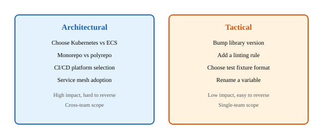
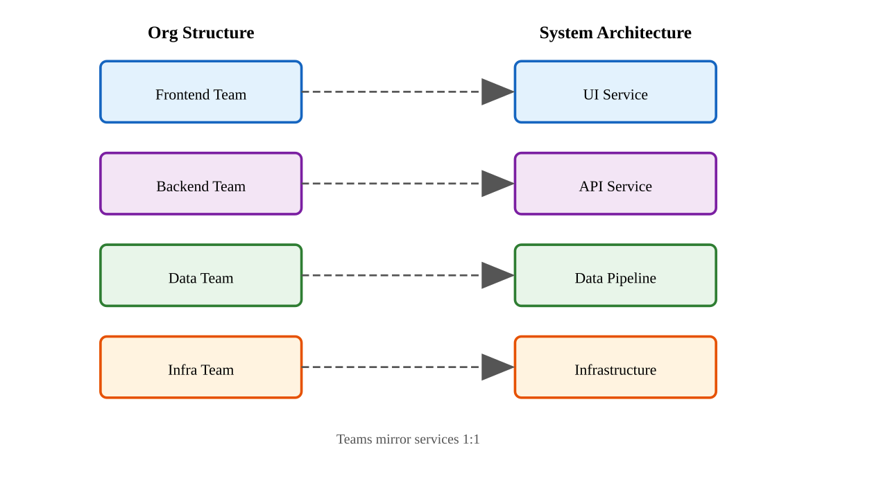
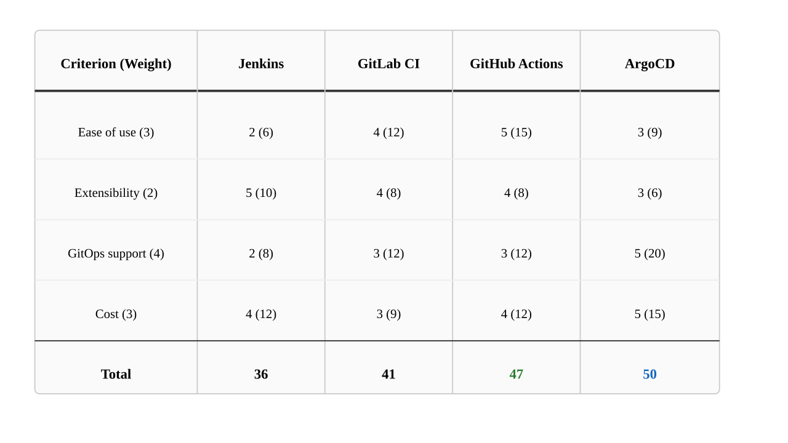

# Decision Frameworks for DevOps
A systematic approach to making and documenting architectural decisions

---

## Why Decisions Matter in DevOps

- DevOps is not just tools and automation; it is a series of decisions
- Poor decisions compound over time, creating technical debt
- Good decisions accelerate delivery and reduce operational burden
- The cost of reversing a bad decision grows exponentially with time

---

## What We Will Cover

1. What makes a decision "architectural" in DevOps
1. Reversibility and cost of change
1. Organizational context and Conway's Law
1. Evaluating tradeoffs systematically
1. Documenting decisions with Architecture Decision Records (`ADRs`)

---

## What Is an Architectural Decision?

- A decision that shapes the structure of a system or organization
- Has long-lasting consequences that are difficult to reverse
- Affects multiple teams, services, or components
- Constrains future choices and design directions

---

## Architectural vs Tactical Decisions



---

## The Litmus Test for Architectural Decisions

- **Scope**: Does it affect more than one team or service?
- **Durability**: Will it still matter in six months?
- **Reversibility**: Would reversing it require significant effort?
- **Cost**: Does it involve meaningful investment of time or money?
- If two or more answers are "yes," the decision is likely architectural

---

## Examples of Architectural Decisions in DevOps

- Which cloud provider to use (`AWS`, `GCP`, `Azure`)
- Container orchestration strategy (`Kubernetes`, `Nomad`, `ECS`)
- `GitOps` vs imperative deployment model
- Branching strategy (`trunk-based`, `GitFlow`)
- Observability stack selection (`Prometheus`, `Datadog`, `Grafana`)
- Secrets management approach (`Vault`, `SOPS`, `AWS Secrets Manager`)

---

## Examples of Non-Architectural Decisions

- Which `YAML` formatter to use in a single repo
- The naming convention for a specific microservice's internal modules
- Choice of a specific test framework for one team
- Order of steps within a single pipeline stage
- These are important but do not require formal frameworks

---

## The Decision Spectrum


---

## Reversibility: The Key Dimension

- Jeff Bezos distinguishes between "one-way doors" and "two-way doors"
- **One-way door**: Difficult or impossible to reverse once taken
    - Choosing a database engine for production data
    - Selecting a cloud provider with deep integration
- **Two-way door**: Easy to reverse if the outcome is poor
    - Trying a new linting tool
    - Switching from one log format to another

---

## The Reversibility Spectrum


---

## Cost of Change Over Time

- A decision made early in a project is cheap to change
- The same decision becomes expensive once systems depend on it
- Data migration, retraining, contract renegotiation all add cost
- This is why early architectural thinking pays off

---

## Strategies for Reducing Irreversibility

- **Abstraction layers**: Hide implementation behind interfaces
- **Feature flags**: Toggle new behaviors without redeployment
- **Strangler fig pattern**: Gradually replace old systems
- **Infrastructure as Code**: Recreate environments from scratch
- **Containerization**: Decouple applications from infrastructure

---

## Deferring Decisions Responsibly

- Not every decision needs to be made on day one
- "The Last Responsible Moment" principle from Lean
- Defer decisions until you have enough information
- But do not defer so long that options close
- Document what you are deferring and why

---

## Conway's Law: The Organizational Force

- "Organizations which design systems are constrained to produce designs which are copies of the communication structures of these organizations" -- Melvin Conway, 1967
- Your architecture will mirror your team structure
- This is not optional; it is a force of nature

---

## Conway's Law Visualized



---

## Conway's Law in Practice

- A company with separate frontend and backend teams will produce a system with a clear frontend/backend split
- A company with teams organized by geography will produce a distributed system
- A company with a single platform team will produce a monolithic platform
- This applies to `CI/CD` pipelines, monitoring, and infrastructure too

---

## The Inverse Conway Maneuver

- Deliberately structure teams to produce the desired architecture
- If you want microservices, create small autonomous teams
- If you want a unified platform, create cross-functional teams
- This is a strategic tool for DevOps leaders
- Pioneered by ThoughtWorks and widely adopted in the industry

---

## Team Topologies and Decision Authority

- **Stream-aligned teams**: Own decisions for their domain end-to-end
- **Platform teams**: Own decisions about shared infrastructure
- **Enabling teams**: Help other teams make better decisions
- **Complicated-subsystem teams**: Own decisions for specialized components
- Decision authority should follow team topology

---

## Cognitive Load and Decision Boundaries

- Teams can only handle a finite amount of cognitive load
- Too many decisions slow teams down and reduce quality
- Architectural decisions should minimize cross-team coordination
- Platforms should absorb complexity and simplify choices for stream teams
- Define clear decision boundaries between teams

---

## Evaluating Tradeoffs: The DACI Framework


---

## Decision Matrix: Weighted Criteria

- List all options as columns
- List evaluation criteria as rows
- Assign weights to each criterion (importance)
- Score each option against each criterion
- Multiply scores by weights and sum for final ranking

---

## Decision Matrix Example



---

## Pitfalls of Decision Matrices

- Garbage in, garbage out: biased weights produce biased results
- False precision: a score of 4 vs 5 may not be meaningful
- Missing criteria: what you forget to list can matter most
- Use as a discussion tool, not an oracle
- Always validate the result against intuition and experience

---

## The RAPID Framework

- **R**ecommend: Propose options and a recommendation
- **A**gree: Must agree before proceeding (has veto power)
- **P**erform: Implements the decision once made
- **I**nput: Provides facts, analysis, and data
- **D**ecide: Has final decision authority
- Useful for decisions involving multiple stakeholders

---

## Tradeoff Analysis: Fitness Functions

- Borrowed from evolutionary architecture
- Automated checks that validate architectural characteristics
- Examples in DevOps:
    - Deployment frequency must stay above X per week
    - `P95` latency must remain below Y milliseconds
    - Infrastructure cost must not exceed Z per month
- Run fitness functions in `CI/CD` to catch regressions

---

## Common DevOps Tradeoffs


---

## Speed vs Stability

- Fast deployments can introduce instability
- Too much caution slows delivery to a crawl
- Resolution: progressive delivery (`canary`, `blue-green`, feature flags)
- DORA metrics help track both simultaneously
    - Deployment frequency (speed)
    - Change failure rate (stability)

---

## Flexibility vs Standardization

- Teams want freedom to choose their own tools
- The organization needs consistency for supportability
- Resolution: "paved roads" -- provide a golden path but allow divergence
- Standardize the interface, not the implementation
- Example: standardize on `OCI` containers, allow any language inside

---

## Security vs Developer Experience

- Security gates can slow developer velocity
- Skipping security checks creates risk
- Resolution: "shift left" security into the pipeline
- Automate security scans (`SAST`, `DAST`, `SCA`) as pipeline stages
- Make the secure path the easiest path

---

## What Are Architecture Decision Records?

- Lightweight documents that capture architectural decisions
- Each `ADR` records one decision, its context, and consequences
- Stored alongside the code they apply to (usually in a `docs/adr/` folder)
- Popularized by Michael Nygard in a 2011 blog post
- They create a decision log for the project

---

## Why Use ADRs?

- **Institutional memory**: New team members understand past decisions
- **Accountability**: Decisions are traceable to context and rationale
- **Reversibility**: Understanding the "why" makes it easier to change later
- **Communication**: Stakeholders can review decisions asynchronously
- **Learning**: Teams can reflect on past decisions and improve

---

## ADR Template Structure


---

## ADR Status Lifecycle



---

## ADR as Markdown

```markdown
# ADR-0003: Use Terraform for IaC

## Status
Accepted (2024-03-15)

## Context
We need a cloud-agnostic IaC tool.
Team has Terraform experience.

## Decision
Adopt Terraform with remote state in S3.

## Consequences
- Positive: Multi-cloud support, large community
- Negative: State management complexity
```

---

## ADR Tooling

- `adr-tools`: Shell scripts for managing `ADRs` (by Nat Pryce)
    - `adr new "Use PostgreSQL for user data"`
    - `adr list`
    - `adr link 3 "Supersedes" 1`
- `log4brains`: Web UI for browsing `ADRs`
- `adr-viewer`: Generates HTML from `ADR` files
- Many teams simply use markdown files in `Git`

---

## Where to Store ADRs

- **In the repository**: Close to the code they describe
    - `docs/adr/0001-use-kubernetes.md`
    - `docs/adr/0002-adopt-gitops.md`
- **In a central wiki**: For organization-wide decisions
- **Best practice**: Repository-level for service decisions, wiki for cross-cutting
- Always version-controlled, never in ephemeral storage

---

## ADR Anti-Patterns

- Writing `ADRs` after the fact with fabricated context
- Making `ADRs` too long (they should fit on one page)
- Never revisiting or superseding outdated `ADRs`
- Using `ADRs` as approval gates instead of documentation
- Not linking related `ADRs` together
- Storing them where nobody can find them

---

## The Decision Flow Process


---

## Gathering Context Effectively

- Talk to all affected stakeholders, not just your team
- Understand current constraints (budget, timeline, compliance)
- Research what others in the industry have done
- Identify non-negotiable requirements vs nice-to-haves
- Document assumptions explicitly -- they change over time

---

## Exploring Options: Spike and PoC

- A **spike** is a time-boxed investigation to reduce uncertainty
- A **proof of concept** validates a specific approach works
- Set clear success criteria before starting
- Document findings even if the option is rejected
- Time-box to prevent analysis paralysis (usually 1-2 weeks)

---

## Bias in Decision-Making

- **Sunk cost fallacy**: Continuing with a bad choice because of past investment
- **Anchoring**: Over-relying on the first option considered
- **Groupthink**: Conforming to team consensus without critical evaluation
- **Recency bias**: Choosing the newest technology because it is trending
- **Familiarity bias**: Choosing what you already know over what might be better

---

## Mitigating Decision Bias

- Assign a "devil's advocate" role in decision meetings
- Use structured frameworks (decision matrix, `DACI`) to force objectivity
- Seek external opinions from outside the immediate team
- Set evaluation criteria before looking at options
- Review past decisions periodically for patterns of bias

---

## Time-Boxing Decisions

- Not every decision deserves unlimited analysis
- Use the "two-way door" test to calibrate investment
- Low-impact, reversible decisions: 30 minutes
- Medium-impact decisions: One meeting with stakeholders
- High-impact, irreversible decisions: Formal evaluation over days or weeks
- The cost of delay often exceeds the cost of a suboptimal choice

---

## The Decision Record Review Process

- Propose the `ADR` via a pull request
- Reviewers are the Contributors in the `DACI` framework
- Use the `PR` discussion to capture dissenting views
- Merge when the Approver accepts
- This creates a natural audit trail in `Git` history

---

## Linking Decisions Together

- Decisions rarely exist in isolation
- An `ADR` to adopt `Kubernetes` links to `ADRs` about:
    - Networking (`CNI` plugin selection)
    - Storage (persistent volume strategy)
    - Secrets (`Vault` integration)
    - Monitoring (`Prometheus` vs `Datadog`)
- Use `ADR` cross-references: "See also: ADR-0005, ADR-0012"

---

## Revisiting Decisions

- Schedule periodic reviews of active `ADRs` (e.g., quarterly)
- Revisit when the original context changes:
    - Team size changes significantly
    - Technology landscape shifts
    - Business requirements evolve
    - Cost structure changes
- Supersede old `ADRs` rather than editing them in place

---

## Case Study: Choosing a CI/CD Platform

- **Context**: Growing startup with 12 microservices, 5 teams
- **Options evaluated**: `Jenkins`, `GitLab CI`, `GitHub Actions`, `CircleCI`
- **Criteria**: Cost, scalability, developer experience, ecosystem
- **Decision**: `GitHub Actions` (already using `GitHub`, lowest switching cost)
- **Consequence**: Limited self-hosted runner support required workaround
- **Documented in**: `ADR-0007`

---

## Case Study: Monorepo vs Polyrepo

- **Context**: 3 teams, 8 services, shared libraries
- **Monorepo pros**: Atomic changes, shared tooling, easier refactoring
- **Polyrepo pros**: Independent releases, clearer ownership, smaller checkouts
- **Decision**: Polyrepo with a shared library registry
- **Reason**: Teams had different release cadences
- **Revisited**: After 18 months when dependency management became painful

---

## Organizational Decision Governance



---

## Lightweight vs Heavyweight Governance

- **Lightweight**: `ADRs` in repos, peer review via `PRs`, async discussion
    - Best for: Small to medium orgs, high-trust environments
- **Heavyweight**: Architecture Review Boards, formal approval processes
    - Best for: Large orgs, regulated industries, compliance requirements
- Most organizations benefit from a hybrid approach
- Start lightweight and add governance as needed

---

## Building a Decision-Making Culture

- Normalize saying "I do not know, let us investigate"
- Celebrate well-documented decisions, even if the outcome was wrong
- Make `ADRs` part of onboarding for new team members
- Share decision retrospectives across teams
- Reward structured thinking over gut instinct

---

## Measuring Decision Quality

- Track how often decisions are revisited or reversed
- Monitor time from decision to implementation
- Survey team confidence in architectural direction
- Count the number of undocumented "shadow decisions"
- Use DORA metrics as proxy for decision effectiveness
    - Lead time, deployment frequency, MTTR, change failure rate

---

## Common Mistakes in DevOps Decision-Making

- Making decisions by committee without a clear approver
- Choosing technology based on resume-driven development
- Ignoring Conway's Law and fighting the organizational structure
- Failing to document the "why" behind decisions
- Not revisiting decisions when the context changes
- Over-engineering for problems you do not have yet

---

## Decision Framework Checklist

- [ ] Is this decision architectural? (scope, durability, reversibility, cost)
- [ ] Who are the `DACI` roles for this decision?
- [ ] Have we gathered sufficient context and constraints?
- [ ] Have we explored at least three options?
- [ ] Have we evaluated tradeoffs with explicit criteria?
- [ ] Is the decision documented in an `ADR`?
- [ ] Have stakeholders reviewed and agreed?
- [ ] Is there a plan to revisit this decision?

---

## Summary: Key Takeaways

- Architectural decisions in DevOps shape systems and teams for years
- Use the reversibility test to calibrate the effort you invest
- Respect Conway's Law -- align teams and architecture intentionally
- Apply structured frameworks (`DACI`, decision matrices) to reduce bias
- Document every significant decision in an `ADR`
- Revisit decisions periodically as context evolves
