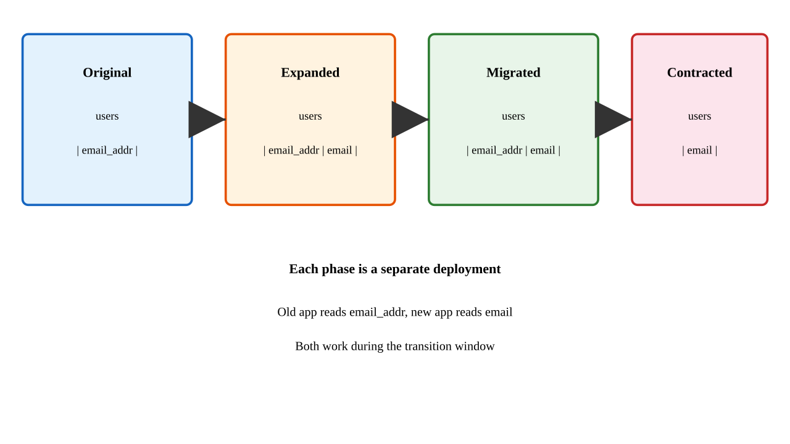
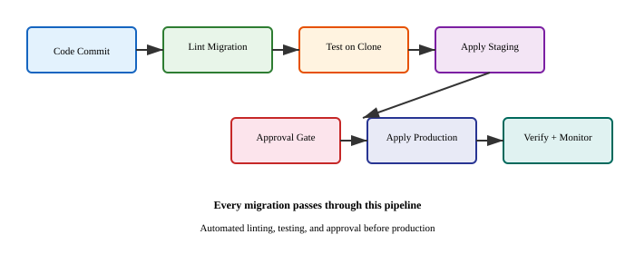
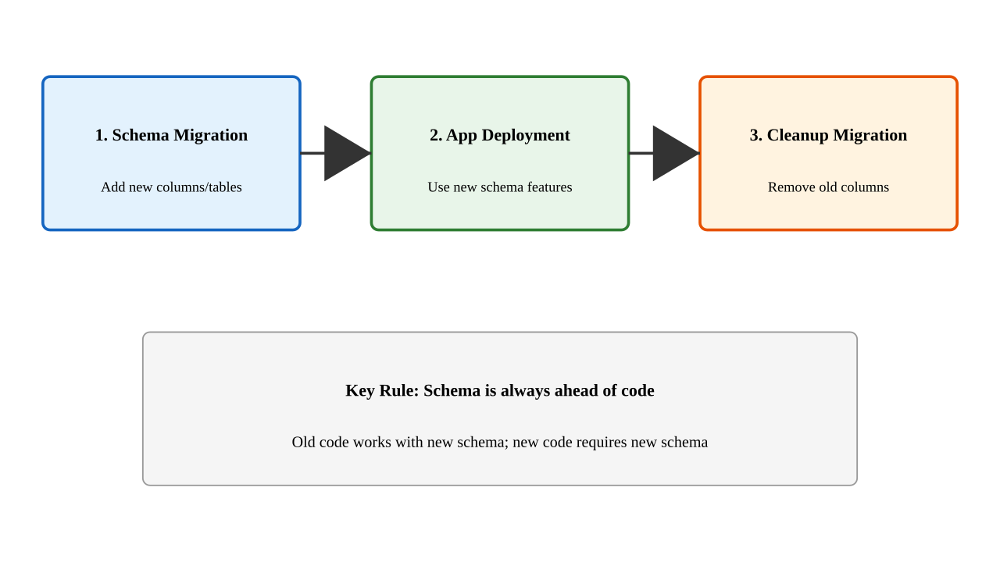

# Database Migration Strategies in CI/CD
Approaches for safe, automated schema and data migrations in modern pipelines

---

## Why Database Migrations Matter

- Database changes are among the riskiest parts of any deployment
- Schema mismatches cause application failures
- Data loss is often irreversible
- Coordination between code and schema is critical
- Automation reduces human error and speeds delivery

---

## Two Fundamental Approaches



---

## Versioned Migrations Explained

- Each migration is a numbered script (e.g., `V001_create_users.sql`)
- Scripts are applied in order, tracked in a metadata table
- The database state is the sum of all applied migrations
- Tools: `Flyway`, `Liquibase`, `Alembic`, `golang-migrate`

---

## Versioned Migration Example

```sql
-- V001__create_users.sql
CREATE TABLE users (
    id SERIAL PRIMARY KEY,
    email VARCHAR(255) NOT NULL UNIQUE,
    created_at TIMESTAMP DEFAULT NOW()
);

-- V002__add_username.sql
ALTER TABLE users
    ADD COLUMN username VARCHAR(100);
```

---

## Migration Metadata Table

```sql
SELECT * FROM schema_version;

-- version | description      | applied_at
-- --------+------------------+---------------------
-- 001     | create_users     | 2025-03-01 10:00:00
-- 002     | add_username     | 2025-03-05 14:30:00
-- 003     | add_roles_table  | 2025-03-10 09:15:00
```

- Tracks which migrations have been applied
- Prevents re-running completed migrations
- Provides audit trail of schema changes

---

## State-Based Migrations Explained

- Define the desired end-state of the schema
- The tool compares current state to desired state
- A diff script is auto-generated and applied
- Tools: `Dacpac` (SQL Server), `Atlas`, `Skeema`, `pgSync`

---

## State-Based Migration Example

```sql
-- desired_schema.sql (the target state)
CREATE TABLE users (
    id SERIAL PRIMARY KEY,
    email VARCHAR(255) NOT NULL UNIQUE,
    username VARCHAR(100),
    created_at TIMESTAMP DEFAULT NOW()
);
```

- Tool detects that `username` column is missing
- Generates `ALTER TABLE users ADD COLUMN username ...`
- Applies the diff automatically

---

## Versioned vs State-Based Comparison

| Aspect | Versioned | State-Based |
|--------|-----------|-------------|
| History | Explicit | Implicit |
| Repeatability | High | Medium |
| Merge conflicts | Per-file | Schema-wide |
| Data migrations | Native | Requires hooks |
| Rollback | Write reverse script | Snapshot restore |
| Learning curve | Lower | Higher |

---

## When to Choose Versioned Migrations

- Teams that need full auditability of every change
- Projects with complex data transformations alongside schema changes
- Environments with strict compliance requirements
- When multiple developers work on migrations concurrently
- Most common choice for application-driven databases

---

## When to Choose State-Based Migrations

- DBA-managed databases with centralized schema ownership
- When schema is managed outside the application codebase
- Projects where auto-generated diffs save significant time
- Environments where snapshot/restore is readily available
- Less common in application CI/CD pipelines

---

## Forward-Only Migrations

- Migrations are never reversed; only new migrations fix issues
- Simpler to reason about in production
- Avoids the complexity of writing and testing rollback scripts
- If a migration fails, deploy a new corrective migration

```sql
-- V005__fix_column_type.sql (corrective migration)
ALTER TABLE orders
    ALTER COLUMN price TYPE NUMERIC(12,2);
```

---

## Reversible Migrations

- Each migration has an `up` and a `down` script
- `down` script undoes the `up` changes
- Allows rolling back to any previous version
- Significantly increases development and testing effort

```sql
-- V003__add_orders.up.sql
CREATE TABLE orders (id SERIAL PRIMARY KEY);

-- V003__add_orders.down.sql
DROP TABLE orders;
```

---

## Forward-Only vs Reversible Trade-offs


---

## The Irreversibility Problem

- Some migrations cannot be reversed:
    - Dropping a column loses data permanently
    - Changing a column type may lose precision
    - Splitting a table destroys original structure
- In practice, most teams prefer forward-only for production
- Reversible migrations are useful in development and staging

---

## Zero-Downtime Migration Challenges

- Application must keep serving requests during migration
- Old and new code versions may run concurrently
- Database locks can block reads and writes
- Large table alterations take significant time
- Foreign key constraints complicate incremental changes

---

## The Expand and Contract Pattern



---

## Expand Phase in Detail

- Add new columns, tables, or indexes alongside existing ones
- Do not remove or modify existing structures
- Both old and new application versions work correctly
- No data loss, no breaking changes

```sql
-- Expand: add new column
ALTER TABLE users ADD COLUMN full_name VARCHAR(200);
```

---

## Migrate Phase in Detail

- Backfill data from old structures to new ones
- Update application code to write to both old and new
- Gradually shift reads to the new structure
- Verify data consistency between old and new

```sql
-- Backfill data
UPDATE users SET full_name = first_name || ' ' || last_name
WHERE full_name IS NULL;
```

---

## Contract Phase in Detail

- Remove the old columns, tables, or indexes
- Only after all application instances use the new structure
- Only after backfill is verified complete
- This is the cleanup step

```sql
-- Contract: remove old columns
ALTER TABLE users DROP COLUMN first_name;
ALTER TABLE users DROP COLUMN last_name;
```

---

## Expand and Contract: Column Rename Example



---

## Dual-Write Strategy Overview

- Application writes to both old and new data stores simultaneously
- Ensures data consistency during migration
- Allows gradual cutover with minimal risk
- Used for moving between databases or restructuring tables

---

## Dual-Write Architecture



---

## Dual-Write Implementation Steps

1. Deploy application that writes to both old and new stores
1. Backfill historical data from old to new
1. Verify data consistency continuously
1. Shift reads gradually from old to new
1. Once fully verified, remove writes to old store
1. Decommission old data store

---

## Dual-Write Consistency Challenges

- Writes to two stores are not atomic by default
- Network failures can cause divergence
- Solutions:
    - Use `Change Data Capture` (CDC) instead of application-level dual write
    - Use a transactional outbox pattern
    - Implement reconciliation jobs to detect drift
    - Accept eventual consistency with conflict resolution

---

## Change Data Capture as Alternative


---

## Online Schema Migration Tools

- `gh-ost` (GitHub): shadow table approach for `MySQL`
- `pt-online-schema-change` (Percona): trigger-based for `MySQL`
- `pg_repack` / `pgroll`: for `PostgreSQL` table rewrites
- These tools avoid long-running locks on large tables
- They create a copy, apply changes, then swap

---

## How `gh-ost` Works

1. Creates a ghost (shadow) table with the desired schema
1. Copies existing rows in small batches
1. Captures ongoing changes via binary log streaming
1. Applies captured changes to the ghost table
1. Performs an atomic table swap when caught up
1. No triggers required; minimal lock time

---

## Migration Pipeline Flow



---

## Migration Linting

- Static analysis of migration SQL before execution
- Catches destructive operations early
- Rules examples:
    - Disallow `DROP TABLE` without explicit approval
    - Require `NOT NULL` columns to have defaults
    - Prevent wide table scans in backfills
- Tools: `squawk` (PostgreSQL), `sqlfluff`, `Atlas` lint

---

## Testing Migrations on Database Clones

- Create a copy of the production schema (not data)
- Apply pending migrations to the clone
- Run application tests against the migrated schema
- Measure migration execution time
- Detect lock contention and performance issues early

```yaml
# CI step example
- name: Test migration
  run: |
    createdb test_clone
    flyway -url=jdbc:postgresql://localhost/test_clone migrate
    pytest tests/
```

---

## Separating Schema and Application Deployments

- Deploy schema changes before application code
- Schema must be backward-compatible with current code
- Application code must be forward-compatible with new schema
- This decoupling allows independent rollback of each layer

---

## Deployment Order Strategy



---

## Handling Large Table Migrations

- Adding columns to billion-row tables can take hours
- Use batched operations to avoid locking entire tables
- Consider `pt-online-schema-change` or `gh-ost`
- Add indexes `CONCURRENTLY` in `PostgreSQL`
- Schedule during low-traffic windows if needed

```sql
-- PostgreSQL: non-blocking index creation
CREATE INDEX CONCURRENTLY idx_users_email
    ON users (email);
```

---

## Data Migration Basics

- Moving or transforming existing data as part of a migration
- Different from schema migration: operates on rows, not structure
- Examples: backfilling new columns, reformatting data, merging tables
- Must be idempotent to allow safe re-runs

---

## Data Migration Script Example

```python
# Idempotent data migration
def migrate_user_names(batch_size=1000):
    while True:
        rows = db.execute("""
            UPDATE users
            SET full_name = first_name || ' ' || last_name
            WHERE full_name IS NULL
            LIMIT %s
        """, [batch_size])
        if rows == 0:
            break
        db.commit()
        time.sleep(0.1)  # throttle
```

---

## Data Seeding in Pipelines

- Seeding inserts baseline data required by the application
- Examples: default roles, configuration values, lookup tables
- Seeds must be idempotent (use `INSERT ... ON CONFLICT DO NOTHING`)
- Run seeds after schema migrations, before application start

```sql
-- Idempotent seed data
INSERT INTO roles (name, description)
VALUES ('admin', 'Full access'),
       ('viewer', 'Read-only access')
ON CONFLICT (name) DO NOTHING;
```

---

## Environment-Specific Seeding

- Development: large synthetic datasets for testing
- Staging: production-like data (anonymized)
- Production: only essential reference data
- Use environment variables to control what gets seeded

```yaml
# Pipeline configuration
seed_data:
  development: seeds/dev_data.sql
  staging: seeds/staging_data.sql
  production: seeds/reference_only.sql
```

---

## Migration Ordering and Dependencies

- Migrations must be applied in strict order
- Concurrent migration development requires careful numbering
- Use timestamps instead of sequential numbers to reduce conflicts
- Example: `20250301120000_create_orders.sql`

```tree
migrations/
  20250301120000_create_users.sql
  20250305143000_add_username.sql
  20250310091500_create_orders.sql
  20250310091501_add_order_items.sql
```

---

## Handling Migration Conflicts in Teams

- Two developers create migrations with the same version number
- Solutions:
    - Use timestamp-based naming (most common)
    - CI check that fails if migration order is ambiguous
    - Require linear migration history in `main` branch
    - `Flyway` and `Liquibase` detect conflicts at apply time

---

## Transactional Migrations

- Wrap each migration in a transaction when possible
- If any statement fails, the entire migration rolls back
- Not all databases support transactional DDL

| Database | Transactional DDL |
|----------|------------------|
| `PostgreSQL` | Yes |
| `MySQL` | No (implicit commit) |
| `SQL Server` | Yes |
| `Oracle` | No (implicit commit) |

---

## Non-Transactional Migration Safety

- For databases without transactional DDL (`MySQL`, `Oracle`):
    - Break migrations into small, atomic steps
    - Each step should be safe to re-run
    - Use a status tracking mechanism
    - Test rollback procedures manually

```sql
-- Small, atomic step
ALTER TABLE users ADD COLUMN phone VARCHAR(20);
-- Tracked separately from:
ALTER TABLE users ADD INDEX idx_phone (phone);
```

---

## Feature Flags and Migrations

- Use feature flags to decouple migration from feature activation
- Deploy migration and code together, but keep feature disabled
- Gradually enable the feature after verifying migration success
- Roll back by disabling the flag, not reversing the migration

---

## Feature Flag Migration Flow



---

## Blue-Green Database Migrations

- Maintain two identical database environments (blue/green)
- Apply migration to the inactive environment
- Test thoroughly, then switch traffic
- High cost: requires full database duplication
- Best for critical systems where downtime is unacceptable

---

## Migration Rollback Strategies

- **Backward-compatible migrations**: old code works with new schema
- **Forward fix**: deploy a new corrective migration
- **Point-in-time restore**: restore database from backup
- **Feature flag disable**: turn off the feature using old schema path
- Avoid `DROP` and destructive changes until fully verified

---

## Monitoring Migrations in Production

- Track migration execution time per environment
- Alert on migrations exceeding time thresholds
- Monitor table lock duration during migration
- Watch for query plan changes after schema updates
- Log before/after row counts for data migrations

---

## Migration Governance

- Require peer review for all migration scripts
- Enforce naming conventions via CI linting
- Mandate testing on a production-schema clone
- Require sign-off for destructive operations
- Keep a migration runbook for emergency procedures

---

## Common Anti-Patterns

- Running migrations manually in production
- Editing already-applied migration files
- Coupling schema and data migrations in one script
- Skipping migration testing in CI
- Using `ALTER TABLE` on huge tables without online tools
- Deploying code before its required migration

---

## `Flyway` Pipeline Integration

```yaml
# GitHub Actions example
jobs:
  migrate:
    runs-on: ubuntu-latest
    steps:
      - uses: actions/checkout@v4
      - name: Run Flyway migrations
        run: |
          flyway -url=${{ secrets.DB_URL }} \
                 -user=${{ secrets.DB_USER }} \
                 -password=${{ secrets.DB_PASS }} \
                 -locations=filesystem:./migrations \
                 migrate
      - name: Validate schema
        run: flyway validate
```

---

## `Liquibase` Changelog Example

```xml
<databaseChangeLog
  xmlns="http://www.liquibase.org/xml/ns/dbchangelog">
  <changeSet id="1" author="dev">
    <createTable tableName="products">
      <column name="id" type="int"
              autoIncrement="true">
        <constraints primaryKey="true"/>
      </column>
      <column name="name" type="varchar(255)"/>
      <column name="price" type="decimal(10,2)"/>
    </createTable>
  </changeSet>
</databaseChangeLog>
```

---

## `Alembic` for Python Projects

```python
# alembic/versions/001_create_users.py
from alembic import op
import sqlalchemy as sa

def upgrade():
    op.create_table(
        'users',
        sa.Column('id', sa.Integer, primary_key=True),
        sa.Column('email', sa.String(255), unique=True),
    )

def downgrade():
    op.drop_table('users')
```

- Integrates with `SQLAlchemy` models
- Auto-generates migrations from model diffs

---

## Multi-Database Migration Coordination

- Microservices often have separate databases
- Migrations must be coordinated across services
- Use a migration orchestrator or ordered pipeline stages
- Each service owns its own migration lifecycle
- Cross-service data dependencies need explicit contracts

---

## Key Takeaways

- Choose between versioned and state-based based on team needs
- Prefer forward-only migrations for production simplicity
- Use expand and contract for zero-downtime schema changes
- Automate migrations in CI/CD with linting and clone testing
- Make data migrations idempotent and batched
- Separate schema deployment from application deployment
- Monitor and govern migrations as a first-class concern
