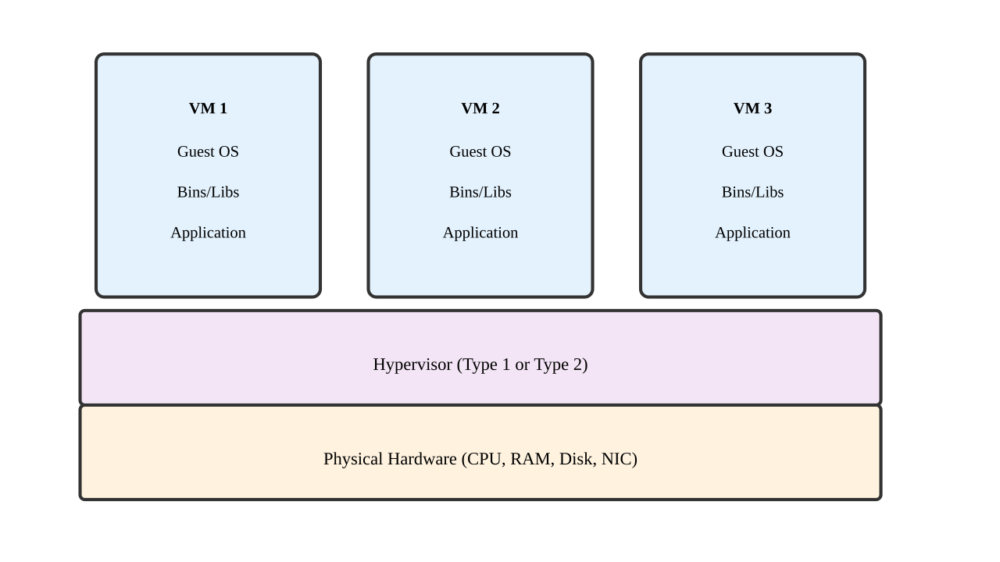
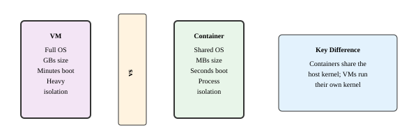
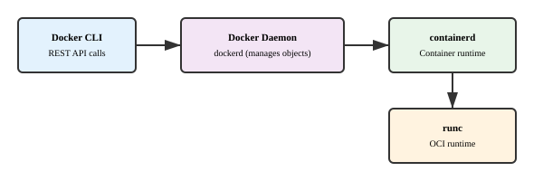
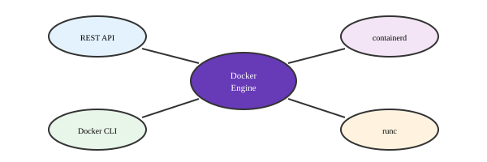

# Docker Under the Hood
---

## Virtual Machine Basics

---

## How Virtual Machines Work

| Component | Role | Resource Impact |
|-----------|------|----------------|
| Guest OS | Complete OS copy | 5-20GB storage |
| Hypervisor | Resource management | 10-20% overhead |
| Virtual Hardware | Hardware emulation | Memory overhead |
| Host OS | Base system | Shared resource |

---

## VM Resource Allocation

- Full hardware virtualization
- Fixed memory allocation
- Dedicated virtual CPU cores
- Complete OS overhead
- Slow boot time (minutes)
- Full system isolation

---

## Containers vs VMs

---

## Container Advantages

| Feature | Containers | Virtual Machines |
|---------|------------|------------------|
| Startup Time | Seconds | Minutes |
| Size | MBs | GBs |
| Resource Usage | Low overhead | High overhead |
| Isolation | Process-level | Full system |
| Portability | Very high | Limited |

---

## Docker Architecture

---

## Docker Engine Components

---

## Container Runtime

---

## Namespace Isolation

| Namespace | Purpose | Isolation |
|-----------|---------|-----------|
| PID | Process isolation | Process tree |
| NET | Network isolation | Network stack |
| MNT | Filesystem isolation | Mount points |
| UTS | System isolation | Hostname |
| IPC | IPC isolation | IPC resources |
| USER | User isolation | User/group IDs |

---

## Control Groups (cgroups)

---

## Storage Drivers

---

## Layer Architecture

---

## Networking Internals

---

## Security Architecture

