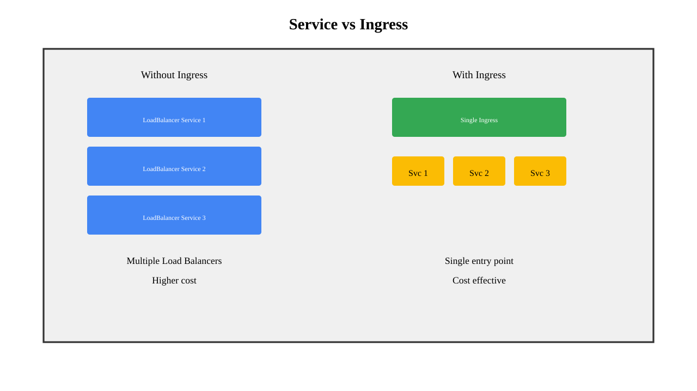

# Ingress and Container Registries

---

## Ingress Overview

1. **HTTP/HTTPS** routing
1. **Load balancing** at L7
1. **SSL/TLS** termination
1. **Name-based** virtual hosting
1. **Path-based** routing

---

## Why Ingress?



---

## Ingress Components

```yaml
apiVersion: networking.k8s.io/v1
kind: Ingress
metadata:
  name: simple-ingress
spec:
  rules:
  - host: app.example.com
    http:
      paths:
      - path: /
        pathType: Prefix
        backend:
          service:
            name: web-service
            port:
              number: 80
```

---

## Path Types

```yaml
pathType: Exact     # Exact match
pathType: Prefix    # Prefix match
pathType: ImplementationSpecific  # Controller decides

# Examples:
# Exact: /foo matches /foo only
# Prefix: /foo matches /foo, /foo/, /foo/bar
```

---

## Host-Based Routing

```yaml
apiVersion: networking.k8s.io/v1
kind: Ingress
metadata:
  name: host-based
spec:
  rules:
  - host: app1.example.com
    http:
      paths:
      - path: /
        pathType: Prefix
        backend:
          service:
            name: app1-service
            port:
              number: 80
  - host: app2.example.com
    http:
      paths:
      - path: /
        pathType: Prefix
        backend:
          service:
            name: app2-service
            port:
              number: 80
```

---

## Path-Based Routing

```yaml
apiVersion: networking.k8s.io/v1
kind: Ingress
metadata:
  name: path-based
spec:
  rules:
  - host: api.example.com
    http:
      paths:
      - path: /users
        pathType: Prefix
        backend:
          service:
            name: users-service
            port:
              number: 8080
      - path: /products
        pathType: Prefix
        backend:
          service:
            name: products-service
            port:
              number: 8080
```

---

## TLS Configuration

```yaml
apiVersion: networking.k8s.io/v1
kind: Ingress
metadata:
  name: tls-ingress
spec:
  tls:
  - hosts:
    - secure.example.com
    secretName: tls-secret
  rules:
  - host: secure.example.com
    http:
      paths:
      - path: /
        pathType: Prefix
        backend:
          service:
            name: secure-service
            port:
              number: 443
```

---

## Creating TLS Secret

```bash
# Generate self-signed certificate
openssl req -x509 -nodes -days 365 -newkey rsa:2048 \
  -keyout tls.key -out tls.crt \
  -subj "/CN=secure.example.com"

# Create TLS secret
kubectl create secret tls tls-secret \
  --cert=tls.crt \
  --key=tls.key
```

---

## Ingress Controllers


---

## Installing NGINX Ingress

```bash
# Using Helm
helm repo add ingress-nginx \
  https://kubernetes.github.io/ingress-nginx
helm install ingress-nginx ingress-nginx/ingress-nginx

# Or using manifest
kubectl apply -f https://raw.githubusercontent.com/\
kubernetes/ingress-nginx/controller-v1.8.2/deploy/static/\
provider/cloud/deploy.yaml
```

---

## Ingress Annotations

```yaml
metadata:
  annotations:
    nginx.ingress.kubernetes.io/rewrite-target: /
    nginx.ingress.kubernetes.io/ssl-redirect: "true"
    nginx.ingress.kubernetes.io/proxy-body-size: "10m"
    nginx.ingress.kubernetes.io/proxy-connect-timeout: "600"
    nginx.ingress.kubernetes.io/proxy-send-timeout: "600"
    nginx.ingress.kubernetes.io/proxy-read-timeout: "600"
```

---

## Rate Limiting

```yaml
metadata:
  annotations:
    nginx.ingress.kubernetes.io/limit-rps: "10"
    nginx.ingress.kubernetes.io/limit-rpm: "600"
    nginx.ingress.kubernetes.io/limit-connections: "10"
    nginx.ingress.kubernetes.io/limit-whitelist: \
      "10.0.0.0/8,172.16.0.0/12"
```

---

## Basic Authentication

```bash
# Create auth file
htpasswd -c auth admin

# Create secret
kubectl create secret generic basic-auth --from-file=auth

# Use in Ingress
metadata:
  annotations:
    nginx.ingress.kubernetes.io/auth-type: basic
    nginx.ingress.kubernetes.io/auth-secret: basic-auth
    nginx.ingress.kubernetes.io/auth-realm: 'Authentication Required'
```

---

## Ingress Class

```yaml
apiVersion: networking.k8s.io/v1
kind: IngressClass
metadata:
  name: nginx
spec:
  controller: k8s.io/ingress-nginx
  parameters:
    apiGroup: k8s.example.com
    kind: IngressParameters
    name: external-config
---
apiVersion: networking.k8s.io/v1
kind: Ingress
spec:
  ingressClassName: nginx  # Use specific class
```

---

## Default Backend

```yaml
apiVersion: networking.k8s.io/v1
kind: Ingress
metadata:
  name: default-backend
spec:
  defaultBackend:
    service:
      name: default-service
      port:
        number: 80
  rules:
  - host: app.example.com
    http:
      paths:
      - path: /
        pathType: Prefix
        backend:
          service:
            name: app-service
            port:
              number: 80
```

---

## Container Registries Overview

1. **Store** container images
1. **Version** control for images
1. **Access** control and security
1. **Image** scanning
1. **Distribution** across regions

---

## Registry Types



---

## Using Private Registry

```bash
# Login to registry
docker login myregistry.io

# Tag image
docker tag myapp:latest myregistry.io/myapp:latest

# Push image
docker push myregistry.io/myapp:latest

# Create registry secret in Kubernetes
kubectl create secret docker-registry regcred \
  --docker-server=myregistry.io \
  --docker-username=user \
  --docker-password=pass \
  --docker-email=email@example.com
```

---

## Using Registry Secret

```yaml
apiVersion: v1
kind: Pod
metadata:
  name: private-app
spec:
  imagePullSecrets:
  - name: regcred
  containers:
  - name: app
    image: myregistry.io/myapp:latest
```

---

## Image Pull Policy

```yaml
spec:
  containers:
  - name: app
    image: myapp:latest
    imagePullPolicy: Always
    # Options:
    # Always - Always pull
    # IfNotPresent - Pull if not cached
    # Never - Never pull
```

---

## Image Tagging Strategy

```bash
# Bad - Mutable tag
myapp:latest

# Good - Immutable tags
myapp:v1.2.3
myapp:1.2.3-build-456
myapp:sha256:abc123...
myapp:20240115-1430

# Semantic versioning
myapp:1.2.3        # Specific version
myapp:1.2          # Minor version
myapp:1            # Major version
```

---

## Harbor Installation

```bash
# Using Helm
helm repo add harbor https://helm.goharbor.io
helm install harbor harbor/harbor \
  --set expose.type=ingress \
  --set expose.ingress.hosts.core=harbor.example.com \
  --set persistence.enabled=true \
  --set harborAdminPassword=Harbor12345
```

---

## Image Scanning

```yaml
# Example with Trivy scanner
apiVersion: v1
kind: Pod
metadata:
  annotations:
    container.apparmor.security.beta.kubernetes.io/scanner: \
      runtime/default
spec:
  initContainers:
  - name: scanner
    image: aquasec/trivy
    args:
    - image
    - --exit-code
    - "1"
    - --severity
    - "HIGH,CRITICAL"
    - myapp:latest
```

---

## Registry Mirroring

```yaml
# Configure containerd for mirror
[plugins."io.containerd.grpc.v1.cri".registry.mirrors."docker.io"]
  endpoint = ["https://mirror.example.com"]

[plugins."io.containerd.grpc.v1.cri".registry.configs."mirror.example.com".auth]
  username = "user"
  password = "pass"
```

---

## Multi-Architecture Images

```bash
# Build multi-arch image
docker buildx build \
  --platform linux/amd64,linux/arm64 \
  -t myapp:latest \
  --push .

# Manifest list
docker manifest create myapp:latest \
  myapp:latest-amd64 \
  myapp:latest-arm64

docker manifest push myapp:latest
```

---

## Image Size Optimization

```dockerfile
# Multi-stage build
FROM golang:1.20 AS builder
WORKDIR /app
COPY . .
RUN go build -o myapp

FROM alpine:3.18
RUN apk --no-cache add ca-certificates
COPY --from=builder /app/myapp /usr/local/bin/
CMD ["myapp"]
```

---

## Registry Webhooks

```yaml
# Harbor webhook example
webhooks:
  - name: image-pushed
    endpoint: https://webhook.example.com/notify
    events:
      - PUSH_ARTIFACT
      - SCANNING_COMPLETED
    enabled: true
```

---

## Cert-Manager for TLS

```bash
# Install cert-manager
kubectl apply -f https://github.com/cert-manager/cert-manager/\
releases/download/v1.13.0/cert-manager.yaml

# Create ClusterIssuer
apiVersion: cert-manager.io/v1
kind: ClusterIssuer
metadata:
  name: letsencrypt
spec:
  acme:
    server: https://acme-v02.api.letsencrypt.org/directory
    email: admin@example.com
    privateKeySecretRef:
      name: letsencrypt
    solvers:
    - http01:
        ingress:
          class: nginx
```

---

## Using Cert-Manager

```yaml
apiVersion: networking.k8s.io/v1
kind: Ingress
metadata:
  annotations:
    cert-manager.io/cluster-issuer: "letsencrypt"
spec:
  tls:
  - hosts:
    - app.example.com
    secretName: app-tls  # Auto-generated
  rules:
  - host: app.example.com
    http:
      paths:
      - path: /
        pathType: Prefix
        backend:
          service:
            name: app
            port:
              number: 80
```

---

## Monitoring Ingress

```bash
# Check ingress status
kubectl get ingress

# Describe ingress
kubectl describe ingress my-ingress

# Check ingress controller logs
kubectl logs -n ingress-nginx deployment/ingress-nginx-controller

# Check endpoints
kubectl get endpoints -n ingress-nginx
```

---

## Troubleshooting Ingress

1. **404 errors**: Check path and pathType
1. **502/503 errors**: Check backend service
1. **SSL errors**: Verify certificate and secret
1. **Slow response**: Check timeouts
1. **No address**: Check controller status

---

## Registry Best Practices

1. **Use** specific tags, not latest
1. **Scan** images for vulnerabilities
1. **Sign** images for trust
1. **Limit** image size
1. **Clean** old images regularly

---

## Ingress Best Practices

1. **Use** TLS for all production
1. **Implement** rate limiting
1. **Configure** appropriate timeouts
1. **Monitor** ingress metrics
1. **Use** ingress classes

---

## Summary

1. Ingress provides L7 load balancing
1. Multiple ingress controllers available
1. TLS termination at ingress level
1. Container registries store images
1. Security scanning is essential
