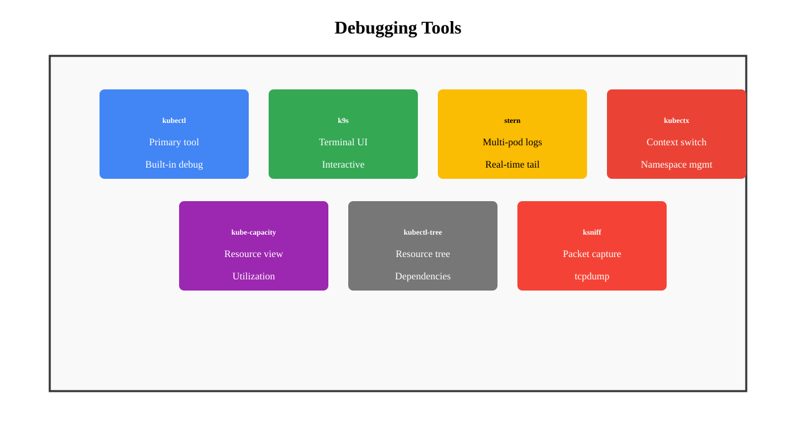

# Troubleshooting

---

## Troubleshooting Overview

1. **Systematic approach** to problems
1. **Understanding** error messages
1. **Using** the right tools
1. **Checking** logs and events
1. **Common** patterns and solutions

---

## Troubleshooting Workflow



---

## Common Pod Issues

1. **Pending**: Cannot be scheduled
1. **ImagePullBackOff**: Cannot pull image
1. **CrashLoopBackOff**: Container crashes
1. **RunContainerError**: Cannot start container
1. **OOMKilled**: Out of memory

---

## Pod Stuck in Pending

```bash
# Check pod status
kubectl get pod my-pod -o wide

# Check events
kubectl describe pod my-pod

# Common causes:
# - Insufficient resources
# - Node selector not matching
# - PVC not bound
# - Taints without tolerations

# Check node resources
kubectl top nodes
kubectl describe nodes
```

---

## ImagePullBackOff

```bash
# Check image details
kubectl describe pod my-pod | grep -A 5 "Image:"

# Common causes:
# - Wrong image name/tag
# - Private registry without secret
# - Registry down/unreachable
# - Rate limiting (Docker Hub)

# Fix: Create image pull secret
kubectl create secret docker-registry regcred \
  --docker-server=registry.io \
  --docker-username=user \
  --docker-password=pass
```

---

## CrashLoopBackOff

```bash
# Check logs
kubectl logs my-pod
kubectl logs my-pod --previous

# Check exit code
kubectl describe pod my-pod | grep -A 10 "Last State"

# Common causes:
# - Application error
# - Missing configuration
# - Wrong command/args
# - Health check failures

# Debug with shell
kubectl run debug --image=busybox --rm -it -- sh
```

---

## OOMKilled

```bash
# Check resource usage
kubectl top pod my-pod

# Check limits
kubectl describe pod my-pod | grep -A 5 "Limits:"

# View OOM events
kubectl get events --field-selector reason=OOMKilling

# Fix: Increase memory limits
resources:
  limits:
    memory: "512Mi"  # Increase this
  requests:
    memory: "256Mi"
```

---

## Debugging Deployments

```bash
# Check deployment status
kubectl get deployment my-app
kubectl describe deployment my-app

# Check rollout status
kubectl rollout status deployment/my-app

# Check replica sets
kubectl get rs -l app=my-app

# Common issues:
# - Insufficient quota
# - Image pull errors
# - Readiness probe failures
```

---

## Service Not Working

```bash
# Check service
kubectl get svc my-service
kubectl describe svc my-service

# Check endpoints
kubectl get endpoints my-service

# Test DNS
kubectl run test --image=busybox --rm -it -- \
  nslookup my-service

# Test connectivity
kubectl run test --image=nicolaka/netshoot --rm -it -- \
  curl my-service:80

# Common issues:
# - Selector not matching pods
# - Wrong target port
# - Network policies blocking
```

---

## Ingress Issues

```bash
# Check ingress
kubectl get ingress
kubectl describe ingress my-ingress

# Check ingress controller
kubectl get pods -n ingress-nginx
kubectl logs -n ingress-nginx deployment/ingress-nginx-controller

# Test with curl
curl -H "Host: app.example.com" http://ingress-ip/

# Common issues:
# - No ingress controller installed
# - Wrong host/path configuration
# - Backend service not found
# - TLS certificate issues
```

---

## Storage Problems

```bash
# Check PVC status
kubectl get pvc
kubectl describe pvc my-pvc

# Check PV status
kubectl get pv
kubectl describe pv

# Common issues:
# - No matching PV for PVC
# - Access mode mismatch
# - Storage class not found
# - Insufficient storage quota

# Check storage class
kubectl get storageclass
```

---

## Node Issues

```bash
# Check node status
kubectl get nodes
kubectl describe node node-name

# Check node conditions
kubectl get nodes -o json | \
  jq '.items[].status.conditions'

# Cordon node (prevent scheduling)
kubectl cordon node-name

# Drain node (move pods)
kubectl drain node-name --ignore-daemonsets

# Uncordon node
kubectl uncordon node-name
```

---

## Using kubectl debug

```bash
# Debug running pod
kubectl debug my-pod -it --image=busybox

# Debug with shared namespaces
kubectl debug my-pod -it --image=nicolaka/netshoot \
  --target=my-container

# Create debug copy of pod
kubectl debug my-pod -it --image=busybox \
  --copy-to=my-pod-debug

# Debug node
kubectl debug node/my-node -it --image=busybox
```

---

## Ephemeral Debug Containers

```bash
# Add ephemeral container
kubectl debug -it my-pod --image=busybox \
  --target=my-container -- sh

# View ephemeral containers
kubectl describe pod my-pod | grep -A 10 "Ephemeral"

# Use cases:
# - Debugging distroless images
# - Adding debugging tools
# - Network troubleshooting
# - File system inspection
```

---

## Logs Investigation

```bash
# View logs
kubectl logs pod-name
kubectl logs pod-name -c container-name
kubectl logs pod-name --all-containers

# Follow logs
kubectl logs -f pod-name

# Previous container logs
kubectl logs pod-name --previous

# Logs with timestamps
kubectl logs pod-name --timestamps

# Tail logs
kubectl logs pod-name --tail=100

# Logs since time
kubectl logs pod-name --since=1h
```

---

## Events Analysis

```bash
# Get all events
kubectl get events --sort-by='.lastTimestamp'

# Events for specific object
kubectl get events --field-selector \
  involvedObject.name=my-pod

# Watch events
kubectl get events --watch

# Events in namespace
kubectl get events -n my-namespace

# Filter by type
kubectl get events --field-selector type=Warning
```

---

## Network Troubleshooting

```bash
# Test DNS
kubectl run test --image=busybox --rm -it -- \
  nslookup kubernetes.default

# Test connectivity
kubectl run test --image=nicolaka/netshoot --rm -it -- bash
# Inside container:
curl service-name:port
nc -zv service-name port
ping pod-ip

# Check network policies
kubectl get networkpolicies

# Port forwarding for testing
kubectl port-forward pod-name 8080:80
```

---

## Performance Issues

```bash
# Check resource usage
kubectl top nodes
kubectl top pods
kubectl top pods --containers

# Check resource requests/limits
kubectl describe pod my-pod | grep -A 10 "Containers:"

# Check HPA status
kubectl get hpa
kubectl describe hpa my-hpa

# Check metrics server
kubectl get deployment metrics-server -n kube-system
```

---

## RBAC Troubleshooting

```bash
# Check permissions
kubectl auth can-i create pods
kubectl auth can-i create pods --as=jane
kubectl auth can-i create pods --as=system:serviceaccount:default:mysa

# List permissions
kubectl auth can-i --list

# Check roles and bindings
kubectl get roles,rolebindings
kubectl get clusterroles,clusterrolebindings

# Describe role
kubectl describe role my-role
```

---

## ConfigMap/Secret Issues

```bash
# Check if mounted
kubectl describe pod my-pod | grep -A 10 "Mounts:"

# Check if exists
kubectl get configmap my-config
kubectl get secret my-secret

# Verify content
kubectl get configmap my-config -o yaml
kubectl get secret my-secret -o jsonpath='{.data.key}' | base64 -d

# Common issues:
# - Wrong name referenced
# - Wrong key in configmap/secret
# - Missing in namespace
```

---

## CrashLoopBackOff Diagnosis



---

## DNS Troubleshooting

```bash
# Check CoreDNS pods
kubectl get pods -n kube-system -l k8s-app=kube-dns

# Check CoreDNS logs
kubectl logs -n kube-system -l k8s-app=kube-dns

# Test DNS resolution
kubectl run test --image=busybox --rm -it -- sh
# Inside pod:
nslookup kubernetes.default
nslookup my-service.my-namespace
cat /etc/resolv.conf

# Check DNS config
kubectl get configmap coredns -n kube-system -o yaml
```

---

## Cluster Component Issues

```bash
# Check control plane components
kubectl get pods -n kube-system

# Check component status
kubectl get componentstatuses

# Check API server
kubectl get --raw /healthz

# Check etcd
kubectl exec -n kube-system etcd-master -- \
  etcdctl endpoint health

# Check scheduler
kubectl logs -n kube-system kube-scheduler-master

# Check controller manager
kubectl logs -n kube-system kube-controller-manager-master
```

---

## Using Metrics

```bash
# Install metrics server if not present
kubectl apply -f https://github.com/kubernetes-sigs/\
metrics-server/releases/latest/download/components.yaml

# View node metrics
kubectl top nodes

# View pod metrics
kubectl top pods --all-namespaces
kubectl top pods --sort-by=memory
kubectl top pods --sort-by=cpu

# Container metrics
kubectl top pod my-pod --containers
```

---

## Common Error Messages

```yaml
# ErrImagePull
- Wrong image name
- Private registry auth

# InvalidImageName
- Malformed image reference

# RegistryUnavailable
- Registry down or blocked

# RunContainerError
- Command not found
- Permission issues

# PostStartHookError
- Lifecycle hook failed

# PreStopHookError
- Shutdown hook failed
```

---

## Health Check Debugging

```bash
# Test liveness endpoint
kubectl exec -it my-pod -- curl localhost:8080/healthz

# Test readiness endpoint
kubectl exec -it my-pod -- curl localhost:8080/ready

# Check probe configuration
kubectl get pod my-pod -o yaml | grep -A 20 Probe

# View probe events
kubectl describe pod my-pod | grep -i probe
kubectl get events --field-selector involvedObject.name=my-pod
```

---

## Resource Quota Issues

```bash
# Check quotas
kubectl get resourcequota
kubectl describe resourcequota my-quota

# Check current usage
kubectl get resourcequota my-quota -o yaml

# Check limit ranges
kubectl get limitrange
kubectl describe limitrange

# Common issues:
# - Exceeded CPU/memory quota
# - Exceeded object count
# - PVC quota exceeded
```

---

## Debugging Tools



---

## Emergency Recovery

```bash
# Backup critical resources
kubectl get all --all-namespaces -o yaml > backup.yaml

# Delete stuck namespace
kubectl get namespace stuck-ns -o json | \
  jq '.spec.finalizers = []' | \
  kubectl replace --raw /api/v1/namespaces/stuck-ns/finalize -f -

# Force delete pod
kubectl delete pod my-pod --grace-period=0 --force

# Reset failed deployment
kubectl rollout undo deployment/my-app
kubectl rollout restart deployment/my-app
```

---

## Best Practices

1. **Always check** logs and events first
1. **Use** kubectl describe for details
1. **Test** in isolation with debug pods
1. **Monitor** resource usage
1. **Document** solutions for future

---

## Troubleshooting Checklist

1. ✓ Check pod status and events
1. ✓ Review logs (current and previous)
1. ✓ Verify image and pull secrets
1. ✓ Check resource limits and quotas
1. ✓ Test network connectivity
1. ✓ Verify configurations and secrets
1. ✓ Check RBAC permissions
1. ✓ Review health checks

---

## Summary

1. Systematic approach to troubleshooting
1. Multiple tools and techniques available
1. Common patterns and solutions
1. Understanding error messages is key
1. Practice makes perfect
