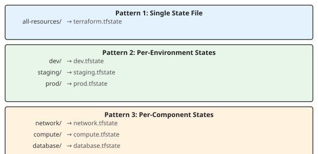

# State Management

## What is Terraform State?

- A JSON file that maps configuration to real-world resources
- Stores resource IDs, attributes, and metadata
- Default file: `terraform.tfstate`
- Created on first `terraform apply`
- Updated on every `apply` and `destroy`

---

## Why Does Terraform Need State?

- **Mapping**: Links config resources to real infrastructure
- **Performance**: Caches resource attributes (avoids querying APIs)
- **Dependencies**: Tracks resource relationships
- **Drift Detection**: Compares desired vs actual state
- **Collaboration**: Shared state enables team workflows

---

## State File Structure

```json
{
  "version": 4,
  "terraform_version": "1.7.0",
  "serial": 5,
  "lineage": "abc123-def456",
  "outputs": {
    "vpc_id": {
      "value": "vpc-12345",
      "type": "string"
    }
  },
  "resources": [
    {
      "mode": "managed",
      "type": "aws_vpc",
      "name": "main",
      "instances": [{"attributes": {"id": "vpc-12345"}}]
    }
  ]
}
```

---

## State File Lifecycle



---

## Viewing State

```bash
# Show full state in human-readable format
terraform show

# List all resources in state
terraform state list

# Show details of a specific resource
terraform state show aws_instance.web

# Output state as JSON
terraform show -json
```

---

## terraform state list Output

```bash
$ terraform state list

aws_vpc.main
aws_subnet.public[0]
aws_subnet.public[1]
aws_security_group.web
aws_instance.web
aws_db_instance.main
data.aws_ami.ubuntu
```

---

## terraform state show Output

```bash
$ terraform state show aws_instance.web

# aws_instance.web:
resource "aws_instance" "web" {
    ami                    = "ami-0c55b159cbfafe1f0"
    id                     = "i-0abc123def456"
    instance_type          = "t3.micro"
    private_ip             = "10.0.1.50"
    public_ip              = "54.123.45.67"
    subnet_id              = "subnet-12345"
    vpc_security_group_ids = ["sg-12345"]
    tags = {
        "Name" = "web-server"
    }
}
```

---

## Problems with Local State

- **No collaboration**: Only one person can modify at a time
- **No locking**: Risk of concurrent modifications
- **No encryption**: Secrets stored in plaintext
- **No backup**: Local disk failure loses state
- **No versioning**: Cannot roll back to previous state

---

## Remote State Overview


---

## Backend Configuration

```hcl
terraform {
  backend "s3" {
    bucket         = "my-terraform-state"
    key            = "prod/terraform.tfstate"
    region         = "us-east-1"
    encrypt        = true
    dynamodb_table = "terraform-locks"
  }
}
```

- Backends define where state is stored
- Configured in the `terraform` block
- Initialized with `terraform init`

---

## Available Backends

| Backend | Provider | Locking | Encryption |
|---------|----------|---------|------------|
| `s3` | AWS | DynamoDB | Yes |
| `azurerm` | Azure | Blob lease | Yes |
| `gcs` | GCP | Native | Yes |
| `consul` | HashiCorp | Native | Yes |
| `pg` | PostgreSQL | Native | Optional |
| `http` | Any | Optional | Optional |
| `cloud` | Terraform Cloud | Native | Yes |

---

## S3 Backend Setup

```hcl
# Create S3 bucket for state (bootstrap)
resource "aws_s3_bucket" "state" {
  bucket = "my-terraform-state"

  lifecycle {
    prevent_destroy = true
  }
}

resource "aws_s3_bucket_versioning" "state" {
  bucket = aws_s3_bucket.state.id
  versioning_configuration {
    status = "Enabled"
  }
}
```

---

## DynamoDB Table for Locking

```hcl
resource "aws_dynamodb_table" "locks" {
  name         = "terraform-locks"
  billing_mode = "PAY_PER_REQUEST"
  hash_key     = "LockID"

  attribute {
    name = "LockID"
    type = "S"
  }

  tags = {
    Name = "Terraform State Lock Table"
  }
}
```

---

## S3 Backend with Full Options

```hcl
terraform {
  backend "s3" {
    bucket         = "my-terraform-state"
    key            = "prod/network/terraform.tfstate"
    region         = "us-east-1"
    encrypt        = true
    dynamodb_table = "terraform-locks"
    acl            = "bucket-owner-full-control"
    kms_key_id     = "alias/terraform-state"
  }
}
```

---

## Azure Backend

```hcl
terraform {
  backend "azurerm" {
    resource_group_name  = "terraform-state-rg"
    storage_account_name = "tfstate12345"
    container_name       = "tfstate"
    key                  = "prod.terraform.tfstate"
  }
}
```

---

## GCS Backend

```hcl
terraform {
  backend "gcs" {
    bucket = "my-terraform-state"
    prefix = "prod/network"
  }
}
```

---

## Terraform Cloud Backend

```hcl
terraform {
  cloud {
    organization = "my-organization"

    workspaces {
      name = "my-workspace"
    }
  }
}
```

- Free tier available
- Built-in locking and versioning
- Web UI for state inspection
- Integration with VCS

---

## State Locking



---

## State Lock Error

```output
Error: Error locking state: Error acquiring the state lock

Lock Info:
  ID:        a1b2c3d4-e5f6-7890
  Path:      my-terraform-state/prod/terraform.tfstate
  Operation: OperationTypeApply
  Who:       user@hostname
  Version:   1.7.0
  Created:   2024-01-15 10:30:00 UTC
```

```bash
# Force unlock (use with extreme caution)
terraform force-unlock a1b2c3d4-e5f6-7890
```

---

## State File Organization Patterns



---

## Key Path Strategies for S3

```tree
s3://my-terraform-state/
├── global/
│   └── iam/terraform.tfstate
├── dev/
│   ├── network/terraform.tfstate
│   ├── compute/terraform.tfstate
│   └── database/terraform.tfstate
├── staging/
│   ├── network/terraform.tfstate
│   └── ...
└── prod/
    ├── network/terraform.tfstate
    └── ...
```

---

## Moving Resources in State

```bash
# Rename a resource in state
terraform state mv aws_instance.old aws_instance.new

# Move resource to a module
terraform state mv aws_instance.web module.compute.aws_instance.web

# Move between state files
terraform state mv -state-out=other.tfstate \
  aws_instance.web aws_instance.web
```

---

## Removing Resources from State

```bash
# Remove a resource from state (does NOT destroy it)
terraform state rm aws_instance.web

# Remove a module from state
terraform state rm module.vpc

# Remove a specific indexed resource
terraform state rm 'aws_instance.web[0]'
```

- Resource continues to exist in the cloud
- Terraform no longer manages it
- Useful for adopting resources into different configs

---

## Pulling and Pushing State

```bash
# Download remote state to local file
terraform state pull > terraform.tfstate.backup

# Upload local state to remote backend
terraform state push terraform.tfstate

# Force push (dangerous)
terraform state push -force terraform.tfstate
```

---

## Replacing Resources in State

```bash
# Mark a resource for replacement on next apply
terraform apply -replace="aws_instance.web"

# Previously known as "taint" (deprecated)
terraform taint aws_instance.web      # deprecated
terraform untaint aws_instance.web    # deprecated
```

- Forces recreation of a resource
- Useful when a resource is in a bad state

---

## State Backup

```misc
Automatic backups:
  terraform.tfstate         # Current state
  terraform.tfstate.backup  # Previous state

S3 versioning:
  Every state update creates a new version
  Previous versions accessible via S3 console

Manual backup:
  terraform state pull > backup-$(date +%Y%m%d).json
```

---

## Sensitive Data in State

- State file contains all resource attributes
- Passwords, API keys, and secrets are stored in plaintext
- Always encrypt state at rest

```misc
Mitigations:
  1. Use encrypted backends (S3 with KMS, Azure with encryption)
  2. Restrict access to state storage (IAM policies)
  3. Never commit state files to version control
  4. Use Terraform Cloud for managed encryption
  5. Mark variables as sensitive = true
```

---

## Migrating State Backends

```bash
# Step 1: Update backend configuration in .tf files

# Step 2: Re-initialize with migration
terraform init -migrate-state

# Terraform will ask:
# Do you want to copy existing state to the new backend?
# Enter "yes"

# Step 3: Verify state is accessible
terraform state list
```

---

## State Disaster Recovery

```bash
# If state is lost but resources exist:

# 1. Create a new empty state
terraform init

# 2. Import each resource
terraform import aws_vpc.main vpc-12345
terraform import aws_instance.web i-abc123

# 3. Verify configuration matches
terraform plan
# Should show no changes if config matches reality
```

---

## Chapter Summary

- State maps Terraform config to real-world resources
- Local state is unsuitable for team collaboration
- Use remote backends (S3, Azure Blob, GCS) for shared state
- Enable state locking with DynamoDB (AWS) or native locking
- Always encrypt state files at rest
- Use `terraform state` commands to inspect and modify state
- Never commit state files to version control
- Organize state by environment and component
