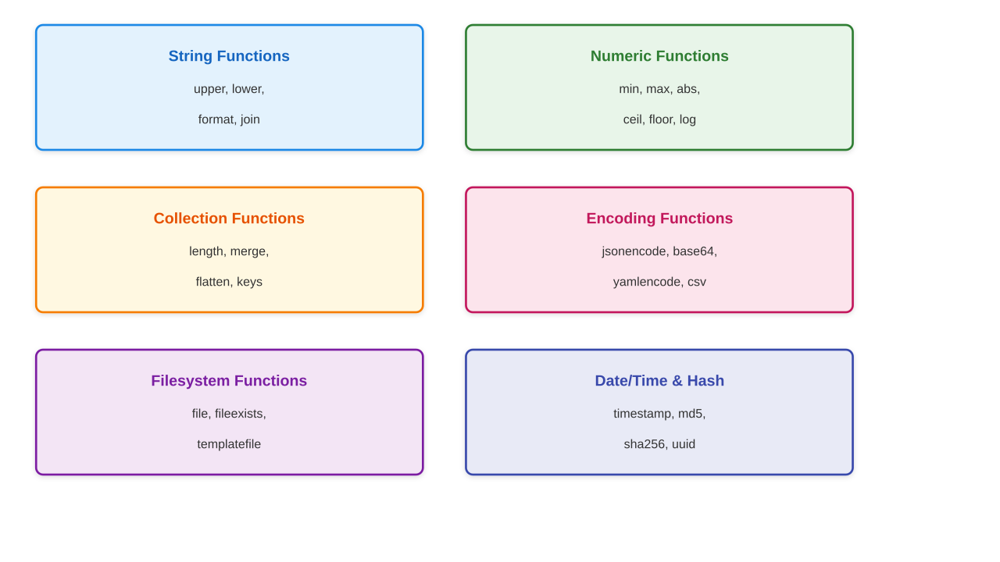

# Built-in Functions and Interpolation

## String Interpolation

```hcl
variable "project" {
  default = "webapp"
}

variable "environment" {
  default = "prod"
}

# String interpolation with ${}
locals {
  bucket_name = "${var.project}-${var.environment}-data"
  greeting    = "Hello, ${var.project}!"
}
# Result: "webapp-prod-data"
```

---

## Directive Interpolation

```hcl
# Conditional in interpolation
locals {
  suffix = "instance-${var.env == "prod" ? "production" : "non-prod"}"
}

# Heredoc with interpolation
locals {
  config = <<-EOT
    server_name = ${var.project}
    environment = ${var.environment}
    port        = ${var.port}
  EOT
}
```

---

## Template Directives

```hcl
# For directive in templates
locals {
  hosts = templatefile("${path.module}/hosts.tpl", {
    servers = ["web1", "web2", "web3"]
  })
}
```

```template
# hosts.tpl
%{ for server in servers ~}
${server}.example.com
%{ endfor ~}

# Output:
# web1.example.com
# web2.example.com
# web3.example.com
```

---

## Conditional Directive in Templates

```template
# config.tpl
%{ if environment == "prod" ~}
log_level = "warn"
replicas  = 3
%{ else ~}
log_level = "debug"
replicas  = 1
%{ endif ~}
```

```hcl
locals {
  config = templatefile("${path.module}/config.tpl", {
    environment = var.environment
  })
}
```

---

## Function Categories



---

## Testing Functions in Console

```bash
$ terraform console

> upper("hello")
"HELLO"

> format("Hello, %s! You have %d items.", "Alice", 5)
"Hello, Alice! You have 5 items."

> length(["a", "b", "c"])
3

> max(5, 12, 9)
12
```

---

## String Functions: upper, lower, title

```hcl
locals {
  name = "hello world"

  upper_name = upper(local.name)
  # "HELLO WORLD"

  lower_name = lower("HELLO")
  # "hello"

  title_name = title(local.name)
  # "Hello World"
}
```

---

## String Functions: format, formatlist

```hcl
locals {
  # format - printf-style formatting
  message = format("Server %s has %d CPUs", "web1", 4)
  # "Server web1 has 4 CPUs"

  # formatlist - format each element
  servers = ["web", "api", "db"]
  fqdns   = formatlist("%s.example.com", local.servers)
  # ["web.example.com", "api.example.com", "db.example.com"]
}
```

---

## String Functions: join, split

```hcl
locals {
  # join - concatenate list elements
  csv = join(",", ["a", "b", "c"])
  # "a,b,c"

  path = join("/", ["home", "user", "config"])
  # "home/user/config"

  # split - break string into list
  parts = split(",", "a,b,c")
  # ["a", "b", "c"]

  segments = split("/", "us-east-1a")
  # ["us-east-1a"]
}
```

---

## String Functions: replace, regex

```hcl
locals {
  # replace - string substitution
  clean = replace("hello-world", "-", "_")
  # "hello_world"

  # regex - extract pattern
  match = regex("^([a-z]+)-([0-9]+)$", "server-42")
  # ["server", "42"]

  # regexall - find all matches
  numbers = regexall("[0-9]+", "port 80 and 443")
  # ["80", "443"]
}
```

---

## String Functions: substr, trimspace

```hcl
locals {
  # substr(string, offset, length)
  prefix = substr("us-east-1a", 0, 9)
  # "us-east-1"

  # trim functions
  trimmed  = trimspace("  hello  ")    # "hello"
  no_prefix = trimprefix("helloworld", "hello")  # "world"
  no_suffix = trimsuffix("helloworld", "world")  # "hello"
}
```

---

## String Functions: startswith, endswith

```hcl
locals {
  # startswith and endswith (Terraform 1.3+)
  is_prod = startswith(var.environment, "prod")
  is_json = endswith(var.filename, ".json")
}

variable "instance_type" {
  type = string
  validation {
    condition     = startswith(var.instance_type, "t3.")
    error_message = "Only t3 instance types are allowed."
  }
}
```

---

## Numeric Functions

```hcl
locals {
  # Basic math
  minimum = min(5, 12, 9)      # 5
  maximum = max(5, 12, 9)      # 12
  absolute = abs(-42)          # 42

  # Rounding
  rounded_up   = ceil(4.3)    # 5
  rounded_down = floor(4.7)   # 4

  # Logarithm
  log_value = log(100, 10)    # 2

  # Power
  power = pow(2, 10)          # 1024

  # Signum
  sign = signum(-5)           # -1
}
```

---

## Numeric Functions in Practice

```hcl
variable "desired_capacity" {
  type    = number
  default = 7
}

locals {
  # Distribute instances across AZs
  azs = ["us-east-1a", "us-east-1b", "us-east-1c"]
  instances_per_az = ceil(var.desired_capacity / length(local.azs))
  # ceil(7 / 3) = ceil(2.33) = 3
}
```

---

## Collection Functions: length

```hcl
locals {
  # length works on strings, lists, and maps
  string_len = length("hello")           # 5
  list_len   = length(["a", "b", "c"])   # 3
  map_len    = length({ a = 1, b = 2 })  # 2
}

resource "aws_subnet" "public" {
  count      = length(var.subnet_cidrs)
  cidr_block = var.subnet_cidrs[count.index]
  # ...
}
```

---

## Collection Functions: keys, values

```hcl
variable "tags" {
  default = {
    Name        = "web-server"
    Environment = "prod"
    Team        = "platform"
  }
}

locals {
  tag_keys   = keys(var.tags)
  # ["Environment", "Name", "Team"]

  tag_values = values(var.tags)
  # ["prod", "web-server", "platform"]
}
```

---

## Collection Functions: merge

```hcl
locals {
  default_tags = {
    ManagedBy   = "Terraform"
    Environment = var.environment
  }

  extra_tags = {
    Team    = "platform"
    Project = var.project
  }

  # merge combines maps (later values win)
  all_tags = merge(local.default_tags, local.extra_tags)
}

resource "aws_instance" "web" {
  tags = merge(local.all_tags, { Name = "web-server" })
  # ...
}
```

---

## Collection Functions: concat, flatten

```hcl
locals {
  # concat - join lists
  all_subnets = concat(var.public_subnets, var.private_subnets)
  # ["10.0.1.0/24", "10.0.2.0/24", "10.0.3.0/24", "10.0.4.0/24"]

  # flatten - reduce nested lists
  nested = [["a", "b"], ["c"], ["d", "e"]]
  flat   = flatten(local.nested)
  # ["a", "b", "c", "d", "e"]
}
```

---

## Collection Functions: lookup, element

```hcl
variable "instance_types" {
  default = {
    dev  = "t3.micro"
    prod = "t3.large"
  }
}

locals {
  # lookup with default value
  instance_type = lookup(var.instance_types, var.environment, "t3.small")

  # element - index into list (wraps around)
  azs = ["us-east-1a", "us-east-1b", "us-east-1c"]
  az  = element(local.azs, 5)  # "us-east-1c" (5 % 3 = 2)
}
```

---

## Collection Functions: contains, distinct

```hcl
locals {
  valid_envs = ["dev", "staging", "prod"]

  # contains - check membership
  is_valid = contains(local.valid_envs, var.environment)

  # distinct - remove duplicates
  unique = distinct(["a", "b", "a", "c", "b"])
  # ["a", "b", "c"]

  # compact - remove empty strings
  clean = compact(["a", "", "b", "", "c"])
  # ["a", "b", "c"]
}
```

---

## Collection Functions: zipmap

```hcl
locals {
  names = ["web", "api", "db"]
  ids   = ["i-111", "i-222", "i-333"]

  # zipmap - create map from two lists
  instance_map = zipmap(local.names, local.ids)
  # { web = "i-111", api = "i-222", db = "i-333" }
}
```

---

## For Expressions

```hcl
locals {
  names = ["alice", "bob", "charlie"]

  # Transform list
  upper_names = [for name in local.names : upper(name)]
  # ["ALICE", "BOB", "CHARLIE"]

  # Filter list
  long_names = [for name in local.names : name if length(name) > 3]
  # ["alice", "charlie"]

  # Create map from list
  name_lengths = { for name in local.names : name => length(name) }
  # { alice = 5, bob = 3, charlie = 7 }
}
```

---

## For Expressions with Maps

```hcl
variable "users" {
  default = {
    alice   = "admin"
    bob     = "developer"
    charlie = "viewer"
  }
}

locals {
  # Filter map
  admins = { for name, role in var.users : name => role if role == "admin" }
  # { alice = "admin" }

  # Transform map values
  upper_roles = { for name, role in var.users : name => upper(role) }
  # { alice = "ADMIN", bob = "DEVELOPER", charlie = "VIEWER" }
}
```

---

## Encoding Functions: jsonencode, jsondecode

```hcl
locals {
  # Encode HCL to JSON
  policy = jsonencode({
    Version = "2012-10-17"
    Statement = [{
      Effect   = "Allow"
      Action   = ["s3:GetObject"]
      Resource = "*"
    }]
  })

  # Decode JSON to HCL
  config = jsondecode(file("${path.module}/config.json"))
  app_name = local.config.name
}
```

---

## Encoding Functions: yamlencode, yamldecode

```hcl
locals {
  # Encode to YAML
  k8s_config = yamlencode({
    apiVersion = "v1"
    kind       = "ConfigMap"
    metadata = {
      name = "app-config"
    }
    data = {
      DATABASE_URL = var.db_url
    }
  })

  # Decode YAML
  values = yamldecode(file("${path.module}/values.yaml"))
}
```

---

## Encoding Functions: base64

```hcl
locals {
  # Encode to base64
  encoded = base64encode("Hello, World!")
  # "SGVsbG8sIFdvcmxkIQ=="

  # Decode from base64
  decoded = base64decode("SGVsbG8sIFdvcmxkIQ==")
  # "Hello, World!"

  # base64 for user data
  user_data = base64encode(templatefile("startup.sh", {
    env = var.environment
  }))
}
```

---

## Encoding Functions: csvdecode

```hcl
# users.csv:
# name,role,department
# alice,admin,engineering
# bob,developer,engineering

locals {
  users = csvdecode(file("${path.module}/users.csv"))
  # [
  #   { name = "alice", role = "admin", department = "engineering" },
  #   { name = "bob", role = "developer", department = "engineering" }
  # ]
}

resource "aws_iam_user" "users" {
  for_each = { for user in local.users : user.name => user }
  name     = each.value.name
}
```

---

## Filesystem Functions: file, fileexists

```hcl
locals {
  # Read file contents as string
  public_key = file("${path.module}/keys/id_rsa.pub")

  # Check if file exists
  has_config = fileexists("${path.module}/custom.conf")

  # Conditional file read
  config = local.has_config ? file("${path.module}/custom.conf") : ""
}

resource "aws_key_pair" "deployer" {
  key_name   = "deployer-key"
  public_key = local.public_key
}
```

---

## Filesystem Functions: templatefile

```hcl
# startup.sh.tpl:
# #!/bin/bash
# echo "Setting up ${server_name}"
# apt-get update
# apt-get install -y ${join(" ", packages)}

resource "aws_instance" "web" {
  user_data = templatefile("${path.module}/startup.sh.tpl", {
    server_name = "web-server"
    packages    = ["nginx", "curl", "jq"]
  })
  # ...
}
```

---

## Filesystem Functions: fileset, filebase64

```hcl
locals {
  # fileset - find files matching a pattern
  config_files = fileset("${path.module}/configs", "*.json")
  # {"app.json", "db.json", "cache.json"}

  # Upload each config file to S3
}

resource "aws_s3_object" "configs" {
  for_each = local.config_files
  bucket   = aws_s3_bucket.configs.id
  key      = each.value
  source   = "${path.module}/configs/${each.value}"
}
```

---

## Filesystem Functions: filemd5, filesha256

```hcl
resource "aws_s3_object" "app" {
  bucket = aws_s3_bucket.deploy.id
  key    = "app.zip"
  source = "${path.module}/dist/app.zip"

  # Detect content changes
  etag = filemd5("${path.module}/dist/app.zip")
}

resource "aws_lambda_function" "handler" {
  filename         = "${path.module}/dist/lambda.zip"
  source_code_hash = filebase64sha256("${path.module}/dist/lambda.zip")
  # ...
}
```

---

## Date and Time Functions

```hcl
locals {
  # Current timestamp (changes every run)
  now = timestamp()
  # "2024-01-15T10:30:00Z"

  # Format timestamp
  date = formatdate("YYYY-MM-DD", timestamp())
  # "2024-01-15"

  # Time addition
  expiry = timeadd(timestamp(), "720h")
  # 30 days from now

  # Plan time (stable within plan)
  plan_time = plantimestamp()
}
```

---

## Hash and Crypto Functions

```hcl
locals {
  # MD5 hash
  content_hash = md5("Hello, World!")
  # "65a8e27d8879283831b664bd8b7f0ad4"

  # SHA256 hash
  secure_hash = sha256("Hello, World!")

  # UUID generation
  unique_id = uuid()
  # "a1b2c3d4-e5f6-7890-abcd-ef1234567890"

  # Base64 SHA256 (for Lambda)
  code_hash = base64sha256(file("lambda.zip"))
}
```

---

## Type Conversion Functions

```hcl
locals {
  # Convert to number
  port = tonumber("8080")  # 8080

  # Convert to string
  port_str = tostring(8080)  # "8080"

  # Convert to list
  single = tolist(toset(["a", "b", "a"]))  # ["a", "b"]

  # Convert to set
  unique = toset(["a", "b", "a"])  # toset(["a", "b"])

  # Convert to map
  config = tomap({ key = "value" })
}
```

---

## IP Network Functions

```hcl
locals {
  # cidrsubnet - calculate subnet CIDR
  subnet1 = cidrsubnet("10.0.0.0/16", 8, 0)   # "10.0.0.0/24"
  subnet2 = cidrsubnet("10.0.0.0/16", 8, 1)   # "10.0.1.0/24"
  subnet3 = cidrsubnet("10.0.0.0/16", 8, 255) # "10.0.255.0/24"

  # cidrhost - calculate host IP in CIDR
  gateway = cidrhost("10.0.1.0/24", 1)  # "10.0.1.1"

  # cidrnetmask - get netmask
  mask = cidrnetmask("10.0.0.0/16")  # "255.255.0.0"
}
```

---

## cidrsubnet Explained

```tree
cidrsubnet(prefix, newbits, netnum)

Example: cidrsubnet("10.0.0.0/16", 8, 1)
  - prefix:  10.0.0.0/16 (base network)
  - newbits: 8 (add 8 bits to prefix = /24)
  - netnum:  1 (first subnet = 10.0.1.0)
  - Result:  10.0.1.0/24

  10.0.0.0/16
  ├── 10.0.0.0/24  (netnum=0)
  ├── 10.0.1.0/24  (netnum=1)
  ├── 10.0.2.0/24  (netnum=2)
  └── ...
  └── 10.0.255.0/24 (netnum=255)
```

---

## Practical Example: Dynamic Subnets

```hcl
variable "vpc_cidr" {
  default = "10.0.0.0/16"
}

locals {
  azs = ["us-east-1a", "us-east-1b", "us-east-1c"]
}

resource "aws_subnet" "public" {
  count             = length(local.azs)
  vpc_id            = aws_vpc.main.id
  cidr_block        = cidrsubnet(var.vpc_cidr, 8, count.index)
  availability_zone = local.azs[count.index]

  tags = {
    Name = "public-${local.azs[count.index]}"
  }
}
```

---

## The can and try Functions

```hcl
locals {
  # can - test if expression evaluates without error
  has_name = can(var.config.name)

  # try - return first expression that succeeds
  name = try(var.config.name, var.config.id, "unknown")

  # Useful for optional attributes
  port = try(var.settings.port, 8080)
}

variable "instance_type" {
  validation {
    condition     = can(regex("^t3\\.", var.instance_type))
    error_message = "Must start with t3."
  }
}
```

---

## Practical Example: Tag Merging

```hcl
locals {
  default_tags = {
    ManagedBy   = "Terraform"
    Environment = var.environment
    Project     = var.project
    CreatedAt   = formatdate("YYYY-MM-DD", timestamp())
  }
}

resource "aws_instance" "web" {
  ami           = data.aws_ami.ubuntu.id
  instance_type = lookup(var.instance_types, var.environment, "t3.micro")

  tags = merge(local.default_tags, {
    Name = format("%s-%s-web", var.project, var.environment)
    Role = "webserver"
  })
}
```

---

## Chapter Summary

- String interpolation uses `${}` syntax inside strings
- Template directives use `%{ for }` and `%{ if }` syntax
- String functions: `upper`, `lower`, `format`, `join`, `split`, `replace`
- Collection functions: `length`, `merge`, `flatten`, `lookup`, `keys`
- Encoding functions: `jsonencode`, `yamlencode`, `base64encode`
- Filesystem functions: `file`, `templatefile`, `fileset`, `filemd5`
- Network functions: `cidrsubnet`, `cidrhost` for IP calculations
- Use `can` and `try` for error-safe expressions
- Test expressions interactively with `terraform console`
