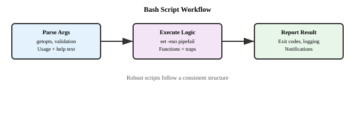

# Automation and Scripting
Leveraging automation for DevOps efficiency

---

## Scripting Languages

---

## Python in DevOps

1. Infrastructure automation
1. Log analysis
1. Monitoring scripts
1. Test automation
1. API integration

---

## Bash Scripting

---

## PowerShell Automation

1. Windows administration
1. Azure management
1. Active Directory
1. System monitoring
1. Resource provisioning

---

## Automation Frameworks

---

## Test Automation

1. Unit testing
1. Integration testing
1. Performance testing
1. Security testing
1. UI automation

---

## CI/CD Pipeline Scripts

---

## Infrastructure Automation

1. Resource provisioning
1. Configuration management
1. Network setup
1. Security controls
1. Monitoring configuration

---

## Monitoring Scripts

---

## Error Handling

1. Exception management
1. Retry mechanisms
1. Logging
1. Alerting
1. Recovery procedures

---

## Script Management

---

## Best Practices

1. Code reusability
1. Error handling
1. Logging
1. Documentation
1. Version control

---

## Security Considerations

---

## Performance Optimization

1. Resource efficiency
1. Execution speed
1. Memory management
1. Parallel processing
1. Caching strategies

---

## Deployment Automation

