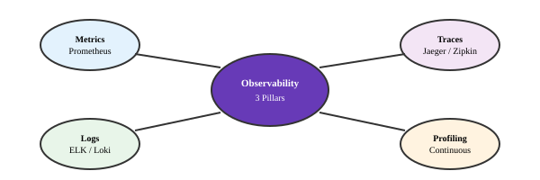
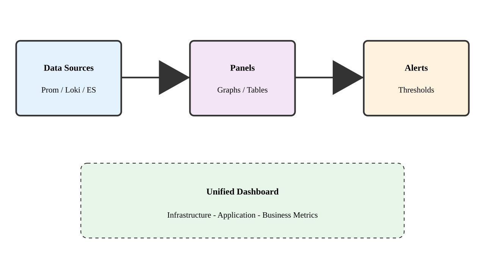

# Emerging Technologies
Modern observability and service management tools

---

## Advanced Observability

---

## Prometheus Architecture

1. Time series database
1. Query language
1. Alert manager
1. Data visualization
1. Service discovery

---

## Grafana Dashboards

---

## Distributed Tracing

1. Request tracking
1. Latency analysis
1. Error detection
1. Service mapping
1. Performance optimization

---

## Jaeger Components

---

## Service Mesh Benefits

1. Traffic management
1. Security policies
1. Observability
1. Load balancing
1. Circuit breaking

---

## Istio Architecture

---

## Linkerd Features

1. Service discovery
1. Load balancing
1. Traffic splitting
1. Failure handling
1. Metrics collection

---

## Modern Logging

---

## ELK Stack Components

1. Elasticsearch storage
1. Logstash processing
1. Kibana visualization
1. Beats data shipping
1. Machine learning

---

## OpenTelemetry

---

## Cloud Native Tools

1. Container scanning
1. Policy enforcement
1. Cost management
1. Performance monitoring
1. Security analysis

---

## Future Trends

---

## Integration Patterns

1. API management
1. Event streaming
1. Message queuing
1. Service discovery
1. Load balancing
