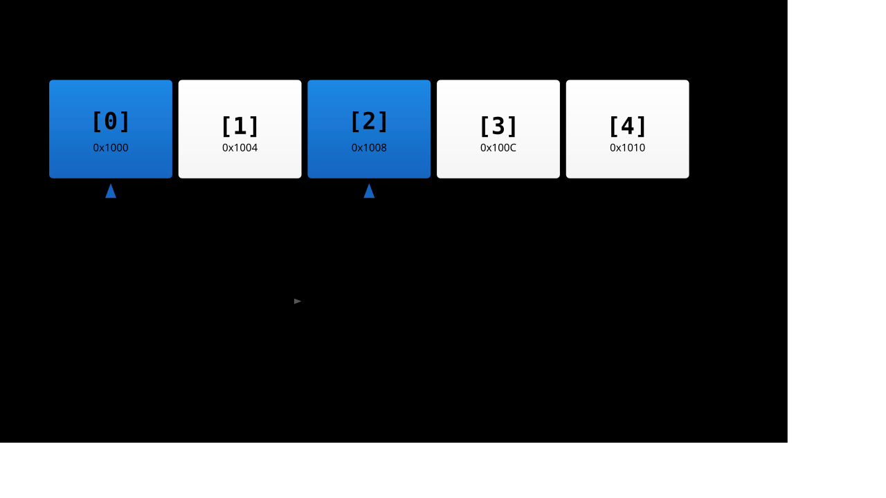

# Effective Pointers

---

## Chapter Overview

1. Arrays vs pointers
1. Dynamic memory principles
1. Void pointers
1. Data structures implementation
1. Function pointers
1. Optimization techniques

---

## Pointers Fundamentals

```c
int x = 42;
int* ptr = &x;     // ptr holds address of x
int value = *ptr;  // dereference to get value

// Pointer arithmetic
ptr++;             // Move to next int
ptr += 5;          // Move 5 ints forward
```

---

## Arrays and Pointers

Arrays decay to pointers in most contexts, but they're not the same!

```c
int arr[10];
int* ptr = arr;    // OK - array decays to pointer

// sizeof difference
sizeof(arr);       // 40 bytes (10 * sizeof(int))
sizeof(ptr);       // 4 or 8 bytes (pointer size)
```

---

## Array vs Pointer Declaration

```c
// Array - fixed size, stack allocated
int arr[100];

// Pointer - must point to allocated memory
int* ptr = malloc(100 * sizeof(int));

// Array of pointers
int* arr_of_ptrs[10];

// Pointer to array
int (*ptr_to_arr)[10];
```

---

## Pointer Arithmetic



---

## Multi-dimensional Arrays

```c
// True 2D array - contiguous memory
int arr2d[3][4];

// Array of pointers - not contiguous
int* arr_ptrs[3];
for (int i = 0; i < 3; i++) {
    arr_ptrs[i] = malloc(4 * sizeof(int));
}

// Access is same for both
arr2d[1][2] = 42;
arr_ptrs[1][2] = 42;
```

---

## Dynamic Memory in Embedded

Usually avoided, but when necessary:

```c
// Custom memory pool
static uint8_t heap[4096];
static size_t heap_used = 0;

void* my_malloc(size_t size) {
    if (heap_used + size > sizeof(heap)) {
        return NULL;
    }
    void* ptr = &heap[heap_used];
    heap_used += size;
    return ptr;
}
```

---

## Void Pointers

Generic pointer type - can point to any data type

```c
void* generic_ptr;
int x = 42;
float f = 3.14f;

generic_ptr = &x;  // Points to int
generic_ptr = &f;  // Now points to float

// Must cast to use
int* int_ptr = (int*)generic_ptr;
float* float_ptr = (float*)generic_ptr;
```

---

## Void Pointer Uses

```c
// Generic memory operations
void* memcpy(void* dest, const void* src, size_t n);
void* memset(void* s, int c, size_t n);

// Generic data structures
typedef struct {
    void* data;
    size_t size;
    size_t capacity;
} generic_buffer_t;
```

---

## Implementing a Stack

```c
typedef struct {
    void* data;
    size_t element_size;
    size_t capacity;
    size_t top;
} stack_t;

void stack_push(stack_t* s, const void* item) {
    if (s->top >= s->capacity) return;

    uint8_t* dest = (uint8_t*)s->data +
                    (s->top * s->element_size);
    memcpy(dest, item, s->element_size);
    s->top++;
}
```

---

## Implementing a Queue

```c
typedef struct {
    uint8_t* buffer;
    size_t size;
    size_t head;
    size_t tail;
    size_t count;
} queue_t;

bool queue_enqueue(queue_t* q, uint8_t data) {
    if (q->count >= q->size) return false;

    q->buffer[q->tail] = data;
    q->tail = (q->tail + 1) % q->size;
    q->count++;
    return true;
}
```

---

## Linked List Implementation

```c
typedef struct node {
    void* data;
    struct node* next;
} node_t;

typedef struct {
    node_t* head;
    node_t* tail;
    size_t count;
} list_t;

void list_append(list_t* list, void* data) {
    node_t* new_node = malloc(sizeof(node_t));
    new_node->data = data;
    new_node->next = NULL;

    if (list->tail) {
        list->tail->next = new_node;
    } else {
        list->head = new_node;
    }
    list->tail = new_node;
    list->count++;
}
```

---

## Function Pointers Basics

```c
// Function pointer declaration
int (*operation)(int, int);

// Functions to point to
int add(int a, int b) { return a + b; }
int mul(int a, int b) { return a * b; }

// Usage
operation = add;
int result = operation(5, 3);  // 8

operation = mul;
result = operation(5, 3);      // 15
```

---

## Function Pointer Syntax

```c
// Return type (*name)(parameters)
void (*simple_func)(void);
int (*binary_op)(int, int);
void* (*complex_func)(const char*, size_t);

// Array of function pointers
void (*handlers[10])(void);

// Function returning function pointer
void (*get_handler(int id))(void);
```

---

## Callbacks with Function Pointers

```c
// Timer callback
typedef void (*timer_callback_t)(void);

typedef struct {
    uint32_t period;
    timer_callback_t callback;
    bool active;
} timer_t;

void timer_tick(timer_t* timer) {
    if (timer->active && --timer->period == 0) {
        timer->callback();
        timer->active = false;
    }
}
```

---

## State Machine Implementation

```c
typedef enum {
    STATE_IDLE,
    STATE_RUNNING,
    STATE_ERROR
} state_t;

typedef state_t (*state_handler_t)(void);

state_t handle_idle(void) {
    if (start_requested) {
        return STATE_RUNNING;
    }
    return STATE_IDLE;
}

// State machine
state_handler_t states[] = {
    handle_idle,
    handle_running,
    handle_error
};
```

---

## Command Pattern

```c
typedef struct {
    const char* name;
    void (*execute)(int argc, char* argv[]);
} command_t;

void cmd_help(int argc, char* argv[]) {
    printf("Available commands...\n");
}

void cmd_status(int argc, char* argv[]) {
    printf("System status...\n");
}

command_t commands[] = {
    {"help", cmd_help},
    {"status", cmd_status},
    {NULL, NULL}
};
```

---

## Pointer Optimizations

```c
// Loop optimization with pointers
void array_sum(const int* arr, size_t n) {
    const int* end = arr + n;
    int sum = 0;

    // Pointer iteration often faster
    while (arr < end) {
        sum += *arr++;
    }
}

// vs index-based
void array_sum_idx(const int arr[], size_t n) {
    int sum = 0;
    for (size_t i = 0; i < n; i++) {
        sum += arr[i];  // Extra multiplication
    }
}
```

---

## Restrict Keyword

```c
// Tell compiler pointers don't alias
void copy_array(int* restrict dest,
                const int* restrict src,
                size_t n) {
    // Compiler can optimize better
    for (size_t i = 0; i < n; i++) {
        dest[i] = src[i];
    }
}

// Without restrict, compiler assumes possible overlap
```

---

## Alignment Considerations

```c
// Ensure proper alignment
typedef struct {
    char c;
    // 3 bytes padding
    int i;
} __attribute__((aligned(4))) aligned_struct_t;

// Aligned memory allocation
void* aligned_alloc(size_t alignment, size_t size) {
    void* ptr = malloc(size + alignment - 1);
    if (!ptr) return NULL;

    uintptr_t addr = (uintptr_t)ptr;
    uintptr_t aligned = (addr + alignment - 1)
                        & ~(alignment - 1);
    return (void*)aligned;
}
```

---

## Variable-Sized Structures

```c
// Flexible array member (C99)
typedef struct {
    size_t len;
    uint8_t data[];  // Must be last member
} packet_t;

// Allocation
packet_t* create_packet(size_t size) {
    packet_t* pkt = malloc(sizeof(packet_t) + size);
    if (pkt) {
        pkt->len = size;
    }
    return pkt;
}
```

---

## Pointer Aliasing Issues

```c
// Dangerous aliasing
void process(int* a, int* b) {
    *a = 5;
    *b = 10;
    // If a == b, result is 10, not 5!
}

// Type punning
float f = 3.14f;
uint32_t bits = *(uint32_t*)&f;  // Undefined behavior!

// Correct way
union {
    float f;
    uint32_t u;
} pun = { .f = 3.14f };
uint32_t bits = pun.u;
```

---

## Const Correctness with Pointers

```c
int x = 42;
const int* ptr1 = &x;     // Can't modify *ptr1
int* const ptr2 = &x;     // Can't modify ptr2
const int* const ptr3 = &x; // Can't modify either

// Pointer to pointer
char** argv;              // Pointer to pointer to char
const char* const* argv2; // Pointer to pointer to const char
```

---

## Common Pointer Pitfalls

```c
// Dangling pointer
int* get_value() {
    int local = 42;
    return &local;  // Danger! Returns stack address
}

// Buffer overflow
void copy_string(char* dest, const char* src) {
    while (*src) {
        *dest++ = *src++;  // No bounds checking!
    }
}

// Null pointer dereference
void process(int* ptr) {
    int value = *ptr;  // Check ptr != NULL first!
}
```

---

## Defensive Programming

```c
// Always check pointers
void safe_process(int* ptr) {
    if (!ptr) {
        handle_error();
        return;
    }
    // Safe to use ptr
}

// Bounds checking
void safe_copy(char* dest, size_t dest_size,
               const char* src) {
    size_t i;
    for (i = 0; i < dest_size - 1 && src[i]; i++) {
        dest[i] = src[i];
    }
    dest[i] = '\0';
}
```

---

## Summary

1. Understand array-pointer relationship
1. Use void pointers for generic code
1. Implement efficient data structures
1. Master function pointers for callbacks
1. Optimize with pointer arithmetic
1. Always validate pointers

---

## Key Takeaways

1. **Pointers** are powerful but dangerous
1. **Function pointers** enable flexible designs
1. **Generic programming** via void pointers
1. **Performance** gains through pointer optimization
1. **Safety** through defensive programming
