# Git Branches
---
## Why We Need Branches
- Parallel development
- Feature isolation
- Experimentation
- Release management
---
## Branch Theory


---
## Local Branching Benefits
- Fast and lightweight
- Private workspace
- Easy experimentation
- Quick context switching
---
## Creating Branches
- git branch command
- Naming conventions
- Branch from specific commits
- Branch best practices
---
## Branch Commands
```bash
git branch feature_name
git checkout -b new_feature
git switch -c another_feature
```
---
## Branch Descriptions
- Adding branch descriptions
- Documentation purposes
- Team communication
- git branch --edit-description
---
## Renaming Branches
- Local branch renaming
- Remote branch considerations
- git branch -m
- Updating remote references
---
## Working on Branches
- Switching between branches
- Tracking changes
- Commit management
- Branch isolation
---
## Branch Navigation


---
## Git Checkout vs Switch
- Traditional checkout
- Modern switch command
- When to use each
- Feature comparison
---
## Branch Visualization
- git log --graph
- git show-branch
- GUI tools
- Understanding history
---
## Branch Cleanup
- Deleting local branches
- Remote branch cleanup
- git branch -d
- git branch -D
---
## The Git Reflog
- Safety net for branches
- Recovery operations
- Historical reference
- Temporary references
---
## Branch Types
- Feature branches
- Release branches
- Hotfix branches
- Integration branches
---
## Feature Branch Workflow


---
## Release Branches
- Version management
- Stabilization phase
- Bugfix handling
- Maintenance support
---
## Hotfix Branches
- Emergency fixes
- Production issues
- Quick deployment
- Multiple target branches
---
## Integration Branches
- Combining features
- Testing integration
- Conflict resolution
- Quality assurance
---
## Branch Organization
- Hierarchical structure
- Naming conventions
- Lifecycle management
- Team coordination
---
## Branch Policies
- Protection rules
- Review requirements
- Automation checks
- Access control
---
## Branch Strategies
- GitFlow
- Trunk-based development
- GitHub Flow
- Custom workflows
---
## GitFlow Model


---
## Trunk-Based Development
- Single main branch
- Short-lived feature branches
- Frequent integration
- Continuous delivery
---
## Working with Tags
- Annotated tags
- Lightweight tags
- Version marking
- Release management
---
## Branch Performance
- Repository size
- History complexity
- Network impact
- Optimization tips
---
## Common Patterns
- Branch per feature
- Branch per release
- Branch per environment
- Branch per team
---
## Automation
- Branch creation
- Integration testing
- Deployment flows
- Cleanup routines
---
## Best Practices
- Clear naming
- Regular cleanup
- Documentation
- Team communication
---
## Troubleshooting
- Lost branches
- Merge conflicts
- Integration issues
- Recovery procedures
---
## Advanced Topics
- Branch filtering
- Branch restrictions
- Custom attributes
- Branch hooks
