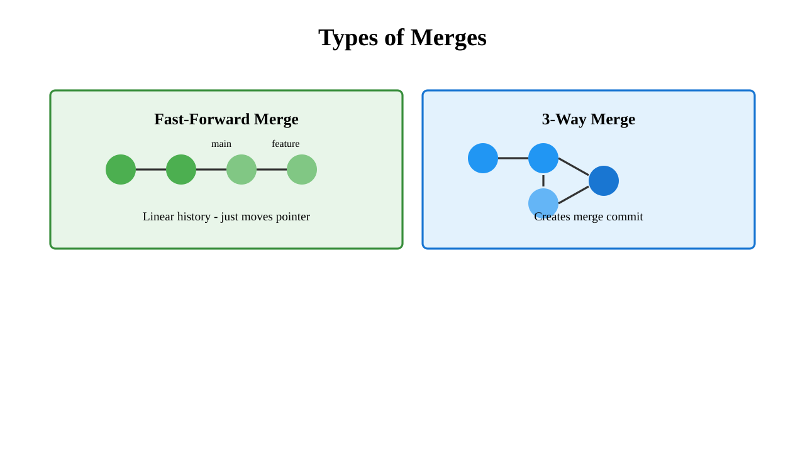
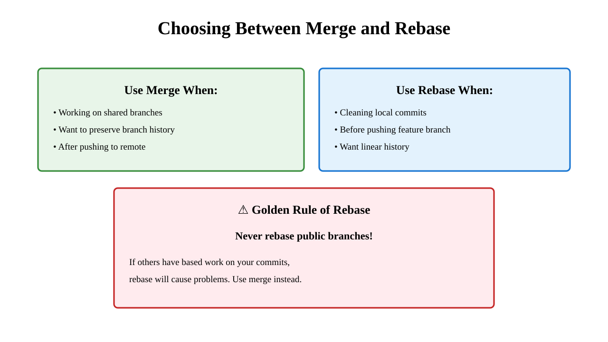

# Branches

---

## What We'll Cover

1. Theory: Why we need branches
1. How branches work internally
1. Creating and managing branches
1. Moving between branches
1. Visualizing branch activity
1. Merging strategies
1. Handling conflicts
1. Branch workflows and best practices

---

## Why Do We Need Branches?


---

## The Power of Branches


---

## What is a Branch?



---

## Branch Internals

```bash
# A branch is stored in .git/refs/heads/
$ cat .git/refs/heads/main
a3f8d9c6b7e5d4c2a1b0e9f8d7c6b5a4e3d2c1b0

# That's it! Just a SHA-1 hash

# HEAD points to current branch
$ cat .git/HEAD
ref: refs/heads/main

# When on detached HEAD
$ cat .git/HEAD
a3f8d9c6b7e5d4c2a1b0e9f8d7c6b5a4e3d2c1b0

# Creating a branch is instant
$ time git branch feature
real    0m0.001s

# Even with millions of commits!
```

---

## Creating Branches

```bash
# Create new branch (doesn't switch to it)
git branch feature

# Create and switch to new branch
git checkout -b feature
# or (Git 2.23+)
git switch -c feature

# Create branch from specific commit
git branch hotfix abc123

# Create branch from tag
git branch release v1.0.0

# Create branch tracking remote
git branch --track feature origin/feature
# or
git checkout -b feature origin/feature
```

---

## Branch Naming Conventions


---

## Listing Branches

```bash
# List local branches
git branch
# * main
#   feature
#   hotfix

# List with last commit
git branch -v
# * main    a3f8d9c Latest update
#   feature b7c9e1a Add new feature
#   hotfix  c2d3e4f Fix critical bug

# List remote branches
git branch -r
# origin/main
# origin/feature

# List all branches (local + remote)
git branch -a

# List merged branches
git branch --merged

# List unmerged branches
git branch --no-merged
```

---

## Switching Branches


---

## Switch vs Checkout

```bash
# Modern way (Git 2.23+)
git switch main              # Switch to branch
git switch -c new-feature    # Create and switch
git switch -                 # Switch to previous branch

# Traditional way (still works)
git checkout main            # Switch to branch
git checkout -b new-feature  # Create and switch
git checkout -               # Switch to previous branch

# Checkout does more (can be confusing)
git checkout -- file.txt     # Discard changes (file operation)
git checkout HEAD~2          # Detached HEAD state
git checkout abc123          # Checkout specific commit

# Switch is clearer - only for branches
# Restore is for files
```

---

## HEAD and Branches


---

## Detached HEAD State

```bash
# Checkout specific commit (not branch)
git checkout abc123
# Warning: You are in 'detached HEAD' state

# What happened?
# HEAD -> abc123 (not HEAD -> branch -> commit)

# You can look around, make experimental changes
git add experimental.txt
git commit -m "Experimental change"

# To save work, create a branch
git switch -c experiment-branch

# To discard and return to branch
git switch main

# Find lost commits from detached HEAD
git reflog
```

---

## Visualizing Branches

```bash
# Simple text graph
git log --oneline --graph --all
# * a3f8d9c (HEAD -> main) Latest on main
# | * b7c9e1a (feature) Feature work
# |/
# * c2d3e4f Common ancestor

# Decorated output
git log --oneline --decorate --graph --all

# Pretty graph alias
git config --global alias.graph \
  "log --graph --pretty=format:'%Cred%h%Creset -%C(yellow)%d%Creset %s %Cgreen(%cr) %C(bold blue)<%an>%Creset'"

# Visual tools
gitk --all          # Built-in GUI
git gui             # Built-in GUI
# Or use: SourceTree, GitKraken, Git Graph (VS Code)
```

---

## Branch Divergence


---

## Comparing Branches

```bash
# See commits in feature not in main
git log main..feature

# See commits in main not in feature
git log feature..main

# See commits unique to each branch
git log main...feature

# Compare files between branches
git diff main..feature

# Show files changed
git diff --name-only main..feature

# Statistics
git diff --stat main..feature

# Check if branches have diverged
git merge-base main feature  # Shows common ancestor
```

---

## Deleting Branches

```bash
# Delete local branch (must not be checked out)
git branch -d feature       # Safe delete (only if merged)
git branch -D feature       # Force delete (even if unmerged)

# Delete remote branch
git push origin --delete feature
# or
git push origin :feature

# Clean up tracking branches
git remote prune origin
# or
git fetch --prune

# Delete multiple branches
git branch | grep "feature-" | xargs git branch -d

# Archive branch before deleting
git tag archive/feature feature
git branch -d feature
```
---

## Branch Management


---

## Renaming Branches

```bash
# Rename current branch
git branch -m new-name

# Rename any branch
git branch -m old-name new-name

# Rename and push to remote
git branch -m old-name new-name
git push origin :old-name                # Delete old
git push origin new-name                 # Push new
git push origin -u new-name              # Set tracking

# Rename main to master (or vice versa)
git branch -m master main
git push -u origin main
git push origin --delete master

# Update local repo to use new default
git symbolic-ref refs/remotes/origin/HEAD refs/remotes/origin/main
```

---

## Branch Descriptions

```bash
# Add description to branch
git branch --edit-description feature
# Opens editor to write description

# View branch description
git config branch.feature.description

# Use in scripts/automation
#!/bin/bash
for branch in $(git branch --format='%(refname:short)'); do
    desc=$(git config branch.$branch.description)
    echo "$branch: ${desc:-No description}"
done

# Descriptions help team understand branch purpose
# Especially useful for long-running branches
```

---

## The Reflog and Branches

```bash
# See branch history
git reflog show feature
# a3f8d9c feature@{0}: commit: Add new feature
# b7c9e1a feature@{1}: branch: Created from main

# Recover deleted branch
git branch -D important-feature  # Oops!
git reflog                       # Find the SHA
git branch important-feature abc123  # Recovered!

# See when branches were updated
git for-each-ref --sort=-committerdate --format='%(committerdate:short) %(refname:short)' refs/heads/

# Find old branch positions
git log -g --grep-reflog="branch:" --oneline
```

---

## Merging Branches



---

## Fast-Forward Merge

```bash
# Scenario: feature branch is ahead of main
#   main:    A---B
#   feature:     └---C---D

git checkout main
git merge feature

# Result: Fast-forward
#   main:    A---B---C---D

# Prevent fast-forward (create merge commit)
git merge --no-ff feature

# Result:
#   main:    A---B-------M
#                 \     /
#   feature:       C---D
```

---

## Three-Way Merge


---

## Merge Strategies

```bash
# Default (recursive/ort)
git merge feature

# Ours - keep our version in conflicts
git merge -s ours feature

# Theirs option (not strategy)
git merge -X theirs feature

# Octopus - merge multiple branches
git merge feature1 feature2 feature3

# Subtree - merge into subdirectory
git merge -s subtree=path/to/dir feature

# No commit - prepare merge but don't commit
git merge --no-commit feature
# Review changes, then:
git commit
```

---

## Merge Conflicts



---

## Resolving Merge Conflicts

```bash
# Start merge
git merge feature
# CONFLICT in file.js

# 1. Check status
git status
# Unmerged paths:
#   both modified: file.js

# 2. Open file, resolve conflicts
# Remove <<<, ===, >>> markers
# Keep desired code

# 3. Stage resolved files
git add file.js

# 4. Complete merge
git commit
# or abort:
git merge --abort
```

---

## Merge Tools

```bash
# Configure merge tool
git config --global merge.tool vimdiff

# Use merge tool during conflict
git mergetool

# Popular merge tools:
# - vimdiff      (Terminal)
# - meld         (Linux/Mac)
# - kdiff3       (Cross-platform)
# - p4merge      (Perforce, free)
# - Beyond Compare (Commercial)
# - VS Code      (Built-in)

# VS Code as merge tool
git config --global merge.tool vscode
git config --global mergetool.vscode.cmd \
  'code --wait $MERGED'
```

---

## Merge vs Rebase


---

## Rebase Workflow

```bash
# Rebase feature onto main
git checkout feature
git rebase main

# Interactive rebase to clean history
git rebase -i main

# If conflicts occur:
# 1. Fix conflicts
git add fixed-file.js
# 2. Continue rebase
git rebase --continue
# Or abort:
git rebase --abort

# Pull with rebase (avoid merge commits)
git pull --rebase origin main

# Configure pull to always rebase
git config pull.rebase true
```

---

## When to Merge vs Rebase



---

## Advanced Branch Patterns

```bash
# Create orphan branch (no parent)
git checkout --orphan new-root
git rm -rf .
# Add new files
git add .
git commit -m "New root commit"

# Track different remote branch
git branch -u origin/different-branch

# Push to different remote branch name
git push origin local-branch:remote-branch

# Create branch from stash
git stash branch new-feature stash@{1}

# Backup branch before dangerous operation
git branch backup-$(date +%Y%m%d-%H%M%S)
```

---

## Branch Protection Strategies


---

## Gitflow Workflow


## GitHub Flow


---

## Trunk-Based Development


---

## Branch Hygiene

```bash
# Find merged branches to delete
git branch --merged main | grep -v main

# Delete all merged branches
git branch --merged main | grep -v main | xargs -n 1 git branch -d

# Find stale branches (no commits in 30 days)
for branch in $(git branch -r | grep -v HEAD); do
  echo -e $(git show --format="%ci %cr" $branch | head -n 1) \\t$branch
done | sort -r

# Archive old branches as tags
git tag archive/old-feature old-feature
git branch -d old-feature

# Clean up remote tracking branches
git remote prune origin --dry-run  # Preview
git remote prune origin             # Execute
```

---

## Troubleshooting Branches


---

## Branch Performance Tips

```bash
# Optimize branch operations
git config core.preloadindex true
git config core.fscache true

# Speed up branch listing
git config column.ui auto
git config branch.sort -committerdate

# Faster branch switching with worktrees
git worktree add ../project-feature feature
cd ../project-feature  # Work on feature
cd ../project         # Work on main
# No switching needed!

# Shallow clone specific branch
git clone --single-branch --branch feature --depth 1 url

# Fetch only specific branch
git fetch origin feature:feature
```

---

## Worktrees: Multiple Branches Simultaneously


---

## Working with Worktrees

```bash
# Add new worktree
git worktree add ../project-feature feature

# Create new branch in worktree
git worktree add -b new-feature ../project-new

# List worktrees
git worktree list
# /home/user/project       abc123 [main]
# /home/user/project-feature def456 [feature]

# Remove worktree
git worktree remove ../project-feature

# Prune stale worktrees
git worktree prune

# Lock worktree (prevent removal)
git worktree lock ../project-feature
```

---

## Branch Automation

```bash
# Auto-setup remote tracking
git config --global branch.autoSetupMerge always

# Auto-setup rebase for new branches
git config --global branch.autoSetupRebase always

# Create alias for common branch operations
git config --global alias.new '!f() { git checkout -b "$1" && git push -u origin "$1"; }; f'

# Automated branch creation from issue
git config --global alias.issue '!f() { git checkout -b "issue-$1" && git commit --allow-empty -m "Start issue #$1"; }; f'

# Usage:
# git new feature/awesome
# git issue 123
```

---

## Visualizing Complex Branch History

```bash
# Graphical history viewers
gitk --all --date-order
git gui
gitg  # Linux
git-cola  # Cross-platform

# Terminal visualization
git log --graph --pretty=format:'%Cred%h%Creset -%C(yellow)%d%Creset %s %Cgreen(%cr) %C(bold blue)<%an>%Creset' --abbrev-commit --all

# Simplified graph
git log --graph --oneline --all --simplify-by-decoration

# Show branch relationships
git show-branch --all

# Web-based visualization
git instaweb  # Starts local web server
```

---

## Branch Security Patterns


---

## Branch Best Practices Summary

1. **Keep branches short-lived** - Merge within days, not weeks
1. **Use descriptive names** - feature/user-auth not feature1
1. **Delete after merging** - Keep repository clean
1. **One feature per branch** - Easier to review and revert
1. **Branch from stable point** - Usually main or develop
1. **Update frequently** - Rebase or merge main regularly
1. **Protect important branches** - Require reviews and tests
1. **Use consistent workflow** - Team should agree on strategy

---

## Common Branch Commands Reference

| Command | Purpose |
|---------|---------|
| `git branch` | List branches |
| `git branch feature` | Create branch |
| `git switch feature` | Switch to branch |
| `git switch -c feature` | Create and switch |
| `git branch -d feature` | Delete merged branch |
| `git branch -D feature` | Force delete branch |
| `git merge feature` | Merge branch |
| `git rebase main` | Rebase onto main |
| `git cherry-pick abc123` | Apply specific commit |

---

## Practice Exercises

1. Create a feature branch and make commits
1. Try both merge and rebase workflows
1. Resolve a merge conflict
1. Use interactive rebase to clean history
1. Set up a gitflow-style branch structure
1. Create and use a worktree
1. Recover a deleted branch using reflog
1. Implement branch protection with hooks

---

## Summary

## What We Learned

1. ✅ Why branches are essential for collaboration
1. ✅ How branches work internally (lightweight pointers)
1. ✅ Creating, switching, and deleting branches
1. ✅ Merge strategies and conflict resolution
1. ✅ Merge vs Rebase decision making
1. ✅ Popular branching workflows
1. ✅ Branch protection and security
1. ✅ Advanced features like worktrees

---

## Key Takeaways

1. **Branches are cheap** - Create them liberally
1. **Choose the right workflow** - Match your team's needs
1. **Merge for public, rebase for private** - Golden rule
1. **Keep main stable** - Always deployable
1. **Clean up regularly** - Delete merged branches
1. **Protect important branches** - Prevent accidents
1. **Use descriptive names** - Self-documenting
1. **Communicate with your team** - Agree on conventions

---

## Next Up: Merging Changes

In the next session, we'll deep dive into:

1. Advanced merging strategies
1. Conflict resolution techniques
1. Three-way merges in detail
1. Merge tools and automation
1. Fast-forward vs no-ff
1. Octopus merges
1. Subtree merging

---

## Branches Complete! 🎉


