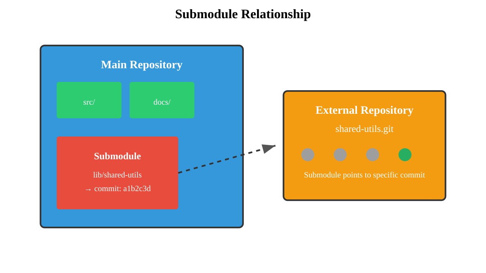

# Git Submodules

---

## What We'll Cover

1. Understanding submodules and their use cases
1. How to create submodules
1. How to pull and update submodules
1. Working with submodule workflows
1. Advanced submodule operations
1. Alternatives to submodules

---

## What Are Git Submodules?

Submodules allow you to include one Git repository inside another:

**Key concepts:**
- **Parent repository:** Contains the submodule reference
- **Submodule:** Independent Git repository
- **Specific commit:** Submodule points to exact commit SHA
- **Nested structure:** Submodules can contain other submodules

**Common use cases:**
- Shared libraries across projects
- Third-party dependencies
- Micro-service architectures
- Plugin systems
- Documentation repositories

```bash
# Example structure
main-project/
├── src/
├── lib/
│   └── shared-utils/     # <- Submodule
└── README.md
```

---

## Why Use Submodules?

Benefits and trade-offs of submodules:

**Advantages:**
- **Code reuse:** Share common code across projects
- **Version control:** Lock to specific versions
- **Independence:** Each submodule has own history
- **Modularity:** Clear separation of concerns
- **Selective updates:** Update only when needed

**Disadvantages:**
- **Complexity:** More complex workflows
- **Learning curve:** Additional commands to learn
- **Synchronization:** Can get out of sync easily
- **Tooling:** Not all tools handle submodules well
- **Nested issues:** Problems compound with multiple levels



---

## Creating Your First Submodule

Add a submodule to your repository:

```bash
# Add submodule
git submodule add https://github.com/user/shared-library.git lib/shared

# Add submodule to specific path
git submodule add https://github.com/user/utils.git external/utils

# Add submodule from specific branch
git submodule add -b develop https://github.com/user/plugin.git plugins/my-plugin

# Commit the submodule addition
git add .gitmodules lib/shared
git commit -m "Add shared library submodule"
```

**What happens during submodule addition:**
1. Repository is cloned to specified path
1. `.gitmodules` file is created/updated
1. Submodule directory added to index
1. Specific commit SHA is recorded

---

## Understanding .gitmodules File

The `.gitmodules` file tracks submodule configuration:

```ini
[submodule "lib/shared"]
    path = lib/shared
    url = https://github.com/user/shared-library.git
    branch = main

[submodule "plugins/auth"]
    path = plugins/auth
    url = https://github.com/user/auth-plugin.git
    branch = stable
```

**Configuration options:**
- `path`: Local directory path
- `url`: Remote repository URL
- `branch`: Default branch to track
- `update`: Update strategy (merge, rebase, checkout)

**Important notes:**
- `.gitmodules` is tracked by Git
- Shared with all repository users
- Can be edited manually if needed

---

## Cloning Repositories with Submodules

Handle submodules when cloning:

```bash
# Clone with submodules (recursive)
git clone --recursive https://github.com/user/main-project.git

# Clone with submodule depth limit
git clone --recursive --depth 1 https://github.com/user/project.git

# Clone normally, then initialize submodules
git clone https://github.com/user/main-project.git
cd main-project
git submodule init
git submodule update
```

**Alternative initialization:**

```bash
# One-step submodule setup
git submodule update --init --recursive

# Initialize only specific submodules
git submodule update --init lib/shared
```

---

## Working with Submodules

Navigate and work within submodules:

```bash
# Enter submodule directory
cd lib/shared

# Check submodule status
git status
git log --oneline -5

# Make changes in submodule
echo "// new feature" >> src/utils.js
git add src/utils.js
git commit -m "Add new utility function"

# Return to parent repository
cd ../..
git status    # Shows submodule has new commits
```

**Submodule states:**
- **Clean:** Submodule matches recorded commit
- **Modified:** Working directory has changes
- **New commits:** Submodule HEAD differs from recorded commit
- **Untracked:** New files in submodule

---

## Updating Submodules

Keep submodules current with upstream changes:

```bash
# Update single submodule
git submodule update lib/shared

# Update all submodules
git submodule update

# Update to latest remote commit
cd lib/shared
git pull origin main
cd ../..
git add lib/shared
git commit -m "Update shared library"

# Update all submodules to latest
git submodule foreach git pull origin main
```

**Update strategies:**
- Manual update per submodule
- Batch update all submodules
- Automatic update to latest
- Selective update of specific submodules

---

## Submodule Update Modes

Configure how submodules are updated:

```bash
# Set update mode for submodule
git config submodule.lib/shared.update merge
git config submodule.lib/shared.update rebase
git config submodule.lib/shared.update checkout

# Update with specific strategy
git submodule update --merge
git submodule update --rebase
git submodule update --remote
```

**Update modes:**
- **checkout:** (default) Detached HEAD at specific commit
- **merge:** Merge upstream changes into current branch
- **rebase:** Rebase local changes onto upstream
- **remote:** Update to latest remote commit

---

## Submodule Status and Information

Monitor submodule state:

```bash
# Check submodule status
git submodule status

# Verbose status information
git submodule status --recursive

# Show submodule summary
git submodule summary

# Show submodule summary for specific commit range
git submodule summary HEAD~5..HEAD

# List submodules
git submodule

# Show submodule configuration
git config --list | grep submodule
```

**Status indicators:**
- " ": Submodule is up to date
- "+": Submodule has new commits
- "-": Submodule is not initialized
- "U": Submodule has merge conflicts

---

## Advanced Submodule Operations

Sophisticated submodule management:

```bash
# Execute command in all submodules
git submodule foreach 'git checkout main'
git submodule foreach 'git pull'
git submodule foreach 'echo "Working in $name at $path"'

# Conditional operations
git submodule foreach 'if [ -f package.json ]; then npm install; fi'

# Push changes in all submodules
git submodule foreach git push

# Show branches in all submodules
git submodule foreach git branch -v
```

**Foreach command features:**
- Execute arbitrary commands
- Access to submodule variables
- Conditional execution
- Batch operations

---

## Removing Submodules

Properly remove submodules:

```bash
# Remove submodule (Git 1.8.5+)
git submodule deinit lib/shared
git rm lib/shared

# Manual removal (older Git versions)
git submodule deinit lib/shared
git rm --cached lib/shared
rm -rf lib/shared
git config --remove-section submodule.lib/shared

# Clean up .git/modules
rm -rf .git/modules/lib/shared

# Commit the removal
git commit -m "Remove shared library submodule"
```

**Removal steps:**
1. Deinitialize the submodule
1. Remove from Git index
1. Remove directory
1. Clean up configuration
1. Commit changes

---

## Submodule Workflows

Different approaches to submodule management:

**Fixed version workflow:**
```bash
# Lock to specific versions
git submodule add https://github.com/user/lib.git lib
cd lib
git checkout v1.2.0
cd ..
git add lib
git commit -m "Lock library to v1.2.0"
```

**Latest version workflow:**
```bash
# Always use latest
git submodule update --remote --merge
git add .
git commit -m "Update submodules to latest"
```

**Development workflow:**
```bash
# Work on submodule and parent simultaneously
cd lib/shared
git checkout -b feature-enhancement
# Make changes
git push origin feature-enhancement
cd ../..
git add lib/shared
git commit -m "Update submodule for feature"
```

---

## Nested Submodules

Handle submodules within submodules:

```bash
# Initialize nested submodules
git submodule update --init --recursive

# Update nested submodules
git submodule update --recursive

# Work with nested structure
project/
├── lib/
│   └── framework/        # Submodule level 1
│       └── vendor/       # Submodule level 2
│           └── utils/    # Submodule level 3
```

**Nested considerations:**
- Increased complexity
- Longer clone times
- More potential for issues
- Harder to troubleshoot
- Consider alternatives

---

## Submodule Best Practices

Guidelines for effective submodule usage:

**Repository organization:**
1. Keep submodules in dedicated directories
1. Use descriptive submodule names
1. Document submodule purposes
1. Maintain consistent structure

**Version management:**
1. Pin to specific versions for stability
1. Test before updating submodules
1. Document version requirements
1. Use semantic versioning in submodules

**Team coordination:**
1. Always commit submodule changes
1. Update submodules together with related code
1. Communicate submodule updates to team
1. Include submodule setup in documentation

---

## Troubleshooting Submodules

Common issues and solutions:

### Issue: Submodule not initialized

```bash
# Error: No such file or directory
# Solution:
git submodule update --init
```

### Issue: Submodule out of sync

```bash
# Submodule shows uncommitted changes
# Solution:
cd submodule-path
git status
git add .
git commit -m "Sync submodule changes"
cd ..
git add submodule-path
git commit -m "Update submodule reference"
```

### Issue: Can't push submodule changes

```bash
# Solution: Push submodule first, then parent
cd submodule-path
git push
cd ..
git push
```

### Issue: Merge conflicts in submodules

```bash
# Solution: Resolve in submodule, then update parent
cd submodule-path
git status
# Resolve conflicts
git add .
git commit
cd ..
git add submodule-path
```

---

## Submodule Alternatives

Consider alternatives to submodules:

**Git Subtrees:**

```bash
# Add subtree instead of submodule
git subtree add --prefix=lib/shared https://github.com/user/shared.git main

# Update subtree
git subtree pull --prefix=lib/shared https://github.com/user/shared.git main
```

**Package managers:**

```bash
# Use language-specific package managers
npm install shared-library      # Node.js
pip install shared-utils         # Python
gem install shared-gem          # Ruby
```

**Build tools:**
- Git submodules in build scripts
- Dependency management tools
- Container-based solutions
- Artifact repositories

---

## Performance Considerations

Optimize submodule performance:

**Clone optimization:**

```bash
# Shallow clone submodules
git clone --recursive --shallow-submodules project.git

# Limit submodule depth
git submodule update --depth 1

# Parallel submodule operations
git submodule update --jobs 4
```

**Selective operations:**

```bash
# Initialize only needed submodules
git submodule update --init lib/critical

# Skip unnecessary submodules
git -c submodule.optional-module.update=none submodule update
```

---

## CI/CD with Submodules

Handle submodules in automated systems:

**GitHub Actions example:**

```yaml
steps:
- uses: actions/checkout@v3
  with:
    submodules: recursive

- name: Update submodules
  run: |
    git submodule update --remote
    git add .
    git diff --staged --quiet || git commit -m "Update submodules"
```

**Jenkins pipeline:**
```groovy
pipeline {
    agent any
    stages {
        stage('Checkout') {
            steps {
                checkout scm
                sh 'git submodule update --init --recursive'
            }
        }
    }
}
```

---

## Submodule Security Considerations

Security aspects of submodules:

**URL security:**

```bash
# Verify submodule URLs before cloning
cat .gitmodules

# Use HTTPS instead of SSH for public repos
git config submodule.lib/shared.url https://github.com/user/lib.git
```

**Access control:**
- Ensure team has access to all submodule repositories
- Consider private submodules access requirements
- Audit submodule dependencies regularly
- Monitor for malicious updates

**Best practices:**
1. Verify submodule sources
1. Pin to specific commits
1. Regular security audits
1. Access control management

---

## Migrating to/from Submodules

Convert between submodules and other approaches:

**Converting subtree to submodule:**

```bash
# Remove subtree
git rm -r lib/shared
git commit -m "Remove subtree"

# Add as submodule
git submodule add https://github.com/user/shared.git lib/shared
git commit -m "Convert to submodule"
```

**Converting submodule to subtree:**

```bash
# Note submodule URL and current commit
git submodule status

# Remove submodule
git submodule deinit lib/shared
git rm lib/shared

# Add as subtree
git subtree add --prefix=lib/shared URL commit-sha
```

---

## Advanced Submodule Configuration

Fine-tune submodule behavior:

```bash
# Configure submodule settings
git config submodule.lib/shared.fetchRecurseSubmodules true
git config submodule.lib/shared.ignore dirty

# Global submodule settings
git config --global submodule.recurse true
git config --global diff.submodule log

# Ignore submodule changes
git config submodule.lib/shared.ignore all
git config submodule.lib/shared.ignore untracked
git config submodule.lib/shared.ignore dirty
```

**Configuration options:**
- Fetch behavior
- Update strategies
- Ignore patterns
- Recursion settings

---

## Lab Exercise: Submodule Management

**Scenario:** Set up a project with multiple submodules representing shared libraries and manage their lifecycle.

**Setup tasks:**
1. **Create submodule structure:**
    - Add multiple submodules with different purposes
    - Configure appropriate update strategies
    - Document submodule relationships

1. **Basic operations:**
    - Practice cloning with submodules
    - Update submodules to latest versions
    - Make changes within submodules

1. **Workflow simulation:**
    - Simulate team development with submodules
    - Handle merge conflicts involving submodules
    - Practice submodule removal and replacement

**Advanced tasks:**
1. **Automation setup:**
    - Create scripts for submodule management
    - Set up CI/CD with submodule handling
    - Implement automated submodule updates

1. **Troubleshooting scenarios:**
    - Simulate and resolve common submodule issues
    - Practice recovery from submodule problems
    - Compare with alternative approaches

**Deliverables:** Complete submodule-based project structure, management scripts, CI/CD configuration, troubleshooting guide, and comparison with alternatives.

---

## Summary: Effective Submodule Usage

**Key takeaways:**

1. **Understand the complexity:**
    - Submodules add workflow complexity
    - Require team coordination and documentation
    - Consider alternatives for simpler use cases

1. **Follow best practices:**
    - Pin to specific versions for stability
    - Always commit submodule changes
    - Document setup and update procedures
    - Test thoroughly before updates

1. **Use appropriate workflows:**
    - Fixed versions for stable dependencies
    - Latest versions for active development
    - Clear communication with team members

1. **Prepare for common issues:**
    - Submodule synchronization problems
    - Complex merge scenarios
    - CI/CD integration challenges
    - Performance considerations

**Remember:** Git submodules are powerful but complex. They work well for specific use cases like shared libraries and modular architectures, but require careful planning, clear documentation, and team coordination. Consider simpler alternatives like Git subtrees or package managers unless you specifically need the independence and version control that submodules provide.
