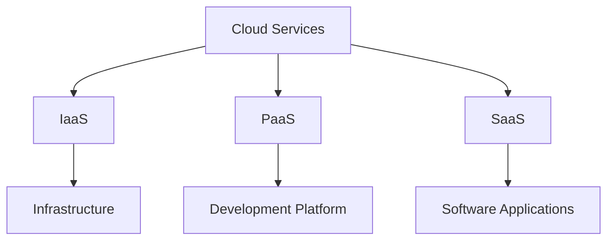
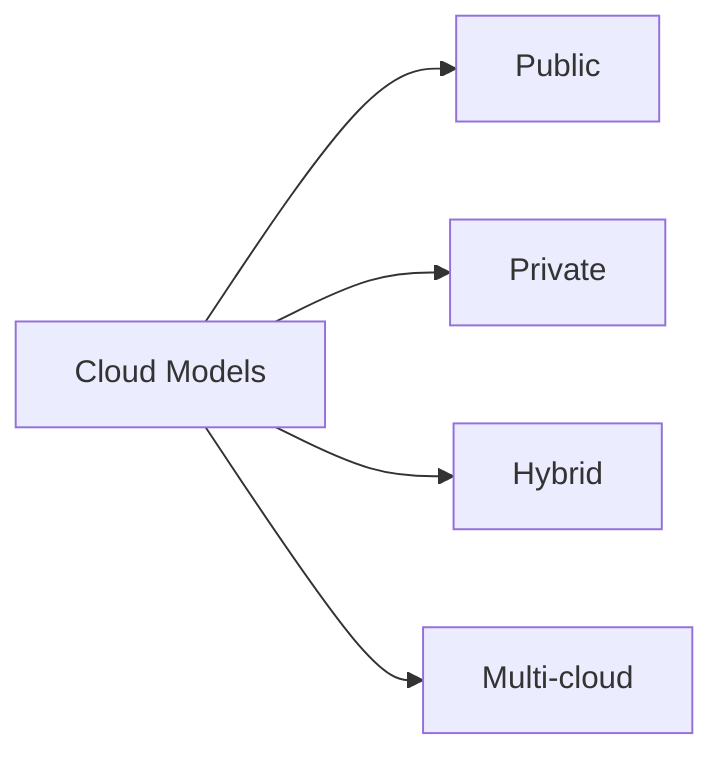
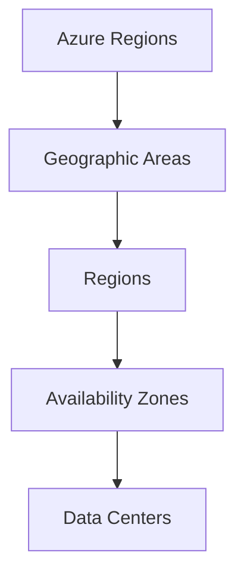
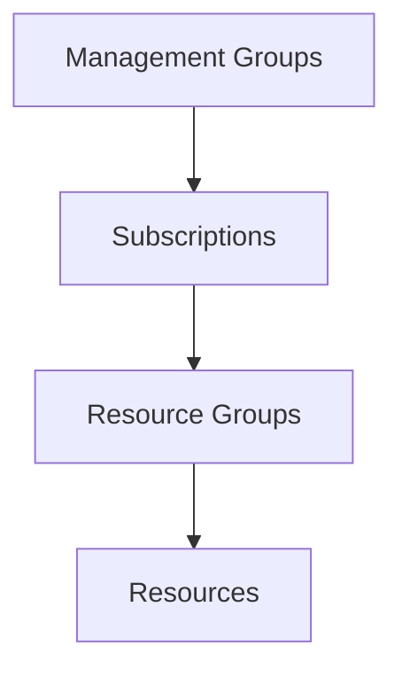

# Introduction to Cloud Computing and Azure

## What is Cloud Computing?
Cloud computing is the delivery of computing services over the internet, including servers, storage, databases, networking, software, and intelligence.

---

## Key Characteristics of Cloud Computing
- On-demand self-service
- Broad network access
- Resource pooling
- Rapid elasticity
- Measured service

---

## Types of Cloud Computing Services



---

## Infrastructure as a Service (IaaS)
- Raw computing resources
- Virtual machines
- Storage
- Networks
- Maximum control and flexibility

---

## Platform as a Service (PaaS)
- Development and deployment environment
- Middleware
- Development tools
- Database management
- Business analytics

---

## Software as a Service (SaaS)
- Complete applications
- Pay-per-use model
- No maintenance required
- Accessible via web browser

---

## Benefits of Cloud Computing
- Cost efficiency
- Scalability
- Global reach
- Performance
- Security
- Innovation acceleration

---

## Cloud Deployment Models



---

## Public Cloud
- Services offered over the public internet
- Available to anyone
- Pay-as-you-go pricing
- Examples: Azure, AWS, Google Cloud

---

## Private Cloud
- Dedicated to a single organization
- Greater control and security
- Can be on-premises or hosted
- Customizable infrastructure

---

## Hybrid Cloud
- Combination of public and private clouds
- Data and apps can move between them
- Greater flexibility
- Best of both worlds

---

## Introduction to Microsoft Azure
- Microsoft's public cloud platform
- Launched in 2010
- Continuous innovation and growth
- Global infrastructure

---

## Azure Global Infrastructure
- Multiple regions worldwide
- Paired regions for resilience
- Availability zones
- Edge locations

---

## Azure Regions



---

## Understanding Availability Zones
- Physically separate locations
- Independent power, cooling, and networking
- Protection against data center failures
- High availability design

---

## Core Azure Services Overview
- Compute
- Storage
- Networking
- Databases
- AI and Machine Learning
- IoT
- Security

---

## Azure Resource Hierarchy



---

## Azure Portal Introduction
- Web-based unified console
- Create and manage resources
- Monitor services
- Access control

---

## Azure Portal Features
- Customizable dashboard
- Resource management
- Monitoring and alerts
- Cost management
- Security center

---

## Working with Resource Groups
- Logical containers for resources
- Organizational tool
- Access control boundary
- Lifecycle management

---

## Azure Marketplace
- Ready-to-use solutions
- Microsoft and third-party offerings
- Virtual machine images
- Templates and applications

---

## Azure Service Level Agreements (SLAs)
- Uptime and connectivity guarantees
- Performance commitments
- Service credits
- Best practices

---

## Getting Started with Azure
1. Create an Azure account
1. Explore the Azure portal
1. Start with basic services
1. Use free tier resources

---

## Azure Free Account Benefits
- Free services for 12 months
- Popular services included
- $200 credit for 30 days
- Always-free services

---

## Best Practices for Azure
- Resource naming conventions
- Tagging strategy
- Security baseline
- Cost monitoring
- Regular backups

---

## Azure Support Options
- Basic
- Developer
- Standard
- Professional Direct
- Premier

---

## Azure Documentation and Learning
- Microsoft Learn
- Azure documentation
- Community resources
- Training and certification

---

## Azure Management Tools
- Azure Portal
- Azure PowerShell
- Azure CLI
- Azure Cloud Shell
- Azure SDKs

---

## Azure CLI Basics
```bash
az login
az group list
az vm create
az webapp list
```

---

## Azure PowerShell Fundamentals
```powershell
Connect-AzAccount
Get-AzResourceGroup
New-AzVM
Get-AzWebApp
```

---

## Next Steps
- Hands-on labs
- Azure certification path
- Practice exercises
- Resource exploration
