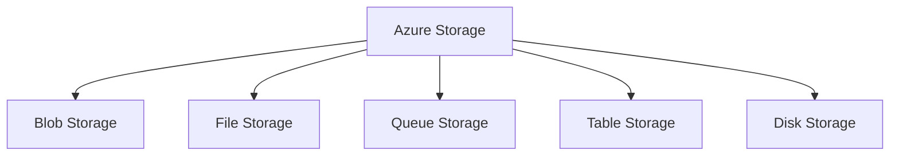
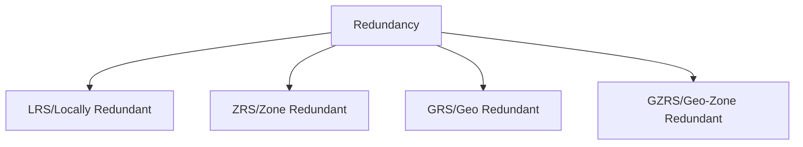
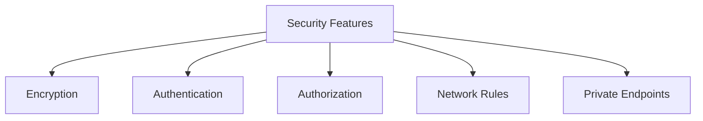

# Azure Storage Services

## Storage Service Types

---

## Storage Account Overview
- Unique namespace
- Global replication
- Data redundancy
- Security features
- Access tiers

---

## Storage Account Types
1. Standard general-purpose v2
1. Premium block blobs
1. Premium file shares
1. Premium page blobs

---

## Redundancy Options

---

## Understanding Blob Storage
- Binary Large Objects
- Unstructured data
- Video, audio, images
- Documents, logs
- Backup data

---

## Blob Types
- Block blobs
- Append blobs
- Page blobs
- Each optimized for specific uses

---

## Blob Access Tiers
- Hot tier
- Cool tier
- Archive tier
- Lifecycle management

---

## Blob Storage Features
- Soft delete
- Versioning
- Change feed
- Static website hosting
- CORS support

---

## Azure Files Overview
- SMB file shares
- Native mounting
- Hybrid scenarios
- File-based apps
- Shared access

---

## File Share Configuration
- Share size limits
- File permissions
- Network access
- Authentication
- Encryption

---

## Azure Queue Storage
- Message queuing
- Asynchronous processing
- Application decoupling
- Load leveling
- Scalable workflows

---

## Queue Storage Concepts
- Queue service
- Queue names
- Messages
- Message lifecycle
- Visibility timeout

---

## Azure Table Storage
- NoSQL data store
- Key-value pairs
- Schema-less design
- Structured data
- Cost-effective

---

## Table Storage Components
- Tables
- Entities
- Properties
- Partition keys
- Row keys

---

## Storage Security

---

## Authentication Methods
- Shared Key
- SAS tokens
- Azure AD
- Anonymous access
- Service endpoints

---

## Shared Access Signatures
- Account SAS
- Service SAS
- User delegation SAS
- Time-limited access
- Specific permissions

---

## Storage Networking
- Public endpoints
- Private endpoints
- Service endpoints
- Network rules
- Firewall settings

---

## Data Protection
- Soft delete
- Point-in-time restore
- Immutable storage
- Backup
- Replication

---

## Storage Monitoring
- Metrics
- Diagnostics
- Activity logs
- Alerts
- Insights

---

## Performance Tiers
- Standard performance
- Premium performance
- IOPS limits
- Throughput limits
- Latency targets

---

## Cost Optimization
- Access tiers
- Lifecycle management
- Reserved capacity
- Right-sizing
- Monitoring usage

---

## Storage Management Tools
- Azure Portal
- Azure CLI
- PowerShell
- Storage Explorer
- REST API

---

## Lifecycle Management
- Automated tiering
- Deletion rules
- Policy-based actions
- Cost optimization
- Data governance

---

## Data Migration
- AzCopy
- Storage Explorer
- Data Box
- Import/Export service
- Migration tools

---

## Backup and Recovery
- Snapshot management
- Geo-replication
- Disaster recovery
- Business continuity
- Recovery testing

---

## Storage Integration
- Azure Functions
- Logic Apps
- Event Grid
- Service Bus
- API Management

---

## Best Practices
- Performance optimization
- Security hardening
- Cost management
- Monitoring strategy
- Access patterns

---

## Compliance and Governance
- Data residency
- Encryption requirements
- Access auditing
- Regulatory compliance
- Data sovereignty

---

## Storage Patterns
- Content distribution
- Data archival
- Backup storage
- Application data
- Media storage

---

## Future Roadmap
- Storage updates
- New features
- Performance improvements
- Security enhancements
- Integration capabilities
