# Adapter Pattern

---

## Intent

- Convert the interface of a class into another interface that clients expect
- Allow classes with incompatible interfaces to work together
- Wrap an existing class with a new interface

---

## Problem: Incompatible Interfaces

```cpp
// Legacy XML analytics library
class XMLAnalytics {
public:
    void analyzeXML(const std::string& xmlData) {
        std::cout << "Analyzing XML data...\n";
    }
};

// New system works with JSON
class AnalyticsClient {
public:
    void processData(JSONAnalytics& analytics, const std::string& json) {
        analytics.analyzeJSON(json);
    }
};
```

The legacy library cannot be modified, but we need it to work with the new system

---

## Adapter Structure



---

## Object Adapter (Composition)

```cpp
class JSONAnalytics {
public:
    virtual void analyzeJSON(const std::string& jsonData) = 0;
    virtual ~JSONAnalytics() = default;
};

class XMLToJSONAdapter : public JSONAnalytics {
    XMLAnalytics& xmlAnalytics;

    std::string convertToXML(const std::string& json) {
        // Convert JSON to XML format
        return "<data>" + json + "</data>";
    }

public:
    explicit XMLToJSONAdapter(XMLAnalytics& xml) : xmlAnalytics(xml) {}

    void analyzeJSON(const std::string& jsonData) override {
        std::string xmlData = convertToXML(jsonData);
        xmlAnalytics.analyzeXML(xmlData);
    }
};
```

---

## Object Adapter Usage

```cpp
XMLAnalytics legacyAnalytics;
XMLToJSONAdapter adapter(legacyAnalytics);

// Client code works with the JSON interface
adapter.analyzeJSON(R"({"key": "value"})");
```

The client only sees `JSONAnalytics` — the XML details are hidden

---

## Class Adapter (Multiple Inheritance)

```cpp
class XMLToJSONClassAdapter
    : public JSONAnalytics, private XMLAnalytics {
public:
    void analyzeJSON(const std::string& jsonData) override {
        std::string xmlData = convertToXML(jsonData);
        analyzeXML(xmlData);  // Call inherited XMLAnalytics method
    }

private:
    std::string convertToXML(const std::string& json) {
        return "<data>" + json + "</data>";
    }
};
```

Class adapter uses private inheritance instead of composition

---

## Real-World Example: Iterator Adapter

```cpp
// Legacy C-style container
class LegacyList {
    int* data;
    size_t size;
public:
    int getElement(size_t index) const { return data[index]; }
    size_t getSize() const { return size; }
};

// Adapter to make it work with range-based for loops
class LegacyListAdapter {
    const LegacyList& list;
public:
    explicit LegacyListAdapter(const LegacyList& l) : list(l) {}

    struct Iterator {
        const LegacyList& list;
        size_t index;
        int operator*() const { return list.getElement(index); }
        Iterator& operator++() { ++index; return *this; }
        bool operator!=(const Iterator& other) const {
            return index != other.index;
        }
    };

    Iterator begin() const { return {list, 0}; }
    Iterator end() const { return {list, list.getSize()}; }
};

// Now works with range-based for
LegacyList legacyList = getLegacyData();
for (int val : LegacyListAdapter(legacyList)) {
    std::cout << val << " ";
}
```

---

## Object Adapter vs Class Adapter

| Aspect | Object Adapter | Class Adapter |
|--------|---------------|---------------|
| Mechanism | Composition | Multiple inheritance |
| Adaptee access | Through reference | Direct (inherited) |
| Can adapt subclasses | Yes | No (fixed to one class) |
| Override adaptee | No | Yes |
| C++ suitability | Preferred | Use with caution |

Prefer object adapter (composition) in most cases
