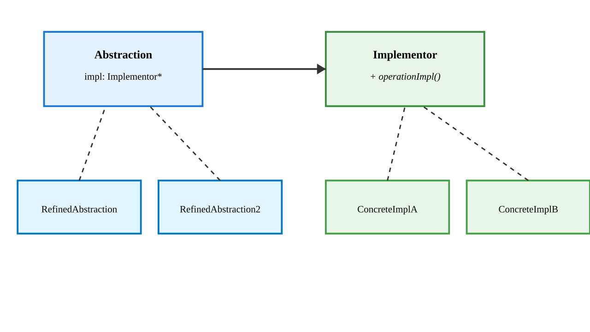

# Bridge Pattern

---

## Intent

- Decouple an abstraction from its implementation so the two can vary independently
- Avoid a proliferation of classes when combining multiple dimensions of variation
- Use composition instead of inheritance to combine implementations

---

## Problem: Class Explosion

```cpp
// Without Bridge: 2 shapes x 3 renderers = 6 classes
class CircleOpenGL { ... };
class CircleVulkan { ... };
class CircleDirectX { ... };
class RectangleOpenGL { ... };
class RectangleVulkan { ... };
class RectangleDirectX { ... };
// Adding a new shape or renderer multiplies the number of classes
```

Every new shape or renderer doubles the number of classes

---

## Bridge Structure



The Abstraction delegates to the Implementor — both can vary independently

---

## Implementation Interface

```cpp
class Renderer {
public:
    virtual void renderCircle(float x, float y, float radius) = 0;
    virtual void renderRectangle(float x, float y, float w, float h) = 0;
    virtual ~Renderer() = default;
};

class OpenGLRenderer : public Renderer {
public:
    void renderCircle(float x, float y, float radius) override {
        std::cout << "OpenGL: circle at (" << x << "," << y
                  << ") r=" << radius << "\n";
    }
    void renderRectangle(float x, float y, float w, float h) override {
        std::cout << "OpenGL: rect at (" << x << "," << y
                  << ") " << w << "x" << h << "\n";
    }
};

class VulkanRenderer : public Renderer {
public:
    void renderCircle(float x, float y, float radius) override {
        std::cout << "Vulkan: circle at (" << x << "," << y
                  << ") r=" << radius << "\n";
    }
    void renderRectangle(float x, float y, float w, float h) override {
        std::cout << "Vulkan: rect at (" << x << "," << y
                  << ") " << w << "x" << h << "\n";
    }
};
```

---

## Abstraction

```cpp
class Shape {
protected:
    Renderer& renderer;

public:
    explicit Shape(Renderer& r) : renderer(r) {}
    virtual void draw() = 0;
    virtual void resize(float factor) = 0;
    virtual ~Shape() = default;
};

class Circle : public Shape {
    float x, y, radius;
public:
    Circle(Renderer& r, float x, float y, float radius)
        : Shape(r), x(x), y(y), radius(radius) {}

    void draw() override { renderer.renderCircle(x, y, radius); }
    void resize(float factor) override { radius *= factor; }
};

class Rectangle : public Shape {
    float x, y, width, height;
public:
    Rectangle(Renderer& r, float x, float y, float w, float h)
        : Shape(r), x(x), y(y), width(w), height(h) {}

    void draw() override { renderer.renderRectangle(x, y, width, height); }
    void resize(float factor) override { width *= factor; height *= factor; }
};
```

---

## Bridge Usage

```cpp
OpenGLRenderer opengl;
VulkanRenderer vulkan;

// Same shapes, different renderers
Circle c1(opengl, 10, 20, 5);
Circle c2(vulkan, 10, 20, 5);

c1.draw();  // OpenGL: circle at (10,20) r=5
c2.draw();  // Vulkan: circle at (10,20) r=5

// Adding a new shape or renderer is independent
// No class explosion
```

---

## When to Use Bridge

**Use when:**

- You want to avoid a permanent binding between abstraction and implementation
- Both abstraction and implementation should be extensible independently
- You have a class explosion from combining multiple dimensions
- You want to switch implementations at runtime

**Bridge vs Adapter:**

- **Adapter** makes two existing interfaces work together (after design)
- **Bridge** separates interface from implementation (during design)
