# Facade Pattern

---

## Intent

- Provide a unified, simplified interface to a complex subsystem
- Reduce coupling between clients and the subsystem's internal classes
- Define a higher-level interface that makes the subsystem easier to use

---

## Problem: Complex Subsystem

```cpp
// Client must understand and coordinate multiple subsystems
void convertVideo(const std::string& filename) {
    VideoFile file(filename);
    auto codec = CodecFactory::detect(file);
    auto buffer = BitrateReader::read(file, codec);
    auto result = BitrateReader::convert(buffer, targetCodec);
    AudioMixer mixer;
    auto audio = mixer.extract(file);
    auto fixedAudio = mixer.normalize(audio);
    auto output = mixer.combine(result, fixedAudio);
    FileWriter::write("output.mp4", output);
}
```

Clients need deep knowledge of the subsystem internals

---

## Facade Structure



---

## Facade Solution

```cpp
class VideoConverter {
    VideoFile file;
    CodecFactory codecFactory;
    BitrateReader reader;
    AudioMixer mixer;
    FileWriter writer;

public:
    std::string convert(const std::string& filename,
                        const std::string& format) {
        file.load(filename);
        auto codec = codecFactory.detect(file);
        auto buffer = reader.read(file, codec);
        auto targetCodec = codecFactory.getCodec(format);
        auto result = reader.convert(buffer, targetCodec);
        auto audio = mixer.extract(file);
        auto fixedAudio = mixer.normalize(audio);
        auto output = mixer.combine(result, fixedAudio);
        std::string outputFile = "output." + format;
        writer.write(outputFile, output);
        return outputFile;
    }
};

// Client code — simple and clean
VideoConverter converter;
converter.convert("funny-cats.avi", "mp4");
```

---

## Real-World Example: Compiler Facade

```cpp
class Lexer {
public:
    std::vector<Token> tokenize(const std::string& source) { ... }
};

class Parser {
public:
    AST parse(const std::vector<Token>& tokens) { ... }
};

class SemanticAnalyzer {
public:
    void analyze(AST& ast) { ... }
};

class CodeGenerator {
public:
    std::string generate(const AST& ast) { ... }
};

class Optimizer {
public:
    void optimize(std::string& code) { ... }
};
```

---

## Compiler Facade

```cpp
class Compiler {
    Lexer lexer;
    Parser parser;
    SemanticAnalyzer analyzer;
    CodeGenerator generator;
    Optimizer optimizer;

public:
    std::string compile(const std::string& source) {
        auto tokens = lexer.tokenize(source);
        auto ast = parser.parse(tokens);
        analyzer.analyze(ast);
        auto code = generator.generate(ast);
        optimizer.optimize(code);
        return code;
    }
};

// Client only needs one call
Compiler compiler;
auto binary = compiler.compile(sourceCode);
```

---

## Facade Does Not Hide the Subsystem

```cpp
class DatabaseFacade {
    ConnectionPool pool;
    QueryBuilder builder;
    ResultMapper mapper;

public:
    // Simple interface for common operations
    template<typename T>
    std::vector<T> findAll(const std::string& table) {
        auto conn = pool.acquire();
        auto query = builder.selectAll(table);
        auto results = conn->execute(query);
        return mapper.mapAll<T>(results);
    }

    // Clients can still access subsystems for advanced use
    ConnectionPool& getConnectionPool() { return pool; }
    QueryBuilder& getQueryBuilder() { return builder; }
};
```

Facade provides convenience — it does not restrict access

---

## When to Use Facade

**Use when:**

- A subsystem is complex and clients need a simple interface
- You want to layer a system (facade defines entry point for each layer)
- You want to reduce dependencies between clients and subsystem classes

**Facade vs Adapter:**

- **Adapter** changes an interface to match what the client expects
- **Facade** simplifies an interface for easier use

**Facade vs Mediator:**

- **Facade** provides a simple interface to existing functionality
- **Mediator** coordinates communication between components
