# Visitor Pattern

---

## Intent

- Define new operations on a set of classes without changing the classes themselves
- Separate algorithms from the objects they operate on
- Add operations to a class hierarchy without modifying it

---

## Problem: Adding Operations to a Class Hierarchy

```cpp
class Circle { public: void draw(); };
class Rectangle { public: void draw(); };
class Triangle { public: void draw(); };

// Need to add area(), perimeter(), serialize() — each requires
// modifying every shape class. Violates Open/Closed Principle.
```

---

## Visitor Structure



---

## Element Hierarchy

```cpp
class ShapeVisitor;  // Forward declaration

class Shape {
public:
    virtual void accept(ShapeVisitor& visitor) = 0;
    virtual ~Shape() = default;
};

class Circle : public Shape {
    double radius;
public:
    explicit Circle(double r) : radius(r) {}
    double getRadius() const { return radius; }
    void accept(ShapeVisitor& visitor) override;
};

class Rectangle : public Shape {
    double width, height;
public:
    Rectangle(double w, double h) : width(w), height(h) {}
    double getWidth() const { return width; }
    double getHeight() const { return height; }
    void accept(ShapeVisitor& visitor) override;
};

class Triangle : public Shape {
    double a, b, c;
public:
    Triangle(double a, double b, double c) : a(a), b(b), c(c) {}
    double getA() const { return a; }
    double getB() const { return b; }
    double getC() const { return c; }
    void accept(ShapeVisitor& visitor) override;
};
```

---

## Visitor Interface and Accept Methods

```cpp
class ShapeVisitor {
public:
    virtual void visit(Circle& circle) = 0;
    virtual void visit(Rectangle& rect) = 0;
    virtual void visit(Triangle& tri) = 0;
    virtual ~ShapeVisitor() = default;
};

void Circle::accept(ShapeVisitor& visitor) { visitor.visit(*this); }
void Rectangle::accept(ShapeVisitor& visitor) { visitor.visit(*this); }
void Triangle::accept(ShapeVisitor& visitor) { visitor.visit(*this); }
```

The double dispatch: `shape->accept(visitor)` calls `visitor.visit(concreteShape)`

---

## Concrete Visitors

```cpp
class AreaCalculator : public ShapeVisitor {
    double totalArea = 0;
public:
    void visit(Circle& c) override {
        totalArea += 3.14159265 * c.getRadius() * c.getRadius();
    }
    void visit(Rectangle& r) override {
        totalArea += r.getWidth() * r.getHeight();
    }
    void visit(Triangle& t) override {
        double s = (t.getA() + t.getB() + t.getC()) / 2;
        totalArea += std::sqrt(s * (s-t.getA()) * (s-t.getB()) * (s-t.getC()));
    }
    double getTotal() const { return totalArea; }
};

class JSONSerializer : public ShapeVisitor {
    std::string json = "[";
    bool first = true;
public:
    void visit(Circle& c) override {
        addComma();
        json += R"({"type":"circle","radius":)" +
                std::to_string(c.getRadius()) + "}";
    }
    void visit(Rectangle& r) override {
        addComma();
        json += R"({"type":"rectangle","width":)" +
                std::to_string(r.getWidth()) + R"(,"height":)" +
                std::to_string(r.getHeight()) + "}";
    }
    void visit(Triangle& t) override {
        addComma();
        json += R"({"type":"triangle","sides":[)" +
                std::to_string(t.getA()) + "," +
                std::to_string(t.getB()) + "," +
                std::to_string(t.getC()) + "]}";
    }
    std::string getJSON() { return json + "]"; }
private:
    void addComma() { if (!first) json += ","; first = false; }
};
```

---

## Visitor Usage

```cpp
std::vector<std::unique_ptr<Shape>> shapes;
shapes.push_back(std::make_unique<Circle>(5.0));
shapes.push_back(std::make_unique<Rectangle>(3.0, 4.0));
shapes.push_back(std::make_unique<Triangle>(3.0, 4.0, 5.0));

// Calculate total area — no changes to Shape classes
AreaCalculator calc;
for (auto& shape : shapes) {
    shape->accept(calc);
}
std::cout << "Total area: " << calc.getTotal() << "\n";

// Serialize to JSON — no changes to Shape classes
JSONSerializer serializer;
for (auto& shape : shapes) {
    shape->accept(serializer);
}
std::cout << serializer.getJSON() << "\n";
```

---

## C++17 Alternative: std::variant + std::visit

```cpp
using Shape = std::variant<Circle, Rectangle, Triangle>;

// Visitor as overloaded lambda set
auto area = [](const auto& shapes) {
    double total = 0;
    for (const auto& shape : shapes) {
        total += std::visit([](const auto& s) {
            if constexpr (std::is_same_v<std::decay_t<decltype(s)>, Circle>)
                return 3.14159 * s.radius * s.radius;
            else if constexpr (std::is_same_v<std::decay_t<decltype(s)>, Rectangle>)
                return s.width * s.height;
            else
                return heronArea(s.a, s.b, s.c);
        }, shape);
    }
    return total;
};
```

`std::variant` with `std::visit` provides a compile-time visitor without virtual functions

---

## When to Use Visitor

**Use when:**

- You need to perform many distinct operations on objects in a structure
- The class hierarchy is stable but you frequently add new operations
- You want to avoid polluting classes with unrelated operations

**Avoid when:**

- The class hierarchy changes frequently (every new element requires updating all visitors)
- The element interface provides sufficient access to state
